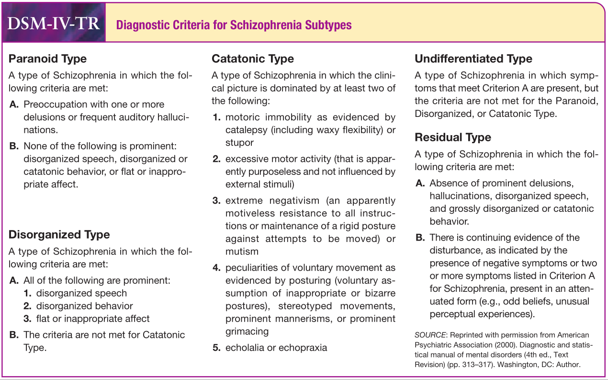

<a href="article-01-03.html"><i class="arrow far fa-arrow-alt-circle-left"></i></a>

<a href="article-01-05.html"><i class="arrow far fa-arrow-alt-circle-right"></i></a>

## 4-1. 조현병 진단의 어려움

진단이란, 어떤 질병에 이름을 붙이고, 정의하며, 식별할 수 있게 해줌으로써, 그 질병을 연구하고, 비교하고, 설명하고, 통제할 수 있는 대상으로 만들어준다. 따라서 진단 과정이 정신의학에서 근본과정이라는 것은 명백하다.[@Oyebode2018-mt] 진단을 떠받치는 두가지 요건은 신뢰도와 타당도이다. 진단은 관련된 전문가들 사이의 의사소통의 수단이기도 하기 때문에, 전세계 어느 누가 진단을 내린다 하더라도 동일해야 할 필요가 있다. 정신의학에서도 신뢰도를 높이기 위해 객관적 현상에 바탕을 두고 진단하고자 애쓰고 있다. 하지만 조현병을 객관적 증상만 갖고 진단하기는 어렵다. 중요한 것은 환자가 마음 속으로 어떤 경험을 하고 있느냐인데, 이는 파악하기도 정량화하기도 어렵다.[@Strauss2005-ff] 조현병 진단에 최첨단 뇌영상학 기술을 이용할 수 있다거나, 정밀한 뇌파 측정이 도움이 된다는 주장도 있으나, 실제 임상에서는 별로 현실성이 없다. 제안된 생물학적 지표는 수십개가 넘지만, 조현병을 확진하는 혈액검사는 없을 뿐더러, 그 어떤 생물학적 지표도 충분한 민감도와 특이도를 지니지 못한다.[@Hager2015-qc][@Lai2016-dc] 심리학적 평가나 신경인지평가도 역시 마찬가지로, 진단이나 감별진단에는 별 도움이 되지 못한다. 이렇듯 검사에 의지할 수 없는 만큼, 어디까지나 조현병의 진단은 숙련된 정신과 의사의 세심한 병력청취와 정신상태 검사에 의지할 수 밖에 없다. 이러한 진단의 기술은 면면히 선배에서 후배로 이어져왔지만, 그 기술이 명문화되거나 공식화된 적은 없다.

대부분의 정신과학 교과서에서 조현병의 진단을 다루는 장은 DSM이나 ICD의 진단 기준을 제시하는 것으로부터 설명을 시작한다. 이제는 표준적으로 자리잡은 진단 기준에 의한 진단은 일종의 상향식 진단법이라 할 수 있다. 이에 따르면 의사의 역할은 먼저 개개 정신병리를 찾아내는 것이다. 망상, 환각, 사고 장애는 물론, 감정의 둔화, 무의욕 등을 현병력과 정신상태검사를 통해 찾아낸다. 이들 중 어떤 정신병리가 병리가 발견되는지, 어떤 병리는 발견되지 않는지를 확인하고, 그 조합을 기록한다. 만약 조합의 모양새가 정신병적 장애에 부합한다면, 이러한 조합이 시간적 경과에 따라 어떻게 변화해 왔는지 확인한다. 동시에 이러한 증상들 때문에 얼마나 직업적/사회적 기능에 손실이 생겼는지 판가름한다. 마지막으로 기질성 뇌질환이나 약물 남용으로 인한 것인지 확인하고, 그렇지 않다면 최종 진단을 내린다. 이렇게 체크리스트를 확인하여 내려지는 진단은 신뢰도가 높아질 뿐더러, 교육적으로도 효과적이다.

그러나 경험을 쌓은 전문가는 이렇게 진단하지 않는다. 그들은 다년간의 경험에 의하여 전형적인 조현병 환자의 원형(prototype)을 몸에 익히며, 진단은 이러한 원형과 눈 앞의 환자와의 유사성에 따라 이루어진다. 더 정확히 말하면, 눈 앞의 환자와 유사성을 띤 몇 가지 전형들을 서로 비교해가면서 가장 가능성이 높은 전형을 2, 3개 선택한 후, 이들 전형의 중요한 감별 포인트를 이용하여 가능성이 떨어지는 진단을 배제해나간다.[@Westen2012-qj]

따라서 진단은 서로 맞물려 있는 두 개의 과정(dual process)에 따라 진행된다고 설명할 수 있다. 첫번째 과정은 직관적 사고로 몸에 익힌 원형과의 유사성에 따라 가능성을 좁히는 과정이며, 두번째는 좀더 분석적인 사고 과정을 거쳐 가장 가능성이 높은 진단을 선택하는 것이다.[@Bhugra2011-od] 경험이 많은 의사일수록 직관적 사고에 더 의존한다. 객관적이어야 할 진단에 직관이 끼어들기 때문에 신뢰도가 낮아진다는 비판을 할 수 있지만, 결국 진단 기준이라는 것도 전문가 집단의 이 직관을 공식화하는 과정에서 탄생한 것이다.

이러한 원형을 몸에 익히는 것은 책을 보고 개념적 정의에 통달하는 것보다는, 다수의 환자를 충분히 오랜 기간 동안 살펴보아 경험을 축적해 나감으로써 가능하다. 경과를 추적하다보면, 다른 환자보다 경과가 좋지 않거나 결국 퇴행에 빠지게 되는 환자를 식별하게 되며, 이들이 전형적 조현병이라고 마음 속에 각인하게 된다. 자신의 머리 속에 다양한 원형들을 간직하게 된 의사는, 이들이 어떤 본질(essence)을 지니고 있는지 무의식적으로 탐색하고자 한다. 어떤 이는 기이한 망상에서, 어떤 이는 감정의 둔마에서, 또 다른 이는 인지기능의 저하에서 다양한 원형들을 꿰뚫는 공통점을 찾고자 할 것이다. 이렇게 해서 초창기 정신의학의 개척자들이 내어놓은 다양한 이론들이 탄생하게 된다.

## 4-2. 주관적 판단에 의한 진단

### 4-2-1. 야스퍼스의 요해불가능성

1900년대 전반의 정신과 의사들은 조현병(schizophrenia)과 정신병(psychosis)을 굳이 구분하지 않았다. 정신병적(psychotic)이란 용어와 조현병적(schizophrenic)이란 말은 뒤섞여서 사용되었고, 정신병적 증상이 나타난다면 이는 조현병의 유력한 증거라고 믿어 의심치 않았다. 현대적 개념으로 환언하면, 조현병과 조현 스펙트럼 장애(schizophrenia spectrum and other psychotic disorder)를 굳이 구분하지 않았다고 말할 수 있다. 따라서 과거 문헌들은 조현병에 대한 설명이라기 보다는 정신병 전반에 대한 것으로 이해하고 살펴야 한다.

야스퍼스의 <s>요해</s>불가능성(un-understandability)은 정신병적 증상을 식별하는 중요한 기준 중 하나이다. 정신증상은 환자의 내적 경험인지라 외부에서 직접 관찰할 수 없다. 단지 외부에서 관찰할 수 있는 망상, 기이한 언어, 이상한 행동을 결과물로 보고, 이에 도달하게 된 심리과정을 추적함으로써, 그 요해불가능성을 간접적으로 추론할 수 밖에 없다. 야스퍼스는 연상이론을 받아들여, 현재의 사고는 그 바로 전에 머리를 스쳐갔던 사고와 연상관계로 이어져 있다고 생각하였다. 따라서 망상이든, 행동이든 이 연상의 고리를 거슬러 올라가면, 애초에 왜 그런 생각을 품게 되었는지를 이해할 수 있을 것이다. 그런데, 정신병적 과정은, 정상적 연상과정과 두 가지 점에서 차이가 날 수 있다. 첫째는 거슬러 올라가는 과정에서 찾아낸 망상과 행동의 근원이 된 사고 자체가 아무런 근거없이 불쑥 솟아난 경우이다. 이를 Wernicke는 자생적 사고(autochthonous ideas)라 하였고([1장 1-8절 참조](article-01-01.html#schneider-first-rank), 야스퍼스는 이를 일차적 망상(primary delusion)의 형식 중 하나로 삼았다.[@McAllister-Williams1997-mr] 둘째는 연상과정 자체의 문제이다. 일찌기 크레펠린은 조현병 환자의 사고는 그 연결고리가 끊어져 있다며 이러한 현상을 <s>"*Zerfahrenheit*"</s>라는 용어로 표현하였다. 동일한 개념을 블로일러는 연상의 이완으로 해석하였으며, 야스퍼스 역시 의미있는 의미관계를 찾을 수 없다면 이해할 수 없다고 보았다.[@Sass1992-wk]

<aside>

**요해(了解)**: 독일어의 *Verstehen*을 번역한 말이다. 이해(理解)와 크게 다를 바 없지만, 전자는 사물의 이치를 아는 것 뿐 아니라, 그래서 납득한다는 의미가 포함되어 있다. 주로 독일철학 문헌에서 많이 사용되는 단어이다. 야스퍼스에게 있어 환자의 내적 세계는 설명(erklären)하는 것이 아니라 이해(verstehen)하는 것으로, 설명은 고사하고 이해마저 불가능하다면 조현병 진단의 가능성이 높아진다고 생각했다.

***Zerfahrenheit**:* 영어로 "confusion", "disintegration", "absentmindedness" 등으로 번역된다.

</aside>

둘 중 어느 쪽인지와는 상관없이 평가자가 환자의 사고를 역추적하는 과정에서, 도저히 이해할 수 없는 벽에 부딪힐 때, 평가자는 요해불가능하다고 하고, 해당되는 망상이나 행동을 정신병적이라고 결론짓는다. 이 때 망상 내용에 대해 공감을 하는 것과 망상이 왜 생겼는지를 이해하는 것은 구분해야 한다. <s>Sims</s> 가 든 한 사례에서, 나치의 박해를 피해 독일에서 탈출한 환자는 "누군가 내가 마시는 물에 이상한 액체를 타서 나를 아프게 한다"는 망상을 보였다. 나치의 위협을 받아왔다는 사실로 피해망상에 공감할 수 있을 지언정, 왜 피독망상을 갖게 되었는지는 이해할 수 없다.[**(Oyebode 2018)**](https://paperpile.com/c/twMDi5/pquZg)

<aside>

**Andrew Sims**: 영국의 정신과 의사. 리즈 대학 교수이자, 1990년부터 93년까지는 영국 왕립정신의학회 회장을 역임하였다. 기술정신의학의 대표적인 책인 "마음의 증상과 징후: 기술 정신 병리학 입문 (Sim's Symptoms in the Mind)"를 저술하였다.

</aside>

### 4-2-2. 슈나이더의 자아 장애

슈나이더는 자신의 생각과 감정, 행동이 타인의 영향을 받거나 타인에 의해 조종되는 느낌을 "자아-장애(ego-disorders, 독어로는 *Ich-Störungen*)이라고 불렀다.[@Fuchs2013-in] 이는 자아와 타인의 경계가 불분명해지는 것이요, 자아의 주권행사력이 약화되는 것이다. 이 개념은 고전적인 정신병리학 교과서에서는 예로부터 중요한 개념으로 논의되었으나, DSM 시대에 들어와서는 그 중요성이 감소되어 여타의 망상, 환각 경험과 구분되지 않고 사용되었다. 예를 들어 사고 전파(thought broadcasting)는, 사고 반향(thought echo) 혹은 가청 사고(audible thought)와는 현상학적으로 전혀 다른 정신병리이다. 그럼에도 불구하고, 미국 정신과 의사를 대상으로 한 설문에서 대상자의 절반 이상은 이들을 같은 개념으로 인식하고 있었다.[@Pawar2003-pb] 게다가 정신분석, 특히 자아 심리학에서 말하는 미성숙한 자아 개념과 혼동되면서, 더더욱 조현병 진단에서의 자아 장애는 간과되거나 오해받고 있는 형편이다.

야스퍼스는 자아 의식(ego consciousness)을 다음과 같은 기능을 행하는 것으로 개념화하였다. 1) 대상 및 외부세계와 구분된 자기 자신을 의식하는 것, 2) 활동성 혹은 의지를 가진 <s>주체</s>로서의 느낌, 3) 시간이 흘러도 동일하게 유지되는 정체성(identity)의 느낌, 4) 심리적으로 단일한 한 명의 자기라는 느낌. 야스퍼스는 이러한 자아 의식에 혼란이 생긴다면 정신병의 증거로 보아야 한다고 믿었다. 이중 두번째 항목, 즉 나의 정신을 내 의지대로 이끌어나갈 수 있고(sense of agency), 내 정신이 나의 것이라는 감각(sense of mine-ness)은 특히 조현병 진단에 중요하다. 슈나이더는 이러한 야스퍼스 철학을, 실제 임상에서 관찰되는 정신병리로 풀어내어 일급 증상을 완성하였다.

<aside>

**주체 (agent)**: 자기란 다양하고 정의하기 힘든 의미를 지닌 복합적인 용어이다. 사람은 자기를 여러가지 방식으로 경험할 수 있는데, 그중 하나가 사고, 행동, 의지의 주인 즉 주체로서의 자기이다. 주체는 선택할 수 있는 능력과 선택한 것을 실행하는 능력이 있다. 즉 자기-주체성(self-agency)이란 어떤 행동이나 의지의 발현이 나로부터 비롯되었음을 느끼는 감각이다.

</aside>

이에 속하는 일급 증상에는 자신의 몸, 사고, 의지나 정서가 자신이 아닌 타인의 의지에 의해 조종된다는 증상이 포함되어 있다. 자신의 생각이 외부로부터 집어넣어지거나, 누군가가 탈취한다는 것은 사고를 통제하는 자아의 지휘권을 상실했다는 느낌이다. 앞서 예로 든 것처럼, 사고 전파는 자신의 생각이 자신의 지배를 벗어나 주변 불특정 다수에게 알려진다는 느낌이다. 정상인은 자신의 생각이 "자기 것"임을 확신하며 자신이 허락하지 않는 한 타인에게는 불투명하다는 것을 믿어 의심하지 않는다. 그러나 조현병 환자는 스스로의 생각을 통제하지 못하며, 생각이 나름대로의 의지를 가진 듯 빠져나간다고 느낀다. 이에 반해 가정 사고란, 머리속으로 하는 생각이 소리로 들리는 환청 경험이다. 가정 사고 때문에 남들이 내 생각을 알게 된다는 식으로 사고 전파를 초래하기도 하지만 엄밀한 의미에서 두 정신병리는 전혀 별개의 것이다.[@Burgy2011-la]

환자는 자신이 통제할 수 있는 내부와 통제할 수 없는 외부를 혼동한다. 그들은 이러한 경험에 대해 피해망상의 대상이 자신에게 박해를 가하는 것이라 믿기도 하고, 몸이나 마음의 일부가 나름의 의지를 지녀 독자적으로 생각하고 행동한다고 믿는다. 이런 식의 망상은 조현병 진단에 있어서 상당히 중요한 의미를 갖는다.

### 4-2-3. 망상적 기분과 망상적 분위기

두 개념 역시 야스퍼스로부터 출발한다. 야스퍼스는 일차적 망상의 형태로 자생적 사고 외에도 망상적 기분, 망상적 지각, 망상적 기억을 열거한다. 특히 조현병 발병 초기에 환자들은 세상이 묘한 분위기를 띄면서 변해가는 듯한 경험을 하게 된다. 이전에는 당연한 것처럼 받아들였던 일상이, 전에 느끼지 못했던 의미나 상징을 내포하고 있는 것처럼 느껴진다. 이는 다시 두 가지 형태로 나눌 수 있는데, 첫째는 주변 사물이나 현상의 익숙함이 상실되어, 낯설거나, 기이하고, 꿈 속을 헤매는 것 같다는 느낌을 주는 것이며, 둘째는 그 모든 것들이 환자 자신과 이런 저런 식으로 관련되어 있는 것처럼 인식되는 것이다. 현상들은 환자에게 무언가를 일깨우려고 하거나, 숨겨진 메시지를 전달해주고자 애쓰고 있으며, 환자에게 그 의미를 찾아내라고 압박을 가하는 것처럼 느껴진다. 이 때문에 환자는 마치 자신의 주변에서 일어나는 일들이 누군가가 일부러 연출해놓은 연극같다고 진술하기도 한다.[@Maj2013-du][@Henriksen2019-vg]

이러한 상태를 망상적 기분(delusional mood) 혹은 망상적 분위기(*wahnstimmung*)라고도 한다. 이 개념은 일찌기 <s>Hagen</s>에게로 거슬러 올라간다.[@Maj2013-du] 야스퍼스는 이러한 기이한 분위기를 어떻게든 해석하려 애쓰는 과정에서 이차적 망상이 발생한다고 여겼다. 현대 학자들은 망상적 분위기가 발병 직전 전구기 단계의 특징적 소견으로 보고 있으며, 전구기 환자들이 느끼는 이유없는 불안, 걱정, 죄책감, 우울감 등의 원인중 하나라고 여긴다.[@Henriksen2019-vg] <s>Conrad</s>는 조현병의 전구기로부터 발병 순간까지를 <s>Trema, Apophany, Anastrophe</s>의 세 단계로 나누었다. 그는 가장 처음의 단계를 Trema 단계라고 하였는데, 환자는 자신이 마치 무대에 혼자 올라가 조명을 받고 있는 것처럼, 세상이 자기를 주시하며, 무언가 사건이 터질 것만 같은 불길한 긴장감에 시달린다. 그는 다음 단계인 Apophany에 도달하면 Trema의 긴장감이 소실된다고 하였는데, 환자는 전단계의 불길함이 "무엇 떄문이었는지"를 퍼뜩 깨닫게 된다. 망상이 자리잡게 되고, 망상은 모든 수수께끼를 한번에 설명해주는 자명한 진리로 자리잡는다. 마지막 Anastrophe 단계에서는 세상의 모든 현상이 나와 관계된 것처럼 느껴진다.[@Mishara2010-wd]

<aside>

**Fridrich Wilhelm Hagen junior (1814\~1888)**: 독일의 정신과 의사. Erlangen 클리닉의 책임자로 활동하였다. 정신질환을 유전에 의해 이해해보고자 하였고, 정밀한 계측을 통해 조현병 환자 뇌의 비정상적 위축을 입증할 수 있으리라 믿었다.

**Klaus Conrad (1905\~1961)**: 독일의 정신과 의사. 조현병 환자가 발병 전에 겪는 "망상적 기분" 혹은 "망상적 분위기"에 대한 업적을 남겼다. 조기 정신증(early psychosis) 개념의 선구자이다.

**Trema, Apophany, Anastrophe**: 모두 그리이스어이다. Trema란 무대에 올라섰을 때의 공포, apophany란 계시, anastophe는 도치 혹은 돌아서다라는 의미를 갖고 있다. Anastrophe란 자신이 세상을 향해 행동을 하는 것이 도치되어, 세상이 자신에게 뭔가를 행하고 있다는 느낌을 의미한다.

</aside>

조현병 진단에서 이러한 망상적 기분이 얼마나 중요성을 띄는지는 확실히 알려져 있지 않다. 그러나 두부 손상이나 약물 남용에 의해 비교적 갑자기 환각, 망상을 보이는 환자의 경과와, 망상적 분위기로부터 시작하여 망상을 굳히면서 긴장감이 해소되는 전구기 단계를 차곡차곡 밟아온 조현병의 질병경과는 분명히 구분되어야 한다. 조현 스펙트럼 장애에서 망상적 기분을 경험하는 비율은 1\~8%라고 하며, 망상적 기분을 오래 경험해왔음에도 불구하고 발병하지 않는 경우도 있다.[@Stone2017-lc] DSM에서 강조하는 역학적 증거는 충분하지 못하다 할 지라도, 이러한 경험을 듣게 된 의사는 당장의 망상/환각 심각도와는 관계없이 조현병 진단을 의심하게 된다.

### 4-2-4. Praecox feeling

<s>Rümke</s>는, 구체적으로 정의하거나 언어로는 표현하기 어렵지만 조현병 환자를 면담할 때 임상가가 주관적으로 겪게 되는 막연한 불편감을 praecox feeling이라고 하였다.[@Ungvari2010-rb] 이는 환자와 공감이 불가능하고 감정 교류가 안되어, 상대방의 마음을 들여다볼 수도, 나 자신의 마음을 전달할 수도 없을 것 같은 느낌을 가리킨다. 야스퍼스의 전통에서 정신과 의사는 공감의 방법을 써서, 환자의 정신 세계를 추체험한다. 그러기 위해선 환자의 내면 세계에 다가가, 연상의 고리가 이어지지 않는 부분을 의사 자신의 이성과 상식을 바탕으로 채워나감으로써, 환자의 파편화된 경험을 최대한 이해가능한 하나의 전체(일종의 게슈탈트)로 만들려 애쓴다. 그러나 의사가 아무리 노력한다 하더라도 환자와 의사 사이에 어느 정도는 공통 분모가 있어야, 이런 과정이 가능해진다. 환자의 내면에 손상이 극심하여 최소한의 공통분모도 찾기 힘들어지면, 결국 공감 자체가 불가능해진다. 의사는 도저히 파악할 수 없는 벽에 부딪혔다고 느끼고, 더 이상 마음을 잇는 노력을 포기해버린다.

<aside>

**Henricus Cornelius Rümke (1893-1967)**: 네덜란드의 정신과 의사. 위트레흐트 대학교수로 재직하였다. 네덜란드에서는 처음으로 현상학적 기법을 정신의학에 도입하였다.)

</aside>

Praecox feeling은 정의하기도 어렵고, 객관적으로 증명하기도 어렵다. 그러나 진료 상황이 아니더라도, 모든 인간은 일상 생활 중에 사람들과 접하면서, 공감능력을 이용하여 타인의 마음에 다가가려 애쓴다. 타인과의 소통은 단순히 정보를 얻는 차원을 넘어, 타인과 내가 공통된 상호주관성(intersubjectivity)의 세계에 속해있다는 것을 확인하는 과정이며, 나 자신의 정상성(normality)을 재확인하는 것이기도 하다.(4장 약물치료의 기본 개념 1-6절 참조) 왜냐하면 타인과 마음이 통할 수 있다는 것은 내가 정상이라는 증거이기도 하기 때문이다.[@Fuchs2009-os][@Varga2013-xh] <s>거울 뉴런 이론</s>을 주장하는 학자들은 거울 뉴런을 통한 시뮬레이션이 공감 능력의 생물학적 기반이라고 말한다.[@Gallese1998-ko] 이처럼 다른 사람의 마음을 공감하거나, 남이 공감할수록 자신의 마음을 내줄 수 있는 것은 인간의 기본적인 인지 능력 중 하나이다.

<aside>

**거울 뉴런 (mirror neuron)**: 이탈리아의 신경생리학자인 Rizzolatti, Gallese 등이 제안한 이론. 원숭이에게, 다른 원숭이가 일련의 동작을 수행하는 것을 지켜보게 하면, 관찰하는 원숭이 뇌에서 그 동작을 담당하는 영역이 활성화된다. 이는 모방이나 공감에서 중요한 역할을 할 것으로 기대된다. 짧은 꼬리 원숭이에서는 실험적으로 증명되었으나, 아직 인간에게 거울 뉴런이 있는 지는 증명되지 않았다.

</aside>

정신과 의사는 각양각색의 사람들과 소통하면서 그들과 공감하는 능력을 키운다. 따라서 어떻게 해도 마주보고 있는 상대와 공감이 불가능하다면, 상대가 정상이 아니라는 식으로 판단할 수 있다. 이러한 느낌이 바로 praecox feeling이다. Praecox feeling은 실제 임상에서 조현병 환자를 진단할 때 드물지 않게 사용된다. 그러나 이를 전적으로 의지하거나 조현병 진단의 유일한 증거로 내세워서는 안 된다. 의사가 환자와 공감하지 못하는 것이, 오히려 의사의 공감능력이 떨어지거나, 충분히 폭이 넓지 않아서일 수 있다. 또는 공감을 하기 위해 충분한 시간과 노력을 들이지 않았다는 반증일 수도 있다.[@Schwartz1987-vt] 게다가 praecox feeling이 강하게 느껴지는 환자라면, 의사가 아닌 일반인들도 이 환자가 정신질환을 앓고 있음을 인식하고 있을 가능성이 높다.

## 4-3. 진단기준에 의한 진단

현대의 정신의학은 진단 기준에 의한 객관적 진단에 높은 가치를 둔다. 조작적 진단기준이 정립되기 전에는 정신과 의사의 독단적 주관이나 이론적 경향에 따라 진단을 내렸고, 이 때문에 남이 내린 진단을 전혀 신뢰할 수 없는 경우가 허다하였다.([1장 2-2-2절 참조](article-01-02.html#dsm-iii)) 진단에 신뢰성이 떨어진다면, 의학 연구나 임상 진료에 진단이 제 역할을 못할 것이며, 더더욱 행정, 사법, 통계 등 비의학적 영역에서는 사용할 엄두를 내지 못할 것이다. DSM과 같은 표준화된 진단기준이 만들어지면서, 모든 이해당사자들이 진단을 중심으로 상대를 신뢰하며 통합된 시스템을 엮어낼 수 있었다.

그러나 조작적 진단 혹은 체크리스트 식 진단이 장점만 있는 것은 아니다. 각각의 항목의 적용 여부만 신경쓰다보면, 전체적인 패턴을 놓치게 된다. 또한 예를 들어 망상이라는 입체적 현상이 단순히 있다/없다로 평가될 수는 없다. 정확한 진단을 위해선 망상의 내용, 신념이나 기이함의 정도, 믿게 된 과정, 요해불가능 여부 등 다면적 요소가 평가되어야 하나, 진단기준에는 그러한 다면적 기술이 끼어들어갈 여지가 없다. 또한 모든 의사들이 동일한 진단기준을 사용한다 하더라도, 그 개개 항목을 이해하는 바가 서로 다르다면, 결코 목적한 신뢰도를 얻을 수 없다. 그러나 무엇보다도 가장 중요한 것은 진단기준은 조현병의 진정한 본질을 반영하지 못하다는 사실을 쉽게 망각한다는 점이다.[@Jablensky2010-zv]

### 4-3-1. DSM-5에 의한 진단

DSM-5는 ICD-10의 코드를 빌려쓰기 때문에, 조현병은 F20.9로 분류된다. 앞서 언급한 바와 같이 DSM-IV에서 DSM-5로의 변화는 두드러지지 않지만, 몇몇 사항은 주목할 필요가 있다. 슈나이더의 일급 증상은 더 이상 진단특이적이라는 지위를 상실하게 되었다. 소위 A 기준에 속하는 다섯개 증상(망상, 환각, 와해된 언어, 기이한 행동, 음성 증상)은 증상의 특성과 상관없이 모두 동등한 지위를 갖게 되었지만, 유독 처음 세가지(망상, 환각, 와해된 언어) 중 적어도 하나는 반드시 포함되어야 한다고 강조되었다. ([1장 3-1절 참조](article-01-03.html#dsm-5-difference))

좀더 눈에 띄는 변화는, 아형에 대한 구분이 사라졌다는 것이다. DSM-IV 까지만 해도 편집형, 파과형, 강직형, 미분화형, 잔류형의 다섯 가지 아형으로 구분되었으나, DSM-5에서는 이런 구분이 아예 없어졌다. 코드를 빌려쓰는 ICD-10은 여전히 아형의 구분을 남겨놓고 있기 때문에, DSM에서의 조현병은 F20.9가 붙게 되었다. (참고로 ICD-10에서 F20.9는 상세불명의 조현병에 해당함)

아형을 삭제한 주된 이유는, 첫째 대부분의 환자가 편집형으로 진단되며, 둘째 아형에 따른 치료 반응이나 예후의 차이가 발견되지 않고, 셋째 한 환자가 질병 경과에 따라 서로 다른 아형을 번갈아 보일 수 있으며, 마지막으로 아형 구분의 신뢰도가 매우 낮기 때문이다.[@Salvatore2009-rr] 이로써 Kahlbaum과 Hecker의 편집증, 강직증, 파과증의 구분은 역사의 뒤안길로 사라지게 되었다.([1장 1-4절 참조](article-01-01.html#before-kraepelin)) 하지만 이 결정은 매우 논란이 많았다. 고전적인 연구들은 아형이 시간이 지나도 안정되게 유지됨을 보여주었고, DSM-IV를 제작할 때만 해도 다수의 학자들은 아형들의 안면 타당도를 지지하였다.[@Kendler1985-ke][@McGlashan1991-io]

한편 DSM-5는 강직증(catatonia)을 다양한 종류의 정신질환 혹은 신체질환에서 병발할 수 있는 상태로 취급하는데, 조현병 환자가 강직증상을 보이는 경우 예외적으로 명시자를 써서 강직증 증상을 동반한다고 첨부할 수 있게 해주었다. 명시자(specifier)란 DSM-IV에서 처음 소개된 개념으로, 진단에 보다 풍부한 정보를 붙여주기 위해서 사용된다. 명시자는 상호배타적이 아니기 때문에 한 진단에 여러 개의 명시자가 붙을 수 있다. 명시자에는 기술형(descriptive), 경과(course), 심각도(severity) 명시자 등이 있는데, 조현병과 관련해서는 강직증 명시자와 함께 8개의 경과 명시자가 붙여질 수 있다. 경과 명시자는 발병 후 1년이 지난 후부터 표기할 수 있다 ([표 1](#tab:dsm-5-specifier)).

::: {#tab:dsm-5-specifier .table}
|                                                                                           |
|-------------------------------------------------------------------------------------------|
| First episode, currently in acute episode (symptom criteria are fulfilled)                |
| First episode, currently in partial remission (symptom criteria are not fully fulfilled)  |
| First episode, currently in full remission (symptom criteria are not present)             |
| Multiple episodes, currently in acute episode                                             |
| Multiple episodes, currently in partial remission                                         |
| Multiple episodes, currently in full remission                                            |
| Continuous (subthreshold symptom periods being very brief relative to the overall course) |
| Unspecified                                                                               |

::: {.figcaption}
Table 1. Course specifier of Schizophrenia in DSM-5
:::
:::

### 4-3-2 ICD에 의한 진단

현재 대한민국에서 사용하고 있는 한국표준질병사인분류(Korean Standard Classification of Diseases, KCD)는 2014년 발표된 7번째 개정판이다. 이는 1990년에 처음 발간된 ICD-10을 기준으로 하고 있기 때문에, DSM-5보다는 DSM-IV와 가깝다. 정신과 질환의 경우 보통 DSM이 앞서가고 ICD가 뒤따르는 양상을 보여주는데, 2019년 발표된 ICD-11 역시 DSM-5의 변화를 대폭 수용하고 있다. 진단을 내리는데 필요한 증상들은 지속되는 망상, 지속되는 환각, 사고형식의 장애, 수동 경험(자기 경험의 왜곡), 음성 증상, 기이한 행동, 운동 장애이며, 이중 적어도 2개가 1달 이상 지속되면 진단을 내릴 수 있다. 다만 4개의 핵심 증상(core symptom), 즉 망상, 환각, 사고형식의 장애 및 수동 경험 중 하나가 포함되어 있어야 한다.

수동 경험 즉 자기 경험의 왜곡(distortion of self-experience)은 슈나이더의 일급 증상에 속한다는 점에서 DSM-5 보다는 일급 증상을 더 높게 평가하고 있음을 엿볼 수 있다. DSM-5의 선례를 따라 고전적인 아형은 삭제되었으며, 대신 1) 초발형, 2) 재발형, 3) 연속형, 4) 기타로 아형을 나눈다. 즉 DSM-5의 경과 명시자가 ICD-11에서는 아형으로 승격되었다.

DSM-5는 Clinician-Rated Dimensions of Psychosis Symptom Severity라고 하여, 정신증의 심각도를 8가지 증상영역에 대하여 5단계로 평가한다. 하지만 이는 실질적으로는 부록 정도에 해당하는 Section 3의 "연구진행중인 평가방법과 모델"에 잠시 언급되는 정도로만 실려있다. ICD-11은 이와 유사한 내용을 postcoordination으로 첨부하게 되어있다 ([표 2](#icd-11-specifier)). Postcoordination은 DSM-5의 명시자에 해당하는 것으로서 진단에 세부사항을 덧붙이는 것인데, 조현병 진단에 해당되는 것으로는 아래와 같은 증상 발현 코드가 있다.[@Valle2020-wq]

::: {#tab:icd-11-specifier .table}
|      |        |                                                           |
|------|--------|-----------------------------------------------------------|
| 6A25 |        | Symptomatic manifestations of primary psychotic disorders |
|      | 6A25.0 | Positive symptoms in primary psychotic disorders          |
|      | 6A25.1 | Negative symptoms in primary psychotic disorders          |
|      | 6A25.2 | Depressive mood symptoms in primary psychotic disorders   |
|      | 6A25.3 | Manic mood symptoms in primary psychotic disorders        |
|      | 6A25.4 | Psychomotor symptoms in primary psychotic disorders       |
|      | 6A25.5 | Cognitive symptoms in primary psychotic disorders         |

::: {.figcaption}
Table 2. Postcoordination of Schizophrenia in ICD-11
:::
:::

Postcoordination 진단을 내릴 때는, 환자에게 해당되는 코드에 대하여 "없음", "경도", "중등도", "고도"로 평가한다. 이러한 차원적 평가가 환자의 기능 수준에 큰 영향을 미친다고 보기 때문이다. 그러나 DSM-5와는 달리, 직업적/사회적 기능 저하를 진단기준에서 제외하고 있다. 따라서 정상적인 기능을 발휘하고 있다 하더라도 조현병 진단을 내릴 수 있으며, 이로 인해 초발 정신병 환자에 대한 진단의 폭을 넓힐 수 있다.[@Biedermann2016-kt]

## 4-4. 아형의 분류

### 4-4-1. 고전적 아형 분류

전술한 바와 같이 DSM-IV까지는 편집형, 혼란형(파과형), 강직형, 미분화형 그리고 잔류형의 다섯개 아형이 포함되었으나, DSM-5와 ICD-11은 이를 과감하게 삭제해버렸다 ([그림 1](#fig:subtypes)).

{#fig:subtypes}

아형의 역사는 지극히 오래되었다. 크레펠린은 1899년 발간된 6판 교과서에서 편집형, 파과형, 긴장형을 아형으로 들고 있는데, 이는 Kahlbaum과 Hecker의 개념을 그대로 수용한 것이다. 뒤이어 블로일러는 진단의 범위를 넓혀가면서, 잠복형(latent)과 단순형(simple)을 추가하였다. 이렇게 해서 만들어진 5개 아형은 잠복형을 제외하고는, DSM-IV에 이르기까지 기본적 틀로서 유지되었다.[@Jablensky2010-zv] 아형의 중요성에 대한 이들 초창기 저자들의 생각은 헤아리기 어렵다. 일찌기 블로일러는 한 환자에서 질병의 아형이 질병 경과에 따라서 변한다면, 아형은 진단분류학적 단위가 될 수 없다고 하였다.[@Kendler1985-ke]

연구자들이 아형을 나누고자 하는 것은, 블로일러가 쓴 저서의 제목 "Dementia Praecox or the Group of Schizophrenias"에서 엿볼 수 있듯이, 조현병이 단일 질환이라기보다는 이질적인 질환들을 억지로 묶어놓은 성격이 강하기 때문이다. 특히 조현병의 유전적 기반 혹은 기타 생물학적 원인을 연구하는 학자들은 조현병이라는 진단의 이질성(heterogeneity) 때문에 연구가 수십년간 진보를 이루지 못했다고 안타까워한다. WKL 진단분류체계는 그러한 아쉬움에 대한 하나의 해답이었다.

그렇다면 아형 구분이 정당성을 확보하려면 아형들 간에, 발병 원인, 임상 양상, 치료 반응 등이 차이가 있다는 근거가 필요하다. 그러나 고전적 아형은 이런 기준을 충족시키지 못한다. 1991년 행해진 연구에서는 편집형 환자가 혼란형 환자보다 유의하게 예후가 좋았다는 것이 확인되었으나, 환자의 2/3만이 평균 4.5년후 동일한 아형을 유지했다고 보고되었다.[@Fenton1991-bg] 이렇게 진단적 안정성이 떨어질 뿐 아니라, 한 아형을 특징지우는 증상이 다른 아형에도 흔히 나타난다는 문제를 가지고 있다. DSM-IV에서는 긴장형, 혼란형, 망상형, 미분화형의 순으로 등으로 위계를 설정하여 이러한 문제를 해결하고 있는데 이는 다만 편의적인 방편이지 과학적 근거가 있는 것은 아니다.[@Liddle1999-gw] 또한, 혼란형, 긴장형 아형은 현대로 넘어오면서 점점 드물어지기 때문에, 효과적 치료의 보편화와 관계있는 것으로 보인다. 따라서 현재는 고전적 아형은 생물학적으로도 임상적으로도 큰 의미가 없는 것으로 결론지어졌다.

### 4-4-1. 현대의 아형 분류 시 {#modern-subtyping}

Crow[@Crow1980-tn]는 1980년에 향후 큰 영향력을 미칠 논문을 발표한다. 그는 항정신병 약물의 효과가 급성 환자에서는 뚜렷하지만, 만성 환자에서는 기대에 못 미친다는 것을 근거로 급성 증상은 도파민 시스템의 과활성에 근거한 것이요, 만성 증상은 뇌의 구조적 변화에 기인한 것이라 가정하였다. 그는 이를 토대로 I형과 II형 조현병을 구분하고, 둘은 상이한 질병 과정에 의해 발현된 것이라 주장하였다 ([표 3](#crow-types)).

::: {#tab:crow-types .table}
|                                 | Type I                                                       | Type II                                                                    |
|---------------------------------|--------------------------------------------------------------|----------------------------------------------------------------------------|
| Characteristic symptoms         | Delusion/hallucination, thought disorder (positive symptoms) | Affective flattening, poverty of speech, loss of drive (negative symptoms) |
| Most commonly seen in           | Acute schizophrenia                                          | Chronic schizophrenia                                                      |
| Drug response                   | Good                                                         | Poor                                                                       |
| Outcome                         | Reversible                                                   | Irreversible                                                               |
| Intellectual impairment         | Absent                                                       | Sometimes present                                                          |
| Postulated pathological process | Increased dopamine receptors                                 | Cell loss and structural changes in the brain                              |

::: {.figcaption}
Table 3. Two types of schizophrenia proposed by Crow.\
Adapted from [@Crow1980-tn]
:::
:::

Crow가 이런 구분을 시도한 것은, Strauss[@Strauss1974-yf]**​**와 Andreasen[@Andreasen1982-xb]**​**등이 블로일러의 4A 증상을 "음성 증상"이라는 이름으로 재조명하면서 조현병 이해에 있어 음성 증상의 중요성이 격상된데 힘입은 바 크다. 뒤이어 1987년 Kay 등**​**[@Kay1987-np]이 PANSS를 발표하면서, 조현병 환자에 대한 표준적 평가에는 항상 음성 증상이 포함되게 되었다.([1장 2-2-3절 참조](article-01-02.html#dsm-iiir-dsm-iv)) 1982년에 Andreasen[@Andreasen1982-qk]**​**은 증상의 구분을 아형 구분으로 확대하여, 조현병을 양성, 음성, 혼합형으로 구분하였다. 그와 동시에 음성 조현병 환자가 유달리 뇌실이 확장되어 있다는 결과를 발표하여, 생물학적 기반과 아형 사이의 연결을 시도하였다.

이와 관련하여 Carpenter 등​[@Carpenter1988-vo]은 다른 정신병리, 예를 들어 우울, 불안이나 약물 부작용 등에 의해 설명되지 않는 일차적 음성 증상이 나타나는 환자를 결핍 조현병(deficit schizophrenia)이라 이름 붙였고, 비결핍 조현병(non-deficit schizophrenia)과는 다른 질환이라고 주장하였다. 의사들은 결핍 조현병의 경우 더 심한 경과를 겪고, 이상 운동의 유병률이 더 높으며, 병전 사회기능이 더 떨어진다고 체감하고 있다.[@Kirkpatrick2001-az][@Jablensky2006-ol] 그러나 결핍 조현병이 치료저항성 환자를 지칭하는 것인지, 가족형 혹은 조기 발병 조현병을 가리키는 것인지 혼란이 심화되면서, 결핍성 조현병을 따로 구분해야하는지는 의문시되고 있다.

아형을 구분하는 과정에서 어떤 선입견이나 이론적 편견도 배제하고, 순수히 통계적 기법을 이용하여 나눠보자는 움직임도 있다. 표준화된 진단도구가 일상적이 되면서, 정신의학 연구도 데이터를 기반으로 이루어지기 시작했고, 다양한 통계기법이 적용되었다. 여기에는 요인분석을 하여, 다양한 증상들을 몇 개의 요인으로 묶는 연구 방향이 있고, 군집분석을 하여 환자들을 몇 개의 집단으로 나누는 연구 방향이 있다. PANSS가 도입된 이후 수많은 연구들이 PANSS의 요인분석을 시도했는데, 그 결과는 양성 증상이 정신병적 차원(psychosis)과 와해 차원(disorganization)으로 나뉘고, 일반 증상은 흥분 차원(excitation)과 우울/불안(depression/anxiety) 차원으로 나뉜다는 정도였다.[@Lindenmayer1994-bi][@Levine2007-br][@Wallwork2012-sp]

한편 동일한 PANSS 데이터로 환자를 나눈 연구에서는, 양성, 음성, 혼합형, 혼란형 그리고 단순형으로 나누어졌다.[@Dollfus1996-pw] 최근에는 좀더 세련된 방법으로 기계 학습 알고리즘을 적용하여 환자군을 나누기도 하는데, 결과는 조금씩 다르지만 양성과 음성이라는 대략적인 구분은 크게 달라지지 않았다.[@Hopkins2020-by][@Chen2020-ti]
