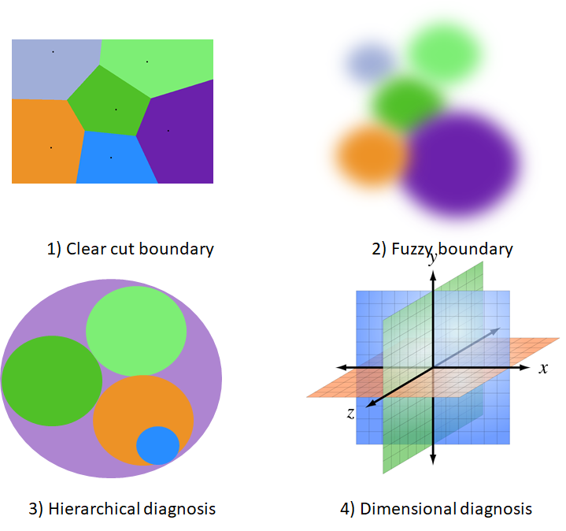
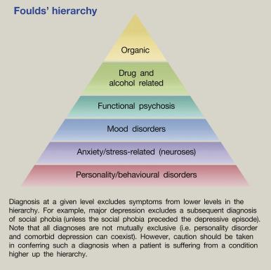

<a href="article-01-04.html"><i class="arrow far fa-arrow-alt-circle-left"></i></a>

<a href="article-01-06.html"><i class="arrow far fa-arrow-alt-circle-right"></i></a>

## 5-1. 진단 체계의 구조적 이해

일반적으로 의학에서 감별진단은 매우 중요하다. 감별진단을 제대로 못하면, 치료의 기회를 놓치거나 엉뚱한 치료를 하여 오히려 환자의 회복을 방해하기도 한다. 그러나 감별진단을 제대로 하느냐 못 하느냐는, 애초에 질병과 질병 간에 분명한 경계선이 그어져있음을 전제로 하는 것이다. 충수염과 게실염을 감별하는 것이 어렵다고 하지만, 어쨌든 둘은 전혀 다른 질병이며 확진을 내릴 방법이 있다.

그러나 정신질환의 경우, 확진할 방법이 없을 뿐더러, 애초에 질병의 경계가 있긴 한 것인지 애매하다. 역사적으로 수많은 진단기준이 제시되었고, 이들은 조금씩 변해왔다. 현재의 진단기준은 타당도가 아니라 신뢰도를 중심으로 개발되었기 때문에, "실제로 존재하는 질병 A를 찾아내기 위한 진단도구"라기 보다는, "질병 A를 이렇게 정의하자는 약속"으로 이해해야 한다. 그렇기 때문에 "DSM-IV로는 조현병이지만, DSM-5로는 조현병이 아니다"라는 이해하기 힘든 상황이 벌어지는 것이다. 또한 이상적인 진단기준이라면 상호배타적이어서 한 진단에 해당되면 다른 진단에는 해당될 수 없어야 하는데, 현행 진단체계는 꼭 그렇지 않다. 자폐증이면서도 조현병 진단이 내려질 수 있는가는 DSM이 개정될 때마다 커다란 논쟁거리였다.[@Hommer2015-uk]

현행 진단체계는 범주적 접근원칙을 따르고 있지만, 이 원칙만으로는 해결되지 않는 문제점이 수두룩하다. 그래서 조금씩 변형된 원칙을 필요할 때마다 적용하고 있다. 따라서 현행 진단방식을 이해하려면 1) 모호한 경계, 2) 계층적 진단, 3) 차원적 진단, 4) 병발 진단에 대해 이해해야 한다.

{#fig:ddx}

### 5-1-1. 모호한 경계

어떤 진단기준이라도 모든 경우의 수를 다 고려할 수는 없다. 한 환자에 대하여 두 가지 이상의 정신과적 진단을 감별해야만 할 때, 이들 후보진단을 서로 구분하는 경계는 애매하기 짝이없다. DSM-5에서 망상 장애 진단을 내리려면, 조현병의 A 기준 중 오로지 망상 만이 1달 이상 지속되며, 환각이 있더라도 두드러지지 않고 망상의 주제와 관련되어야 한다. 더불어 기능 장애가 현저하게 떨어지지 않으며, 행동이 대놓고 기이하지 않아야 한다. 그런데 여기에 사용된 언어를 보면 "두드러지지 않아야 (not prominent)", "관련되어야(related to)", "현저하지 않게(not marked)", "대놓고 기이하지 않아야(not obviously bizarre)" 등 조작적 진단기준이라는 이름이 무색할 정도로 애매모호한 표현이 사용되고 있다. 게다가 ICD-11에서는 조현병의 진단 기준에서 기능 수준의 저하가 삭제되었기 때문에, 더더욱 망상 장애와의 구분이 어려워진다.

강박장애와 망상장애 혹은 조현병을 구분해야 하는 경우, 경험많은 의사라도 강박사고와 침습사고를 구분하기는 매우 어렵다. 더구나 강박사고에 대해 망상적 믿음을 지니고 있는 경우에도 강박장애로 진단할 수 있기 때문에, 이를 망상적 강박사고로 판단하면 강박증, 단순한 망상으로 판단하면 망상장애/조현병이 되어버린다.

이런 식으로 진단의 경계가 모호한 문제에 대해 DSM은 환자의 전체적인 임상상을 고려해야 한다고 권하고 있다. 하지만 전체적인 패턴을 원형(prototype)과 비교하여 진단을 내리는 것은 경험이 어느 정도 축적된 의사만이 가능하다. 게다가 그럴 정도의 경험이 축적되어 있다면 애초에 DSM 진단기준에 의지하지도 않을 것이다.

모호한 경계는 감별진단에서 문제를 초래한다. 물론 실제 임상에서는 감별진단이 그리 중요하지 않을 수도 있다. 특히 정신과 치료가 진단 중심보다는 증상 중심으로 이루어진다는 것을 고려하면 더욱 그렇다. (4장 조현병 치료의 이해 참조) 그러나 법적, 행정적 상황에서는 이러한 모호한 경계가 많은 갈등을 초래할 수 있다.

### 5-1-2. 계층적 진단

DSM이나 ICD가 아무리 정교해진다 하더라도, 정신과 질환 자체의 속성 때문에 넘어설 수 없는 벽이 있기 마련이다. 100여년전 야스퍼스는 이러한 한계를 명쾌하게 분석하였다. 그에 따르면 정신과에서 다루게 되는 문제들은 세 가지 서로 다른 층위에 놓여있다. 이들은 1) 생물학적 원인과 밀접하게 맞닿아있는 기질적 정신장애(true diseases), 2) 어중간한 위치에 놓여있는 내인성 정신장애(circles), 그리고 3) 이해할 순 있어도 설명할 수 없는 신경증/인격장애(types)이다. 야스퍼스는 기질적 원인에 의한 진짜 질병들은 비교적 명확하게 감별진단 할 수 있지만, 내인성 정신장애는 사람들이 어떻게 선을 긋느냐에 따라 달라지는 인위석 구분밖에는 할 수 없다고 하였다. 한발 더 나아가, 유형(types)에 대해선 감별진단이 무의미하다고 하였다.

야스퍼스는 이러한 구분에 더하여 계층적 진단의 원칙(hierarchical principle, 독일어로는 *Schichtenregel*)을 강조하였다. ([1장 1-7절 참조](article-01-01.html#ununderstandability)) 모든 진단은 기질적 정신장애가 가장 우선되며, 그 뒤를 내인성 정신장애, 신경증/인격장애가 뒤따른다. 그는 환자가 보이는 다수의 증상 혹은 임상적 증거들을, 진단을 내리는데 결정적인(pathognomonic) 주 증상과 나머지 부수 증상으로 나눌 수 있다고 하였다. 증상들 중에서 상위 계층의 진단을 지지하는 것이 있으면 이것이 주 증상이 되며, 나머지는 자동적으로 부수 증상이 된다. 따라서 다양한 증상 중에 하위 계층의 진단을 시사하는 것들이 있더라도, 진단은 최상층의 진단 하나만 내려진다.

예를 들어 불안을 주소로 내원한 환자가, 아직 평가가 덜 된 상태에서 불안 장애의 진단이 내려졌다고 하자. 면담을 이어가면서 주기적으로 우울증에 빠졌다는 사실이 발견되면, 불안 장애 진단은 삭제되고 그 보다 상위인 주요 우울증 진단이 붙여진다. 만약 우연히 갑상선 기능 저하증이 발견되었다면, 진단은 다시 기질적 우울 장애로 바뀔 것이다.

DSM은 대놓고 계층적 진단의 원칙을 명시하고 있지는 않지만, 배제 원칙에 의해 간접적으로 적용하고 있다. 예를 들어 DSM-5는 정신병적 증상이 약물이나 기타 의학적 질환에 의한 것이라면 조현병 진단을 내리지 않도록 규정하고 있으며, 또한 기분 장애나 조현정동 장애에 의한 것일 때도 조현병 진단을 내리지 못하도록 하고 있다. 그러나 신경증/인격장애의 경우, DSM은 병존 질환으로 삼아 조현병과 함께 진단할 수 있도록 허용하고 있다.

Foulds와 Caine은 1965년 발표한 "인격과 정신질환(Personality and Personal Illness)"라는 책[@Foulds1965-bg]에서 모든 정신질환은 정상에서부터 극심한 인격의 붕괴까지 점점 더 심해지는 인간관계의 장애로 이해할 수 있다고 하였다. 그는 10년 후 연속선 상에 있다는 입장을 수정하여 모든 정신질환은 4개의 위계적 단계로 구분할 수 있다고 하였고, 이들을 기분 부전 상태(dysthymic state), 신경증 증상(neurotic symptoms), 통합된 망상(integrated delusion), 해체 망상(delusion of disintegration)이라고 하였다.[@Foulds1975-ky] 각 단계는 하위 단계의 증상을 모두 포함하기 때문에, 역시 진단은 가장 상위 단계를 기준으로 내려진다.[@Morey1987-fy] 예를 들어 조현병은 마지막 해체 망상 단계에 속하는데, 그렇기 때문에 조현병 환자가 우울/불안/공황 증상을 보이더라도, 진단은 조현병 하나로 마무리된다.

{#foulds}

Foulds' hierarchy of psychiatric illnesses

야스퍼스의 이론은 인간이 정신질환을 이해할 수 있는 인식론적 한계에 대한 것이라면, Foulds의 이론은 정신질환 자체의 구성원칙에 대한 이론이다. Foulds는 자신의 이론을 증명하기 위해 "Delusions-symptoms-states, Inventory"라는 자가설문지를 제작하였고, 이는 다양한 인구집단에 적용되었다.[@Foulds1975-ky] 한국에서도 황석현 등​[@Hwang2013-zx]**​**이 환자군 및 정상대조군에 시행하여, Foulds의 이론을 지지하는 연구결과를 얻어낸 바 있다.

### 5-1-3. 다중 진단

동반질환(comorbidity) 문제는 정신과 진단에서 항상 대두되는, 결코 쉽게 해결되지 않는 문제이다. 의학 진단은 두 가지 상반되는 원칙에 따라 이루어진다. 첫째는 오컴의 면도날 원칙(Occam's Razor)이라 하여, 환자가 나타내는 다양한 증상을 최대한 하나의 진단으로 설명하는 것이다. 이와 대조되는 원칙을 히캄의 격언(Hickam's dictum)이라 하며 "환자는 가질 수 있는 모든 질병을 동시에 가질 수 있다"는 원칙이다. 대부분의 의사는 오컴의 면도날 원칙을 우선하며, 다양한 증상을 아우르는 단일 진단을 선호한다. 정신질환에 있어서 계층적 진단은 오컴의 면도날 원칙을 따른 예라고 할 수 있다. 그러나 현대로 접어들수록 점점 더 다중 진단(multiple diagnosis)이 내려지는 추세이다. 이는 몇 가지 이유가 있다.

원래 동반질환(comorbidity)이란 주 진단에 동반하는 기타 질환이 주 질환의 병세나 경과를 변화시킬 수 있다는 개념에서 출발하였다. 그러다가 다중 이환(multimorbidity)의 개념으로 옮겨가게 되었는데, 이는 한 환자가 앓고 있는 모든 질환이 환자의 건강 수준과 삶의 질에 어떤 영향을 미치느냐에 초점을 맞추고 있다. 따라서 동반질환이라고 표현할 때는 보통 주 진단이 있어서 이것이 치료의 초점이 되며, 다중 이환이라 표현할 때는 모든 질환이 동등한 비중으로 고려된다. 정신의학에서는 전자의 개념으로 언급될 때가 많다. 조현병과 연관된 동반질환 개념은 조현병과 내과 질환의 병존, 조현병과 물질 남용의 병존, 조현병과 인격장애의 병존 등이 있다.

DSM-III 부터 DSM-IV 까지는 <s>다축 진단체계</s>를 도입하여, axis I에서 정신과 진단을, axis II, III에는 인격장애와 의학적 장애를 진단함으로써 다중 진단 문제를 원만하게 피해갔다. 그러나 문제가 되는 것은 Axis I에 속하는 서로 다른 정신과 질환을 동시에 진단할 수 있느냐이다. DSM-III만 해도 이를 권장하지 않고 있었으나, 동반질환에 대한 <s>Boyd 등​[@Boyd1984-eq]**​**의 영향력있는 연구</s>를 통해 점차 다중 이환을 인정하고 복수의 진단을 동시에 내리는 것이 권장되었다. 급기야 DSM-5에서는 다축 진단체계가 삭제됨으로써 다중 진단의 제한은 완전히 사라졌다. 게다가 현행 의료보험 체계에서는 치료를 행하려면 그에 걸맞는 진단명을 붙여야 한다. 예를 들어 조현병 환자가 우울 증상을 보여서 항우울제 처방을 해야할 때가 있는데, 삭감을 당하지 않으려면 우울증 진단코드를 추가해야만 한다.

<aside>

**다축 진단체계 (multiaxial system)**: DSM-IV 까지 사용되던 진단 체계. Axis I에는 통상적인 임상적 장애를, axis II에는 인격장애나 지능저하, 그리고 주된 방어기제를 적는다. Axis III는 동반된 신체적 질환을 의미하며, axis IV는 정신사회적 스트레스, 환경적 영향을 적는다. 마지막으로 axis V에는 전반적 기능 수준을 Global Assessment of Functioning (GAF) 척도를 이용하여 기록한다.

**Boyd 등의 연구**: 일반 인구 11,519명을 대상으로 표준화된 진단도구로 정신질환의 유병률을 조사한 결과, DSM-III에서 배제 조항("\~에 부합하는 경우 \~로 진단하지 않는다")으로 묶여있는 질환들이 실제로 한 환자에게 공존하는 비율이 매우 높다는 것이 발견되었다.

</aside>

물론 개수와 상관없이 정확한 진단이 붙여져서 환자가 필요한 치료를 받게 된다면 말할 것이 없겠지만, 많은 연구자들은 다중 진단이 진단 기준의 모호성 때문에 비롯된 아티팩트(artifact)라고 우려한다.[@Maj2005-hc][@Van_Loo2015-ds] 다중 진단을 허용하면서 동반 질환 연구가 활발해졌는데, 만약 이 현상이 진단의 불완전함때문이라면 문제가 아닐 수 없다.

### 5-1-4. 차원적 진단

DSM-5의 개정 작업이 이루어지는 동안, 가열찬 논쟁거리였던 주제가 바로 차원적 접근의 수용 여부였다.[@Krueger2009-vh] 차원적 접근은 기존의 질병분류학에 대한 정면 도전이기도 하다. 기존의 분류학은 질병과 질병 사이를 구분하는 법과 두 질병이 어떤 위계 관계에 있는 지를 정하는 것이다. 그러나 자연의 모든 현상은 분명한 구분이 없을 때가 많으며, 구분을 함으로써 오히려 유용한 정보를 놓치게 될 때가 많다. 예를 들어 인간은 빨주노초파남보의 7가지 색을 구분하고 있지만, 이는 어디까지나 연속적인 전자기파의 파장을 임의로 구분한 것에 지나지 않는다. 그렇기 때문에 서로 다른 언어 사용자들은 서로 다른 색채 이름을 사용하며, 색채를 지시하는 이름의 개수도 다르다. 따라서 빨강과 주황을 어떻게 구분하는지에 대해 소모적인 논쟁을 하는 것보다는, 파장 자체를 숫자로 표기하는 것이 더 유용할 지 모른다.

점점 더 진단에 표준화된 평가도구를 이용하는 경우가 늘어나고, 정량화된 자료가 더해지면서, 차원적 진단이 가능한 시대에 돌입한 것은 사실이다. 일부 학자들은 차원적 진단이 조작적 진단기준의 폐해를 일소할 수 있을 뿐 아니라, 정신질환에 결부된 편견을 해소하는데도 한 몫할 것으로 기대한다.[@Cratsley2019-ot] 적지 않은 학자들은 정신병적 경험은 조현병 환자뿐 아니라 일반인에게도 널리 펴져있으며, 환자와 일반인의 차이는 정도 차이에 지나지 않는다고 주장한다.[@Nuevo2012-yc][@Van_Os2016-qe] 치료 역시 발병한 후의 환자보다, 높은 위험이 의심되는 환자에게 미리 행하는 것이 성과가 더 좋다고들 말한다.[@Fusar-Poli2017-lw][@Salazar_de_Pablo2020-vq] 이렇게 정상과의 경계를 정해놓지 않으면 자연스레 편견이 줄어들 전망이다. 차원적 진단은 다중 진단의 문제나 동일 질환 내부의 이질성 문제, 정신질환이 의심되나 기준에 덜 미치는 환자의 문제 등도 무리없이 해결할 수 있다.[@Krueger2009-vh]

이런 장점들 때문에, DSM-5, ICD-11이 큰 영향을 받았으며, RDoC ([1장 3-4절 참조](article-01-03.html#future-of-dsm))는 아예 정신기능의 영역(domain)을 정상으로부터 극단적인 비정상까지를 아우르는 차원으로 평가, 분석한다. DSM-5는 개정 작업 중에는 좀더 야심찬 목표를 세웠으나, 결국은 section 3에서 인격장애를 분류하는 대안적 모델을 싣는데 그치고 말았다. 아직은 차원적 진단을 받아들이기에는 연구가 부족하고, 실제 사용에서도 문제점이 많기 때문이다. 하지만 앞으로 점점 더 광범위하게 적용될 전망이다.[@Appelbaum2017-hn]

## 5-2. 조현 스펙트럼 장애와의 감별

### 5-2-1. 조현 스펙트럼 장애의 개념

DSM-IV에서는 "조현병과 기타 정신병적 장애 (Schizophrenia and Other Psychotic Disorders)"라는 표현이 DSM-5에서는 조현 스펙트럼과 기타 정신병적 장애(Schizophrenia Spectrum and Other Psychotic Disorders)"로 바뀌었다. 이는 차원적 진단을 수용하려 했던 DSM-5 개정의 의도가 간접적이나마 반영된 결과이다. 여기에 속한 질환들은 서로 범주적으로 뚜렷이 구분된다기 보다는, 연속선 상에 이웃하여 존재한다. 또한 조현형 인격 장애(schizotypal personality disorder)는 인격 장애로 기술되면서도 동시에 조현 스펙트럼 장애에 속하며, section 3에 포함되긴 했지만 약화된 정신병 증후군(attenuated psychosis syndrome) 역시 조현 스펙트럼 장애의 하나로 분류된다. [@Tsuang2013-oa] 조현병의 감별은 주로 이들 스펙트럼 질환과의 감별이며, 이 과정은 질병의 본질을 구분한다기 보다는, 기간이나 기분 증상의 비중, 기능 장애의 정도 등 부차적인 요인들을 구분하는 과정이다.

​

### 5-2-2. 인격 장애

조현병과 감별 진단을 해야 하는 인격 장애는 조현형 인격 장애와 편집형 인격 장애이다. 조현형 인격장애(schizotypal personality disorder)라는 개념은 그 근원을 1962년 Meehl이 발표한 논문 'Schizotaxia, schizotypy, schizophrenia"에 두고 있다.[@Meehl1962-ym] Meehl은 조현병이 유전적 원인에 의해 발생할 것이라고 믿은 선구자 중 하나였다. 그는 유전자 변이로 인해 중추신경계 기능에 문제가 생긴 상태를 schizotaxia라고 하였고, 이러한 상태가 독특한 성격 특성으로 드러나는 것을 schizotypy, 그리고 임상적으로 뚜렷이 발병한 것을 schizophrenia로 개념지었다.[@Modenato2015-ea] 따라서 schizotypy는 schizotaxia의 외적 발현이라 할 수 있는데, Meehl은 schizotypy를 보이는 사람이 전 인구의 10%는 될 정도로 흔하며, 조현병으로의 발병 위험도 높을 것이라 예상하였다.

Schizotypy의 개념은 DSM-III에서 조현형(schizotypal) 인격 장애로 통합되었다. 환자들은 대인관계를 맺으려는 욕구도 능력도 없다. 이들은 사회적 접촉에서 움츠러들며, 감정적으로 냉담하며 초연하다. 기분이 우울하거나, 타인에 대해 부끄러움, 열등감을 느끼는 것도 아니며, 타인의 말에 예민한 것도 아니다. 공감 능력이 부족하며, 혼자만의 기이한 공상세계에 머무르는 경향이 있다.[@Oyebode2018-mt] 일시적인 망상, 환각 등이 있을 순 있지만 지속적이지는 않으며, 기이한 사고나 행동을 보인다고 하지만 이를 마음 속에 간직하거나 사적 공간에 국한시키기 때문에 타인에게 눈총을 받을 일은 드물다. 그러나 조현성(schizoid) 인격 장애, 자폐 스펙트럼 장애와 구분하기 매우 어렵다.

편접형 인격 장애 환자는 항상 의심에 사로잡혀 있으나, 이들이 보이는 의심은 피해 망상이라기 보다는 <s>지배관념</s>에 가깝다. 광범위한 삶의 상황에서 의심에 빠지며, 의심은 그의 사고와 인생을 완전히 지배한다. 환자는 자신이 항상 피해자라고 느끼며, 주변에 일어나는 모든 상황이 이를 뒷받침한다고 느낀다. 종종 공격적이고 자기 파괴적인 행동을 보이나, 사고 장애는 드물다. 지배관념은 현상학적으로 망상이나 강박적 사고와는 뚜렷하게 구분된다.

<aside>

**지배관념 (overvalued idea, 불어로는 *idée fixe*)**: 거짓이 아니고 이해 가능하다는 점에서 망상과는 구분되나, 상식적인 범위를 넘어설 정도로 집착하며 도가 지나친 가치를 부여하는 신념. 건강염려증 환자의 건강에 대한 집착은 지배관념의 한 예이다.

</aside>

### 5-2-3. 망상 장애

크레펠린은 하나의 주제에 대해서 논리적으로 구조화된 망상이 지속되는 질환군을 편집증(paranoia)라고 하였고, 조발성 치매와는 달리 인격의 황폐화가 없고, 감정 반응이 보존되며, 기능 저하가 뚜렷하지 않다고 하였다.[@Kendler2017-xf] 그러나 어디까지를 망상 장애로 보고, 어디서부터 조현병으로 볼 것인지는 지속적인 논란이 대상이었다.[@2015-aw] 특히 ICD-11에서 조현병 진단기준에 기능 저하를 삭제하면서 더더욱 감별이 어려워졌다.

망상 장애와 조현병의 감별점을 Marneros 등[@Marneros2012-et]**​**은 다음과 같이 정리하였다.

1.  망상 장애와 편집형 조현병의 유일한 공통점은 망상 뿐이다.
2.  편집형 조현병은 망상 이외에도 기타 정신병적 증상을 보이지만, 망상 장애는 그렇지 않다.
3.  망상 장애는 음성 증상이 나타나지 않는다.
4.  편집형 조현병의 발병 연령은 망상 장애보다 이르다.
5.  일차 친족에서의 정신병은 편집형 조현병에서 더 흔하다.
6.  망상 장애 환자들 중 극소수만이 나중에 편집형 조현병으로 진단이 바뀐다.
7.  사회적 기능은 망상 장애 환자들이 전반적으로 더 낫다.

### 5-2-4. 조현정동 장애와 기분 장애

임상에서 조현병 진단이 분명한 것 같은데 두드러진 조증/우울증 증세를 동반하거나, 이전 삽화에서는 조현병이었는데 다음 삽화에서는 기분 삽화로 이행하는 경우를 드물지 않게 보게 된다. "조현정동 장애(schizoaffective disorder)"라는 명칭은 1933년 <s>Kasanin</s>이 처음 사용하였다. 그는 크레펠린의 구분이 잘 맞아 떨어지지 않는 환자들을 보게 되었고, 정신병적 증상과 기분 증상의 혼재에 초점을 맞추어 이렇게 이름지었다. 조현정동 장애는 DSM-I과 II에서는 조현병의 한 아형으로 취급되다가, DSM-III로 넘어오면서 독립적인 질병으로 격상한다. DSM-III는 이 질환이 다양한 의미로 사용되어 왔음을 지적하면서, 명칭만 등재했을 뿐 명확한 진단기준은 내놓지 못했다.

<aside>

**Jacob Kasanin (1897\~1946)**: 러시아 태생의 미국 정신과 의사.

</aside>

조작적 진단기준을 마련하기 시작한 것은 Spitzer의 연구진단기준(RDC) 이었다 ([1장 2-2-2절 참조](article-01-02.html#dsm-iii). 두 계통의 증상이 병존하는 것에 더하여 기분 증상이 없는 상태에서도 1주 이상 정신병적 증상이 지속될 것을 기준에 추가하였다. DSM에서는 DSM-IIIR에 와서야 조현정동 장애의 진단기준을 명시되었는데, 두 계통의 증상이 한 삽화에 병존해야 하고, 기분 증상이 없는 상태에서 2주 이상 정신병적 증상이 지속되어야 하며, 전체적 경과에서 차지하는 기분 삽화의 비율이 정신병적 삽화보다 높아야 한다. RDC의 체계를 답습한 흔적이 보인다.

조현정동 장애는 조현 스펙트럼 장애중에서 가장 문제점이 많은 진단이다. DSM-IIIR의 잣대를 엄격하게 적용하면 그 유병률은 0.3% 정도에 지나지 않는다.[@Heckers2012-dn] 또한 장기간에 걸친 임상 자료가 있어야 진단이 가능하기 때문에, 진단의 안정성도 매우 떨어진다. 실제 임상에서는 한 환자가 재입원할 때마다 조현병, 양극성 장애, 조현정동 장애로 번갈아 진단되는 일이 비일비재하다. 이 환자들을 단순히 정신병적 기분 장애 환자로 분류하면 그만이라는 견해가 쏟아졌다.[@Lake2007-mh][@Marneros2007-xf] 더군다나 다중 진단이 일반화된 현재, 조현병과 기분 장애를 동시에 진단하지 말라는 법도 없다.

질병분류학적으로 이렇게 애매한 위치에 있고 비판도 수도 없이 쏟아지는 질병이지만, DSM-IIIR에서 한번 정해놓은 진단기준은 DSM-5에 이르기까지 전혀 바뀌고 있지 않다. 조현병과 감별하기 위해선 평생에 걸친 경과 중에서, 우울증이나 조증 증상이 없는 상태에서 망상/환각이 2주 이상 지속되어야 한다. 한편 기분 장애와 감별하기 위해선 역시 평생에 걸쳐 기분 장애 증상이 대부분의 시간 동안 나타나야 한다. 결국 정확한 감별을 위해서 한 환자를 평생 동안 추적 조사해야한다는 뜻인지라, 현실성은 없어 보인다.[@Parker2019-is]

#### 

### 5-2-5. 단기 정신병적 장애와 조현양상 장애

이 둘은 독립된 진단명이라기보다는, 아직 경과관찰이 충분하지 않아 조현병의 진단을 내리기 어려울 때 잠정적으로 사용된다. 초발 환자가 처음 발병한지 아직 6개월이 되지 않았을 때는 이러한 진단을 붙일 수 밖에 없다.

그러나 개념적으로 조현병과는 조금 다른 양호한 예후를 보이는 상태를 의미하기도 한다. 예로부터 심리적 충격에 반응하여 극적인 정신병적 증상을 보였다가 비교적 깨끗하게 회복하는 경우에 대한 많은 사례보고가 있어왔다. 이를 독일에서는 "cycloid disorders", 프랑스에서는 "*bouffée délirante*"이라고 하였으며, 스칸디나비아에서는 "reactive and psychogenic psychoses"이라고 불러왔다.[@Marneros2005-xy]

Cycloid psychosis는 Kleist와 Leonhard의 WKL 분류체계에서 중요하게 다루어진다. ([1장 1-10절 참조](article-01-01.html#wernicke-kleist-leonhard)) Leonhard는 이 진단에 해당하는 환자들은 갑자기 상황에 걸맞지 않은 불안/행복감을 보이거나, 생생한 환각/망상으로 혼란에 빠지거나, 강직증에 버금가는 운동장애를 보인다고 하였다.[@Yadav2010-us] 발병 당시에는 증상이 매우 심해보이지만, 조속히 회복되며 후유증도 거의 남지 않는다. DSM은 cycloid psychosis 개념을 수용하지 않았지만, ICD-10은 acute polymorphic psychotic disorder (APPD)라는 이름으로 진단체계에 삽입하였다.[@Van_de_Kerkhof2016-lw]

*Bouffée délirante* 역시 극적인 망상, 환각, 혼란, 불안 및 기분 증상을 동시에 보인다. 시간 단위로 증상이 바뀌기도 하며, 비교적 빨리 후유증을 남기지 않고 회복한다. 반응성 정신병(reactive psychosis)이라는 개념은 감당하기 힘든 외적 스트레스에 반응하여 급격한 정신병적 증상을 보인다는 의미인데, DSM-III와 IIIR에서는 단기 반응성 정신병(brief reactive psychosis)으로 편입되었다. 이는 뚜렷한 스트레스 요인이 있고, 지속기간이 1달 이내여야 한다는 단서가 붙어있다.

DSM-IV부터는 반응성이라는 표현이 삭제되고, 단기 정신병적 장애(brief psychotic disorder)로 명칭이 바뀌었다. 원인이 될만한 스트레스 요인이 있건 없건 지속기간이 하루 이상 1달 미만이면 이렇게 진단한다. 다만 스트레스 요인이 있을 때는 명시자를 통해 기입하도록 되어있다. 따라서 조현병과의 감별진단은 역시 기간에 따라 이루어진다.

조현양상 장애는 기간이 1달 이상 6개월 미만일 뿐, 진단기준은 급성 정신병적 장애와 다르지 않다. 조현병과의 차이점은 기능 저하가 없어도 진단을 내릴 수 있다는 점이다. <s>Langfeldt</s>가 조현병을 전형적 조현병과 조현양상 장애로 나눈 것은 전자와는 달리 후자는 비교적 예후가 좋다는 것을 강조하기 위해서였다.[@Bergem1990-oz] 그러나 예후가 좋은 것은 단기 정신병적 장애일 뿐이요, 한달 이상 지속되는 경우에는 예후가 그다지 좋지 않다.[@Coryell1986-pf] 게다가 예후가 좋게 보였던 고전적 증례들은 실상 기분 장애의 증례였던 것으로 추정되었다.[@Bergem1990-oz][@Guldberg1991-qj][@Benazzi2003-ek] 조현양상 장애에 대한 연구를 살펴보면 대부분 "좋은 예후를 갖는 조현병 유사 질환" 혹은 "조현병 유사 질환으로 잘못 진단되는 기분 장애" 정도로 이해되고 있다. 따라서 조현양상 장애와 조현병을 감별하는 것보다는, 조현양상 장애와 기분 장애를 감별하고, 그 나머지는 조현병의 전단계 정도로 받아들이면 될 것이다.

<aside>

**Gabriel Langfeldt (1895\~1983)**: 노르웨이의 정신과 의사로 오슬로 대학에 재직하였다. 조현양 장애(schizophreniform disorder)에 대한 업적을 남겼다. 노벨상을 받은 노르웨이 작가 Knut Hamsun의 나찌 부역죄에 대해 정신감정을 한 것으로 유명하다.

</aside>

## 5-3. 긴장증

긴장증(catatonia)은 정신의학의 긴 역사 속에서, 주로 조현병의 한 아형으로서 진단되어 왔다. 하지만, 긴장증은 조현병만이 아니라 기분장애나 기질성 정신장애에서도 발견되는 것이 명확해졌다. 게다가 긴장증은 원래 질환에 관계없이 특정한 치료법이 효과적이기 때문에, 긴장병을 조현병의 한 아형이 아니라, 독립된 증후군으로서 진단하고 치료하는 것이 장려되게 되었다. DSM-5에서는 아형으로서의 긴장형 조현병을 삭제하고, 명시자의 하나로 긴장증을 사용한다. 이는 ICD-11에서도 마찬가지이다.

### 5-3-1. 개념의 역사적 변천

긴장증의 개념은 Kahlbaum으로 거슬러 올라간다.([1장 1-4절 참조](article-01-01.html#before-kraepelin)) 그는 Gorlitz의 Remer 요양소에서 평생 근무하면서 환자들을 장기간에 걸쳐 추적 조사할 수 있었다. 환자의 장기적 경과와 예후를 토대로 질병을 분류할 수 있다는 그의 생각은 크레펠린에게 지대한 영향을 미쳤다. Kahlbaum이 활약했던 19세기 후반에는 수용소 환자의 상당부분이 신경매독 환자였다. 이들은 정신증상과 함께 운동장애, 진전, 경련발작 등 신경증상을 보였다. Kahlbaum은 조금은 독특한 운동증상을 보이는 환자들을 구분해내고, 이들이 신경매독보다는 양호한 경과를 밟는다는 것을 관찰하였다. 이들은 주기적으로 이상 행동을 보이나, 어느새 정상적으로 돌아오기도 하였다. 그러나 Kahlbaum은 이들이 기분 증상에서 시작하여 주기적으로 특징적인 운동 증상을 보이다가 종국에는 인격의 황폐화에 이르게 된다고 보고, 이를 독립적인 질환으로 여겨 긴장증(catatonia)이라 이름붙였다. 1874년 Kahnbaum이 발간한 소책자 "Die Katatonie"에는 26명의 증례가 수록되었는데, 이들은 기분 장애, 조발성 치매, 신경매독, 결핵, 간질 등 다양한 질환을 앓고 있었다.[@Fink2011-oi]

크레펠린은 결국 인격의 황폐화에 이르게 되는 이들 환자들이 자신이 구상한 조발성 치매 개념에 부합한다고 여기고, 긴장증을 조발성 치매의 한 아형으로 삼는다. 즉 당시에도 이미 긴장증은 두가지 서로 다른 의미로 사용되고 있음을 알 수 있다. 첫째는 강직증, 함구증, 상동 행동 혹은 과도한 흥분 등을 보이는 독특한 증상 집합체이고, 둘째는, 일정한 경과를 밟다가 인격의 황폐화로 향하는 질병 과정이었다. 크레펠린이 조발성 치매에 부속시킨 것은 후자의 개념이다.

그러나 크레펠린 스스로도 이 증상군은 조발성 치매가 아닌 다른 질환에서도 발견할 수 있음을 언급하였다. 따라서 그는 긴장증의 존재만으로는 조발성 치매 진단을 내리지 말것을 권고하였다.[@Carroll2001-ix] 크레펠린과 블로일러의 영향으로 긴장증이 조현병의 한 아형으로 자리잡았지만, 19세기 의사들은 오히려 긴장증 혹은 혼미(stupor)가 멜랑콜릭 아형의 우울증 혹은 조울정신병에서 흔히 나타난다고 보았다. 그래서 Baillarger([1장 1-5절 참조](article-01-01.html#kraepelin))는 이러한 상태(*stupidité*)를 멜랑콜리의 한 아형으로 보아 *"melancholie avec stupeur "*라고 이름붙였다. Kahlbaum 역시 긴장증이 멜랑콜리에서 시작하는 경우가 많다고 보았으나, 그는 이후에 조증이 뒤따르는 경우가 많다는 것을 지적하였다.[@Starkstein1995-wg]

이들이 관찰한 긴장증은 주로 움직임이 없어지고 고정된 자세를 유지하는 형태가 많아 긴장형 혼미(catatonic stupor)라고 불리우곤 했다. 그런데, Kleist와 Leonhard는 반대로 심하게 흥분하고 움직임을 멈추지 못하다가 탈진하게 되는 과활동성 긴장증에 주목하였다. 이를 <s>Stauder</s>는 악성 긴장증(lethal catatonia)이라고 불렀다.[@Castillo1989-li][@Sienaert2014-ce] 내인성 정신증의 WKL 분류체계에서는 긴장증이 여러군데 출현하는데, 우선 순환 정신증의 한 종류인 1) Hyperkinetic-Akinetic Motility Psychosis로서, 비체계적 조현병의 아형인 2) 주기적 긴장증(periodic catatonia)으로서, 그리고 체계적 조현병의 아형인 3) 긴장형 조현병으로 분류에 포함되었다. Leonhard는 긴장증이 조울정신병의 일환으로 혹은 조현병의 일환으로 나타나는 경우를 모두 염두에 두었다. 긴장증의 예후에 대한 연구도 이런 이중성 때문에 모순되는 결과가 얻어지곤 하였다.

<aside>

**K.H. Stauder (1905-1969)**: 독일의 정신과 의사이자 기자겸 작가.

</aside>

20세기 초엽에 진행된 <s>Hoch</s>의 연구에서는 25명의 긴장증 환자에 대한 예후가 기록되었는데, 이중 19명이 조울증 환자였고, 조현병에 의한 것으로 간주된 환자는 6명 뿐이었다. 전자의 환자는 대체로 좋은 예후를 보였고, Hoch는 이들을 "양성 혼미(benign stupor)"라 불렀다.[@Hoch1921-pq] Joyston-Bechal**​**[@Joyston-Bechal1966-vw]**​**은 모즐리와 베들렘 병원에 입원했던 긴장증 환자 100명을 골라 경과를 추적하였는데, 이중 25%가 우울증, 20%는 기질성 뇌질환 환자였으며, 30% 정도만이 조현병이었다고 하였다. 이중 약 20%가 결국 사망하였으며, 기질성 뇌질환이었던 경우 더 치명률이 높았다.

<aside>

**August A. Hoch (1868\~1919)**: 스위스 태생의 미국 정신과 의사. 뉴욕 시의 시립 정신병원 소장을 역임하였다.블로일러의 정신분열병 개념을 최초로 미국 학회에 소개하였다.)

</aside>

미국 아이오와 주립 병원에 입원한 환자를 대상으로 한 두 개의 연구에서는, 주로 긴장증을 보인 조현병 환자에 대한 경과 및 예후가 조사되었다.[@Morrison1974-fy][@Winokur1974-gu] 두 연구에서도 양극성 장애에서 나타난 과활동성 긴장증은 경과가 짧고 회복 비율도 높았으나, 그렇지 못한 주로 조현병에서 나타나는 혼미형 긴장증은 예후가 불량한 것으로 나타났다. 특히 <s>아이오와 500 연구</s>에서는, 긴장증은 질병 경과 중 일시적으로 나타나지만, 이들이 결국 파과형 조현병으로 전환되어 인격의 황폐화에 이르게 된다는 것이 관찰되었다.[@Pfohl1982-yu]

<aside>

**아이오와 500 연구 (Iowa 500 Research Project)**: 1975년 아이오와 대학 정신과를 중심으로 1934년에서 44년 사이에 입원한 조현병과 기분 장애 환자 525명의 이후 30\~40 년 간의 삶을 추적 조사하는 후향적 연구이다. 이에 더하여 환자 가족 2,055명, 대조군 160명 까지 조사되었다.[@Tsuang1975-gv]

</aside>

### 5-3-2. DSM에서의 긴장증

DSM-III에 처음 등장한 긴장증은 조현병의 한 아형으로 등재되었다. 따라서 그 치료 역시 통상적인 항정신병 약물이 권장되었다. 1994년 발표된 DSM-IV에서는 처음으로 "의학적 질환에 2차적인 긴장증" 항목이 추가되었다. 이후 DSM-5가 나올 때까지 20년 가까운 동안, 학자들은 1) Kahlbaum이 원래 기술했던 조현병의 아형으로서의 긴장증, 2) 조증에서 보여지는 과활동성 긴장증, 3) 항정신병 약물 부작용인 항정신병 약물 악성증후군(neuroleptic malignant syndrome, NMS), 4) 기타 의학적 질환에 의한 긴장증을 구분하고자 하였다. 게다가 긴장증은 항정신병 약물이 아니라 벤조디아제핀이나 전기경련치료가 훨씬 더 효과적임이 확인되면서, 더 이상 조현병의 아형이 아니라 독자적인 질환으로 인정해줄 것을 요구하였다. 조현병의 한 아형으로서 잔류를 원하는 학자들도 많았기 때문에 토론은 결론을 내지 못하고 질질 끌었다.[@Heckers2010-lb]

DSM-5는 긴장증 뿐 아니라 조현병의 아형 자체를 삭제함으로써, 긴장증을 둘러싼 지리한 토론도 막을 내렸다. 긴장증은 명시자로서 조현병 뿐 아니라 다양한 질환에 추가 정보로 기입할 수 있게 되었다.[@Fink2011-oi]

### 5-3-3. 감별진단

긴장증을 확진할 수 있는 뚜렷한 검사소견은 없다. 다만 <s>특징적인 운동 증상</s>으로부터 미루어 짐작할 뿐이다. 과거에는 벤조디아제핀을 정맥주사한 후 50%이상 운동 증상이 감소되면 긴장증을 확진하곤 했다.[@Fink2011-oi] 이 방법은 진단 뿐 아니라 치료법으로서 지금도 응급실에서 많이 이용하고 있다.

<aside>

DSM-5는 긴장증의 운동증상으로 다음을 열거하고 있다. 혼미(stupor), catalepsy, 납굴증(waxy flexibility), 함구증(mutism), 거부증(negativism), 자세 유지(posturing), 매너리즘(mannerism), 상동행동(stereotypy), 극심한 흥분(agitation), 찡그림(grimacing), 반향 언어(echolalia), 반향 동작(echopraxia). 이중 2개 이상이 있으면 긴장증으로 진단한다.

</aside>

긴장증은 조현병의 명시자 중 하나이기 떄문에, 조현병과 긴장증을 감별한 필요는 없다. 오히려 문제는, 약물 부작용이나 다른 의학적 질환과 감별하는 것이다. 만약 약물과 관계된다고 여겨지면 약물에 의한 급성 근긴장증이나 지연 운동 장애(tardive dyskinesia, TD) 혹은 악성 증후군(NMS)를 염두에 두어야 한다. 긴장증을 유발할 수 있는 의학적 질환으로는 뇌종양, 뇌염, 칼슘혈증, 간성 뇌증, 호모시스틴 뇨증, 당뇨성 케토산증 등이 있으며, 드물지만 신경학적 질환인 무동성 함구증, Locked-in syndrome, Stiff person syndrome도 유사한 증상을 일으킬 수 있다.

## 5-4. 기질성 정신병과의 감별

### 5-4-1. 기질성 원인에 의한 정신 증상

조현병 역시 생물학적 원인에 의한 뇌 기능 장애라는 점에서 기질성 뇌질환에 속한다. 그러나 통상 의학에서 기질성 정신병(organic psychosis)이라 하면, 뚜렷한 중추신경계의 병변이 생긴 후에 망상, 환각 등 정신병적 증상이 발생한 경우만을 의미한다. 약물에 의한 뇌 기능 이상도 기질성 원인 중 하나이지만, 보통은 기질성 정신병에 포함시키지 않는다. DSM-5는 이를 "다른 의학적 상태에 의한 정신병적 장애(Psychotic disorder due to another medical condition)"로 표현하며, 조현 스펙트럼 장애 항목에 집어넣고 있다. 반면, ICD-11은 "조현병과 기타 일차적 정신병적 장애(Schizophrenia or other primary psychotic disorders)"와 완전히 분리하여, "다른 곳에서 분류된 질환 혹은 장애와 연관된 이차적 정신 행동 증후군(Secondary mental or behavioral syndromes associated with disorders or diseases classified elsewhere)" 항목에 넣고 있다.

기질성 정신병은 뇌졸중, 뇌종양, 외상성 뇌손상, 자가면역 질환, 대사 장애, 감염성 질환 등 다양한 조건에서 발생할 수 있다.[@David2005-gq][@Pego-Reigosa2008-ra][@Keshavan2013-fl] 따라서 뇌 기능에 문제를 일으킬 수 있는 질병이 존재한다면 기질성 정신병을 고려해야 한다. 그러나 단순히 선행질병이 있다 해서 모두 다 기질성 정신병이 확실한 것은 아니다. 만약 유방암 환자가 망상, 환각을 보이는 증례가 있다고 할 때, 이론적으로는 정신증상이 <s>신생물딸림 증후군</s>으로 인한 악성 종양의 후유증일 수 있다.[@Kayser2010-wu] 그러나 대다수의 의사는 일차적 정신병으로 진단할 것이다.

<aside>

**신생물딸림 증후군 (paraneoplastic syndrome)**: 악성 종양을 갖고 있는 환자에서 종양 자체의 침윤이나 전이, 영양실조, 감염, 항암치료의 부작용 등과는 관계없이 나타나는 다양한 증상들을 통칭한다. 암에 대한 면역반응이나 암세포에서 비정상적으로 분비하는 호르몬, 사이토카인 등과 같은 체액성 물질 등이 원인으로 여겨지고 있다.

</aside>

따라서 동반 질환이 있다고 무조건 기질성 정신병을 의심하는 것이 아니라, 다음 요건을 갖추었는지 확인해보아야 한다. 첫째, 당연하겠지만 의학적 질환이 선행되어야 한다. 단 정신증상으로 인해 의학적 질환이 우연히 발견되는 경우는 예외가 되겠다. 둘째, 일차적 정신증의 전형적 증상이나 경과와 맞지 않아야 한다. 고령에 발병한다던지, 의식저하가 있다던지, 환청보다 환시/환촉이 심하다던지 하는 것들이다. 셋째, 특징적인 증상패턴을 보이는 경우이다. 질병실인증(anosognosia)를 동반한 다양한 실인증(agnosia) 혹은 Capgras 증후군과 같은 오인증, 환후(olfactory hallucination)같은 드문 환각 등이 있으면 기질성 원인을 의심해보아야 한다.네째, 원인 질환의 악화, 호전에 따라 정신증상도 변화할 때, 그리고 마지막으로 일차적 정신증으로 설명하기 곤란할 때 기질성 정신병을 고려할 수 있다. 이런 요건이 해당된다면 기질성 원인에 대한 모든 가능성을 열어놓고 뇌영상학 검사를 포함한 기본 검사를 행한 후, 관련 전문의의 도움을 청하는 것이 바람직하다.[@Sachdev2010-gu]

::: {#tab:organic-psychosis .table}
| Category                    | Examples                                                                                              |
|-----------------------------|-------------------------------------------------------------------------------------------------------|
| Trauma                      | Traumatic brain injury                                                                                |
| Autoimmune disorders        | Systemic Lupus Erythematosus, NMDA receptor encephalitis                                              |
| Congenital disorders        | Velocardiofacial syndrome, agenesis of corpus callosum                                                |
| Iatrogenic disorders        | Antimalaria drug, steroid, isoniazid                                                                  |
| Cerebrovascular disorders   | Stroke, cerebral or meningeal hemorrhage                                                              |
| Space-occupying lesion      | Cerebral tumors                                                                                       |
| Metabolic disorders         | Pheochromocytoma, metachromatic leukodystrophy, Wilson's disease                                      |
| Dietary disorders           | Pellagra, B12 deficiency, vitamin D deficiency                                                        |
| Sepsis/infectious disorders | Neurosyphilis, toxoplasmosis, HIV infection                                                           |
| Neurodegenerative disorders | Lewy body dementia, Parkinson's disease, Huntington's disease, multiple sclerosis, Freireich's ataxia |
| Seizure disorders           | Partial complex seizure, temporal lobe epilepsy                                                       |
| Endocrine disorders         | Hyperthyroidism, hypothyroidism, hyperparathyroidism                                                  |

::: {.figcaption}
Table 1. Possible causes of secondary psychoses.\
Adapted from [@Keshavan2013-fl]
:::
:::

### 5-4-2. 뇌졸중, 뇌종양

뇌졸중이나 뇌종양 후에 망상, 환각이 생기는 경우는 흔하진 않지만 종종 접하게 된다. 특이하게도 우측 반구에 손상이 있을 때 망상이 생길 위험이 더 크다. 기존에 피질하 위축 등 문제가 있었던 경우에 더 흔하다.[@Joyce2018-pt] 전형적인 조현병 증세보다는 망상이나 환각에 국한되는 경우가 대부분이다. 유병률은 망상이 4.7%, 환각이 5.1% 정도이다. 남성에게 좀더 많으며, 뇌졸중을 겪은 후 뒤늦게 나타나는 경우가 많다.[@Stangeland2018-ii]

뇌종양은 워낙 빈도가 적기 때문에 임상에서 잘 찾아보기 어렵지만, 정신병적 증상을 일으키는 중요한 원인 중 하나이다. 양성이냐 악성이냐 보다는 위치가 중요하며, 측두엽 특히 변연계에 종양이 생긴 경우 정신병적 증상이 나타나는 빈도가 20%에 달한다고 한다.[@Filley1995-vj] 뇌하수체 종양도 흔히 증상을 일으키는 위치 중 하나이다.[@Madhusoodanan2010-no]

### 5-4-3. 파킨슨 병

파킨슨 병은 흔히 정신병적 증상을 일으키는 원인이 된다. 질병 초반부터 가벼운 착시, 생생한 꿈, 렘수면 행동 장애 등이 나타날 수 있으나, 질병이 진행되면 생생한 환각과 정신병적 증상이 일어난다. 환각 중에는 환시가 가장 흔하며, 처음에는 병식을 앓지 않으나 후에는 치매환자처럼 환각과 현실을 혼동한다. 약물 치료를 시작하기 전에도 정신병적 증상이 나타나지만, L-DOPA를 비롯한 대부분의 항파킨슨 약제가 정신병적 증상을 악화시킬 수 있다.[@Thanvi2005-af]

정신과 의사는 환시를 중심으로 한 정신증상과 진전, 가벼운 운동장애 등을 고려하여 파킨슨 병을 의심해보지만, 신경과 의사는 뇌 양전자 단층 촬영(PET)을 통해 도파민 운반체 밀도를 확인한 연후에야 확진을 내리기 때문에, 진단이 제대로 내려지지 않은 채 시간만 끄는 경우가 있다. 게다가 파킨슨 병(Parkinson disease)이 아니더라도, <s>파킨슨 증후군</s>은 상당히 많은 의학적 상태를 포괄하기 때문에 정신과 의사가 이를 확진하기란 쉬운 일이 아니다.

<aside>

**파킨슨 증후군 (Parkinsonian syndrome) 혹은 파킨스니즘 (Parkinsonism)**: 진전, 서동증, 근경직, 자세 불안정성의 4가지 증상이 함께 나타나는 증후군을 말한다. 이러한 증상군이 나타나는 원인으로는 파킨슨 병을 비롯하여 약물부작용, 독성물질 중독, 외상, 뇌혈관질환 등 다양하다.

**파킨슨 병 (Parkinson disease)**: 뇌의 기저핵 특히 흑질체(substantia nigra)가 파괴되면서 파킨슨 증후군을 나타내는 질환

**파킨슨 플러스 증후군 (Parkinson-plus syndrome) 혹은 비정형 파킨슨 증후군(atypical parkinsonism)**: 파킨슨 증후군에 몇 가지 부가적 증상을 동반하는 일군의 신경퇴행 질환들. 다계통 위축증(multiple system atrophy), 진행성 핵상마비(progressive supranuclear palsy), 피질 기저퇴화(corticobasal degeneration), 루이소체 치매(Lewy body dementia) 등이 포함된다.

</aside>

파킨슨 병 환자는 항정신병 약물을 사용했을 때, 운동증상이 심각하게 악화될 위험이 크다. 퀘티아핀을 제외한 비정형 항정신병 약물 역시 마찬가지이다. 도파민 회로에 영향을 미치지 않는 pimavanserin만이 FDA로부터 사용허가를 획득한 유일한 약제이다.[@Marcinkowska2020-pj]

### 5-4-4. 치매

조발성 치매라는 질병명 자체가 조현병 환자와 치매의 유사성을 알려주듯이, 조현병과 치매를 감별해야할 경우가 생길 수 있다. 물론 발병연령이 다르기 때문에 임상에서 혼동할 여지는 적겠지만, 기존의 조현병 환자가 인지기능 저하를 보일 때라던지, 과거의 조현병이 진단되지 않은 채로 치매 증상때문에 처음 병원을 방문하게 되었을 때 까다로운 상황이 일어날 수 있다. 조현병 환자가 과연 치매로 진행될 위험이 높은 지는 논란의 여지가 있다. 조현병 환자는 유병기간이 오래될 수록 인지 기능이 떨어지기 때문에, 간이정신상태검사(Mini-Mental Status Examination, MMSE)의 점수만을 고려하면 치매로 진단될 확률이 높다. 그러나 인지기능 저하가 바로 치매를 의미하는 것은 아니기 때문에, 두 질환 사이에 연관성이 없다는 연구도 적지 않다.[@Jellinger1999-sa] 그래도 최근에 발표된 메타 분석에서는 조현병 환자가 치매에 걸릴 상대 위험도가 2.3으로 유의하게 높았다.[@Cai2018-pz] 따라서 조현병 환자가 정신증상의 악화와 함께 인지기능 저하를 보일 때, 조현병이 악화된 것인지 치매가 새로 발생한 것인지를 구분하기란 매우 어렵다.

한편 고령의 환자가 처음 정신증상을 보여 병원을 찾았을 때도 감별진단이 어렵기는 매한가지이다. 조현병이 40세 이후에 발생하는 것이 드물긴 하지만 전혀 없진 않기 때문에, 40\~60세 발병인 경우를 late-onset (LOS),, 60세 이후 발병을 very-late-onset (VLOS)로 구분하여 기술하기도 한다.[@Howard2000-hw] 65세가 넘어서 조현병이 처음 발병하는 비율은 인구 100,000명당 7.5명 정도라는 집계도 나와있다.[@Stafford2018-vv]

치매에 동반되는 망상은 대부분 누군가 물건을 훔쳐간다는 망상이 많으며, 그 밖에 의심이 많아지거나 부정망상이 동반되기도 한다.[@Burns1990-yw] 사람을 못 알아보는 경우도 많은데, 특징적으로 <s>Capgras, Fregoli 증후군</s>이 나타난다. 환각이 나타나는 경우, 환청보다는 환시가 심하며, 환청이 있다 하더라도 일급 증상은 드물다. 치매에 동반되는 정신병적 증상은 <s>치매의 행동심리증상</s>의 일부를 이루며, 인지기능 저하보다도 훨씬 더 주변인에게 부담을 준다.

<aside>

**Capgras, Fregoli 증후군**: 둘 다 사람에 대해 오인(misidentification)하는 망상이다. 전자는 친숙한 사람이 외모를 똑같이 빼닮은 사람으로 바꿔치기 되었다고 믿는 망상이다. Fregoli 증후군은 어떤 한 사람이 여러 사람으로 모습을 그때그때 바꾸어 나타난다고 믿는 망상이다.

**치매의 행동심리증상 (Behavioral and Psychological Symptoms of Dementia: BPSD)**: 치매 환자가 보이는 인지기능 저하 이외의 모든 정신증상. 여기에는 정신병적 증상을 포함하여, 불안, 우울, 안절부절함, 자극과민, 성적 방종과 같은 탈억제 현상 등이 포함된다. )

</aside>

생생한 환시은 <s>루이소체 치매</s>의 특징적인 증상이기도 하다. 한 연구에 따르면 이 질병에서 망상과 환시의 유병률은 각각 57%, 76%에 육박했으며, 이는 알츠하이머 치매의 경우보다 훨씬 높을 뿐더러, 파킨슨 병에서의 유병률 29%, 54% 보다도 유의하게 높았다.[@Aarsland2001-jn] 이 질병은 특별히 감별진단이 중요한데, 망상과 환각을 조절하려는 목적으로 항정신병 약물을 사용했을 때 약 절반가량에서 심각한 추체외로 증상이 나타나며 심하면 목숨을 잃기 때문이다.

<aside>

**루이소체 치매 (Lewy body dementia)**: 알츠하이머 병에 이어 두번째로 빈번한 치매이며, 루이소체(Lewy body)라고 불리는 침착이 신경세포에서 광범위하게 발견된다. 환자들은 인지기능 저하와 함께 파킨슨 병과 같은 운동 증상, 생생한 환각, 자율신경계 기능 혼란, 수면 장애 등을 보인다.

</aside>

### 5-4-5. 섬망

섬망상태에서도 역시 망상과 환각이 매우 흔하다. 섬망 환자는 이외에도 사고 및 언어 장애, 이자극성 및 공격성을 보이기 때문에 만성 치매 환자와는 또 다른 임상양상을 보이며, 급성 정신병과 감별해야 할 때가 있다.[@Meagher2007-qz] 이 상태는 환자의 안전을 해치기 때문에 정신과적 응급상태에 해당한다. 섬망은 원인이 된 선행질환의 존재, 의식수준의 변화, 뚜렷한 일중 변화 등을 근거로 삼아 조현병과 감별한다.

## 5-5. 약물 남용에 의한 정신병

### 5-5-1. 각성물질

남용 물질에 의한 정신질환은 과다사용으로 인한 급성 정신병과 오랜 사용에 의한 만성 정신병으로 나눌 수 있다. 조현병과 가장 흡사한 증상을 일으키는 것은 암페타민과 코카인 같은 각성물질이다. 특히 암페타민 정신병은 조현병의 동물모델일 정도로 조현병의 양성증상과 양상이 흡사하다. 암페타민에 의한 급성 정신병의 경우 극적인 피해망상과 환각이 주를 이루며, 환각은 환시 및 환촉이 흔하다. 피해 망상은 주로 누군가가 자신을 미행하거나 해치려 한다는 내용이 많다. 이에 비해 조현병에 특징적인 형식적 사고장애나 언어 장애는 흔하지 않다.[@Wearne2018-rh] 급성 정신병은 조현병과 감별해야 하는데, 왜냐하면 체내에서 암페타민 성분이 빠져나가면서 저절로 증상이 가라앉기 때문이다. 응급 처치가 필요한 경우라도 안정된 환경을 제공하고 벤조디아제핀을 투여함으로써 조절할 수 있다.

감별이 어려운 것은 만성 사용자이다. 이들은 한동안 약물을 사용하지 않더라도 지속적으로 유지되는 피해 망상과 환각을 보인다. 조작적 정의로는 약물을 한달 이상 사용하지 않았는데도 정신병적 증상이 지속된다면 암페타민 유발 정신병으로 진단한다. 호주에서 조사한 바에 따르면 만성 메스암페타민(소위 필로폰) 사용자의 13%는 조현병 진단에 부합하며, 정신병적 증상을 보인 대상자의 비율은 23%에 달하였다. 후자의 비율은 메스암페타민 의존 환자인 경우 76%까지 치솟았다.[@McKetin2006-po]

만성 암페타민 정신병의 경우 인지/음성 증상까지 동반하기 때문에, 조현병과 구분하는 것이 거의 불가능하다. 또한 단순히 암페타민을 끊는다고 정신병이 호전되지도 않기 때문에 조현병에 준하는 치료가 필요할 수 있다.[@Fluyau2019-bz]

코카인의 경우 암페타민보다는 덜 하지만 일시적으로 정신병적 증상을 보일 수 있다. 피해망상, 관계망상과 함께, 특징적을 벌레가 피부 표면 혹은 아래를 기어간다는 환촉을 호소하는 "코카인 버그(cocaine bug)" 현상을 보인다. 코카인은 암페타민보다 체내 반감기가 짧기 때문에 지속적인 정신병을 일으키는 예는 드물다. 또한 일시적으로 주변에 관심이 없어지는 음성 증상을 보이기도 하지만, 지속되는 인지/음성 증상을 일으키는 비율도 낮다.

### 5-5-2. 대마초

DSM-5는 대마초에 의한 정신병을 대마초 사용 장애 외에도, 급성 중독, 금단, 기타 장애 등으로 비중있게 다루고 있다.대마초는 급성 혹은 만성으로 정신병적 증상을 일으킬 뿐 아니라, 어떤 일에 대해서도 동기를 잃게 되는 무의욕 증후군(amotivational syndrome)을 일으키기 때문에 음성 증상과 유사할 수 있다.

급성 대마초 사용으로 인한 정신병적 증상은 보통 대마초를 피운 지 24시간 이내에 나타나며, 평소에 피우던 사람이라면 갑자기 용량을 높이거나 순도가 높은 (<s>THC</s> 함량이 높은) 대마초를 피웠을 때 나타날 수 있다. 급성기에는 피해망상, 과대망상, 환각, 불안 등이 주로 나타나지만, 만성화되면 인지/음성 증상을 일으키므로 조현병과 감별이 어려울 수 있다. 다만 조현병에 비해서는 기분 증상이 자주 나타나며, 대인관계 민감성, 우울, 경조증, 사회 불안을 동반한 불안 등이 두드러진다.

<aside>

**Tetrahydrocannabinol (THC)**: 대마초에 포함되어 있는 주된 화학성분 중 하나.체내의 카나비노이드 수용체(CB1 수용체)에 결합하여 약리효과를 나타낸다.

</aside>

실제 임상에서는 대마초 유발 정신병을 감별하는 것보다는, 대마초를 상습적으로 피운 사람이 이후 조현병에 걸릴 확률이 높다는 것, 그리고 많은 조현병 환자가 대마초를 피운다는 것이 더 문제가 된다. 스웨덴에서 징병 자료를 이용해 27년간에 걸친 자료를 조사한 바에 따르면, 대마초를 피웠던 청년은 이후 조현병에 걸릴 위험이 2.2배 높았다.[@Andreasson1987-tu][@Zammit2002-gz] 더군다나 이 연관은 분명한 용량 의존도를 보였다. 상습적 복용자인 경우에는 오즈비가 3.9에 다다를 정도였다.[@Sienaert2014-ce]

한편 젊은 나이에 대마초 유발 정신병을 일으킨 환자들 중 무려 41.2%가 결국 조현병 진단을 받는다. 이렇게 조현병 위험을 상승시키는 효과는 오히려 암페타민, 코카인보다도 유의하게 높았다.[@Starzer2018-tn][@Murrie2020-jo] 이런 정도이니, 오히려 대마초에 의해 정신병이 유발되는 환자는 애초에 유전적 요인을 갖고 있는 조현병 고위험군이 아닌가 하는 견해도 등장하였으며, 조현병의 전구기에 해당되는 것으로 여겨지기도 하였다.[@Ghose2018-po]

이러한 견해는 조현병 환자 중에 특히 대마초 상습 사용자가 많다는 사실에 의해 뒷받침된다. 대마초 사용 자 중에서 조현병 환자의 유병률은 약 5%가 넘는다.[@Libuy2018-zy] 역으로 조현병을 비롯한 정신병 환자에서 대마초 사용 비율은 현재 사용 비율이 23%, 평생 사용 비율이 42%로 일반인구에 비해 상당히 높은 편이다.[@Green2005-ex] 최근에 시행된 초발 정신병 환자를 대상으로 한 메타 분석에서, 초발 환자들이 대마초를 사용해왔던 비율은 33.7%였으며, 상습적으로 사용한 이후 조현병 발생까지 걸린 시간은 평균 6.3년이었다.

일부 연구자들은 조현병 환자 중 니코틴 중독이 많은 것처럼, 조현병이 발병했거나 혹은 전구기에 있는 환자가 자가 처방(self medication)의 일환으로 대마초를 사용할 가능성에 주목하고 있다.[@Hamilton2019-up] 이러한 형편이기 때문에 대마초 유발 정신병과 조현병을 감별하기 보다는, 이중 진단을 내리는 것이 고려되기도 한다.

## 5-6. 뇌전증

20세기 전반에 메두나(조현병의 약물치료 이해 2장 1-2 절 참조)는 메트라졸을 이용하여 조현병 환자에게 인위적인 경련을 일으켰고, 긍정적인 치료 효과를 얻었다. 뒤이어 개발된 전기경련치료 역시 경련의 치료 효과를 이용한 것이다. 이러한 치료법이 개발될 무렵에는, 조현병과 간질은 한 환자에서 동시에 나타나지 않는다는 견해가 일반적이었고, 이에 근거하여 경련과 정신병이 서로 길항작용(antagonism)을 한다는 이론이 퍼져나갔다.[@Wolf1985-eu]

그러나 이는 경련 환자가 정신병적 증상을 보이지 않는다는 뜻은 아니다. 길항 이론을 뒷받침하는 임상 양상으로, Landolt가 "강요된 정상화(forced normalization)"라고 이름붙였고, Wolf가 "교대 정신병(alternative psychosis)"라고 이름붙인 소견이 있다. 경련성 질환 환자가 경련 발작이 줄고 뇌파가 정상화되면 오히려 정신병을 보이기 시작하는 경향이 있다는 것이다.[@Calle-Lopez2019-wv] 따라서 길항 이론을 따른다 해도, 경련 환자를 조현병을 비롯한 정신병과 감별해야 할 경우는 계속해서 생길 수 밖에 없다.

실제로 간질 발작, 특히 측두엽성 발작인 경우에는 다양한 양성 증상이 동반된다. Clancy 등[@Clancy2014-kg]**​**이 실시한 메타분석에 의하면, 간질 환자에서 정신증상을 보이는 유병률은 5.6%에 달하며, 특히 측두엽 간질인 경우에는 7%에 이른다. 측두엽 간질, 특히 복합 부분 발작(complex partial seizure)인 경우에는 간질 발작 자체가 다양한 인지, 지각, 행동 장애를 보이며, 강직증과도 유사한 자동증을 보이기도 한다. 환각이 흔하며 전형적인 피해, 과대, 종교망상을 보이기도 한다. 단순 부분 발작일 때는 의식 수준이 정상인채 망상, 환각을 보일 수 있다. 이러한 경련 중 정신병(ictal psychosis)은 갑작스레 다발성의 정신 증상이 한꺼번에 나타나는 것, 이전에도 이런 식으로 정신 증상이 나타났다가 단기간에 소실된 과거력이 있는 점, 뇌파의 이상 등으로 감별할 수 있다.[@Sachdev1998-nh]

경련 발작 후 뒤늦게 정신병적 증상이 발현되는 경우를 경련 후(post-ictal) 정신병이라고 한다. 이는 마지막 경련 발생 후 짧게는 12시간 길게는 1주 후에 발생하며 망상, 환각, 긴장증, 혼동, 기분 장애 증상 등 다양한 증상이 나타난다. 증상이 소실되기까지는 평균 70시간 정도가 걸리며, 길게 간다 해도 한달 내에는 사라진다.[@Sachdev1998-nh] 경련성 질환을 오래 앓아올수록 발병 위험이 높으며, 보통 10년 이상 경과된 경우가 많다.[@Logsdail1988-li]

경련 중, 혹은 경련 후 정신병은 경련 발작과 직접적인 관계가 있지만, 발작없이 정신병을 나타내는 경우도 있다. 이를 발작간(inter-ictal) 정신병이라고 한다. 자주 발작을 일으키는 환자에게서 한번은 발작, 한번은 정신병, 이런 식으로 번갈아 나타나기도 하는데, 이 현상은 교대 정신병에 해당한다.[@Wolf1991-on] 이는 반복적으로 나타나며 수일 혹은 수 주가 지나면 저절로 사라진다. 만약 저절로 사라지지 않는다면 급기야 조현병이 발병했을 가능성도 염두에 두어야 한다. 소위 만성 발작간 정신병(chronic interictal psychosis)이란 경련성 질환에서 발작의 출현과 상관없이 조현병과 구분하기 어려운 정신병적 증상을 보이는 것이다. 이러한 상태가 그야말로 조현병 유사 정신병인지, 아니면 조현병이 발병한 것인지는 어디선가 선을 긋기 어려운 불분명한 문제다.

### 5-7. 자폐 스펙트럼 장애

DSM-IV 까지 전반적 발달 장애(pervasive developmental disorders)라고 불리우던 진단범주는 DSM-5에서 자폐 스펙트럼 장애(Autism Spectrum Disorder ,ASD)로 바뀌었다. 지적 장애가 분명하고, 언어기능의 장애가 동반되면 조현병과 혼동될 리가 없겠지만, ASD에는 다양한 기능 수준의 환자가 포함되기 때문에 감별진단이 어려울 수도 있다.

자폐 환자는 사회적 기술과 비언어적 의사소통을 포함한 소통 능력이 떨어지기 때문에 혼자만의 세계에 머물러 있기 쉽다. 그런데 블로일러의 4A에 자폐 성향이 포함되어 있을 정도로, 조현병 환자는 발병 전부터 혼자만의 공상 세계에 머물러 있는 성향이 강하기 때문에 "자폐"라는 동일한 단어가 어떤 의미로 쓰여지는 것인지 구분이 잘 안될 때가 있다. 이에 "자폐 성향"이라는 말은 조현성 혹은 조현형 인격을 의미하는 것으로 사용되기도 한다.[@Cook2020-rw] 또한 조현병 환자 중에 기이한 강박 증상을 동반하는 경우가 있는데, 이는 자폐 환자의 강박 증세나 상동 증세와 구분하기 어렵다.

결과적으로 오래전부터 자폐증과 조기 발병 조현병은 진단 상의 혼란을 가져왔다.[@Woodbury-Smith2010-hm] Heller 증후군으로 불리우는 아동기 붕괴성 장애(childhood disintegrative disorder) 처럼 증상이 굉장히 심한 환자에서부터, Asperger 증후군 처럼 경미한 증상을 보이는 환자에 이르기까지 망상이나 환각이 동반되는 경우는 적지 않으며, 따라서 자폐 스펙트럼의 전 영역에 있어 조현병과 증상면에서 겹치고 있다.[@Trevisan2020-ce] 억지로 감별을 한다면, 자폐 환자들은 능력의 극단적인 불균형, 주위 사람들의 상황을 전혀 고려하지 않는 강한 고집, "상식"의 결여, 독특한 비언어적 의사소통 습관, 반복적인 자해 등이 동반되며, 조현병에서 보이는 의욕 감퇴나 감정 둔마는 상대적으로 드물다.

DSM-5에서는 두 질환을 엄밀하게 구분하기 보다는, 아동기에 자폐 스펙트럼 장애를 진단받았다 하더라도, 현재 현져한 망상, 환각 등 정신병적 증상이 1개월 이상 지속되면 이중 진단을 내리도록 허용하고 있다.
