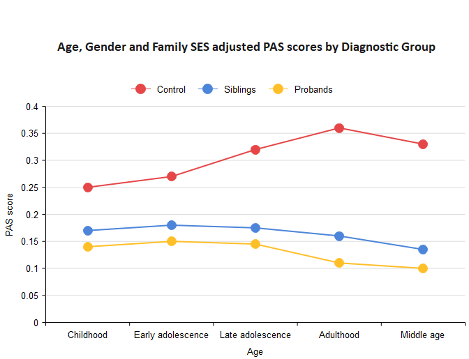

<a href="article-01-05.html"><i class="arrow far fa-arrow-alt-circle-left"></i></a>

조현병은 오랜 세월에 걸쳐 환자의 삶을 잠식하는 끈질긴 질환이다. 조현병의 개개 사례가 단일한 질병에서 비롯되었다고 부르기 곤란할 정도로 환자에 따라 경과가 다르며, 그 예후도 완전한 회복에서부터 돌이킬 수 없는 인격의 황폐화까지 범위가 매우 넓다. 그 시작은 태생기로 거슬러 올라가며, 사망할 때까지 완치가 가능한지도 불분명하다. 사망률이 높고 기대 수명이 짧은데, 이는 중간에 적지 않은 환자들이 자살로 삶을 마감하기 때문이며, 이에 더하여 중년 이후에는 불규칙한 생활습관과 불성실한 건강관리로 성인병에 시달리기 때문이다. 전반적으로 조현병의 경과는 타 정신질환에 비해 매우 비관적이라고 할 수 있겠으나, 불과 100년전 조현병 환자들의 삶과 죽음을 되짚어 본다면 지난 100년 사이에 기적적인 발전이 있었다고 보아야 한다. 불치의 병으로 낙인찍힌 채 수용소에서 삶을 마감해야 했던 100년 전과는 달리, 이제는 지역 사회에서 직업에 종사하고 독립적 삶을 유지하면서 인간다운 삶을 누릴 수 있게 되었다.

## 6-1. 적응기와 전구기 {#premorbid-stage}

### 6-1-1. 개념

크레펠린, 블로일러, 슈나이더와 같은 선구자들은 뚜렷한 급성기 증상을 보이거나, 발병 후 수년이 지나 인격의 황폐화에 접어든 환자들을 접하고 치료하면서, 조현병에 대한 이해와 통찰력을 키워왔다. 이후로도 오랜동안, 조현병은 망상과 환각을 일으키는 병 정도로 이해되면서, 행동 문제가 겉으로 드러난 시점부터의 경과를 중심으로 연구가 진행되었다.

1950년대에 접어들어 항정신병 약물이 개발되고 치료 기법이 나날이 발전하면서, 조현병은 치료될 수 있다는 희망이 싹트기 시작하였다. 그러나 그대와 열망과는 달리 약물 치료를 해도 병전 기능을 회복하기는 어려웠고, 그 한계와 부작용이 점점 분명해졌다. 이에 의사와 연구자들은 조기 치료와 예방에 주목하기 시작하였다.

물론 이전 시대 학자들이라고 발병 전의 미묘한 변화를 눈치채지 못한 것은 아니다. 블로일러나 콘라드([1장 4-2-3절 참조](article-01-01.html#delusional-mood)) 등의 학자들은 발병 전 환자들이 보이는 초점없는 생각이라던가, 사회적 위축, 의욕이나 기력 저하 등에 주목하였다. 망상이나 환각과는 거리가 먼 비특이적 증상들이 조현병의 초기 증상이며, 동시에 재발의 징후가 될 수 있다는 생각은 이미 오래전부터 제기되었다. [@Chapman1966-ew][@Herz1980-zn]

1980년대 중후반에는 바야흐로 초발 정신증(first episode psychosis)이라는 개념이 거론되기 시작하였다. 의사들은 초발 삽화와 재발 삽화가 임상 양상이나 치료 반응면에서 현저히 다르다는 것을 체감하기 시작하였고, 첫 삽화 때 공격적이고 충분한 치료를 받아야 한다는 공감대가 형성되었다. 선구적인 연구로서 1987년, "스코틀랜드 초발 삽화 조현병 연구(The Scottish First Episode Schizophrenia Study)"가 시작되었고, 49명의 초발 환자를 5년간 추적 조사하였다. 연구의 주 목적은 이들의 향후 경과를 관찰하는 것이었으며, 추적결과는 매년 논문으로 발표되었다. 자료를 분석해보니 실망스럽게도 5년간 꾸준히 약물을 복용했음에도 불구하고 70%가 재발하였고, 20%만이 안정된 직장을 유지하였다.[@thescot1987]

초발 환자의 이후 경과가 만족스럽지 못하다는 연구 결과가 발표되면서, 1990년대에 접어들자 "정신병의 비치료 기간(Duration of Untreated Psychosis, DUP)"이라는 개념이 등장하였다.[@Loebel1992-ps] 초발 환자를 아무리 열심히 치료해도 성과가 신통치 않다면, 환자를 일찍 발굴하여 최대한 신속히 치료를 시작함으로써 치료 반응이나 예후를 나아지게 한다는 아이디어였다. DUP가 짧을수록 치료 성과가 좋아진다는 보고가 앞다투어 발표되었다. [@Falloon1992-ec][@Birchwood1992-vn] 발병한 환자를 최대한 빨리 찾아내기 위해선 의료인 교육뿐 아니라 사회 전반에 걸쳐 조현병에 대한 의식 변화와 계몽이 필요하였다.

조현병 경과에 대한 연구의 초점이 점점 더 시간적으로 앞당겨지면서, 새로운 개념들이 도입되었다. 비슷한 시기에 발표된 조현병의 신경발달학적 가설(현재 4장 2절 참조)이 영향력을 확장하면서, 노련한 임상가라면 감지할 수 있는 특징적인 증상 패턴이 발병 전에 이미 드러날 것이라 예상되었다. 동시에 일단 발병하고 나면 아무리 빨리 치료를 시작해도 오래전부터 시작된 뇌 손상을 되돌리기 어려울 것이라는 우려가 제기되었다.[@McGlashan1996-bq]

일찌기 1977년, Strauss 등[@Strauss1977-mq]은 조현병 환자의 병전 적응에 대해 논의하기 시작하였다. 병전 적응(premorbid adjustment)이란 질병의 징조가 나타나기 전까지 환자의 사회적/직업적 적응 수준을 의미한다. 저자들은 발병 과정을 요약하는 하나의 모델을 제시했는데, 이에 따르면 조현병 환자는 영아기 때부터 수면과 각성의 문제를 일으키다가, 아동/청소년 기에는 미세한 정신병적 삽화와 함께 또래와의 어울림 문제, 학업 성적 저하, 집중곤란 등의 문제를 보이고, 급기야 청소년기와 초기 청년기에 심한 스트레스를 받으면 사회적 위축과 기능 저하가 심해지면서 발병에 이르게 된다.

물론 이러한 전형적 패턴을 보이는 것은 극소수에 해당할 것이다. 환자마다 너무나 다양한 병전 증상을 보이기 때문에, 발병한 환자에서 후향적으로 병전 문제를 찾아낼 수는 있겠지만, 아직 발병하지 않은 소아/청소년의 증상을 바탕으로 미래의 발병 여부를 예측하기는 곤란하다. 게다가 병전 기간이란 태어나서부터 발병 전까지를 의미하므로, 너무나 광범위하고 조작적 정의를 내리기 힘든 개념이다.대표적인 평가 도구인 병적 적응 척도(Premorbid Adjustment Scale, PAS)[@Cannon-Spoor1982-fq] 역시 태어났을 때부터 성인기 까지를 4개의 구간으로 나누어 평가한다.

기간을 정의하기 어려운 병전 적응과는 달리 전구 증상(prodromal symptom)이란 일단 발병하고 난 후 본격적 정신병적 증상이 나타나기 전까지 환자가 겪게 되는 비특이적 증상들을 말한다. 이는 어찌되었던 정상에서 벗어난 증상들이기 때문에 정의하기도 쉽고 향후 경과 예측에 사용하기도 용이하다. Keith와 Matthews[@Keith1991-ta]는 전구증상을 발병 과정과 관련하여 나타나는 다양한 문제 행동들이라고 정의했다. Loebel 등[@Loebel1992-ps]은 전구기를 비정상적 행동 증상의 발현과 정신병적 증상 발현 사이의 기간으로, Beiser 등[@Beiser1993-my]은 첫번째 뚜렷한 증상발현으로부터 첫번째 저명한 정신병적 증상의 사이로 보았다. 물론 환자의 시점에서 보느냐, 제 3자의 시점에서 보느냐에 따라 기간 정의에 차이가 난다.[@Yung1996-yj] 환자 본인이 이상을 감지했을 때를 전구기의 시작으로 삼는다면 좀 더 빨라질 수 있지만, 병식이 없는 환자라면 더 늦어질 수도 있다.

{width="60%"}

<figcaption>

Figure 1. A model of the long-term course of schizophrenia. Modified from [@McGlashan1996-bq]

</figcaption>

병적 적응기, 전구기, 급성기, 잔류기, 만성기 등 조현병의 경과가 일정한 단계를 거친다는 아이디어가 자리를 잡아가면서(그림 1), Fava와 Kellner[@Fava1993-uz]는 최초로 조현병에 병기 모델(staging model)을 적용하였다. Fava와 Kellner는 전구 증상부터를 제 1기로 정하고 있다. 물론 이러한 병기는 절대적인 것이 아니며, 병기와 병기 간의 구분도 분명하지 않다. 또한 순서대로 밟지 않고 병기를 거슬러 올라가거나 구간을 반복하는 경우도 있다.

학문적 추세가 조기 발굴과 조기 치료를 강조하면서 병기에 포함되는 범위가 점점 앞으로 당겨졌다. Liberman 등[@Lieberman2001-zf]은 각각의 병기와 그 시기에 겪게 되는 생물학적 변화를 대응시키면서 병전 적응기도 병기 모델에 포함시켰다. 그는 병전 기간 동안에 신경계의 비정상적인 발달로 인한 신경 회로의 이상이 누적된다고 여겼다.

| Stage   | Description                                           |
|---------|-------------------------------------------------------|
| Stage 1 | Prodromal (mainly affective and negative symptoms)    |
| Stage 2 | Acute episode                                         |
| Stage 3 | Residual symptom from the previous episode            |
| Stage 4 | Subchronic (less than 2 years but more than 6 months) |
| Stage 5 | Chronic (more than 2 years)                           |

: (\#tab:fava-stage) Stages of schizophrenia. Modified from [@Fava1993-uz]

​

<figcaption>

Figure 2. Stages of schizophrenia. Modified from [@Lieberman2019-jf]

</figcaption>

### 6-1-2 병전과 전구기의 주요 증상

병전 적응기는 아직 발병하기 전이기 때문에, 연구를 진행하는 것 자체가 어렵다. 지금까지 행해진 연구는 보통 환자 가족 등 고위험군을 코호트로 삼아 전향적으로 추적하거나, 이미 발병한 환자를 대상으로 후향적으로 과거력을 조사한다. 후자의 경우 회상한 내용에 명백한 편향이 있을 수 있다. 워낙 비특이적이라 특정한 증상을 찾아내기보다는 광범위한 적응 정도를 추적한다. 연구결과에 따르면, 조현병 환자의 PAS 점수는 아동기부터 대조군보다 현저히 높아 발달 과정에 다양한 문제를 보인다는 것을 엿볼 수 있다. 특히 대조군은 청소년기에서 성인기로 넘어가면서 부쩍 점수가 감소하는데, 환자군은 오히려 급격히 증가한다. (그림 3) Shapiro 등[@Shapiro2009-ji]의 연구에 따르면 환자 가족 즉 고위험군은 대조군보다 점수가 높긴 하지만, 청소년기-성인기의 변화는 대조군과 동일한 패턴을 보인다. 이를 토대로 추론해보면, 아동기까지는 병전 적응 정도가 대조군에 비해 크게 차이가 나지 않지만, 후기 청소년기에 접어들면 상당한 차이가 나리라 예상할 수 있다.

<figcaption>

Figure 3. Trajectories of Premorbid Adjustment Scale (PAS) score by diagnostic group. Modified from [@Shapiro2009-ji]

</figcaption>

단순히 정상적인 기능 발현이 제대로 되지 않는 병전 적응기에 비해, 전구기에는 보다 명확한 비특이적 증상이 나타난다. Lieberman 등[(Lieberman et al. 2001)](https://paperpile.com/c/mJkxZF/eO0L)은 대표적인 전구증상으로 비특이적인 기분 증상, 불안, 감정기복, 자극과민성, 수면장애, 주의 집중 곤란, 마술적 사고, 일시적 망상이나 환각, 대인 기피, 집착, 약물 사용 문제 등을 나열하였다. Yung과 McGorry[(Yung and McGorry 1996)](https://paperpile.com/c/mJkxZF/rtD9)는 과거 문헌에서 전구 증상으로 언급되었던 증상들을 추려 정리했는데, 이는 표 2와 같다.

::: {.l-body-outset}
| 신경증적 증상  | 기분 증상     | 의욕 변화           | 인지 증상        | 신체 증상            | 행동 변화           | 기타           |
|----------------|---------------|---------------------|------------------|----------------------|---------------------|----------------|
| 불안           | 우울          | 무기력, 욕망의 상실 | 주의 집중 곤란   | 막연한 신체증상 호소 | 학업/직업 기능 저하 | 강박증         |
| 좌불안석       | 무쾌감증      | 따분함, 흥미 저하   | 집착, 백일몽     | 체중 감소            | 사회적 위축         | 해리현상       |
| 분노, 이자극성 | 죄책감        | 피로, 기력 감퇴     | 사고 차단        | 식욕 부진            | 충동성              | 대인관계 민감  |
|                | 자살사고      |                     | 추상적 사고 곤란 | 수면 장애            | 기이한 행동         | 자기 경험 변화 |
|                | 심한 감정기복 |                     |                  |                      | 공격적, 파괴적 행동 | 언어구사 이상  |
|                |               |                     |                  |                      |                     | 지각 변화      |
|                |               |                     |                  |                      |                     | 편집 경향      |
:::

<figcaption>

Table 2. Domains and exemplary symptoms in prodromal stage of schizophrenia.  Modified from [@Yung1996-yj]

</figcaption>

표 2에서 보는 바와 같이 광범위한 정신병리가 모두 나타날 수 있기 때문에, 이를 통해 발병을 예측하기는 매우 어렵다. 그러나 일부 학자들은 특히 조현병과 주로 연관되는 진단 특이적인 증상이 있다고 주장한다.예를 들어 Cameron[@Cameron1938-cw]은 의심 경향, 혼란감, 기이한 신체적 경험을 언급했으며, Chapman[@Chapman1966-ew]은 주의집중 곤란 특히 선택적 주의의 곤란과 지각의 미묘한 변화가 특징적이라고 하였다. 슈나이더의 제자인 <s>Huber</s>는 1960년대부터 기본 증상(basic symptoms)이라는 개념을 발전시켜 왔다. 이 개념은 환자의 주관적 경험에 초점을 맞추어, 환자 자신과 세상을 경험하는 느낌에 미묘한 변화가 있거나, 평범하게 벌어지는 주변 상황에 적절히 대처하기 어려워하는 현상들을 가리킨다. 기본 증상 개념을 옹호하는 학자들은 객관적 증상보다 이러한 주관적 느낌의 변화가 조현병의 전형적인 전구 증상이며, 역설적으로 이들 증상이 사라지면서 전형적인 정신병적 증상이 뒤를 잇는다고 말한다. 그래서 이러한 기본 증상을 "전초 증후군(outpost syndrome)"이라 칭하기도 한다. 유럽에서는 기본 증상을 중심으로 Cognitive Disturbances scale (COGDIS)와 Cognitive-Perceptive basic symptoms scale (COPER)라는 평가도구가 개발되었으며, 이 척도들은 고위험 군의 발병을 미리 찾아내기 위한 목적으로 사용되고 있다.[@Schultze-Lutter2015-oo][@Schultze-Lutter2016-xk]

<aside>

**Gerd Huber** (1921\~2012): 독일의 정신과 의사. 조현병 환자의 장기 종적 관찰인 본 연구(Bonn study)를 통하여 조현병의 초기 경과에 대해 연구하였다. 소위 "기본 증상(Basic symptoms)" 개념을 제안하였으며, 이 개념은 현재도 [International Working Group on Basic Symptoms](https://basicssymptoms.org)을 통해 연구가 지속되고 있다.

</aside>

주관적 증상을 강조하는 유럽에 비해 미국에서는 보다 객관적인 지표를 강조하고 있다. 2004년 무렵, 미국의 연구자들은 다기관 공동연구인 "북미 전구증상 종적 연구 (North American Prodrome Longitudinal Study, NAPLS)"를 진행하기 시작하였다. [@Addington2007-lo] 연구를 진행하기 위해선 잠정적 전구기 모델과 표준화된 평가 도구가 필요했는데, 그들은 평가 도구로 Structured Interview for Prodromal Syndromes (SIPS)[@Miller2003-os]를 사용하기로 결정하였다. 이 도구의 평가항목을 보면 음성증상을 비롯한 조현병의 제반 항목이 대부분 들어있으며, 수면 장애나 스트레스 내성 약화 등 신경증적 증상도 포함되어 있다. NAPLS의 연구자들은 SIPS 평가 결과를 분석한 후, 전구증상으로 인해 의사를 찾게 되는 경우를 세가지로 요약하였다. 첫째는 SIPS 양성 증상에 해당되는 각 항목이 중등도 이상이거나 지난 1년간 상승했으며 빈도가 잦아진 경우이다. 둘째는 친척 중에 조현병 환자가 있으며 지난 1년간 병전에 비해 상당히 기능이 떨어진 경우이다, 셋째, SIPS 양성 증상이 정신병적 단계에 도달하지만 일시적이어서, 한번에 1시간을 넘지 않는 범위에서 증상이 나타났다 사라졌다를 반복하는 경우이다. NAPLS의 연구자들은 SIPS 결과 및 인구학적 정보를 바탕으로 향후 발병의 위험도를 계산하는 모델을 개발하였고, 이는 민감도 94%, 특이도 23.6%의 성적을 보였다.[@Cannon2016-cx] NAPLS 연구는 이후 전구기를 이해하고, 고 위험군을 가려내는데 있어 큰 영향을 끼쳤다.

<aside>

NAPLS에서 만든 모델은 [An Individualized Risk Calculator for Psychosis](https://riskcalc.org/napls/)에 접속하면 직접 사용해 볼 수 있다.

</aside>

::: {.l-body-outset}
| P. Positive                                | N. Negative               | D. Disorganization                   | G. General symptoms                     |
|--------------------------------------------|---------------------------|--------------------------------------|-----------------------------------------|
| P1. Unusual thought content                | N1. Social anhedonia      | D1. Odd behavior or appearance       | G1. Sleep disturbance                   |
| P2. Suspiciousness/persecutory ideas       | N2. Avolition             | D2. Bizarre thinking                 | G2. Dysphoric mood                      |
| P3. Grandiose ideas                        | N3. Expression of emotion | D3. Trouble with focus and attention | G3. Motor disturbances                  |
| P4. Perceptual abnormalities/hallucination | N4. Experience of self    | D4. Impairment in personal hygiene   | G4. Impaired tolerance to normal stress |
| P5. Disorganized communication             | N5. Ideational richness   |                                      |                                         |
|                                            | N6. Occupational function |                                      |                                         |
:::

<figcaption>

Table 3. Structured Interview for Prodromal Syndromes (SIPS)

</figcaption>

### 6-1-3. DSM에서의 전구 증상

DSM-IIIR은 조현병의 전구 증상을 따로 열거하고 있지만, DSM-IV부터는 더 이상 언급하지 않고 있다. DSM-5 역시 전구증상에 대한 언급을 찾을 수 없지만, 대신 향후 연구 대상인 질병 목록에 "약화된 정신병 증후군(Attenuated Psychosis Syndrome)"을 올려놓고 있다. 이 질환은 그 진단 기준만을 보면 위에 언급한 조현병의 전구증상과 크게 차이나지 않는다. DSM-5에 이 질환을 넣느냐 마느냐로 의견이 분분할 때만 해도 이 상태는 "정신병 위험 증후군(Psychosis Risk Syndrome)"이라 하여 좀더 전구기 증상과 개념이 접근해 있었다.[@Carpenter2009-jg][@Woods2009-vg] 그러나 예상과는 달리 가벼운 정신병적 증상을 오랫동안 앓아온 환자 중 절반 이상이 결코 조현병으로 이행되지 않는다는 연구 결과가 거듭 발표되자, 약화된 정신병 증후군이라는 명칭이 더 적절해보였다.[@Xu2015-wi] 아직 이 상태가 정식 DSM 진단명이 되지는 못했지만, 조현병의 조기 발견이라는 측면이 아니라 그 자체의 임상적 중요성에 의해 활발한 논의가 진행되고 있다.

<aside>

**Prodromal symptoms of schizophrenia**

1.  Marked social isolation or withdrawal
2.  Marked impairment in role functioning
3.  Markedly peculiar behavior
4.  Marked impairment in personal hygiene and grooming
5.  Blunted or inappropriate affect
6.  Digressive, vague, over-elaborate or circumstantial speech
7.  Odd beliefs or magical thinking
8.  Unusual perceptual experiences
9.  Marked lack of initiative, interests, or energy.

</aside>

### 6-1-4. 전구기에서 발병으로의 이행

전구기는 전정신병 단계(pre-psychotic phase)와 정신병 단계(psychotic phase)의 두 단계로 나누어 생각해 볼 수 있다. 전자가 정신병적 증상을 제외한 비특이적인 증상이 주를 이룬다면, 후자는 약화된 정신병 증후군에 가깝다. 자연히 전자가 선행하며, Häfner 등[@Hafner2003-zw]은 전자가 2\~4년을 끈다면 후자는 2년 미만이라고 하였다. 전구증상을 어떻게 정의하느냐에 따라 천양지차이지만, 미약할 지라도 망상, 환각을 보였던 경우에는 40\~50% 정도가 조현병으로 이행된다.[@Hafner2003-zw] 그러나 최근의 연구결과는 좀 다른 양상을 보여준다. 아무래도 전구기에 대한 관심이 높아지면서 평가도구의 민감도가 높아진 때문인지, 최근 연구일수록 조현병으로의 이행 비율이 조금씩 낮아지고 있다. 2011년 행해진 메타 분석에 따르면 약화된 정신병적 증상을 보여 임상적 발병 위험군(Clinical High-Risk, CHR)으로 분류된 환자들은, 6개월 내 18%, 1년내 22%, 2년 내 29%, 3년 내 36%가 조현병으로 이행되었다.[@Fusar-Poli2012-ge]

환자에 따라 전구기 증상이 다른 것처럼 그 기간도 각양각색이다. 수일에서 수년까지 지속되기도 하며, 20\~25% 정도의 환자는 전구증상없이 갑자기 발병한다.[@Freudenreich2019-kb] Beiser 등[@Beiser1993-my]은 전구기의 중앙값이 52.7주라고 보고하였고, Loebel 등[@Loebel1992-ps]은 초발 조현병 환자에서 전구기는 평균 98.5주였다고 보고하였다. 대체로 첫 번째 정신증상과 본격적인 정신병의 발병 사이의 평균적인 시간은 약 2년 정도 (중앙값은 1년) 걸린다.[@Yung1999-xq] 그러나 발병에 도달하지 않았다 할지라도, 임상적 발병 위험군(CHR) 환자가 별 문제가 없느냐 하면 그렇지 않다. 약화된 정신병 증후군을 앓고 있는 것으로 분류되는 이들 환자들 역시, 전구증상 자체 때문에 고통을 받는다.[@Lin2015-wb] 약화된 증상이라 할 지라도 치료없이 저절로 회복되는 경우는 절반 정도에 지나지 않는다.[@Addington2011-zw]

전구기에서 발병에 이르는 상황의 임상적 변화는 자세히 알려져 있지 않다. 환자가 어떻게든 심리적으로 대처하면서 내부에 담아두고 있던 증상이, 정도가 심해지면서 외부 행동의 이상으로 나타나면 조현병이 발병했다고 판단하는 것 뿐이다. 발병 이전에 환자들은 정신병적 증상 뿐 아니라 우울, 불안을 함께 겪으며, 사회적/직업적 기능의 점진적 저하가 드러난다. 환자에 따라선, 발병 이전에 이미 기능 저하 때문에 학업/직업을 유지하지 못하기도 하며, 음성 증상의 증거가 미리 엿보이는 경우도 있다.[@Piskulic2012-un][@Devoe2020-zq] Healey 등[@Healey2018-hi]은 지난 2년간의 증상 변화를 바탕으로, 발병에 이르는 군의 특징을 조사하였다. 증상의 정도가 심하지 않고 인지증상의 증거가 없는 경우, 이행하는 비율은 5.6%에 지나지 않았다. 반면 최근 2년 동안 편집 경향이 강화되고 우울증에 빠진 경우는 이행 비율이 14.2%였으며, 음성/인지 증상이 이미 눈에 띄게 된 경우에는 30% 가까이 이행하였다. 결론적으로 본격적 조현병으로 이행하는 군은, 이미 전구기부터 정신병적 증상 뿐 아니라 퇴행 증상을 보이기 시작한다는 것을 알 수 있다.

## 6-2. 첫 발병

### 6-2-1. 초발 삽화

상당 기간 동안 전구기에 머물러있었던 경우, 전구기와 초발 삽화를 구분하는 것은 인위적 구분에 불과할 수 있다. 그러나 초발 삽화는 아무런 전조증상없이 발병하기도 하며, 전구기와는 질적으로 차이나는 증상을 겪기 시작하기도 한다. 환자가 외적으로 확연히 드러나는 기이한 행동을 보이거나, 폭력 성향을 보이면 쉽사리 주위에서도 눈치를 챌 수 있으나, 그렇지 않은 경우에는 발병을 하고도 치료를 받기까지 상당한 시간이 걸릴 수 있다. 증상의 심각도와는 상관없이 급성 발병인 경우 점진적 발병에 비해 장기적 예후가 양호하다.[@Kanahara2013-ib] 그 원인이 두 경우 사이의 생물학적 차이에 의한 것인지, 단순히 급성 발병은 정신병의 비치료 기간(DUP)가 짧기 때문인지는 분명하지 않다.

환자는 처음 겪게 되는 정신병적 증상때문에 당황하고 공포에 휩싸이며, 진실과 동떨어지더라도 의미를 부여하여 어떻게든 이해하고자 하며, 필사적으로 그 원인을 찾고자 한다.[@Troube2013-gl][@Bergamin2020-yq] 망상 자체에 포함된 가해자가 아니라해도, 가족이나 이웃 기타 주변인물이 자신의 고통에 관련되어 있다고 생각하기 때문에 사람을 피하며, 사회적으로 고립된다. 가까운 사람에게 분노를 폭발시키거나, 자해를 시도하기도 한다. 처음에는 이런 식으로 투쟁하려 애써보기도 하지만, 어떻게 해도 망상이나 환각이 지속된다는 사실에 맞부딪히면서 좌절, 포기에 빠진다. 수치심이나 피해사고 때문에 남에게 도움을 구하지도 못한다. 더군다나 전문가의 도움을 구하는 것은 자신이 미쳤다는 것은 인정하게 되는 셈이기 때문에 더더욱 숨기려 하거나 치료 권유를 거부한다. 대신 담배, 술, 기타 남용 물질에 의존하면서 스스로 증상을 가라앉히려 애쓴다.[@Goswami2004-dp] 일부 환자들은 자신이 점점 통제불능이 되어간다는 것을 인식하며, 이러한 변화에 공포를 느낀다. 이들 환자들은, 결국 통제가 안 되어 한바탕 소동을 일으킨 후 정신병동에 입원하게 되면 오히려 안도감을 느끼기도 한다.

환자가 자신의 증상을 숨기는 경향이 높기 때문에 비치료 기간(DUP)이 필요없이 길어진다. 메타 분석에서 DUP의 평균 값은 약 1년 (67.4주)이지만, 워낙 치우친 분포를 하기 때문에 평균값은 별 의미가 없다.[@Large2008-mk] 양성 증상이 심한 경우 DUP가 짧으며, 그에 비해 음성 증상이 일찍 시작되었을 때는 DUP가 현저하게 길다. 알코올 등 약물 남용이 동반되었을 때도 DUP가 길어진다.[@Howes2021-nq] DUP는 워낙 중요한 치료 반응의 예측인자이기 때문에 DUP를 줄이는 것은 의사들의 당면과제이다. 그러나 많은 조기 발견 프로그램들이 양성 증상에 초점을 맞추고 있는데 비해, 정작 DUP를 늘이는 것은 음성/인지 증상이라 방향 조절이 필요할 것으로 보인다.

### 6-2-2. 초발 삽화의 치료 반응

임상적 경험에 따르면 초발 삽화를 겪는 환자는 재발 환자나 만성 환자에 비해 확연히 치료 반응이 양호하다. 초발 환자 522명을 대상으로 리스페리돈 혹은 할로페리돌 단일 약제를 이용하여 치료한 결과에 따르면 4주 이내에 77%의 환자가 임상적으로 의미있는 반응(PANSS 총점이 20%이상 감소)을 보였다.[@Emsley2006-it] 물론 11.2%의 환자는 8주가 지나도 의미있는 반응을 보이지 않았다. 만성 환자와는 달리 1주일 내에 반응을 보이는 환자도 약 1/4에 달하였다. 최근에 행해진 메타 분석에 의하면 초발 삽화 환자가 최종적으로 PANSS 혹은 BPRS 총점의 20% 내지 50% 감소를 보이는 비율은 각각 81.3%와 51.9% 였다. 여성이거나 DUP가 짧은 환자가 유의하게 반응비율이 높았다.[@Zhu2017-aw] 거의 모든 연구에서 치료 직전 PANSS/BPRS 점수가 높은, 즉 증상이 심한 환자가 더 반응 비율이 높은 것으로 나타난다. 이는 양성 증상이 치료에 잘 반응한다는 것, 증상이 심한 환자는 DUP가 짧다는 것, 그리고 PANSS 점수가 낮아질 수록 거기서 더 호전되기가 어려워진다는 점 등으로 설명할 수 있다.

그러나 치료에 반응한다고 해서, 예외없이 관해에 도달하고 병전 기능을 되찾는 것은 아니다. 치료 반응이란 약물이 듣는다는 것 뿐이고, 증상이 소실되는 것을 의미하지는 않는다. 관해란 임상적으로 의미있는 증상이 없어지는 것을 의미하는데 (3장 4-1절 참조), 초발 삽화 환자에서 관해에 이르는 비율은 연구마다 큰 차이가 있지만 평균 35.6% 정도이다.[@AlAqeel2012-st] 기능적 회복(functional recovery)은 증상의 관해보다도 더 비율이 낮아서, 첫 발병 후 5년이 지났을 때 적절한 사회적 기능을 수행하는 환자의 비율은 25.5% 정도였으며, 그야말로 완전히 회복되는 비율은 13.7%에 지나지 않았다.[@Robinson2004-lv]

## 6-3. 초발 삽화 이후 {#after-first-episode}

### 6-3-1. 정신병후 우울증

초발 삽화에서 겨우 회복된 환자는 대체로 자신이 했던 경험을 잘 소화하지 못한다. 부인과 억압의 방어기제가 작동하며, 잘 기억하지 못하거나 대놓고 부인하기도 한다. 비정상적이었다는 것은 인정하지만 조현병이라는 진단을 받아들이지 못하기도 하며, 치료만 잘 받으면 아무 문제가 없다는 낙관론을 펴기도 한다. 오히려 사태를 있는 그대로 받아들인 환자는 우울과 좌절에 빠지기 쉽다. 정신병후 우울증이라는 개념은 매우 오래된 개념으로, 이에 대한 최초의 언급은 1920년대로 거슬러 올라간다.[@McGlashan1976-xm] 정신분석가들은 급성 정신병적 삽화를 겪은 환자들이, 회복 후 수개월이 지난 뒤에도 퇴행된 상태에 머물면서, 상담을 하려해도 말을 하지 않고 강한 저항을 보이는 것을 발견하였다. 분석가들은 이 시기 환자들이 부정, 투사, 왜곡을 주로 사용하며, 자기애적이고 퇴행적 상태에 머물러있다가 한참이 지난 후에야 조금씩 외부 현실로 빠져나온다고 보았다.이 시기 환자들은 심한 대인 기피와 함께 우울증과 유사한 증상을 보인다. McGlashan과 Carpenter[@McGlashan1976-xm]은 이러한 현상을 정신병후 우울증이라고 불렀다.

특히 초발 환자의 경우, 대다수 환자가 회복 후 잠깐이나마 우울증을 겪는다. 약 75%의 환자가 상당한 우울 증상을 경험하며, 22% 정도는 주요 우울증의 진단기준에 부합한다.[@Koreen1993-ln] 그러나 이러한 우울증이 정신병적 과정에서 회복한 환자가, 병식을 얻으면서 겪게되는 좌절인지는 확실하지 않다. 일단 분명한 것은 정신병후 우울증은 전구증상으로서의 우울증과는 확연히 구분된다는 점이다. 전구기 우울증은 정신병적 증상이 자리를 잡으면서 오히려 사라지는 경향이 있다. 전형적인 경과에서는 망상, 환각에서 회복된 환자가 처음에는 강한 의욕을 보이며 정상 생활로 되돌아가려고 애를 쓰지만, 얼마 지나지 않아 좌절, 무기력, 무의욕에 빠진다. 이 기간은 환자에 따라 차이가 심하며, 수개월이상 경우에 따라서는 1년 가까이 지속되기도 한다.[@Roth1970-uc]

<s>정신병후 우울증</s>을 독립적인 증후군으로 보아야 할 지는 애매하다. 일부 학자들은 우울 증상이 잔류하는 것은 삽화 자체가 아직 관해에 도달하지 않았기 때문이라고 하며, 약물 부작용에 의한 2차적 우울 증상을 감별해야 된다고 한다. 또한 애초에 진단을 정신병적 기분장애 혹은 조현정동 장애로 내려야 할 수도 있으며, 음성증상과의 구분 또한 명확하지 않다.

<aside>

정신병후 우울증은 DSM-IV에서 "조현병의 정신병후 우울 장애(postpsychotic depressive disorder of schizophrenia)"라고 하여 향후 연구가 필요한 진단으로 등재되었다. 그러나 이를 뒷받침하는 증거가 부족한 나머지, DSM-5에서는 다시 삭제되었고, 필요한 경우 Other Specified Depressive Disorder로 진단하도록 되어있다.

</aside>

원래 정신분석가들이 이 상태를 고찰할 때는, 정신병적 혼란을 겪고난 자아가 스스로 자신의 내면을 치유해나가는 과정을 묘사하고자 하였다. 그러다 DSM으로 대표되는 진단 만능의 시대로 넘어오면서, 진단기준에 넣어야 하느냐 말아야 하느냐로 분분하다가 결국 흐지부지 되어버린 느낌이다. 하지만, 임상 현장에서 초발 삽화 후 비관 및 자살 충동을 느끼는 환자는 드물지 않게 목격한다. 이러한 환자를 치료하는 의사는 곤란한 딜레마에 빠지게 된다. 향후 경과를 현실적으로 설명하면 환자의 비관과 좌절을 더 악화시킬 것이요, 그렇다고 지나치게 희망적인 전망을 제시하면 약물 순응도가 떨어질 위험이 있다.

### 6-3-2. 재발

초발 삽화의 치료 반응이 양호하다는 것은 긍정적인 부분이겠지만, 역으로 치료 순응도를 떨어뜨리는 원인이 되기도 한다. 심지어 기능적 회복을 이루지 못한 환자들도 고통스러운 망상이나 환각에서 벗어나기면 하면, 더 이상 약을 먹어야 될 필요성을 느끼지 못한다. 쉽게 회복했으니, 병 자체가 심각하지 않으리라 믿어버리는 것이다. 약물 순응도의 정의는 연구마다 다르지만, 초발 삽화 후 1년내에 약물 투여를 중단하는 비율은 50%가 넘는다.[@Ljungdalh2017-ms] 그런데 약물 중단은 재발의 가장 큰 요인 중 하나이다. 재발의 비율은 연구 대상군이나 기간, 재발의 정의에 따라 크게 차이가 나기 때문에 어림잡기 어렵지만, 약물 유지군과 약물 중단군의 차이는 뚜렷해보인다. Kishi 등[@Kishi2019-pb] 행한 메타 분석에 따르면 초발 삽화에서 회복된지 24개월 시점에서 재발 비율은 약물 중단군의 경우 60%에 이르렀으며, 이에 비해 유지군은 35% 정도에 머물렀다.

<figcaption>

Figure 4. Relapse rate of first-episode patients with schizophrenia.  Modified from [@Kishi2019-pb]

</figcaption>

재발의 가장 주요한 원인 중 하나가 약물 중단이지만, 약물을 중단하고 바로 재발하는 것은 아니다. 이 기간은 환자마다 큰 차이가 나는데, 보고된 평균값은 200-300일 정도이다.[@Gaebel2011-aq][@Emsley2012-cg] 그러나 임상에서 흔히 경험하기로는 약물 중단 후 1-2개월 내에 재발하는 경우가 꽤 있으며, 심지어 며칠 내에 재발하기도 한다.[@Emsley2013-ts] 약물을 끊고 수주 내에 재발하는 경우에 대해선 해석이 엇갈린다. 이전 삽화가 제대로 관해를 이루지 못했기 때문일 수도 있고, 그 동안 질병 과정은 계속 진행되고 있었는데 약물에 의해 겉으로 나타나는 증상만 억제되었을 수도 있다. 흥미로운 것은 금단 정신병(withdrawal psychosis) 가설이다.(3-4-3 참조) 장기간 항정신병 약물을 사용하여 도파민 수용체의 민감도가 높아져 있다면 갑자기 약을 끊었을 때 급속히 재발할 수 있다.

꽤 오랜 동안의 전구 증상을 보이는 초발 삽화와는 달리, 재발은 상대적으로 단기간에 일어나는 경우가 많다. 따라서 특정 증상을 이용하여 재발을 예측하고, 이에 따라 필요할때만 항정신병 약물을 투여하는 <s>간헐적 약물 치료</s>는 별로 실용성이 없다.[(Gaebel et al. 2011)](https://paperpile.com/c/mJkxZF/H0bS) 재발의 위험을 알려주는 전구 증상을 흔히 "조기 경고 징후(early warning sign)"이라고 칭한다.[(Bustillo et al. 1995)](https://paperpile.com/c/mJkxZF/288S) 일반적으로는 처음에 우울감, 대인 기피, 식욕 및 수면 패턴 변화가 생기고, 뒤이어 감정적 기복과 불쾌감이 두드러지며, 마지막으로 뚜렷한 정신병적 증상이 따르게 된다.[(Birchwood et al. 2000)](https://paperpile.com/c/mJkxZF/Fmct) 일단 정신병적 증상이 출현하기 시작하면 며칠 내로 완전한 재발이 일어나기 때문에 그 전에 비특이적 증상만 갖고도 재발을 예측할 수 있어야 하는데, 이는 쉽지 않은 문제이다. 정신병후 우울증을 비롯하여, 조현병 환자가 일상생활에 제대로 적응하지 못하여 우울/불안을 보이는 것은 다반사이기 때문에, 이를 일일이 조기 경고 징후로 삼는것은 불가능하다.

<aside>

**간헐적 약물치료(Intermittent drug treatment)**: 항정신병 약물의 장기 사용이 중추신경계 혹은 신체 전반에 예기치 못한 부작용을 가져올 수 있다는 전제 하에, 투여된 약물의 총량을 어떻게든 줄이기 위해서 제안되었다. 이에 더하여 항정신병 약물을 지속적으로 투여하면 도파민 수용체의 보상성 상향 조절이 생겨 약물에 내성이 생길 것이라는 우려도 이를 뒷받침하였다. 일단 관해에 돌입하면 약물을 끊었다가 재발 징조가 보이면 재투여하는 방법(targeted intermittent treatment), 급격한 정신병적 증상발현시 위기 개입 정도로만 약물을 사용하는 방법, 약물 휴일 (drug holiday)등 다양한 방법이 있다.[@Sfera2013-fr]

</aside>

절대적 기준을 세워서 모든 환자에게 적용하기 보다는, 관해 상태였을 때의 각자만의 기능 수준과 비교하는 것이 효율적이다. 일부 학자들은, 각각의 환자는 재발할 때마다 동일한 증상 경과를 밟는다고 보았고, 이를 "재발 시그니처(relapse signature)"라고 불렀다.[@Birchwood1995-ih] 그러나 아무리 세심하게 추적관찰 한다고 해도, 조기 경고 징후를 이용하여 재발을 예방하는 것은 특이도가 떨어지거나 때를 놓치는 경우가 많아 실효성이 거의 없다.[@Gleeson2005-of]

일단 재발을 하게되면, 초발 삽화때 나타났던 증상들이 급격하게 다시 출현한다. 조금씩 증상이 악화되는 초발 삽화에서와는 달리, 재발 삽화는 마치 억눌려있던 증상들이 일거에 출현하는 듯한 양상을 보인다. 재발은 환자나 가족들에게 심리적, 사회적 피해를 입히는 것으로 끝나지 않는다. 재발이 거듭될 수록 인지/음성 증상이 악회되며, 다시 회복하였을 때의 기능 수준도 점점 떨어진다. 이 때문에 다수의 학자들은 재발 자체가 신경 독성을 띠고 있을 것이라 예상한다.(참조...) 재발을 거듭할 수록 치료 반응도 나빠진다. 반응 비율이 떨어질 뿐 아니라, 관해에 걸리는 시간도 늘어나며, 필요한 약물의 용량도 증가한다. Takeuchi 등[@Takeuchi2019-mj]이 조사한 바에 따르면 이러한 치료 반응의 악화 양상은 두번째 삽화에서도 이미 뚜렷해진다.

### 6-3-3. 장기 경과의 유형

정신과 의사들은 흔히 자신의 예후를 묻는 초발 조현병 환자와 그들의 가족에게 ¼, ½, ¼ 법칙을 설명한다. 즉 환자가 자연적으로 건강을 회복할 확률이 ¼ 이요, 증상은 남아있지만 그럭저럭 사회적 기능을 수행할 확률이 ½ 이요, 나머지 ¼ 은 아무리 치료해도 점진적 악화를 막을 수 없으리라는 법칙이다.

이는 원래 1960년대 스위스의 로잔 지역에서 시행된 "Enquête of Lausanne (로잔의 조사연구)"라는 연구에서 비롯되었다.[@Ciompi1980-ul] 주 연구책임자였던 Müller와 <s>Ciompi</s>는 1963년 이전에 처음으로 입원했던 65세 이하의 주요 정신질환 환자 5,661명을 연구 대상으로 삼았는데, 이중 1,642명이 조현병이었다. 이들에 대한 집중 인터뷰와 의무기록 조사를 통해 후향적으로 경과를 재구성하였다. 이 연구를 통해 조현병 환자의 기대 수명이 대조군보다 짧다는 것, 사인의 분포는 대조군과 유사하지만 상대적으로 암 유병률은 낮다는 것 등이 처음으로 알려졌다. 연구가 시작될 때 살아있던 289명의 조현병 환자에 대해서는 이후 추적 조사가 이루어졌다. 당시만 해도 조현병은 불치병이라는 인식이 강했고, 현대적인 약물 치료도 보급되지 않았을 때였다. 이러한 선입견과 달리 조사 대상의 ¼ 은 완전히 회복되어 정상적 삶을 누렸고, 인격의 황폐화로 진행된 환자는 ¼ 에 불과하였으며, 나머지 ½ 은 그 중간이었다. 이를 토대로 유명한 ¼, ½, ¼ 법칙이 탄생하게 되었다.[@Ciompi_undated-vq]

<aside>

**Luc Ciompi** (1929\~): 이탈리아 태생의 스위스 정신과 의사. 조현병 환자의 장기 추적 결과를 바탕으로, 이들의 예후가 심리사회적 지지체계에 달려있다고 주장하였다. 사회 정신의학(social psychiatry)을 발전시키는데 공헌하였으며, 1984년에는 스위스 Berne 지역에 "Soteria Berne"이라는 조현병 환자를 대상으로 한 치료-재활 공동체를 설립하였다.[@Ciompi2004-aa]

</aside>

Ciompi는 환자의 경과가 가족력 유무 보다는 환자를 둘러싼 환경적 요인이나 병전 성격 등 심리사회적 요인에 의해 좌우된다고 보고, 재발을 막기 위해서는 위기 개입(crisis intervention)이나, 지지 체계(support system) 마련으로 환자의 심리사회적 스트레스를 줄여주어야 한다고 주장한다. 이는 이후에 조현병 환자의 지역사회 재활의 중요한 개념으로 자리잡는다.

로잔에서의 연구가 부분적으로 후향적 연구였던 것에 비해, <s>블로일러</s>는 208명의 조현병 환자를 부려 23년간 추적 관찰하였다. 이 환자들은 1942\~43년 사이에 입원한 코호트로 정신약물학 태동기의 혜택을 약간이나마 본 그룹인데, 전체의 53%, 초발 환자만 따지면 66%가 회복되거나 상당히 호전되었다. 블로일러는 이 결과를 발표하면서 발병의 두 유형(급성과 만성), 중간 경과의 두 유형(기복형과 안정형), 그리고 최종 결과의 두 유형(회복과 심각한 손상)을 구분하였다. 이를 조합하면 2 x 2 x 2 = 8로 8개 유형의 경과가 도출된다.

<aside>

**Manfred Bleuler** (1903\~1994): 스위스의 정신과 의사., Eugen Bleuler의 아들로 쮜리히 의과대학 교수로 재직했으며, 부속 병원인 Burghölzli 병원에서 환자를 돌보았다. 아버지 Bleuler의 이론을 가다듬고 전파하는데 공헌하였다.

</aside>

::: {.l-body-outset}
| Onset   | Course      | Outcome | Lausanne | Burgholzli | Vermont | Chicago | ISoS | Mean |
|---------|-------------|---------|----------|------------|---------|---------|------|------|
| Acute   | Undula ting | Mild    | 25.4     | 35         | 7       | 10.8    | 29.4 | 21.5 |
| Chronic | Undula ting | Mild    | 9.6      |            | 38      | 6.8     | 22.6 | 19.3 |
| Chronic | Simple      | Severe  | 24.1     | 15         | 4       | 36.5    | 14.4 | 18.8 |
| Chronic | Undula ting | Severe  | 5.3      |            | 27      | 12.2    | 4    | 12.1 |
| Chronic | Simple      | Mild    | 10.1     | 7.5        | 12      | 4.1     | 10.4 | 8.8  |
| Acute   | Simple      | Severe  | 8.3      | 10         | 3       | 13.5    | 9.1  | 8.8  |
| Acute   | Undula ting | Severe  | 11.9     | 5          | 4       | 9.5     | 4.9  | 7.1  |
| Acute   | Simple      | Mild    | 5.3      | 5          | 5       | 6.8     | 5.3  | 5.5  |
:::

<figcaption>

Table 4. Types of long-term course of schizophrenia and their proportion in several longitudinal observation studies.  Modified from [@Hafner2014-cx]    <b>Studies and their sources</b>:    Lausanne [@Ciompi1980-ul], Burgholzli [@Bleuler1978-cm], Vermont [@Harding1987-gr], Chicago [@Marengo1991-fj],

</figcaption>

  이후에 진행되었던 몇몇 대규모 종적 관찰 연구의 결과를 종합하여 8개 유형의 비율을 구하면 표 4와 같다. 급격히 혹은 서서히 발병하여 재발을 거듭하다가 나이가 들면 어느 정도 증상이 안정화되고 일상을 되찾는 경우가 전체의 40% 정도로 가장 많으며, 그 뒤를 회복과 재발이 뚜렷하지 않은채 서서히 기능을 상실해가는 유형이 차지하고 있다 (18%). 유형의 분포를 좀더 분석하면, 재발/호전을 반복하는 기복형(undulating)이 좀더 예후가 좋으며, 급성 발병인 경우 좀더 기복형이 차지하는 비율이 크다. 가장 예후가 좋지 않은 것은 전구기서부터 삽화가 분명하지 않은 채 증상이 지속되는 유형이다.

명확한 데이터가 제시되지는 않았으나, 조현병 발병 후 첫 수년 동안은 심한 증상 및 잦은 재발로 인하여 삶 전체가 혼란에 빠진다. 이때는 아직 병식이 확립되지 않아 치료진과의 마찰도 빈번하며, 반복되는 비자발적 입원으로 인해 가족과도 대립이 심할 때이다. 환자는 아직 증상에 대처할만한 나름대로의 방안을 마련하지 못했고, 자신에게 병이 있다는 것을 부인해야할 지 수긍해야 할 지도 결정하지 못했다. 병전의 정체성을 포기하지 못했기 때문에 좌절과 방황이 극심하며, 만성기에 비해 자살 위험도 높은 편이다.

Shepherd 등[@Shepherd1989-rs]는 49명의 초발 환자를 5년간 추적관찰 하였다. 그는 이 환자들의 경과 유형을 4가지 군으로 나누었는데, 이는 그림 5와 같다. Ciompi의 ¼, ½, ¼ 법칙처럼, 전체 환자의 ¼ 은 단 한번 삽화를 겪은 이후 재발 없이 기능을 완전히 회복하였고, 43%는 삽화가 반복되나 기능 수준의 점진적 저하는 보이지 않는다. 나머지 35%는 지속적으로 기능 수준이 저하되어 만성화에 이른다.

<figcaption>

Figure 5. Course of illness in first-episode patients with schizophrenia during 5 years after discharge.  Modified from [@Shepherd1989-rs]

</figcaption>

### 6-3-4. 심리적 적응

조현병 초기의 질풍노도와 같은 시기를 지나가면, 환자들은 나름대로 증상에 적응하기 시작한다. 실상 환자가 적응해야 하는 것은 증상 뿐만은 아니다. 대다수의 환자들은 학업을 중단하고, 직장을 잃었으며, 가족과 단절되어 삶의 터전을 상실한다. 또한 피해망상으로 인해 스스로 지역사회에 등을 돌렸을 뿐 아니라, 지역사회 역시 편견과 차별로 환자를 궁지에 몰아넣는다.

이러한 힘든 상황에서 회복의 실마리를 찾기란 여간 어려운 일이 아니다. 그러나 성공적으로 적응하기 시작한 일부 환자들은 나름대로의 대처전략을 마련한다. 조현병이 중반에 접어들면 증상이 조금은 약화되는 듯 하며, 적어도 재발의 주기가 길어진다. 환자들은 질병이 자신의 삶에 미친 영향을 심각하게 받아들이며, 부분적 병식이라도 얻게된 환자들은 약물 치료 및 정신과 상담에 의지하게 된다. 망상이나 환각에 대해서는, 증상이 완전히 사라지지 않았더라도, 그 의미를 축소하거나, 무시하거나, 주의를 다른 데로 돌리는 법을 익힌다.

환자의 회복 및 재활에 있어서 사회적 관계는 무엇보다도 중요한 역할을 한다. 환자들은 이전에 갖고 있던 사회적 연결고리를 대부분 상실한 상태이고, 증상 때문에 새로운 고리를 형성하기 어려워한다. 성년기에 접어들면 원가족으로부터 독립을 해야할 나이이기 때문에, 발병으로 인해 결혼 시기를 놓친 환자들은 자신만의 가족을 꾸리지 못한 채 홀로 살아나가야 한다. 지지적인 가족들이 경제적으로나 심리적으로 환자를 지탱해주기도 하지만, 그렇지 못한 경우 사회경제적으로 하위 계층으로 추락하기 쉽다. 다행스러운 것은, 환자가 강한 의지가 있거나, 적극적인 치료진을 만나는 경우에는, 그룹 치료나 재활 센터 등을 통해 새로운 지지 체계를 구축하기도 한다. 이러한 지지 체계는 현실적으로 환자의 자활을 도울 뿐더러, 환자가 현실감을 놓치지 않도록 지탱해주는 역할을 한다.

이를 정리하면, 질병의 중반기에 접어든 환자들은 증상이 조금은 경감되고, 부분적이나마 병식을 획득하며, 증상에 대처하는 기술을 익히고, 사회적 관계를 조정함으로써 재발의 기틀을 마련한다. 어떤 이들은 긍정적 미래를 꿈꾸기도 하고, 어떤 이들은 무기력과 절망감에 빠지기도 한다. 더 많은 이들은 젊은 시절에 꿈꾸었던 미래와 너무도 동떨어져버렸음을 아쉬워하면서도, 수용과 체념을 통해 새로운 현실에 적응하고자 한다.[@Shepherd2012-nv]

### 6-3-5. 증상별 경과

조현병의 정체가, 발병 때 급격한 혼란 상태에 빠졌다가 시간이 지나면서 서서히 회복되는 질환인지, 아니면 마치 치매와 같이 점진적으로 악화되는 진행성 질환인지는 분명하지 않다. 이는 조현병 자체의 특성이기보다는 환자 각각의 특성으로 보는 것이 더 유용하다. 임상적 경험에 따르면 시간이 지날 수록 양성 증상이 전체 병세에 차지하는 비중은 줄어들며, 대신 음성/인지 증상이 차지하는 비중이 높아진다. 안타깝게도 기능 수준과 삶의 질을 결정하는 것은 후자의 증상이다.

양성 증상의 비중이 줄어드는 것이 질병의 자연적 경과인지, 약물 치료의 효과인지도 확실하지 않다. 윤리적 문제때문에, 환자를 추적 조사하는 모든 연구는 약물 치료를 병행할 수 밖에 없다. 약물의 효과가 양성 증상과 비교하여 음성/인지 증상에는 별반 뚜렷하지 않기 때문에, 증상의 비중이 변하는 것은 약물 치료의 결과일 가능성이 있다. <s>시카고 추적 조사</s>에서는 조현병의 다양한 증상들을 2, 4.5, 7.5, 10, 15, 그리고 20 년 후에 평가하였다.[@Harrow1985-ph] 슈나이더의 일급 증상은 초반에 심하다가 10년 후 약간 줄어드는 듯하였으나, 20년 후에는 다시 늘어나는 양상을 보였다. [@Rosen2011-gs] 하지만 환청은 처음 80%에서 15년 후에는 30%의 환자만이 경험하고 있었다. [@Goghari2013-xn]

<aside>

**시카고 추적 조사(Chicago Follow-up study)**: 시카고 지역의 정신병원을 중심으로 행해진 조현병 환자에 대한 장기 경과 추적 조사. 1980년대 초 시카고 대학 심리학 교수였던 Martin Harrow의 주도하에, 젊은 조현병 환자 139명을 이후 최대 27년간 주기적으로 평가하였다. 이 연구는 항정신병 약물을 한번도 투여받지 않은 환자군이 오히려 예후가 좋고 기능 수준이 높다는 것을 보여줌으로써 약물치료에 대한 맹신을 되돌아보게 하였다.[@Harrow2017-wh]

</aside>

많은 의사들의 선입관과는 달리 조현병 환자의 인지 기능 저하는 초발때부터 나타난다.[@Albus1996-si] 치료를 하여 양성 증상이 호전된다 할 지라도 인지 기능의 호전은 뚜렷하지 않으며, 동시에 시간이 경과한다고 해서 눈에 띠게 악화하지도 않는다.[@Censits1997-dd] 신경발달학적 가설에 의하면 환자들은 발병 전에도 이미 신경회로의 이상을 지니고 있으며, 이 때문에 집행 기능 등 고위 인지기능에 문제가 있을 수 있다. 단순히 전구증상을 보이는 고위험군과 비교해보아도, 실제로 발병에 이른 고위험군은 인지기능이 발병전부터도 이미 더 떨어져 있다. [@Carrion2015-va][@Carrion2018-um] 따라서 이렇게만 보면 점진적인 인지기능 저하 혹은 신경퇴행의 증거는 찾기 어려워보인다.

그러나 초발 후 10년 이상이 지난 장기적 시점에서 조사해보면, 인지기능의 저하가 서서히 관찰되기 시작한다. Zanelli 등[@Zanelli2019-jo]은 65명의 조현병 환자와 41명의 기타 정신병적 장애 환자를 발병 전과 후 약 10 여년의 간격을 두고 IQ를 측정하였다. 그 결과 비록 효과 크기는 작았지만(Cohen's d=-0.28), 조현병 환자군에서만 유의한 IQ 저하가 관찰되었다.

이상의 연구 데이터를 보면, 초발 시점에서 장년기에 이르기까지 인지기능의 점진적인 저하가 예상과 달리 두드러지지 않다는 것을 알 수 있다. 그러나 흥미롭게도 조현병 환자가 50세 이상이 되었을 때 간이정신상태검사 등을 이용하여 치매선별검사를 하면, 상당수 환자가 치매 진단기준에 해당한다.[@Friedman2001-jl][@Murante2017-jp] 연구자들은 나이든 조현병 환자의 인지기능 변화 궤적을 세가지 패턴으로 나눌 수 있다고 여긴다. 약 절반 정도의 환자는 일반 인구와 유사한 퇴행 속도를 보이며, 약 40%는 일반 인구보다는 좀더 빠른 속도로 퇴행하며, 10% 정도는 그야말로 급격한 퇴행을 보인다.[@Thompson2013-wm] 서로 다른 패턴의 존재가 생물학적 차이 때문인지, 평생에 걸쳐 사회와 담을 쌓고 살았던 때문인지는 불분명하다.

실제로 나이든 조현병 환자가 치매에 걸릴 위험은 일반 인구의 2.2배 정도이며, 이환 연령도 더 낮다.[@Cai2018-pz] 80세 이상을 비교했을 때는 치매의 이환률이 일반 인구에 비해 크게 차이가 없지만, 65세 이하만을 고려하면 상대 위험도는 3.8배에 이른다. 조현병 환자가 다양한 성인병에 좀더 빨리 걸리고, 65세 이하의 조기 치매 비율도 높으며, 기대 수명도 짧다고 했을 때, 이들이 <s>가속화된 노화</s>의 특성을 보인다고 생각해볼 수 있다.[(Kirkpatrick & Kennedy, 2018)](https://paperpile.com/c/q6TNkm/4DPB)

<aside>

**가속화된 노화(Accelerated aging)**: 현대의 연구자들은 노화가 단순히 시간경과에 따라 신체가 기능을 상실해가는 수동적 과정이 아니라, 정교하게 프로그램된 생리적 프로세스라고 여긴다. 조로증(progeria)에서 볼 수 있듯이 이러한 프로세스에 이상이 생기면, 시간적 연령과 생리적 연령에 차이가 생긴다. 조현병 환자는 기대 수명이 짧아질 뿐 아니라 인지기능, 혈압변화, 당대사 변화, 골밀도, 뇌실질 감소 등 다양한 노화 관련 현상이 일반 대조군보다 일찍 시작된다. 이는 항정신병 약물을 투여하지 않는 군도 마찬가지이다.[@Kirkpatrick2018-pg] 후성유전학의 발전에 따라 텔로메이 길이 등 후성유전학적 시계(epigenetic clock)이 조현병 환자에게서 앞당겨져 있는 것이 반복해서 확인되었다.[@Higgins-Chen2020-rp] 혹자는 조현병을 부분적 조로증(segmental progeria)으로 이해하기도 한다.[@Papanastasiou2011-ak]

</aside>

21세기에 접어든 지도 20년이 지난 현재 노령기에 든 환자들은 조현병 치료에 대한 철학과 관행이 급격히 전환되는 시기를 거쳐왔다. 불과 10여년 전까지만 해도 대형 정신병원 위주의 치료가 행해졌고, 수년이상 가족과 사회로부터 격리된 채 담장 안에서 살아온 조현병 환자가 드물지 않았다. 이에 비해 지난 10년간 한국에서도 급격한 탈원화 물결과 함께 지역 사회로 돌아온 조현병 환자가 늘어났고, 사회적 지지체계도 눈에 띄게 발전하였다. 자의든 타의든 사회로부터의 단절 여부가 고령에 접어든 조현병 환자의 인지기능 감소 패턴을 설명할 수 있을 지는 향후 10여년 이상의 추적관찰 연구가 뒷받침되어야 알 수 있을 것 같다.

## 6-4. 장기적 예후 {#long-term-course}

지난 70년 동안, 정신약물학의 발달과 신약의 도입으로 치료 성과가 점진적으로 나아졌다고 해도, 여전히 조현병 환자의 장기적 예후는 밝지 않다. 무엇보다 항정신병 약물이 장기적 예후를 개선시키는데 도움을 준다는 증거가 뚜렷하지 못하다.[@Harrow2013-fn] 약물 도입 이전에도 많게는 25%의 환자가 평생 재발하지 않고 건강한 일상을 보낸다.(2-3-3절 참조) 따라서 약물 도입으로 인해 이 비율이 유의하게 높아졌는지는 확인하기 어렵다.[@Taylor2019-ba] 물론 약물 도입으로 말미암아 양성 증상의 조절은 비교할 수 없이 수월해졌고, 재발 예방 역시 큰 성과를 거두었다. 그러나 여전히 음성 증상과 인지 장해가 지속되는 비율은 상당히 높다. 이밖에도 환자의 25\~80%는 우울 증상을 경험한다. 우울 증상은 피해/관계사고와 결부되어 사회적 위축을 심화시키고, 가족 또는 사회 관계를 단절시키며, 물질남용을 높여 질병 경과를 악화시킴과 동시에 자살경향성도 2배 이상 높인다. [@Conley2007-el][@Schennach-Wolff2011-mv] 장기적인 환자의 삶의 질은 음성/인지/우울 증상이 결정한다고 했을 때, 약물은 기껏해야 부분적인 승리만을 거둔 셈이다.

처음 발병한 환자의 70-80%는 치료 후 일단 관해에 도달하지만, 5년 이내에 80% 정도가 재발한다.[@Robinson1999-qy] 재발이 반복될수록 회복하지 못하는 비율이 늘고 항정신병 약물에 반응할 때까지의 시간이 길어지며, 약물 용량이 늘어나거나 병용 투여가 필요해진다.[@Emsley2013-ts][@Takeuchi2019-mj] 궁극적으로 환자의 20-30% 정도는 치료에 반응하지 않고, 30% 정도는 부분적인 반응만을 보인다.[@Meltzer1997-rp]

비정형 항정신병 약물의 도입으로 말미암아 추체외로 부작용 및 지연 운동 이상증은 줄었으나, 대신 비만과 대사장애 그리고 이와 연관된 심혈관계 질환은 현저히 늘어났다. 조현병 환자의 일반 인구 대비 표준화 사망비(standardized mortality ratio, SMR)는 1970년대 1.84배에서 1990년대에는 3.2배로 오히려 더 높아졌는데[@Saha2007-ea], 이렇게 점점 벌어지는 사망률의 차이가 비정형 약물에 기인한 대사장애 때문은 아닌지 의심되고 있다.[@Nielsen2013-et] 또한 고프로락틴혈증도 흔하고 환자의 30-80% 정도가 성기능 장애를 겪으며[@Malik2007-ox], 비정형 약물 도입으로 현저히 줄었다고는 하나 여전히 2% 정도의 환자는 지연 운동 이상증을 겪는다.[@Correll2004-dk]

조현병 환자의 기대 수명은 일반 인구에 비해 짧은 편이다. 이는 특히 지난 30년 동안 일반 인구의 사망률이 급격히 낮아지고 기대 수명이 길어졌다는 것을 고려하면 더욱 두드러진다. 표준화 사망비(SMR)는 약 2.58 정도로 추정되는데, 연구가 행해진 나라에 따라 심하게 차이가 난다.[@Saha2007-ea] SMR 자체는 해가 갈수록 높아지는 것처럼 보이는데, 환자군의 실제 사망률(case fatality rate, CFR)이 늘어나는 것은 아니기 때문에, 일반 대조군의 사망률이 점점 떨어지기 때문이라고 보는 것이 맞다. 즉 현대 의학의 발전, 건강에 대한 관심, 라이프스타일의 변화 등 기대수명을 늘이는데 기여한 다양한 요소들의 혜택을 환자들이 누리고 있지 못하고 있다는 뜻이 된다.

Hjorthøj 등[@Hjorthoj2017-jq]이 2017년에 발표한 자료에 따르면, 조현병 환자는 일반 인구에 비해 14.5년 일찍 죽는다. 이러한 수명의 단축은 남성에게서 더 뚜렷하며, 남성 환자의 기대 수명은 60세 정도요, 여성 환자는 67.6세에 불과하다. 조기 사망의 원인 중 상당 부분은 자연사나 병사가 아닌 변사(unnatural death)이며, 이에는 자살, 사고사, 타살 등이 포함된다. 조현병 환자의 4.9%는 결국 자살로 목숨을 잃게 되며, 이는 전체 사망의 12% 정도를 차지한다.[@Pompili2007-sk]

역설적이지만, 일반인에 비해 조현병 환자의 수명이 단축되는 원인 중 자살이 차지하는 비중은 점차 줄어들고 있다. 조현병 환자의 자살률이 줄어드는 것이 아니라, 일반 인구의 자살률이 급격히 높아지고 있기 때문이다. 자살에 의한 표준화 사망비(SMR)는 1984년에 11.0에서 2014년에는 6.6으로 감소하였다.[@Tanskanen2018-at] 대신 심혈관 질환이나 암으로 인한 SMR은 점차 커지고 있다.

항정신병 약물 사용이 보편화된 이후에도 여러 가지 이유로 인해, 조현병 환자들의 장기적 자연 경과와 예후는 크게 달라지지 않았다. 약물 치료의 한계는 결국 환자의 사회적, 직업적 기능의 저하, 사회와 스스로로부터의 낙인, 결혼과 출산의 어려움, 폭력 그리고 낮은 삶의 질과 가족 및 사회의 부담 증가로 이어진다.

비록 조현병을 일으키는 생물학적 프로세스가 발병 전에 이미 피해를 입힐만큼 입혔고, 이후 평생에 걸친 유병 기간에는 그리 큰 영향을 미치지 않는다 하더라도, 한번 궤도를 벗어난 환자의 인생은 점점 더 정상과의 격차가 벌어지면서 고통이 가중될 수 있다. 현대 사회는 초경쟁 사회로서, 모든 사회구성원이 각자의 역량의 최대한 발휘해야만 생존할 수 있다. 이렇게 여유가 없어지는 현실 속에서 조현병 환자는 쉽게 사회의 밑바닥으로 떨어지며, 기술 만능의 사회에서 자신의 위치를 찾지 못한다. 탈원화 정책을 신봉해온 이론가들은 환자를 정신병원이라는 격리 시설에서 해방시키기만 하면 자동적으로 인간다운 삶을 되찾을 것이라 기대했지만, 이는 순진한 기대였을 뿐이다. 전체 사회 시스템 자체가, 기능이 떨어지는 조현병 환자들을 포용할만한 여유를 찾지 못하고 있으며, 환자들은 표면적으로는 자유를 누리고 있지만 실질적으로는 보이지 않는 창살 안에 갇혀 있는 것과 마찬가지인 인생을 보낸다. 조현병 환자의 궁극적 예후가 산업화된 국가보다 오히려 개발도상국에서 더 양호하다는 것은 이를 뒷받침한다.[@Padma2014-ny] 아마도 환자의 장기적 예후는 이러한 궁극적 소외 현상을 고려에 넣은 후에야 포괄적으로 논의될 수 있을 것이다.[@Warner2004-uz]
