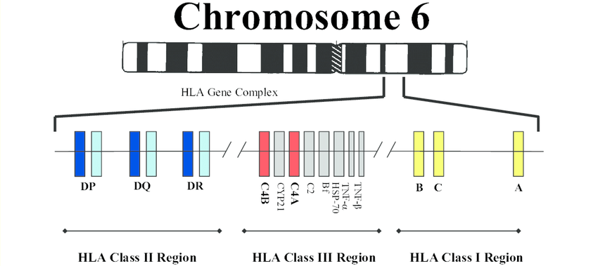

<a href="article-02-04.html"><i class="arrow far fa-arrow-alt-circle-left"></i></a>

<a href="article-02-06.html"><i class="arrow far fa-arrow-alt-circle-right"></i></a>

## 5-1. 신경면역학 가설의 역사적 배경

조현병 가계를 대상으로 한 연관 연구(linkage study)가 한창일때 일찌기 발견된 사실은, 염색체 6p 영역과 조현병이 동시-분리(co-segregation)된다는 것이었다. 일찌기 1979년에 McGuffin은 <s>인간 백혈구 항원</s>(HLA)과 조현병의 유전적 연관에 대해 종설을 발표하였고, 이 연관이 향후 충분히 검토해볼 가치가 있는 발견이라고 보았다.[@McGuffin1979-pz] 1974년 Cazzullo 등[@Cazzullo1974-hv]으로부터 시작된 HLA와 조현병의 유전적 관련성 연구는 최근까지도 지속되어 오고 있는데, 현대의 광범위 유전체 연합 연구에서도 여전히 유의미한 신호를 보내주고 있다.[@Pouget2016-wi] HLA는 개체와 개체를 구분해주는 항원으로서, 장기이식을 했을 때 적합 여부 및 거부 반응을 결정해주는 항원으로 알려져 있다. 여기에는 다양한 종류의 이질적인 항원이 포함되어 있는데, 이들을 코딩하는 유전자를 통칭하여 주조직 적합성 복합체(Major Histocompatibility Complex, MHC)라고 한다. MHC는 염색체 6p21.3-6p22.1에 위치하고 있으며, 여기에 포함된 수백개의 유전자 중 다수는 면역 기능과 관련된 기능을 수행한다.[@noauthor_1999-ld]<aside>

**인간 백혈구 항원 (Human Leukocyte Antigen, HLA)**: 개인의 모든 조직 세포와 혈액 세포 표면에 위치하여 인체가 자기와 비자기를 구별할 수 있게 하는 식별 분자 집단. T 림프구나 자연살해세포(natural killer cell)등으로 부터 정상세포를 보호해준다. 이는 모든 개인이 달라야만 하기 때문에, 유전자 중 다형성(polymorphism) 정도가 가장 높다. 인간에서 이를 코딩하는 유전자 집합을 주조직 적합성 복합체(Major Histocompatibility Complex, MHC)라고 한다.

</aside>

{#fit:HLA width="631"}​

MHC 영역과 조현병의 유전적 관계는 많은 연구에서 일관되게 확인되는 몇 안 되는 소견이었기 때문에, 자연스레 연구자들은 면역관련 유전자들이 조현병의 발병에 영향을 미칠 것이라 생각하게 되었다. 사실 이런 아이디어는 20세기 초반부터 회자되었다. 1937년 독일의 정신과 의사인 <s>Lehmann-Facius</s>는 자가면역 반응이 조현병의 원인일 것이라 지적하였다. 그가 이렇게 생각한 이유는, 조현병의 경과가 몇몇 자가면역질환의 경과와 매우 흡사하다는 것이었다. 예를 들어 후기 청소년 기에 발병한다거나, 심리사회적 스트레스로 악화되고, 악화와 호전을 반복하는 등의 특징은 면역학적 질환에서 흔히 발견된다. <s>Menninger</s>는 일차 대전 직후 전세계를 덮쳤던 스페인 독감에 걸렸던 아이들에게서 정신증이 다수 발견되었음을 보고 하였다.[@Rothermundt2001-pr] 또한 역학연구를 통해 겨울에 태어난 아이이거나, 산모가 인플루엔자, 풍진 등 바이러스에 감염되어 태어난 아이는 조현병에 걸릴 위험이 높다는 것이 알려졌다. 이러한 출생전 감염이 신경발달 과정에 악영향을 끼쳐 발병 위험을 높일 가능성은 이미 앞절에서 논의하였다. 그런데 바이러스가 어떤 식으로 신경발달을 가로막는지는 여전히 의문이다. 태반 장벽(placental barrier) 때문에, 산모가 바이러스에 감염이 되었더라도 태아에게 전해지는 것은 상당히 어렵다. 이에 연구자들은 바이러스 자체가 아니더라도, 바이러스로 인해 산모의 면역 기능이 활성화될 때 분비되는 C-reactive protein(CRP)나 TNF-alpha 등 cytokine이 태아에게 영향을 줄 수 있다고 생각하기 시작하였다.[@Canetta2014-gi] 산모의 감염이 아니라, 주산기 영아가 Epstein-Barr 바이러스에 감염되었을 때에도 조현병 발병 위험이 두 배 정도 증가한다는 보고도 있었다.[@Khandaker2014-uz]

<aside>

**Hermann Lehmann-Facius** (1899\~1960): 독일의 신경병리학자. 뇌조직에 존재하는 유지질(lipoid)에 반응하는 자가면역반응때문에 조현병이 생긴다고 주장하였다.[@Steinberg2015-kq]

**Karl Menninger** (1893\~1990: 미국의 정신과 의사. 아버지인 Charles Menninger, 동생인 William Menninger와 함께 Menninger 진료소 및 요양원을 설립하였고, 정신분석의 보급과 정신의학의 체계적 교육을 위해 1941년 Menninger 재단을 발족하였다.

</aside>

## 5-2. 바이러스, 신경면역과 신경발달

만약 바이러스 감염이 조현병 발병과 관련이 있다면, 가능한 두가지 가능성을 상정해볼 수 있다. 첫째, 바이러스가 직접 신경세포에 구조적/기능적 손상을 일으키는 것이다. 에스퀴롤([1장 1-3절 참조](article-01-01.html#modern-period))은 1845년에 이미, 정신증이 마치 전염병처럼 유난히 급증하는 해가 있는 것 같다고 언급하였다.[@Rothermundt2001-pr] 전염병인 신경 매독은 20세기 전반 까지 정신증의 중요한 요인 중 하나였고, 인플루엔자와 조현병의 관련성을 강조한 Menninger 역시 바이러스성 뇌염이 정신증의 직접적인 원인이라고 보았다.[@Yolken2008-rp]

성인에 있어서 감염된 후 급격한 정신증상을 일으킬 수 있다고 알려진 세균 혹은 바이러스만 해도 십여개가 넘는다. 여기에는 매독균과 인플루엔자를 포함하여, 헤르페스 바이러스, 거대세포 바이러스, Epstein-Barr 바이러스, 홍역, 풍진, 볼거리, 인간면역결핍 바이러스(human immunodeficiency virus, HIV) 등이 포함된다. 이들 중 일부는 조현병 환자의 사후 뇌조직이나 척수액에서 발견되기도 한다.[@Crow1979-nn]

그러나 이러한 사례들은 보통 감염과 정신증 발병 사이의 시간적 간격이 짧다. 예외적으로 정신증상이 오랜 동안 후유증으로 남게 되는 경우도 있지만, 대부분은 뇌염이 호전되면서 정신증도 자연히 회복된다. 산모가 감염되었다 하더라도, 바이러스 자체나 바이러스에서 기인한 mRNA는 태아에서 거의 발견되지 않는다.[@Shi2005-yn] 만약 예외적으로 태아에게 직접 바이러스가 전달되었다 하더라도, 그렇다면 영아기나 학령전기에 이미 정신증상이 나타나야 할 법한데, 아무리 전구증상이 빨리 나타난다고 해도 청소년기 초반은 되어야 한다. 물론 HIV와 같은 <s>레트로바이러스</s>는 숙주의 게놈에 끼어들었다가 성인기에 재활성 될 수 있고, 헤르페스, 톡소플라스마 등도 추후에 재활성화 될 수 있다. 그러나 이는 지극히 드문 경우라 하겠다.

<aside>

**레트로바이러스 (retrovirus)**: RNA 바이러스의 한 유형이다. 자신의 유전정보가 담겨있는 RNA를 숙주의 DNA에 끼워넣기 위해, RNA에서 DNA를 만들어내는 역전사효소를 지니고 있다. 분자생물학의 중심 도그마에 부합하지 않는 대표적인 예이다.

</aside>

따라서 훨씬 더 많은 연구자들은 바이러스 감염이 면역반응을 통해 간접적으로 태아의 뇌에 악영향을 미친다는 두번째 가설을 더 지지한다. 바이러스에 의해 산모의 면역계가 작동하면 IL-6나 TNF-α와 같은 <s>사이토카인 </s>이 다량 분비되고, 이들이 발생과정 중에 있는 태아의 뇌에 전달되면 문제를 일으킬 수 있다. 이러한 이론을 "산전 사이토카인 가설(prenatal cytokine hypothesis)"이라고 부른다.[(Meyer 2013)](https://paperpile.com/c/i8EgLm/QSkd)

<aside>

**사이토카인(cytokine)**: 주로 면역세포에서 분비되는 단백질로, 숙주 방어와 손상 치유에 관여하는 다양한 세포들이 상호간에 정보전달을 하는 수단이다. 이를 통해 다양한 세포들이 기능 및 활성도를 서로 조율하여 전체 면역시스템이 효과적으로 운용될 수 있게 한다. 인터루킨, 케모카인, 인터페론, 콜로니 자극인자(CSF), 종양괴사인자(TNF) 등 다양한 종류로 나뉜다.

</aside>

사이토카인은 과도한 신경염증을 유발하는 효과가 있으며, 이에 노출된 신경세포는 세포자멸사를 통해 죽게 된다.[@Downen1999-bn] 신경교세포는 이렇게 해서 죽어버린 신경세포의 부스러기들을 처리하는 역할을 하지만, 주도적으로 주위의 신경세포를 자멸사에 이르게 유도하기도 한다.[@Marin-Teva2011-ke] 따라서 면역 반응이 비정상적으로 항진된 환경에서 태아의 신경발달이 제대로 이루어질리가 없다.

하지만 사이토카인을 비롯한 신경면역 체계가 신경발달 과정에 영향을 미치는 것은 이러한 세포 사멸에 의한 기전뿐만은 아니다. 신경세포 자체에 다수의 사이토카인 수용체가 있으며, 이는 신경세포의 정상적인 생리기능에 사이토카인이 필요하다는 증가가 된다. 예를 들어 IL-1는 중뇌에서 신경전구세포(neural progenitor cell, NPC)가 도파민 분비 세포로 분화하는데, 인터페론(interferon, IFN)은 콜린성 신경세포로 분화하는데 꼭 필요하다.[@Howard2013-rk] 그 뿐만이 아니다. TNF-α는 해마에서 수상돌기의 성장과 시냅스 강도를 조절하며, IL-1은 도파민 세포 축삭돌기가 뻗어나가는 것을 증진시키며, 역으로 IL-6는 이를 방해한다.[@Howard2013-rk] 신경교세포(microglia)들은 사이토카인을 매개로 하여 희소돌기 아교세포를 공격하며, 희소돌기 아교세포의 수가 줄어들면 미엘린화가 영향을 받으면서 사이뉴런의 연결이 차단된다.

성숙된 뇌에 있어서도 정상적인 시냅스 기능의 유지나, 역동적인 기억/학습 과정에서 면역 세포들이 일정 기능을 담당한다. TNF 수용체 1형을 통한 TNF 신호전달은 시냅스 연결강도를 유지시키며, IL-1α와 β는 장기강화 (NOTE: 장기강화(Long-Term Potentiation, LTP): 서로 연결된 두 신경세포가 동시에 흥분하는 경우가 많아지면, 두 세포간의 시냅스 강도가 점점 높아지면서 한 신경세포가 흥분했을 때 좀더 효율적으로 다른 신경세포도 흥분하게 된다. 이는 단기적인 기억과 학습의 기전으로 믿어지고 있다.)가 일어날 때 분비가 증가된다. 원래 체내에 침범한 이물질을 식별하는 수용체인 Toll-like receptor (TLR) 역시 기억/학습, 그리고 신경가소성에 일익을 담당한다.[@Marin2013-ai] 신경교세포는 잘 사용되지 않는 시냅스전 말단을 포식함으로써, 시냅스 가지치기를 이루어내며[@Paolicelli2011-ga], 외부 환경에 맞추어 신경연결망을 하나하나 축조해나가는 역할을 맡고 있다고 믿어지고 있다.

사이토카인을 비롯한 면역 체계가 정상적인 신경발달에 깊숙히 관여한다는 이론은 신경발달학적 가설과 자연스레 이어진다. 만약 산모의 면역 활성화(Maternal Immune Activation, MIA) 혹은 산전 면역 자극(prenatal immune challenge)으로 인해 초래되는 악영향이 결함이 있는 신경연결망을 만들어낸다면, 이 과정이 바로 "2회 충격 가설"에서 이야기되는 일차 충격이라고 말할 수 있다.

## 5-3. 동물모델

신경면역학적 변화가 일차 충격에 해당하고 이로 인해 조현병이 발병한다면, 면역기능을 통제된 환경에서 자극한 후 뒤따르는 신경발달학적 변화를 집중적으로 연구함으로써 조현병 병태생리의 단서를 잡을 수 있을 것이다.[@Bergdolt2019-og] 이런 맥락에서 현재까지 산모의 면역 활성화와 관련된 몇 가지 동물 모델이 개발되었다. 대표적으로 두 가지 모델이 있는데, 이들은 세균유래 내독소(bacterial endotoxin)인 지질 다당체(lipopolysaccharide, LPS) 투여 모델, 그리고 바이러스 RNA의 인공적 유사물인 Poly-I:C 투여 모델이다.[@Winship2019-ii]

쥐에게 LPS를 투여하면, 다양한 종류의 사이토카인 및 기타 염증유도 물질들이 분비되며, 중추신경계 내에서는 신경교세포를 활성화시켜 역시 맹렬한 염증반응을 일으킨다. LPS가 투여된 쥐는 조현병과 관련된 다양한 신경해부학적, 조직병리학적, 신경생리학적, 신경인지적 변화를 나타낸다.[@Wischhof2015-to] Poly-I:C는 바이러스가 지니고 있는 이중가닥 RNA와 구조적으로 유사하다. 이는 면역세포 세포막에 위치한 toll-like receptor 3 (TLR3)과 결합하여 맹렬한 면역 반응을 일으킨다. 임신한 쥐에 Poly-I:C를 투여했을 때에도 LPS 모델에서와 마찬가지로 자손 쥐에서 다양한 조현병 유사 증상이 일어난다. Poly-I:C는 LPS 모델보다 훨씬 더 광범위하게 연구되었다. 연구자들은 서로 다른 임신 주기에 Poly-I:C를 투여하고, 이 때 활성화되는 유전자를 검색함으로써, 조현병 발병 기전과 관련된 경로를 찾고자 노력하였다. 관찰 결과에 따르면 투여 시기를 앞당기면 앞당길수록 태어난 자손 쥐에서 더욱 심하고 다양한 이상 소견이 나타났다. 게다가 변동이 일어나는 세포내 경로가 워낙 복잡다단하여, Poly-I:C가 일으키는 면역반응이 신경발달 과정의 근본적인 무언가를 훼손하는 것으로 짐작되고 있다.[@Meyer2006-rs]

지금까지 논의한 기전을 요약하면, 바이러스 등의 원인으로 말미암아 산모의 면역체계가 비정상적으로 활성화되면 태아의 신경발달에 문제가 생기고, 이것이 바로 신경발달학적 가설에서 이야기되는 첫번째 충격이라는 것이다. 언뜻 간단하게 들리지만, 정확히 어떤 기전에 의해 신경발달 과정 중 어떤 부분이 손상되는 지는 아직 안개에 쌓여있다. 게다가 조현병에 취약하게 만드는 특정 유전형과 산모의 면역 활성화가 어떤 식으로 상호 작용하는 지가 설명되어야 한다. 애초에 조현병의 신경면역학적 가설이 출발한 계기가 MHC와의 유전적 연관때문이었던 만큼, 태생기의 유해한 면역 환경이 산모의 기회 감염(바이러스 등) 때문인지, 아니면 태아 자체의 유전자 변이 때문인지도 구분해야 한다.

## 5-4. 면역 관련 유전자와 신경발달

신경발달학적 가설에서 발달과정의 이상을 초래할 수 있는 원인은 첫째가 유전적 소인이요, 둘째가 산전감염을 포함한 환경적 요인이다. 감염과 신경발달과의 관계에 대해서는 좀더 자세한 연구가 이뤄진 것에 비해, 전자인 유전적 소인에 대한 연구는 아직 초보적 단계에 머물러있다.

연구가 지지부진한 가장 큰 요인은 유전학 연구 자체가 몇 차례 패러다임 전환을 거치면서, 조현병의 발병 위험을 높이는 취약 유전자가 어떤 것인지 여전히 합의에 도달하지 못했기 때문이다. 현재까지 알려진 백여개가 넘는 취약 유전자들은 광범위한 세포 내 기능과 경로에 관여하고 있으며, 이중 면역 체계와 관련된 것도 적지 않다. 연관 연구를 통해 처음 시사된 고전적인 MHC 영역과 조현병의 연관은 광범위 유전체 연합 연구에서도 재확인 되었다. 최근에는 MHC 보다 "확장된 주조직 적합성 복합체(Extended Major Histocompatibility Complex, xMHC)"라는 표현을 주로 사용한다.[@Horton2004] 이 영역은 염색체 6p21에 위치한 약 7Mb 길이의 영역을 가리키며, 400여개가 넘는 유전자가 포함되어 있다. xMHC 영역에 포함된 유전자로서 조현병 취약 유전자에 속하는 것은 C4, BAK1, SYNGAP1 등이 있다.

C4 보체 유전자는 내인성 면역 체계(innate immune system)를 구성하는 한 요소이다. 이 유전자에는 C4A와 B 두개의 유전자좌(loci)가 있으며, 각각의 유전자좌는 단순한 염기치환(SNP)가 아니라 유전자 복제수 변이(2장 3-2절 참조)에 의해 변이가 발생하기 때문에 대립유전자형이 수십개가 넘는 복잡한 변이를 일으킨다.[@Sekar2016-ag] C4는 사용되지 않는 시냅스 제거를 담당하며 시냅스 가지치기의 주요 기전이다. Sekar 등은 C4A의 유전자 복제수가 많아지면서 활성이 높아지면, 과도한 시냅스 제거가 발생하면서 조현병 환자에게서 나타나는 시냅스 및 신경그물(neuropil) 감소를 일으킨다고 하였다. 흥미로운 것은 C4는 전신성 홍반성 낭창(SLE)과 쇠그렌 증후군(Sjögren's syndrome) 발병을 막아주는 효과가 있으며, 역으로 조현병을 유발한다. C4는 보편적으로 여성보다는 남성에서 더 활성이 높기 때문에, 이러한 성별 차이가 조현병이 유달리 남성에게 많은 이유를 설명해줄런지도 모른다.[@Kamitaki2020-pk]

BAK1은 자가면역을 막아주는 미토콘드리아 단백질을 코딩하며, SYNGAP1은 <s>시냅스후 밀도</s> 단백질을 코딩한다. SYNGAP1은 PSD에 위치해있는 NMDA 수용체 기능과 관련이 있으며, 조현병 환자에서 해당 단백질의 분비가 감소되어 있다는 것이 독립된 연구들에서 재확인되었다.[@Funk2009-fq][@Guo2009-ui][@Niu2019-he]

<aside>

**시냅스 후 밀도(Postsynaptic Density, PSD)**: 시냅스 후 뉴런의 세포막 부위에 다양한 단백질들이 밀집되어 있는 구조로 신경전달물질 수용체들이 모여있다. 전자현미경으로 보면 검고 굵은 띠 처럼 보여지기 이런 이름이 붙었다.

</aside>

xMHC 영역에 포함되어 있지 않더라도, B, T 림프구에서 발현되며 면역 기능 수행에 중요한 역할을 담당하는 다양한 유전자가 조현병의 위험을 높이는 것으로 알려졌다. GWAS를 통해 수십개의 후보 유전자가 발견되었는데, 이중 HSPD1, CD14, DPP4, CLU, EGR1은 두 개 이상의 연구에서 재확인 되었다.[@Lencz2015-kz][@Pouget2016-wi][@Lin2016-du] HSDP1은 소위 <s>열충격 단백질</s> 중 하나로, 열 뿐만 아니라 모든 종류의 스트레스에 반응하여 생성이 증가한다. HSP는 세포 내에서 <s>분자적 샤프론</s>으로 활동하여 단백질의 응집(aggregation)을 방지하고, 손상된 단백질의 수리에 관여한다. 그 때문인지 오래전부터 조현병과의 연관성이 논의되어 왔다.[(오동훈, 양병환, and 최준호 2007)](https://paperpile.com/c/i8EgLm/px3Y)

<aside>

**열충격 단백질(Heat Shock Protein, HSP)**: 단백질은 온도가 높아지면 변성되기 싶다. 만약 세포가 높은 온도와 같은 스트레스에 노출되면, 기능발휘 단백질이나 구조물들을 변성의 위험으로부터 지키기 위해 특화된 단백질을 생성하는데 이를 열충격 단백질이라 한다.

**분자적 샤프론(molecular chaperone)**: 단백질은 다양한 자극에 의해 그 3차원 구조를 변화시킴으로써, 즉 접힘(folding)으로써 새로운 기능을 발휘한다. 그런데 이렇게 접히는 과정에 다른 분자가 방해를 하면 제 기능을 발휘하지 못하거나 속도가 늦어진다. 열충격 단백질과 같은 샤프론은 다른 단백질에 달라붙어 후자가 접히는 과정에 다른 훼방을 받지 못하도록 보호하는 역할을 한다.

</aside>

위에서 살펴본 것과 같이 면역 기능과 관련된 유전자 중 일부는 조현병의 병태생리와 밀접한 관련을 맺고 있다. 그러나 정확히 어떤 메커니즘에 의해 신경발달을 방해하는지는 알려져 있지 않다. 다만, 각 유전자에 해당되는 단백질이 신경계에서 어떤 역할을 하는지를 조사함으로써, 간접적으로 그러한 기능이나 경로가 조현병 발병에 관여하리라 짐작하는 것 뿐이다. 한편 관련된 유전자 중 다수는 조현병 뿐만이 아니라, 다양한 정신질환 및 심리적 특성과 연관되어 있기 때문에 특이성의 문제가 뒤따른다. 일반적인 정신병리의 위험을 높이는 것인지, 아니면 조현병에 국한된 위험을 높이는 것인지는 불분명하다.[@Pouget2018-sj]

## 5-5. 자가면역 {#autoimmunity}

한편, 또 다른 의문점은 면역 체계 활성화와 그로 의한 신경계 손상이 태생기에만 국한된 것이냐는 질문이다. 조현병 환자는 성인기에 이르러서도 여전히 면역 체계의 다양한 이상을 보인다. 사이토카인의 혈중 농도는 성인이 되어서도 여전히 대조군에 비해 상승되거나 저하되어 있으며, 자가면역 항체가 빈번히 발견되고, 실제로 다양한 자가면역질환이 병발하기도 한다.[@Ezeoke2013-fy]

조현병 환자의 혈장에서 상승된 것으로 알려진 사이토카인에는 IL-6, TNF-α, IL-1β, IL-12, transforming growth factor (TGF)-β 등이 있으며, 반대로 IL-2, IL-10, IFN-γ 분비는 줄어드는 게 보통이다.[@Miller2011-bu][@Goldsmith2016-zf] 상승하는 사이토카인 중에는 염증 유발(pro-inflammatory) 인터루킨이 다수 포함되어 있으며, 역으로 감소하는 사이토카인 중에는 염증 억제(anti-inflammatory) 인터루킨이 많다. 물론 이러한 증가 및 감소 패턴은 연구에 따라 조금씩 차이가 나지만, IL-6가 증가되어 있는 것 만큼은 일관되게 발견된다.[@Potvin2008-lx] IL-6는 맥락에 따라 염증 유발 쪽으로도, 염증 억제 쪽으로도 작용하기 때문에 조현병 환자에게 어떤 역할을 하는 지 확신하기는 어렵다.[@Hunter2015-mh] 그러나 급성 환자나 초발 환자에게 주로 상승 폭이 큰 것으로 보아 아무래도 염증 유발 쪽 효과가 우세한 것으로 보인다.

따라서 조현병 환자의 사이토카인 시스템 변화를 한마디로 요약하면, 급성기에는 좀더 두드러지게, 하지만 만성기에도 여전히 염증 반응이 지속되고 있다고 말할 수 있다. 더불어 B 림프구에 의해 유도되는 항체 매개 면역기능이 항진되어 있으며, 이에 반해 T 림프구에 의해 매개되는 세포 매개 면역기능은 비효율적 상태에 놓여있다.[@Steiner2010-xu] 세포 매개 면역기능의 불균형에 대해 혹자는 Th-2 shift 이론을 제안하기도 한다.[@Schwarz2001-xq][@Kidd2003-le] 보조 T 세포(T-helper cell)는 Th-1형과 Th-2형으로 나누어지는데, 전자는 IFN-γ, TNF-β를 분비하여 대식세포(macrophage)의 기능을 자극하고, 후자는 인터루킨을 분비하여 B 세포가 형질 세포(plasma cell)로 분화되도록 유도한다. 조현병 환자에서는 Th-1/Th-2의 상대적 비율이 감소하기 때문에, 세포 매개 면역 기능이 취약해지고 항체 매개 반응이나 알러지 관련 반응이 항진된다. 이를 Th-2 shift 이론이라고 한다.[@Muller2015-xu]

자가면역 항체 역시 조현병에서 드물지 않게 발견된다. MHC의 주된 역할이 자기 신체와 이물질을 구분하는 것이기 때문에, 이 기능에 문제가 생기면 비정상적 자가면역이 발동되어 앞절에서 요약한 면역체계의 이상이 지속될 수 있다. 더군다나 자가면역 질환과 조현병의 병발(comorbidity) 경향 역시 뚜렷하다. 자가면역 질환이 원인이라고 단정할 수는 없지만, 과거 자가면역 질환과 감염질환의 병력이 있으면 이후 조현병 발병 확률이 각각 29%와 60% 상승하며, 두 조건을 모두 갖추고 있으면 2.25배로 발병 위험이 높아진다.[@Benros2011-yq] 심지어 흔한 면역질환인 아토피 피부염, 알러지성 비염, 천식의 발생비율도 조현병 발생비율과 연관이 있다.[@Wang2017-bi]

Lehmann-Facius은 1937년 조현병의 자가면역 가설을 처음으로 제시하면서, 조현병 환자의 사후 뇌조직에서 보이는 특정 항원에 반응하는 항체가 동일한 환자의 혈청에서 발견되었다고 보고하였다. 이후 20여년간 이 보고는 잊혀져 있었지만, 1960년대초부터 일부 연구자들은 뇌조직에 반응하는 자가면역 물질의 존재를 구체적으로 입증하기 시작하였고, 이것이 면역글로불린임을 알아내었다.[@Heath1967-nw] 그들은 이를 항뇌 항체(anti-brain antibodies)라 하였다.[@2008-jz] 한때 항뇌 항체에 대한 연구가 활발하게 이루어지던 때가 있었으나, 재현에 어려움을 겪었고 이후에는 그다지 관심을 끌지 못하였다. 2013년에 행해진 메타 연구에 따르면 조현병 환자에게서 빈번히 관찰되는 자가면역 항체에는 항핵 항체(antinuclear antibody), 항카디오리핀 항체 IgG와 IgM (cardiolipin IgG, igM), 항 DNA 항체, 항도파민 수용체 항체, 항 NMDA 수용체 항체 등이 있으며, 이중 다수는 뇌 조직에 반응한다.[@Ezeoke2013-fy]

관심이 많이 줄어들었음에도 불구하고 한가지 예외가 있는데, 이는 항 NMDA 수용체 자가항체에 의한 뇌염(Anti-NMDA receptor encephalitis)이다. 미국의 언론이었던 Susannah Cahalan의 회고록 "Brain on Fire: My Month of Madness"로 인해 유명해진 이 질환은, NMDA 수용체를 이루는 NR1, NR2 아단위에 대한 자가 항체로 인해 급성 뇌염이 일어나고, 환자는 정신병적 증상, 경직증, 경련발작, 운동 장애 등을 일으키는 경우를 가리킨다.[@Dalmau2008-qm] 정상적으로 NMDA를 경유하는 글루타메이트 신호는 선조체의 도파민 활성을 억제하기 때문에, NMDA 수용체가 기능을 하지 못하면 도파민의 활성이 지나치게 높아져 정신증이 유발되는 것으로 짐작되고 있다.

NMDA 뇌염과 조현병을 감별하는 것이 중요하긴 하지만, 문제는 진단이 정확한 조현병 환자에게서도 약 8%의 비율로 항 NMDA 수용체 자가항체가 발견된다는 것이다.[@Pollak2014-am] 따라서 NMDA 뇌염과 조현병이 서로 전혀 다른 질환인지도 확실하지 않다. 혹자는 설령 급성 뇌염 사례가 아니더라도, 조현병 환자가 치료저항성을 보이는 원인 중 일부는 항 NMDA 수용체 자가항체 때문일 것이라고 주장한다 [@Senda2016-yd] 이러한 관점은 조현병의 중요 병태 생리 중 하나가 NMDA 수용체의 기능 부전이라는 사실과 맞물려 있다.

만약 신경세포 구성 물질에 반응하는 자가 항체의 존재가 조현병을 이해하는데 큰 비중을 차지한다면, 애초에 왜 자가 항체가 생기게 되었는지 의문이 들지 않을 수 없다. 물론 유전적 요인을 간과할 수 없다. 대표적인 자가면역 질환인 류마티스 관절염(rheumatoid arthritis)이나 전신성 홍반성 낭창(systemic lupus erythematosus)은 조현병과 마찬가지로 MHC 부위와 강한 유전적 연관성을 보인다. 그러나 이들 자가면역 질환에서도 여전히 유전자 변이가 자가면역을 일으키는 기전에 대해선 확실히 알려지지 않았다.

유전자 변이와는 별개로, 바이러스 감염에 의한 이종 단백이 면역 반응을 유도하면, 이에 따라 생산된 항체가 환자 자신의 신체를 이루는 항원(자가 항원, autoantigen)과 교차 반응(cross-reactivity)을 일으킨다는 가설이 있다. 이 가설은 세가지 경우로 나눠 생각해볼 수 있다. 첫번째, 바이러스 항원이 숙주 신체의 자가 항원과 구조적으로 유사한 부분을 지니고 있는 경우이다. 이렇게 되면 자연히 항바이러스 항체가 자가 항원과 교차 반응을 일으킬 것이다. 둘째, 바이러스에 의한 면역 반응이 너무 심하다보면, 근처에 있던 정상 조직의 자가 항원이 유리되는 경우가 생기고, 이미 항진된 면역 세포들은 이들 자가 항원에 대해서도 격렬한 면역 반응을 보일 수 있다. 셋째, 바이러스 증식으로 조직 내 세포가 다수 파괴되면, 괴사한 세포로부터 바이러스 항원과 함께 자가 항원들이 흘러나오면서 자가 항체 생성을 유발한다.[@Smatti2019-ko]

이러한 가능성에 대한 논의는, 산모의 바이러스 감염이 어떻게 태어난 자손에게, 태생기를 지나 성인기가 될 때까지 지속되는 면역계 이상을 유발하는지 단서를 제공한다. 모든 자가면역 질환이 마찬가지이지만 한번 자가면역이 자리잡게 되면 만성 염증 상태가 평생 지속되기 때문에, 면역 체계는 이에 적응하기 위해 정상과는 다른 길을 밟을 수 밖에 없다. 자가 면역 질환에서 나타나는 급격하진 않지만 오래 지속되는 만성 염증 상태를 소위 "불꽃없는 염증(smoldering inflammation)"이라고 표현하기도 한다. 조현병 역시 만성 염증 상태가 특징적이며 동일한 표현을 적용할 수 있을 것이다. 한편 다발성 경화증(multiple sclerosis)과 같은 신경계 자가면역질환에서는 "불꽃없는 염증" 상태가 중추신경계에만 국한되는 양상을 보이는데, 조현병 역시 같은 방식으로 이해할 수 있다.[@Muller2018-vf]

## 5-6. 신경염증

신경면역학과 조현병 사이의 관계는 주로 신경발달학적 관점에서 논의되어 왔다. 앞서 논의된 내용들을 살펴보면, 면역 기능과 관련된 유전자의 산물 혹은 외적 요인에 의해 과도하게 활성화된 사이토카인 시스템 등이 태생기 뇌의 정상적인 발달 과정을 방해하여 일차 충격을 가한다는 공통된 플롯을 지니고 있다.

그러나 동일한 증거들을 신경퇴행적 관점에서 재해석 할 수도 있다. 조현병이 발병하는 것만으로 끝나는 것이 아니라, 점진적으로 퇴행하는 것이 문제가 된다면, 무엇이 퇴행을 일으키는 지에 대해서도 설명이 있어야만 한다. 더불어 만약 취약한 신경연결망이 심리사회적 스트레스 때문에 발병에 이르게 된다면, 스트레스는 어떻게 발병을 유도하는지에 대해서도 경로가 밝혀져야 한다. 신경염증 가설(neuroinflammation hypothesis)은 이에 대해 개연성 있는 설명을 제공한다.

![Vulnerability-stress-inflammation model of schizophrenia\
from [@Muller2018-vf ]](images/02-05/img_1.png)

2회 충격 가설과 유사하지만 강조점이 조금 다른 모델로 취약성-스트레스 모델(vulnerability-stress model 혹은 diathesis-stress model)이라는 것이 있다.[@Zubin1977-gx] 조현병의 생물심리사회 모델을 강조하던 학자들은 생물학적 취약성과 심리사회적 스트레스 간의 연결고리를 찾아야만 했다. 그들은 저하된 인지기능, 과민한 자율신경계 반응, 사회적 인지 결함 등으로 인해, 외적 환경 변화에 대처할 능력이 떨어지는 환자가, 적응범위를 벗어나는 스트레스를 받게 되면 발병/재발한다는 이론을 세웠다. 이를 확장하여 Müller는 취약성-스트레스-염증 모델(vulnerability-stress-inflammation model)을 제안한다.[@Muller2015-xu] 그에 따르면 취약성과 스트레스를 연결하는 연결고리는 다름 아닌 신경염증(neuroinflammation)이다. 즉 면역기능과 신경연결망 둘 다에 결함을 갖고 있는 조현병 고 위험 환자에게 스트레스가 가해지면, 가뜩이나 염증 유발 상태(proinflammatory state)에 놓여있던 체내의 염증반응이 심해지면서 도파민, 세로토닌, 글루타민 등의 신호전달에 혼란이 생긴다는 이론이다. 예를 들어 염증 반응이 심해지면 tryptophan/kynurenine 경로의 불균형이 초래된다. Kynurenic acid (KYNA)는 트립토판의 대사 물질로 체내에서 생성되는 유일한 NMDA 수용체 길항제이다. KYNA가 축적되면 NMDA 수용체의 글리신 결합부위를 차단하여 케타민 유발 정신증 모델에서와 유사한 정신증상의 악화를 일으킬 수 있다.[@Pedraz-Petrozzi2020-vm]

[앞절](#autoimmunity)에서 언급한 바와 같이 과거 자가면역 질환과 감염질환의 병력이 있으면 이후 조현병 발병 확률이 훨씬 높아진다.[@Benros2011-yq] 여기서 의미하는 병력은 어머니의 감염 여부나 영아기 무렵의 감염 병력을 의미하는 것이 아니기 때문에, 신경발달학적 이해의 틀로 해석하기는 어렵다. 이미 발달이 끝난 신경계에도 비특이적인 감염이나 염증이 있으면 조현병 발병 위험이 높아진다는 뜻이다. 이런 환자들은 신경교세포의 활성이 높아져 있다. (R)-[(11)C]PK11195라는 방사성 동위원소가 붙은 표지자를 사용하여 PET를 촬영하면 생체 내의 신경교세포 활성을 직접 측정할 수 있다. 한 연구에 따르면, 비록 10명 밖에 안 되는 소규모 표본이었지만 조현병 환자의 뇌는 대조군의 뇌에 비해 신경교세포 활성이 뚜렷이 항진되어 있었다.[@Van_Berckel2008-xq]

조현병 환자의 사이토카인 변화 패턴에서 엿보이듯이, 환자 들의 면역체계는 항시 "불꽃없는 염증상태"에 놓여있으며, 스트레스에 대해서도 과민한 염증 반응을 보인다. 염증 유발 사이토카인의 분비 정도는 유병 기간 및 증상의 심각성에 비례한다. 만성 안정기보다는 급성 재발기에 두드러진 것으로 보아, 스트레스가 많아지고 양성 증상이 두드러질 때 반응적으로 사이토카인 분비가 늘어나는 것으로 보인다.[@Momtazmanesh2019-jd] 그러나 유병 기간에 비례하는 것으로 보아, 만성기에도 여전히 과다한 염증 유발 사이토카인에 노출되어 있다고 보아야 할 것이다.[@Schmitt2005-eb]

조현병 환자가 스트레스에 대해 과도한 생리적 반응을 보인다는 것은 예로부터 잘 알려져왔다.[@Van_Leeuwen2018-ea] 스트레스는 교감신경계를 흥분시키며, 코티졸 분비를 자극한다. 환자들은 정상인에 비해 스트레스에 대한 코티졸 분비가 과도하며, 코티졸의 항염증 효과도 정상인과 달리 제대로 기능하지 않는다.[@Do_Prado2017-ih] 이외에도 HPA 축의 기능이 손상되어 스트레스 반응의 해소가 원만하게 진행되지 않는다.[@Walker2008-tv][@Chiappelli2016-vy] 상승된 코티졸은 신경교세포를 증식시키거나, 신경교세포 내의 유전자 전사 패턴을 바꿔 기능을 변화시키기도 한다.[@Nair2006-rb][@Duque2016-cm][@Lehmann2018-ca] 과도하게 활성화된 신경교세포는 무분별한 시냅스 가지치기를 일으켜 중추신경계의 정상적인 연결 패턴을 파괴하며, 그 과정에서 반응성 산소종이나 퀴놀린 산(quinolinic acid)과 같은 신경독소(neurotoxin)을 만들어 신경세포의 괴사까지도 일으킨다.[@Muneer2020-ui] 이 때문에 스트레스에 특히 취약하다고 여겨지는 해마와 전전두엽의 신경세포가 손상을 받는다. 이러한 일련의 과정은 조현병 환자에게서 흔히 관찰되는 점진적 피질 용적 감소의 원인으로 여겨지고 있다.[@Howes2017-jx]

이러한 사실들을 종합하면, 모종의 이유(유전 혹은 감염 등)로 말미암아 어린 시절부터 민감화 상태에 놓여있던 조현병 환자의 면역계는 만성적인 염증 상태를 유지할 뿐더러, HPA 축의 기능 부전, 코티졸의 분비 증가 및 비정상적 조절 기전 등으로 인해 사소한 스트레스에 대해서도 과도한 염증 반응을 일으킨다. 염증 반응의 정도는 현재 정신증상의 심각성을 반영하는 상태지표일 뿐 아니라, 그 원인이기도 하다. 염증이 지속되면 신경교세포를 매개로 다양한 신경세포의 손상이 뒤따르게 된다.

![Unknown\
from [@Hong2020-ol]](images/02-05/img_2.png)

## 5-7. 전신성 염증과 대사 장애

조현병 병태생리의 다양한 차원이 드러나면 드러날수록, 조현병이 단순한 뇌질환이 아니라 전신성 질환이라는 증거가 속속 밝혀지고 있다. 항정신병 약물의 효과를 배제하더라도, 조현병 환자는 비만 및 내분비계 질환, 심혈관계 질환 등의 유병률이 높으며, 이로 인해 기대 수명도 정상 대조군에 비해 평균 14.5세 정도 단축된다.[@Hjorthoj2017-jq] (3장 4-3절 참조)

그런데 이러한 전신성 질환이 만성 염증 때문이라는 견해가 있다. 조현병 환자에게서 빈발하는 대사성 장애의 중심에는 인슐린 저항성(insulin resistance)이 자리하고 있다. 비정형 항정신병 약물이 폭넓게 사용되기 이전인 1990년대에 집계된 조현병 환자 결과 연구팀(Schizophrenia Patient Outcomes Research Team, PORT) 연구에서, 15,000명이 넘는 조현병 환자 중 당뇨병의 유병률은 15% 정도로 나타났다.[@Dixon2000-im] 당뇨 이전 단계의 당 대사 이상이나 인슐린 저항성의 비율은 이보다 높을 것이다. 최근 호주에서 집계된 바에 따르면 1,155명의 표본 중 당뇨 전단계 환자 비율은 19%, 당뇨병의 비율은 12.1%로, 둘을 합하면 무려 30% 이상의 환자가 당 대사 이상을 보였다.[@Foley2016-xo]

비만과 대사 이상은 염증을 유발하기도 하고, 염증 때문에 악화되기도 한다. 섭취된 칼로리가 소모된 칼로리보다 많아지면 혈액 상피세포, 간세포, 지방세포, 백혈구 등은 어떻게든 축적되는 당과 지방산을 대사하여 애쓴다. 이 과정에서 반응성 산소종을 비롯한 대사 부산물이 축적되며, 점차 기능이 떨어지게 된다. 동시에 세포 괴사가 일어나면서 염증 반응이 늘어난다.[@De_Souza2005-ui] 복부의 백색 지방 세포에서는 adiponectin을 비롯한 <s>아디포카인</s>을 분비하며, 동시에 IL-6, TNF-α 와 같은 염증 유발 사이토카인, 급성병기 단백질(acute phase protein), leptin 등을 분비한다. 이들은 모두 염증 반응을 촉진시키기 때문에 체내의 염증 상태는 점차 악화된다.[@Leonard2012-wl] 역으로 분비가 증가된 IL-6, TNF-α는 glucose transporter 4(GLUT4)나 Insulin receptor substrate 1 (IRS-1) 발현을 억제하고, <s>PI3K/AKT 경로</s> 경로를 비활성화 시킴으로써 인슐린 저항성을 악화시킨다. 이렇듯 인슐린 저항성과 염증은 서로가 서로를 악화시키기 때문에, 어느 한 상태가 시작되면 쉽사리 악순환에 빠져들게 된다.[@De_Luca2008-pn]

<aside>

**아디포카인(adipokine)**: 지방조직에서 분비되는 사이토카인을 의미한다. 지방조직은 단순한 에너지 저장소가 아니며, 다양한 아디포카인을 분비함으로써 전신의 에너지 대사, 혈당 조절, 체중, 염증 반응 등을 담당한다. Leptin, adiponectin, resistin 등이 포함되며, IL-6, TNF-α 역시 지방조직에서 분비된다.

**PI3K/Akt (phosphatidylinositol-3-hydroxy kinase / serine/threonine-protein kinase) pathway**: 외부 환경의 변화에 대응하여 세포의 생존과 성장을 조절하는 신호전달계. 세포주기를 직접 관리하기 때문에, 암세포의 제약없는 증식은 이 신호전달계를 장악하기 때문이라고 여겨진다.)

</aside>

대사 증후군(Metabolic Syndrome, MS)이란 비만, 인슐린 저항성, 고혈압, 지질 대사 이상 등을 포함하는, 당뇨와 심혈관 질환의 위험 인자들을 가리킨다. 2006년에 발표된 메타 연구 결과에서 대상 증후군은 심혈관계 질환 발생률을 1.53배, 관상동맥 질환은 1.52배, 뇌혈관 질환은 1.73배 높이는 것으로 추산되었다.[@Galassi2006-xu] 대사 증후군의 유병률은 대상이 된 표본의 특성, 적용한 기준, 성별과 연령, 항정신병 약물 투여 여부 등에 따라 매우 편차가 심하다. Mitchell 등[@Mitchell2013]이 보고한 메타 분석에서 조현병 환자의 대사 증후군 유병률은 32.5% 정도로 나타났으며, 이는 정상 대조군의 약 두배에 가깝다. 클로자핀 투여군이 가장 비율이 높아서 51.9%에 달했으며, 약물을 사용하지 않은 군이 가장 낮아 20.2%에 머물렀다.

이런 관찰결과들을 종합하면, 조현병 환자는 항정신병 약물의 영향을 감안한다 하더라도 인슐린 저항성을 비롯한 대사 증후군의 소견이 나타날 위험이 높으며, 이는 만성 전신성 염증 상태와 밀접한 관련이 있다. 지속되는 염증 반응과 높은 사이토카인 농도는 당 대사를 방해하며, 이렇게 자리잡은 인슐린 저항성은 그 밖의 대사 증후군 증상들을 불러일으킨다. 대사 증후군은 심혈관계 질환의 위험을 높이며, 이는 조현병 환자의 높은 사망률을 일부 설명할 수 있다. 게다가 만성 염증 상태는 꼭 인슐린 저항성을 거치지 않더라도 동맥경화를 유도하여 심혈관 질환까지 초래할 수 있으므로, 더더욱 조현병 환자의 건강 상태를 저하시키는 요인이 된다.

## 5-8. 항염증 제제의 치료적 사용

신경염증이 조현병 발병의 중요한 매커니즘 중 하나요, 동시에 증상을 유지시키고 재발을 초래하는데 악영향을 끼치고 있다는 것이 점점 더 분명해지면서, 이를 치료에 응용해보고자 하는 노력도 쉼없이 기울여졌다.

소위 NSAID라고 불리우는 항염/진통제 들은 대부분 cyclooxygenase (COX) 억제제들이다. COX는 1형과 2형이 있는데, COX-2는 COX-1의 523번째 아미노산인 isoleucine이 valine으로 치환된 동위효소(isozyme)이다. COX-2는 염증이 활발한 부위에만 선택적으로 존재하기 때문에, 최근에 개발된 NSAID는 대부분 COX-2에 대한 선택적 억제제이다. 2002년 Müller 등[@Muller2002-jr] 리세페리돈에 COX-2 억제제인 celecoxib를 추가하는 방식으로 항염/진통제의 조현병 치료 효과를 확인해보았다. 5주간에 걸친 임상시험에서 병용 투여 군은 리스페리돈 군에 비해 의미있게 PANSS 총점의 감소 폭이 컸다. 아스피린은 COX-2에 선택적이진 않지만 가장 많이 사용되는 cylooxygenase 억제제이다. Laan 등[@Laan2010-kk]은 다양한 항정신병 약물을 투여받고 있던 환자에게 아스피린과 위약을 병용 투여하였다. 이 연구에서는 PANSS 총점 및 양성 척도에서 유의한 차이가 드러났다.

이후 COX 억제제를 이용한 유사한 연구가 이어졌지만, 확실한 결론보다는 많은 의문점만을 남기고 있다. 예를 들어 용량을 어떻게 정해야 할지, 얼마나 오래 투여해야 효과가 나는지, 다양한 차원의 증상 중 어떤 부분이 호전되는지, 어떤 환자들이 혜택을 보는 지 등은 여전히 풀리지 않는 숙제이다. 예를 들어 앞선 Müller 등[@Muller2002-jr]의 연구에서는 PANSS 총점에서만 유의한 차이가 나타났으나, 동일한 저자가 아미설프라이드에 celecoxib를 병용 투여한 연구에서는 PANSS의 음성 척도에서 호전이 드러났으며[@Muller2010-zd], Laan 등[@Laan2010-kk]의 아스피린 연구에서는 PANSS 양성 척도에서 호전이 있었다. 아스피린과 celecoxib의 적절한 용량도 의문이다. 염증성 질환에 있어서도 적응증이나 치료 목표에 따라 권장용량이 달라진다. 아무리 COX-2 선택적 길항제라고 해도 고용량에서 부작용이 늘어나기 때문에 용량 결정은 중요한 의미를 갖는다. 용량은 투여 기간과도 밀접한 연관이 있다. Laan 등[@Laan2010-kk]의 연구는 3개월간 지속된 반면, Müller 등[@Muller2002-jr][@Muller2010-zd]의 연구는 5주 내지 6주에 그쳤다. 이론적으로만 생각한다면, 아무래도 염증 반응을 줄여서 신경세포의 기능이 회복되기까지는 상당한 시간이 필요할 터이기 때문에, 투여 기간이 길수록 효과가 더 분명해지리라 예상된다. 그러나 현재까지 행해진 가장 긴 연구 기간은 12주에 불과하다.[@Marini2016-hr]

신경퇴행적 관점에서 본다면 항염증 치료가 더 이상의 퇴행을 막는 유효한 수단일 것으로 기대되지만, 현재까지의 연구 결과를 보면 여전히 유병 기간이 짧은 초발 환자들이 더 항염증 치료의 혜택을 보는 것으로 알려져 있다.[@Muller2010-zd] 게다가 COX-2 억제제를 장기간 사용하는 것도 문제가 있다. 위장 출혈도 문제가 되지만, 심혈관 질환이나 뇌졸중의 위험을 높이기 때문에 이미 임상에서는 celecoxib를 제외한 다른 COX-2 억제제는 퇴출되었다.

동일한 신경염증 가설의 바탕 위에 cyclooxygenase 억제제 외에도 다양한 종류의 치료제가 시도되었다. 대표적인 것은 minocycline, N-acetylcysteine, omega-3 fatty acids, estrogen 등이 있다. 항생제인 minocycline은 항염증 작용 뿐 아니라 신경보호 작용을 지니고 있으며, N-acetylcysteine은 항염증 작용 외에도 사이토카인 분비를 억제하며, 항산화 효과가 있다. 오메가 3 지방산은 다양한 항산화 효과와 함께 단가아민 신경전달에 관여하기 때문에, 조현병 뿐 아니라 다양한 정신질환 치료에 보조 약물로 이용되어 왔다.[@Bozzatello2016-nj] 조현병에서의 오메가 3 지방산의 효과에 대해서는 꽤 많은 연구가 이루어졌지만, 결과는 기대에 미치지 못하였다. 아직 효과가 전혀 없다고 결론짓기는 어렵지만, 다른 항염증 치료에 비해서는 현저히 효과가 떨어진다.

조현병이 남성에게 많다는 역학적 결과를 바탕으로 성호르몬인 에스트로젠과 pregnenolone이 조현병 병태생리에 관여할 것이라고 예상되었다. 이들은 NMDA, GABA 신호전달을 조절할 뿐 아니라, 그 자체가 항염증, 신경보호 효과를 갖는다. 같은 맥락에서 selective estrogen receptor modulator (SERM)인 raloxifene 도 조현병 환자에 시도되었으며 긍정적인 가능성을 보였다.

Cho 등[@Cho2019-eq]은 조현병 치료에 사용된 다양한 항염증 치료의 효과에 대해 메타 분석을 행하였으며, celecoxib와 오메가 3 지방산을 제외하고는 모두 긍정적인 치료 효과를 보인다고 결론 짓고 있다. 특히 minocycline과 pregnenolone은 인지기능 호전에도 도움이 된다고 보았다. 이들 치료 과정에서 유의한 부작용은 발견되지 않았으며, 투여 전 정신증상이 심한 환자일 수록 효과의 폭이 컸다고 하였다.

![Effect of anti-inflammatory agent on total PANSS score improvement\
from [@Cho2019-eq]](images/02-05/img_3.png)

최근에는 좀더 실험적인 방법도 시도되고 있다. Davunetide는 activity-dependent neuroprotective protein (ADNP)로부터 유도된 신경펩타이드로서, 시냅스의 구조를 지탱해주는 microtubule을 다양한 외부 독성물질로부터 지켜주는 역할을 한다. Interferon--1b은 그 자체가 항염증 기능을 하는 사이토카인으로서 Th1/Th2 균형을 정상화시키는 효과를 보인다.

사이토카인 시스템 내의 다양한 타깃에 대한 단클론 항체(monoclonal antibody)들은 최첨단 치료기법에 속한다. Tocilizumab는 IL-6 수용체에 대한 항체로 개발되었으며, 이외에도 canakinumab, natalizumab, fingolimod, siltuximab 등의 단클론 항체들이 다양한 신경퇴행성 질환 치료를 위해 개발되었다. 현재 조현병 환자를 대상으로 이들 항체의 효과를 검증하기 위한 임상 시험이 속속 이루어지고 있다.[@Hong2020-ol]
