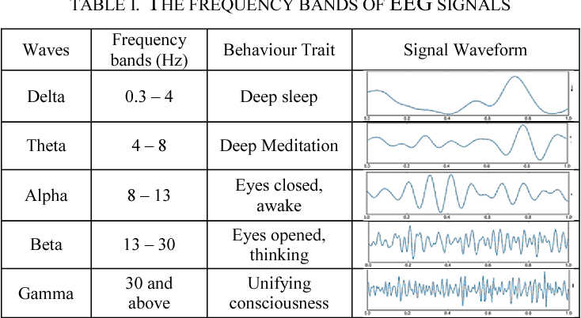
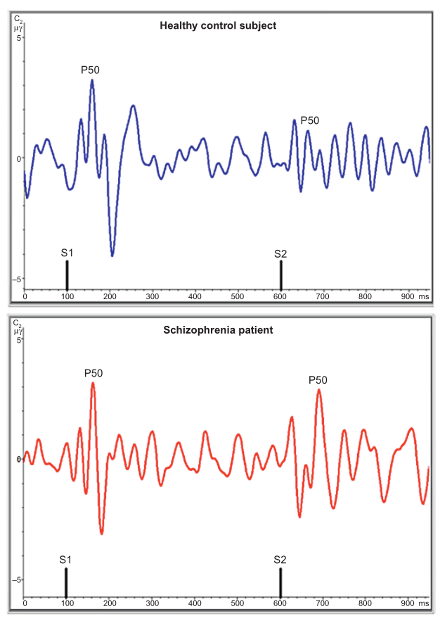

<a href="article-02-05.html"><i class="arrow far fa-arrow-alt-circle-left"></i></a>

<a href="article-02-07.html"><i class="arrow far fa-arrow-alt-circle-right"></i></a>

## 6-1. EEG와 MEG

뇌파는 신경계에서 뇌신경 사이에 신호가 전달될 때 생기는 전기의 흐름이다. 신경세포 하나에서 발생하는 전기적 파동의 세기는 측정할 수 없을 정도로 약하지만, 수만 개의 신경세포가 서로 동조하여 전기 신호를 주고받으면 미약한 파동들이 합쳐져서 측정 가능한 파동이 된다.

뇌파 검사(electroencephalography, EEG)란 이러한 뇌파의 시간에 따른 변화 양상을 기록하는 기법으로, 1924년 <s>베르거</s>에 의해 개발되었다. 뇌파는 수면시의 뇌파 변화, 외상이나 저산소증에 의한 뇌손상의 심각도, 혈관성 뇌질환의 후유증, 간질 발작의 검출 등 다양한 용도로 사용되어 왔으며, 치매나 조현병 등 다양한 정신질환에서도 연구 목적으로 활발히 활용되어 왔다.

<aside>

**Hans Berger (1873\~1941)**: 독일의 생리학자이자 정신과 의사. 청년 시절 겪었던 텔레파시 경험에 집착하여 평생 인간과 인간 사이에 물리적 신호를 보내는 기전을 연구하는데 매달렸다. 이 연구의 일환으로 뇌 표면에서의 전기 신호를 측정, 기록하는 방법을 개발하였고 이를 *Elektrenkephalogramm*이라고 이름지었다.

</aside>

정신질환에서의 뇌파 검사는 뇌의 정보 처리 기전을 알아내거나 평가하기 위해 주로 사용되었으며, 안정 상태에서의 뇌파와 <s>유발 전위</s>를 중심으로 측정되어 왔다. 안정상태에 있는 뇌일지라도 뇌 각부분의 동조 상태를 반영하는 독특한 뇌파 패턴이 나타나며, 이 패턴의 이상은 뇌의 제반 인지기능이 서로 조율되어 합목적적으로 기능하지 못하고 있음을 시사한다. 뇌파는 공간적인 해상도는 매우 낮지만, 뇌영상 검사와는 달리 시간적 해상도가 매우 높다. 유발 전위는 이러한 특성을 이용하여, 자극에 대한 반응으로 나타나는 특징적인 뇌파 변화를 검출하며 그 파형과 시간을 분석함으로써 특정 정보 처리의 양과 질을 평가한다.

<aside>

**유발 전위(evoked potential 혹은 event-related potential)**: 시각, 청각, 체성 감각등 자극을 주면, 말초 감각기로부터 전달된 신호를 뇌가 일차적으로 처리하는 과정에서 시간 순서에 따라 독특한 뇌파의 파형이 만들어진다. 하나하나는 진폭이 너무 작아 측정하기 어렵지만, 반복적으로 자극을 주고 이를 중첩하여 측정가능한 세기의 파형을 검출한다. 얻어진 파형을 분석함으로써 신경전달 경로에 문제가 있는지 파악할 수 있다.

</aside>

최근에는 자기 뇌촬영(Magnetoencephalography, MEG) 기법도 조금씩 이용되고 있다. 이는 뇌신경에서 유래된 전기 흐름이 만들어내는 자장의 변화를 측정하는 기법이다. 원리적으로는 동일한 뇌의 전기 흐름에서 유래된 것이지만, 뇌파 검사보다 훨씬 높은 공간 해상도를 보이며, 뇌파와는 조금 다른 생리 현상을 반영한다. 극히 미세한 자기장을 검출하기 위해 초전도 양자 간섭 장치(Superconducting Quantum Interference Device, SQUID)와 같은 특별한 장치를 필요로 하기 때문에 임상적으로는 사용되지 않고 있으며, 시각/청각 중추의 기능과 같은 특정한 연구 목적으로만 활용된다.

## 6-2. 정량화 뇌파 연구

고전적인 뇌파 연구는 시간에 따라 변화하는 파형의 패턴을 분석하는 형식이었다. 이러한 분석은 수면뇌파나 전간증 환자의 경련파를 분석하는데는 유용하나, 뇌의 전반적 기능 수준을 파악하는데는 그다지 도움이 되지 못하였다. 시간축에서 정의되는 모든 종류의 파형은 푸리에 변환이라는 과정을 거치면, 주파수 축을 따라 새로운 파형으로 변환된다. 이는 동일한 현상을 시간축으로 보느냐 주파수축으로 보느냐 관점만 바꾼 것이며, 내포된 정보량은 동일하다.([그림 1](#fourier-transformation)) 뇌파 연구자들은 예로부터 알파파, 베타파, 델타파 등 뇌파의 모양을 기준으로 파형을 분류하곤 하였는데, 이를 주파수축에서 바라보면 모양이 아니라 주파수 영역(frequency band)으로 구분된다. 예를 들어 알파파는 8-12Hz, 델타파는 1-3Hz 등의 주파수 밴드를 갖는다. ([그림 2](#main-frequencies)) 이러한 밴드들에 포함된 뇌파의 세기(power)를 뇌의 각 영역별로 시각화하여 일종의 지도 형태로 표시하는 과정을 정량화 뇌파(Quantitative Electroencephalography, qEEG) 분석이라고 한다.

{#fourier-transformation}

{#main-frequencies}

정량화 뇌파 분석은 뇌파에서 각각의 주파수 밴드가 차지하는 비중(power)을 알려줄 뿐 아니라, 뇌의 각 영역간의 상호 관계(coherence)도 정량적으로 나타내준다. 게다가 파형을 육안으로 보고 판정해야 하는 고전적 뇌파분석과는 달리, 전과정이 자동화되어 해석이 쉽고 표준화되어 있다는 장점이 있다

조현병 환자의 qEEG에서 거의 일관되게 나타나는 특징은 정상대조군에 비해 델타파, 쎄타파, 베타파의 파워가 증가하는 대신, 알파파의 파워는 저하되어 있다는 것이다.[@Boutros2008-ab] 서파의 비중이 높아지는 현상은 외상성 뇌손상이나 치매 환자의 특징이기도 하기 때문에, 이는 관련된 영역의 뇌기능이 전반적으로 떨어져 있음을 시사한다. 이러한 비정상적인 qEEG는 뇌의 모든 영역에서 나타나긴 하지만, 특히 전두엽 부분에서 많이 발견된다. 이러한 차이는 약물 투여 이전부터도 발견되기 때문에, 항정신병 약물 효과와는 상관없는 조현병의 병태생리를 반영한다.[@Kim2015-qj] 일부 의사들이 qEEG를 진단보조 도구로 사용하고자 애써왔지만, 진단특이도는 떨어지는 편이다. 물론 정상인과 조현병 환자의 차이는 뚜렷한 편이지만, 양극성 장애, 우울증, 치매 등에서 나타나는 소견과는 구분하기 어렵다.[@Boutros2008-ab] 최근에는 진단적 목적보다는, 신경피드백 치료를 했을 때 호전 양상을 추적하는 도구로서 각광받고 있다.[@Surmeli2012-me]

파워에 대한 연구에 비해 연결성(coherence)에 대한 연구는 상대적으로 적은 편이다. 연결성은 두 신호를 주파수 축에서의 파형으로 바꾼 후 둘 사이의 상관관계를 계산한 것이다. 즉 연결성이 높다는 것은 한쪽 파형이 다른쪽 파형에 의해 영향을 받거나 결정되는 요소가 크다는 것을 뜻한다. 정신질환에서는 보통 두 대뇌반구 사이의 연결성이 증가하는 경향을 보인다. 두 뇌반구가 서로 동조한다는 것은 언뜻 들으면 긍정적인 현상으로 보이지만, 실제로는 자유도가 떨어지고 뇌 기능에 포함된 정보량이 감소한다는 의미이기도 하다. 조현병에서는 특히 델타파 혹은 쎄타파의 양쪽 반구 연결성이 증가한다고 알려져 있다.[@Nagase1992-jc][@Andreou2015-iy][@Di_Lorenzo2015-hr] 그러나 이와 동시에 베타파와 감마파의 연결성은 감소되어 있다는 연구도 있다.[@Yeragani2006-zf]

## 6-3. 유발 전위 연구

전통적으로 조현병 환자의 뇌파 연구는 유발 전위 연구로부터 시작하였다. 특정한 감각 자극을 부여한 후 정해진 시간 후 나타나는 뇌파의 진폭이나 지연 시간을 측정하는데, 이는 해당 감각 정보를 처리하는 뇌 기능을 반영한다고 여겨진다.

조현병 환자들은 기이한 정신병적 증상때문에 사람들의 이목을 끌지만, 실상 환자들의 주관적 고통과 삶의 질을 결정하는 것은 다양한 신경인지 증상이다. 신경인지 기능의 감퇴 때문에 양성 증상이 이차적으로 나타난다고 해도 과언이 아니고, 만성화 황폐화의 원인이 되는 것 역시 신경인지 증상들이다. 정상적인 신경인지 기능이 이루어지려면, 감각 자극을 신속하고도 정확하게 처리해야함은 물론 불필요한 자극으로부터 현재 맥락에서 본질적인 자극을 골라내는 기능이 원활하게 일어나야 한다.[@Turetsky2007-wb] 유발 전위 연구의 공헌은, 조현병 환자들에게서 이러한 요소들이 모두 손상되어 있다는 것을 찾아냈다는 점이다.

### 6-3-1. 감각 관문과 P50

1930년대에 이르면 이미 실험 동물의 눈에 광선을 비추면 뇌수막에서 전기적 변화를 관찰할 수 있다는 것이 알려졌다. 연구를 거듭하면서 연구자들은 연달아 두번의 광선 자극을 주면, 뇌파 변화는 한번만 나타난다는 것을 발견하였다. 두 자극을 얼마나 짧은 시간 간격(two flash threshold, 2FT)을 두고 주었느냐에 따라 유발 전위가 한번 나타나기도 하고 두번 나타나기도 했는데, 이 시간 간격은 망상체(reticular formation)의 각성 정도와 상관관계에 놓여있었다.

<s>Venables</s>는 1960년대에 이미 조현병 환자를 대상으로 다양한 신경생리적 변화를 연구하고 있었다. 그는 피부전기반응(electrodermal activity)을 이용하여 조현병 환자의 각성(arousal) 정도를 측정하고 있었는데, 우연하게도 말이나 행동이 거의 없는 심하게 위축된 환자들이 역설적으로 상당한 각성 상태에 있다는 것을 발견하였다. 그는 이들로부터 시각적 유발 전위를 측정하여 2FT가 상당히 감소되어 있음을 확인할 수 있었다. 그는 이러한 관찰결과로부터 각성과 주의력 범위에 대한 창의적 가설을 이끌어낼 수 있었다. 각성 상태에 놓이면 주의력의 범위가 좁아지는 대신, 좁아진 범위 내에 유입되는 자극 하나하나에 반응하여야만 하고, 이들을 억제, 선택하는 것이 불가능해진다. 즉 조현병 환자들은 내부 여과장치 또는 감각 관문 기전의 손상이 있으며, 그 때문에 여과되지 않은 모든 자극이 불수의적으로 밀려와서 압도된다는 이론이다.[@Venables1964-sx]

<aside>

**Peter Venables (1923\~2017)**: 영국의 심리생리학자. 요크 대학의 교수로 재직하면서 조현병 환자의 뇌파는 물론 피부전기반응에 대한 연구를 수행하였다.

</aside>

이보다 몇년 앞서, 정신분석 기법으로 조현병 환자를 치료하고 있던 MacGhie와 Chapman[@Mcghie1961-dw]**​**은 환자들이 분석과정에서 겪는 어려움은 결국 주의력과 지각 이상을 중심으로 한 인지기능의 결함때문이라는 가설을 내놓았다. 이는 당시로서는 혁명적인 생각이었다. 전통적으로 정신분석가들은 조현병 환자의 근본 병리는 에고(ego) 구조의 붕괴와 파편화라고 굳게 믿고 있었다. 이런 와중에 개별 인지기능 들을 따로따로 떼어 고찰하고, 그 중 일부를 조현병의 근본 병리로 삼았다는 것은 지극히 현대적이다. MacGhie와 Chapman이 거론한 중심 병리중 첫번째가 주의력에 관한 것이다. 환자들은 공통적으로, 너무나도 생생하고 너무너무 많은 감각자극이 자신들에게 밀려오며, 이들에 주의를 기울이지 않을 수 없다고 하였다. 또한 이런 상황 때문에 오히려 꼭 주의를 기울여야만 하는 자극은 놓치게 된다고 호소하였다. Venables는 환자들의 이러한 호소를 실험적으로 입증한 셈이다.

감각 관문(sensory gating) 현상은 이렇듯, 대뇌 고위 중추가 탑 다운 방식으로 말초로부터 유입되는 감각 자극을 차단하고, 중요한 것과 그렇지 않은 것을 걸러내는 과정을 말한다. 대부분 무의식적이고 자동적으로 일어나나, 목표 지향적으로 주의를 기울일 수 있는 능력과 연결되어 있다.[@Jones2016-pd] 여기엔 해당 감각중추, 전전두엽, 해마 등 다양한 뇌구조가 관여하지만, 직접 관문 역할을 하는 것은 시상에 위치하여 감각신호의 중계를 맡고 있는 핵들이다.[@Moustafa2017-tn] 정상인에게 있어서는 주의력이라는 제한된 인지적 자원을 효율적으로 한 곳에 집중시키는 능력을 가리키며, 원활한 인지기능 발휘를 위해 필수적이다.

{#evoked-potentials}

감각 관문을 연구하는 대표적인 방법이 유발 전위이다. 서로 다른 유발 전위에는 보통 P50, N100, P300 등과 같은 부호가 붙어있는데, P, N은 극성을 가리키며, 뒤에 붙은 숫자는 자극을 준후 몇 millisecond 후에 나타나는 파형인지를 뜻한다.([그림 3](@evoked-potentials)) 감각 관문을 반영하는 유발 전위에는 P50, N100, P200이 있다. P50은 자극이 주어진 후 가장 먼저 나타나는 파형으로서, 이중 클릭 패러다임(paired-click paradigm)이라는 시험 방법을 통해 측정한다.[@2019-wv] 첫번째 조건화 자극(S1)과 두번째 시험 자극(S2)을 500ms 정도의 간격을 두고 들려준다. 정상인이라면 S2에 대한 파형의 진폭이 S1에 대한 것보다 훨씬 작아지는데, 이는 선행 신호로 인해 뒤에 따라오는 신호가 정상적으로 차폐되었음을 의미한다. 보통 S1/S2의 비가 0.5 이하이면 정상으로 취급한다. 첫번째 신호가 주어지면, 전전두엽의 작업 기억 기능이 이를 기억해놓는다. 두번째 신호가 주어지면 앞의 기억과 비교하게 되는데, 별 다른 차이가 없어서 정보적으로 가치가 적다고 판단하면 그만큼 신경활성을 억제해버린다.[@Cromwell2008-dj]

{\#@sensory-gating}

조현병 환자의 P50을 살펴보면 S1/S2가 정상인에 비해 유의하게 높게 나타나며, 이는 환자들의 감각 관문이 제대로 기능하지 못함을 의미한다.[@Freedman1987-dk] 청각중추, 해마, 전전두엽이 함께 동조하여 작동해야 하기 때문에, 전두엽과 측두엽의 정보 연결이 끊어진 것으로도 이해된다.[@Vlcek2014-uk] 이 기능에 관여하는 해마의 CA3, CA4 영역에 위치한 사이뉴런(Interneuron) 들은 중간 중격핵(medial septal nucleus)으로부터 콜린성 입력 신호를 받으며, 이는 alpha7 니코틴성 수용체에 의해 받아들여진다.[@Javitt2015-bj] 니코틴성 수용체 길항제는 P50을 손상시키며, 효현제는 항진시키는 것으로 보아 콜린성 신호전달과 밀접한 연관이 있다.[@Martin2004-ed] 조현병 환자들이 흡연에 집착하는 것도, 니코틴이 투여되면 감각 관문 기능이 일시적으로 항진되는 것과 무관하지 않다.[@Adler1993-gu]

조현병 환자들의 P50 패턴 양상은 만성화된 조현병 환자뿐 아니라, 초발환자, 전구기 환자, 심지어 발병하지 않은 가족에게도 나타난다.[@Cadenhead2005-mh][@Atagun2020-qq] 특정 증상과 상관관계가 있다거나, 만성화될수록 악화된다는 증거는 발견되지 않았으나, 항정신병 약물을 투여하면 상당히 정상화된다. 이런 특성때문에 고 위험군을 가려내거나 발병 위험군을 찾아내고, 약물의 효과를 판별하는 지표로서의 효용성이 연구되고 있다.[@Potter2006-qh]

### 6-3-2. 익숙해짐과 파동 전 억제

감각 관문의 또 다른 형태로 반복되는 자극에 익숙해지는 현상(habituation)을 들 수 있다. 동물에게 갑자기 큰 소리를 들려주면 경악 반사(startle reflex)가 일어난다. 그러나 큰 소리를 들려주기 전에 조그마한 소리를 먼저 들려주면 경악 반사의 정도가 상당히 감소한다. 이런 식으로 선행하는 약한 강도의 신호에 의해, 뒤따르는 강한 강도의 신호에 미리 적응하는 현상을 파동 전 억제(Prepulse Inhibition, PPI)라고 한다. 이 역시 불필요한 자극으로부터 필요한 자극을 걸러내는 인지기능의 하나로, 미지의 환경을 탐구하는 동물이 하나하나 자극에 지나치게 놀라지 않도록 하는 진화론적 기능을 갖는다.

인간에서 경악반사는, 눈꺼풀 근육에 부착한 근전도 계측기로 눈의 깜박임 정도를 정량화함으로써 측정한다. 놀람 자극을 주기 30내지 120 millisecond 전에 선행 신호를 들려주는데, 선행 신호를 들려주었을 때와 아닐 때의 눈 깜박임의 비를 갖고 PPI를 측정한다. 흥미로운 것은 P50과 PPI가 모두 감각 관문을 반영하는 생리현상임에도 불구하고, 두 평가치는 서로 낮은 상관관계 밖에 보이지 않는다는 것이다. 따라서 두 현상은 감각 관문의 서로 다른 측면을 반영한다고 보아야 한다.[@Braff2007-iw]

PPI는 P50보다는 좀더 원시적인 신경연결망을 통해 일어난다. 경악 반사는 교뇌(pons)에 위치한 망상체에서 비롯된다. 그런데 선행 신호가 주어지면 해마가 측좌핵(nucleus accumbens)을 억제하고, 연이어 대뇌다리교뇌(pedunculopontine) 신경세포가 억제됨으로써 경악 반사가 감소된다. 조현병 환자에서는, 측좌핵의 도파민 활성이 지나치게 높아 제대로 억제되지 않기 때문에, 선행신호가 주어지더라도 경악 반사가 줄어들지 않는다고 여겨지고 있다.[@Javitt2015-bj]

P50과 마찬가지로 PPI의 이상은 조현병 환자 뿐 아니라, 다양한 조현병 스펙트럼 장애에서 발견되며, 발병하지 않는 환자 가족, 조현병 고위험군에게서도 관찰된다.[@Braff2010-lq] 정신병적 증상과는 별 상관관계를 보이지 않기 때문에, 상태 변수(state variable)라기 보다는 특성 변수(trait variable)라고 보아야 하며, 이 때문에 관련된 유전 인자를 찾으려는 노력이 행해졌다. 한때 글루타메이트 시냅스의 성숙과 신경가소성에 관여하고 있는 NRGL--ERBB4 복합체와 PPI 결함의 관련성이 주목받기도 하였으나 재확인되지는 못했다.[@Greenwood2012-vg] Quiednow 등[@Quednow2018-mj]이 행한 메타 연구에서 PPI와 유의한 연관을 맺는 것으로 나타난 유전자는, COMT, GRIK3, TCF4 그리고 PRODH 였다. 그러나 이러한 결과는, GWAS가 일반화되기 이전의 후보 유전자 연구에 의해 얻어진 결과를 종합한 것에 지나지 않기 때문에 아직 확실한 결론은 얻지 못한 상태이다.

파동 전 억제 현상은 조현병 환자에게 높은 빈도로 관찰되기는 하지만, 조현병에 특이한 현상은 아니다. 조현병 스펙트럼 질환 뿐 아니라, 강박증, 틱장애, 양극성 장애, 주의력결핍 과잉행동장애, 불안장애, 자폐증, 외상후 스트레스 장애 등 광범위한 질환에서 관찰할 수 있기 때문에, 조현병에 독특한 병태생리를 연구하고자 할 때는 적합한 연구대상이 되지 못한다. 다만 다양한 정신질환의 공통된 병태생리에 대해서는 단서를 제공할 수 있으리라 기대된다.[@Kohl2013-ku]

### 6-3-3. 정보 처리와 P300

P50과 PPI가 의식하기도 전 단계에서 일어나는 반사 현상이라면, P300은 보다 후기의 정보처리 과정을 반영한다. P300은 <s>양자극 방안</s>을 통해 연구한다. 지루한 반복자극으로 주의력이 떨어진 와중에서도 색다른 변이 자극이 입력되면 즉각 의식적으로 주의를 기울이게 되는데, P300은 이때 주의를 기울이고 정보를 처리해나가는 인지 능력을 측정한다.

<aside>

**양자극 방안(oddball paradigm)**: 이는 동일한 표준 자극(standard stimulus)이 반복적으로 제시되는 중에, 무작위로 나머지와 다른 변이 자극(deviant stimulus)이 제시되는 실험방안이다.

</aside>

P300은 변이 자극이 주어진 후 300ms 뒤에 나타나는 유발 전위이다. 이는 다양한 뇌부위의 정보 처리 기능이 통합되어 생성되는 것이기 때문에, 특정한 하나의 인지기능 보다는 종합적 기능을 평가한다고 보아야 한다. 크게 P3a와 P3b로 나누기도 하는데, 전자는 특별한 지시 사항이 없이 변이 자극을 수동적으로 수용할 때 드러나며, 후자는 변이 자극을 찾아내라는 과제를 부여하여 환자가 자극을 능동적, 적극적으로 수용할 때 드러난다.[@Polich2007-wj P300은 전두엽을 비롯하여, 해마, 두정엽과 측두엽 등 뇌의 여러 부위가 동조함으로써 일어난다. 아마도 전측 대상 피질(anterior cingulate gyrus)에서 주의가 새로운 자극으로 기울여지는 것을 기점으로 해서, 전두엽의 작업 기억이 갱신되고, 이는 해마를 거쳐 측두-두정엽에 저장된 장기 기억과 대조하는 과정으로 이어지게 되리라 짐작되고 있다.[@Polich2007-wj]

변이 자극이 주어진 후 P300이 나타날 때까지 걸린 시간을 잠재기(latency)라고 한다. P300의 진폭은 할당된 주의력의 양을 의미하고, 잠재기는 주의력을 할당하고 자극을 평가하는 데 소요된 시간을 가리킨다. 표준 자극에 비해 변이 자극이 나타날 확률이 낮은 검사일수록 P300의 진폭은 작아지고, 변이 자극과 표준 자극의 차이가 두드러질수록 잠재기가 짧고 진폭도 커진다고 한다.[@2019-wv]

P300은 얼마 전까지 조현병과 관련하여 가장 많이 연구된 신경생리학적 표지자 중 하나이다. 조현병 환자들은 P300의 진폭이 작아질 뿐 아니라, 잠재기(latency)가 늦어진다. 정상 성인에서도 노화에 따라 P300 잠재기가 연장되는 것으로 보아, P300의 잠재기는 신경 퇴행성 과정을 반영하는 것으로도 볼 수 있다.[@Polich1996-hg] P300의 진폭과 잠재기는 서로 다른 신경생리 측면을 반영하며, 두 지표 사이의 연관성도 낮은 편이다.[@Blakey2018-qg] P300의 잠재기보다는 진폭의 감소가 조현병 환자에서 더 일관되게 관찰되며, 초발 환자나 고위험 군에서도 만성 환자에 못지 않은 P300 진폭의 감소가 나타나기 때문에, P300 진폭은 조현병의 대표적인 특성 변수(trait variable)이자 내적 표현형(endophenotype)으로 여겨지고 있다.[@Qiu2014-yz] 그러나 P300의 진폭이 정신증상의 악화나 인지기능 저하와 비례하여 감소한다는 보고도 있어서 상태 변수로의 가능성도 고려되고 있다.[@Ford1999-if][@Mathalon2000-fh]

P300의 유전성은 60%에 달하기 때문에, 이를 매개하는 유전자에 대한 검색도 활발하게 이루어졌다. 현재까지 COMT, DISC1, NRG1, ABCB1 등의 후보 유전자가 거론되었으나, 확실한 결론을 내리기에는 여전히 증거가 불충분하다.[@Bramon2008-hc][@Kang2010-dd][@Decoster2012-hg][@Shaikh2013-nk] 게다가 P300의 이상은 조현병에만 국한된 것이 아니기 때문에, 조현병의 유전 요인을 찾고자 하는 연구에는 적당하지 않다. P3a보다는 P3b가 좀더 조현병의 독특한 병태생리를 반영한다고 생각되고 있다.[@Ethridge2015-gx]

### 6-3-4. 불일치 음전위

불일치 음전위(Mismatch Negativity, MMN)은 P300을 측정할 때와 같은 양자극 방안을 통해 측정한다. 표준 자극을 주었을 때와 변이 자극을 주었을 때 모두 유발 전위가 일어나지만, 두 전위의 진폭에 상당한 차이가 나는데 이 차이가 바로 불일치 음전위이다. 예상치 못한 자극을 자동적으로 알아차리는 과정에서 일어나는 뇌의 활성 신호라 볼 수 있다.[@2019-wv]

MMN은 P300보다 빠른 100-250ms 시점에 일어난다. 이 때문에 의식적으로 주의를 기울이기 전에 자동적으로 발생하는, 주의를 기울이라는 선행 신호로 여겨진다. 발생기전으로 두가지 가설이 제기되었다. 첫번째의 좀더 고전적인 가설에서는, 반복되는 자극을 지각한 뇌가 이 패턴을 작업 기억 상에 띄워놓고 연이어 들어오는 입력 신호와 비교하며, 새로 들어오는 신호가 이 기억된 패턴과 차이가 나면 MMN이 발생한다.[@Escera1998-mx] 두번째 가설은 좀더 단순한 설명으로, 자극이 반복되면 점점 익숙해지기 때문에 유발 전위의 진폭이 작아진다. 따라서 변이 자극에 대한 유발 전위 진폭과 표준 자극에 대한 진폭의 산술적 차이가 MMN으로 나타난다는 것이다. 후자를 적응 가설(adaptation hypothesis)라고도 한다.[@Jaaskelainen2004-zb]

발생기전에 대한 설명이 어떻든 간에, MMN은 자신을 둘러싼 주위 환경으로부터 끊임없이 위험 요소를 찾아내 피해야 하는 동물에게 있어서, 익숙한 자극으로부터 잠재적으로 위험한 자극을 골라낼 수 있게 해주는 인지기능이다. 그래서인지 MMN 현상은 영장류는 물론 하위 포유류에서도 측정가능하며, 특성 변수에 가깝기 때문에 평생 동안 거의 일정하게 유지된다.

MMN은 특히 NMDA 수용체를 통한 글루타메이트 신호전달과 밀접한 관련이 있다. NMDA 길항제를 투여하면 MMN이 상당히 줄어든다. 감각 관문에서와 마찬가지로, MMN의 기능이 떨어지면 과흥분 상태에 놓이고 모든 자극에 민감하게 반응하게 된다. 그러나 감각 관문이 불필요한 반응을 여과하는데 초점을 맞추고 있다면, MMN은 필요한 반응을 골라내는 측면을 강조한다.

조현병 환자에서 MMN에 결함이 발견된다는 것은 1991년 Shelley 등[@Shelley1991-jq] 에 의해 최초로 보고되었으며, 이후 수많은 연구자들이 이를 재확인하였다. 2016년 발표된 메타 분석 자료를 인용하면, 병기를 고려하지 않은 조현병 환자에서 확인된 효과 크기는 0.95로 <s>Cohen이 제시한 기준</s>으로 보았을 때 매우 큰 값에 속한다. 질병 초기에는 크게 변하지 않고, 유병기간과 효과 크기 간에 유의한 상관관계도 없지만, 만성화가 되면서 점점 나빠질 것으로 예상되고 있다. 고위험 군 중 나중에 발병하는 군이 그렇지 않은 군에 비해 MMN이 상당히 떨어지는 것으로보아, 발병 위험군을 찾아내는데 사용할 수 있는 가능성도 시사된다.[@Erickson2016-wa] 한 연구에서는 P300과 MMN을 이용하여 조현병 환자군과 정상군을 구분하는 시도를 해보았는데, 그 분류 정확도가 최대 79.8%에 달하여 선별 검사로 유용할 수 있다는 것을 입증하였다.[@Laton2014-nv]

<aside>

**Cohen의 효과 크기 (Cohen's effect size, d)**: Jacob cohen이 제시한 효과 크기는 두 집단의 평균의 차이를 공통 표준 편차로 나눈 값이다. 그는 d ≈ 0.2를 "small", d≈0.5를 "medium", d≈0.8 이상을 "large"로 구분할 것을 제안하였다.

</aside>

## 6-4. 비정상적 현저성 가설 {#aberrant-salience}

Salience란 한국말로 "돌출 혹은 현저성"으로 번역되며, 어떤 사건이 중요하거나 현재 논의되고 있는 것과 연관성이 있다는 뜻을 지닌다. 감각 관문 이론에서 언급했듯이, 중요한 것과 그렇지 않은 것을 구분하는 기능이 원활하게 이루어져야, 이후의 고등 정신기능이 제대로 발휘된다. 감각 관문 개념이 정보 처리의 초기에 위치하는, 자동적이고 불수의적인 단계를 다룬다면, 비정상적 현저성 가설은 좀더 의식적으로 이루어지는 후기 단계를 다룬다.

이 이론은 피해망상 혹은 관계망상을 인지기능 손상과 연결시켜 설명하려는 노력으로부터 탄생하였다. Kapur는 개인이 경험하는 각양각색의 정신적 표상에 중요성을 부여하는 기능이 과도하거나 혼란에 빠지게 되면, 매사를 자신과 관계맺어서 생각하고, 숨겨진 의미를 찾고자 하는 경계심이 강해져서 결국 피해망상에 시달리게 된다고 하였다. 어떤 의미에서 망상이란, 모든 경험들이 중요성을 띄고 압박감을 주며 다가오는 상황을 어떻게든 설명하기 위한 2차적인 결과물이라고 해석할 수 있다.[@Kapur2003-xc] Kapur는 현저성의 장애는 도파민 신호전달계의 과활성 때문에 초래되며, 항정신병 약물을 투여하면 현저성이 약화된다고 믿었다. 현저성이 줄어들면 환자가 망상적이 아닌 대신 다른 방식으로 현상을 설명하는 길이 열리기 때문에 망상에 의한 긴장과 공포가 줄어들게 된다는 것이다.

비정상적 현저성(aberrant salience) 이론은 다양한 수준에서의 인지기능 이상을 하나로 통합하여 설명하는 이론적 틀을 제시해주었다. 정보 처리의 초기 단계에서 감각 신호를 저장된 기억과 대조된다. 인간은 저장된 기억을 통해 사건이 어떤 식으로 벌어지리라는 것을 대충 예측한다. 그런데 이후 실제로 벌어지는 사건들이 예상한 바와 어긋나면 그 예외성에 주목하게 되고 무언가 다른 의미가 있지 않나 의심하게 된다.[@Hemsley2005-ln][@Fletcher2009-da] 이러한 일련의 과정이 현저성을 결정하기 때문에, 관계된 인지 기능은 주의를 기울이기 전부터 의식하고 난 다음까지 다양한 수준에 걸쳐져 있다고 보아야 한다.[@Chun2019-ha]

이중 초기 단계에는, 아마도 감각 관문과 연계된 기능들 즉 다양한 유발 전위로 측정되는 인지기능들이 포함될 것이다. 그 중에서도 특히 표준 자극으로부터 "돌출된" 변이 자극을 골라내는 MMN과 P300이 밀접하게 반영할 것이다. 이보다 좀더 뒤에 위치한 중간 단계의 인지 기능은 도파민에 의해 매개되는 보상 회로와 관련이 있다.[@Winton-Brown2014-br] 생활하면서 맞닥뜨리는 수많은 자극 들은 기억속에 저장된 조건화에 의해, 그 자극이 담고 있는 보상이나 처벌에 대한 가능성과 연결되어 있다. 보상과 처벌 어느 쪽이든 간에, 이와 관련된 조건화된 자극에는 주의가 기울여지며, 그렇지 못한 자극은 잊혀지게 마련이다. 도파민 신호전달에 문제가 생겨 보상 회로가 제대로 기능하지 못하면, 보상과 처벌의 감정적 가치가 제대로 매겨지지 못하기 때문에, 역시 중요한 자극과 그렇지 못한 자극을 구분해내지 못하게 된다.[@Howes2016-qm][@Chun2019-ha]

마지막으로 망상을 형성하게 되는 마지막 인지 단계는 인과 관계에 대한 잘못된 추론 단계이다.[@Fletcher2009-da][@Chun2019-ha] 사람들은 다양한 심리적 기전에 근거하여, 다수의 현상이나 사건들을 원인과 결과라는 관계로 맺어 놓으려 한다. 자신이 굳게 믿는 세상의 근본 법칙에 의해 사건들을 인과관계로 묶어 설명해야만 심리적 안정을 얻기 때문이다.[@Feeney2017-xh] 그런데 사람들이 흔히 기대는 인과 법칙은 오류투성이이며, 이 때문에 편견이나 미신, 초자연적 현상에 대한 믿음 등이 없어지지 않는다. 그런데 조현병 환자는 더더욱 사로 상관없는 사건들을 인과 관계로 묶고자 하는 경향이 강하며, 게다가 잘못된 인과 법칙을 사용하는 경우가 많다. 이렇게 정보 처리의 초기, 중기, 후기의 단계들이 모두 어우러져 비정상적인 현저성을 일으키게 된다. 이 원리는 조현병 뿐 아니라, 정상인에게 발견되는 망상과 환각 현상, 또는 분열형 인격 성향(schizotypy)을 설명하는데 유력한 이론이다.

## 6-5. 동기화와 감마 밴드 진동

대뇌 인지기능이 제대로 수행되기 위해선 각 영역의 기능이 온전해야 함은 물론이지만, 이들이 전체적으로 얼마나 통합되느냐도 중요한 요소이다. 각각의 기능들이 정밀한 타이밍으로 일관되게 움직여주어야 합목적적인 기능을 발휘할 수 있다. 과거 고위인지기능을 논의할 때, 집행기능(executive function)이라 하여, 계획을 수립하고, 필요한 요소들을 조직화하며, 순차적, 통합적으로 이들 기능 들을 개시, 유지, 변경, 중단함으로써 목표를 달성하는 기능을 언급하곤 하였다.[@1997-yg] 이는 지극히 추상적인 개념이긴 하지만, 수년전부터 각광받고 있는 뇌 전역을 아우르는 신경 진동(neural oscillation)은 집행 기능의 신경생리학적 측면으로 여겨지고 있다.

신경 진동이란 일군의 신경세포들이 같은 주파수와 같은 위상을 갖는 전기활성을 띠게 되는 것을 말한다. 이렇게 동조되는 것은 외부 자극에 의해서일 수도 있지만, 신경세포들의 자체적인 흥분성에 의해 이루어지기도 한다. 광범위한 뇌 영역의 동조된 신경 진동 현상은 이들 부위들이 조직화되어 움직이고 있음을 표시한다. 고주파 영역의 신경 진동은 지역적(local) 신경세포의 동조현상을 반영하며, 저주파 영역은 전역적(global) 동조현상을 반영한다. 세타파 영역의 신경 진동은 학습 및 기억과 관련이 있다. 세타파가 시작되는 곳은 중격핵과 해마이며, 이 부위와 인접 뇌 영역은 세타파를 이용해 정보를 포장(packaging)하여 전달한다. 아마도 기억의 부호와와 인출, 서로 다른 기억들 간의 연합 등에 중요한 역할을 할 것으로 믿어진다.

이중에서도 특히 감마 밴드는 조현병을 연구하는 많은 학자들의 관심사가 되고 있다. 감마 밴드는 30Hz 이상의 영역을 말하는데, 그 중에서도 특히 40Hz 근방의 진동이 주목받고 있다. 감마 밴드 진동(gamma band oscillation)은 단순히 감각 신호를 처리하는 과정보다는, 자극의 다양한 감각적 특징들을 결합하여 하나의 대상으로 통합하는, 이른바 <s>결합 문제</s> 그리고 <s>의식적 지각</s>의 문제와 관련되어 있을 것으로 믿어진다.오랜 동안 의식현상을 탐구해온 <s>Searle</s>이나 <s>Edelman</s>과 같은 학자들은 빨간 사과를 보았을 때 빨갛다고 느끼는 의식적이고 질적인 경험을 감각질 혹은 퀄리아(qualia)라고 명명하면서, 의식을 이해하기 위해 반드시 넘어서야 하는 중요한 현상이라고 생각하였다.[@Escobar2013-tx] 퀄리아의 신경학적 기반을 찾고자 했던 <s>Crick</s> 과 <s>Koch</s> 등 학자들은 감마 밴드의 신경 진동이 그 역할을 하리라 기대하였다.[[@Crick1990-ld; @Rees2002-cv]

<aside>

**결합 문제(binding problem)**: 인간은 다양한 자극을 동시에 받아들이지만, 이를 적절히 구획하여 개개 사물을 식별할 수 있다. 예를 들어 꽃 모양의 벽지를 배경으로 화병에 든 꽃이 있을 때에도 두 꽃을 구분해서 지각할 수 있다. 반대로 시각, 청각, 촉각 등 다양한 자극이 들어와도 이를 하나의 사물로 결합할 수 있다. 손에 든 사과를 바라보는 경우, 사과의 모양과 색깔, 향기와 촉감을 모두 "사과"라는 하나의 사물에 속한 것으로 결합할 수 있다. 이 두 문제를 총칭하여 결합 문제라 부른다.

**의식적 지각**: 시각 자극의 경우, 인간의 뇌는 다양한 색과 모양을 구분하며, 그때그때 경우에 맞게 적절한 운동 반응을 보인다. 그러나 반응을 보이는 것과 의식적으로 인지(awareness) 혹은 지각(perception)하는 것은 구분할 수 있다. 예를 들어 의식적으로 지각하지 않더라도 날아오는 물체를 피할 수 있다.

**John Searle (1932\~)**: 미국의 철학자. 주체와 의지/지향성, 의식을 갖는 주체와 그렇지 못한 인공 지능의 구분 등에 대해 연구하였다.

**Gerald Edelman (1929\~2014)**: 미국의 생물학자. 면역체계에 대한 연구로 1972년 노벨 생리의학상을 수상하였다. 면역 체계가 점진적으로 발전하는 진화 과정이 뇌 구조와 의식이 발달하는 것과 유사하다는 전제하에, 의식의 생물학적 기전을 신경계의 다윈주의(neural darwinism) 입장에서 해석하려고 시도하였다.

**Francis Crick (1916\~2004)**: James Watson, Maurice Wilkins, Rosalind Franklin과 함께 DNA의 3차원 구조를 해석하여 노벨 생리의학상을 수상하였다. 말년에는 Christof Koch와 함께 의식을 컴퓨터 모델이나 신경생물학적 모델로 설명하는 연구에 몰두하였다.

**Christof Koch (1956\~)**: 미국의 신경생물학자. 의식의 신경생물학적 모델을 만드는데 기여해왔으며, 현재는 알렌 뇌과학 연구소(Allen Institute for Brain Science)에서 대뇌의 시각정보 처리를 컴퓨터 모델링하는 연구를 행하고 있다.

</aside>

감마 밴드 진동과 조현병의 관련을 최초로 언급한 사람은 Clemenz 등[@Clementz1997-jf]**​**이었으나, 조현병 환자군에서 최초로 40Hz 진동의 파워가 저하되어 있음을 발견한 것은 권준수 등**​**[@Kwon1999-qr]**​**이다. 감마 밴드는 "청각성 안정유발반응(auditory steady-state response, ASSR)"이라는 기법으로 측정한다. 단일 주파수의 순음(pure tone)을 들려주면서 유발 전위를 측정하는데, 음량의 크기를 40Hz 빈도로 키웠다 줄였다를 반복한다. 그러면 유발 전위 자체도 소리에 맞춰 40Hz로 진동하게 되는데, 이 세기가 바로 감마 밴드 진동에 해당한다.

감마 밴드 진동은 여러가지 기전에 의해서 발생한다고 알려져 있으며, 조현병과 관련해서 중요한 것은 빠르게 발포(fast-spiking)하는 parvalbumin 사이뉴런이다.([2장 4-2 절 참조](article-02-04.html#neurodegenerative-evidence)) 이들 사이뉴런은 그들 자체의 연결 네트워크에서도 감마 밴드 진동을 만들어내지만, 주로 피라미드 뉴런과의 피드백 연결을 통해서 감마 진동을 만들어낸다.[@Sohal2009-yi][@Tada2020-ya] 진동은 글루타메이트 신호전달에 의한 피라미드 뉴런의 흥분과, 이에 대한 피드백으로 사이뉴런에서 분비되는 GABA에 의한 억제가 반복되는 현상으로 이해되고 있다. 조현병 환자들은 parvalbumin 발현 사이뉴런의 미엘린 화가 줄어들 뿐 아니라, 시냅스 가지치기 등에 의해 시냅스의 수가 줄어들면서 감마 진동의 강도도 줄어든다. 해부학적으로는 측두엽의 관자이랑(superior temporal gyrus)의 회백질 감소와 연관이 있다.[@Edgar2014-vv]

권준수 등[@Kwon1999-qr]**​**의 보고 이후, 조현병 환자의 감마 밴드 이상은 수많은 독립적 연구팀에 의해 재확인 되었다. 2016년에 행해진 메타 연구에서 효과 크기는 0.58 정도로 역시 Cohen의 기준에 근거하여 중간 정도의 효과로 해석되었다.[@Thune2016-dt] 감마 진동의 정도는 작업 기억, 인지적 조절, 지각적 결합 등 개개 인지기능과 상관관계가 있다.[@Barr2010-sm] 증상과의 연관성은 아직 확실히 알려져 있지 않다. 유전성은 0.64에 달하기 때문에 내적표현형으로 사용될 여지가 있지만, 아직 관련된 유전자는 발견되지 않았다.[@Turetsky2011-qs]
