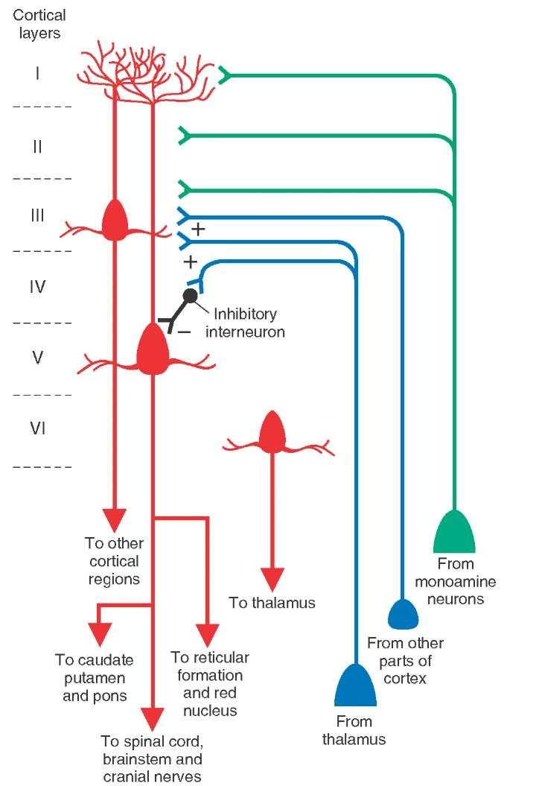

<a href="article-02-06.html"><i class="arrow far fa-arrow-alt-circle-left"></i></a>

<a href="article-02-08.html"><i class="arrow far fa-arrow-alt-circle-right"></i></a>

## 7-1. 도파민 가설의 의의

조현병의 병태생리를 아무리 다차원적으로 분석하려 애쓴다 할 지라도, 결국은 그 최종 경로는 도파민 신호전달로 돌아오게 마련이다. 병인론을 탐구하기 위해 고안된 아무리 참신하고 정교한 경로라고 하더라도, 그 중 어딘가에는 도파민 분비 뉴런과 수용체가 포함되어 있다. 현재까지 개발된 모든 항정신병 약물은 도파민 수용체 그 중에서도 D~2~ 수용체 차단에 의해 그 효과를 나타내며, 이는 소위 조현병의 도파민 가설(dopamine hypothesis of schizophrenia)을 낳는 근거가 되었다. 좀더 구체적는 "조현병 양성 증상에 대한 중변연계 도파민 가설(mesolimbic dopamine hypothesis of positive symptom of schizophrenia)"이라는 것으로, 중뇌에서 변연계로 뻗어나가는 도파민 신호전달의 과활성이 양성 증상을 일으킨다는 가설이다. 이는 지난 수십년간, 아니 현재까지도, 조현병 병인론의 가장 영향력있는 이론으로 자리잡고 있다.[@McCutcheon2019-qo]

물론 도파민의 과활성 때문에 조현병이 발생한다라는 단순한 설명은 사실과 거리가 멀다. 도파민 활성은 해부학적 위치에 따라, 수용체의 아형에 따라, 주변 신경전달물질의 활성 정도에 따라, 주어진 과업과의 시간적 관계에 따라 역동적으로 활성이 높아지기도 하고 떨어지기도 한다. 무엇보다도, 도파민 활성의 증가는 정신병적 증상의 신경생물학적 차원일 뿐이며, 확실히 알려진 것은 도파민 활성을 조절하면 치료효과를 얻을 수 있다는 것 뿐이다. 애초에 왜 도파민 조절에 문제가 생겼는지를 설명하지 못한다면 병인론이라 할 수 없다.

예를 들어, 신체가 발열 반응을 일으키는 것은 다양한 원인에 의해 프로스타글란딘(prostaglandin) 분비가 촉진되고, 이들이 시상하부에서 정상 체온의 기준점(set-point)을 올리기 때문이다. 해열제는 cyclooxygenase를 억제하여 프로스타글란딘 생성을 차단하기 때문에 체온 상승을 막아낼 수 있다. 조현병과 도파민, 그리고 항정신병 약물은, 보는 관점에 따라, 발열과 해열제의 관계에 빗대어 이해할 수 있다. 모종의 이유로 도파민(프로스타글란딘) 활성 조절에 혼선이 생기면 정신병적 증상(발열)이 발현되고, 항정신병 약물(해열제)을 사용하면 이를 억제할 수 있다는 식이다. 도파민과 항정신병 약물의 역할을 이렇게 국한하여 바라보면, 중요한 질문을 피해갈수 없다. 즉 해열제를 써서 발열을 막는다 해도 원인 질환이 치료되지 않듯이, 항정신병 약물을 써서 아무리 증상을 차단한다고 해도 원인 질환이 치료될 수 있겠느냐는 질문이다.

따라서 도파민 가설은 서로 상반되는 두가지 방식으로 이해될 수 있다. 첫째는 도파민 과활성이 조현병의 궁극적인 원인이자, 조현병이라는 질병과 동치(equivalence)라고 보는 시각이다. 이에 따르면 정신병적 증상이 없는 조현병은 존재하지 않는 것처럼, 도파민이 상승되지 않은 조현병은 있을 수 없다고 본다. 둘째는 도파민 과활성은 마지막 공통 경로일 뿐이고, 조현병의 진정한 정체는 도파민 활성보다 상위 기전을 탐구해야만 밝힐 수 있다고 보는 입장이다. 발열이 동반되지 않는 폐렴이 있듯이 도파민이 상승되지 않는 조현병도 있을 지 모른다. 아마도 진실은 양극단에 서있는 두 입장 가운데 어딘가에 숨어있을 것이다. 본서에는 도파민 가설 말고도 조현병을 이해하는 다양한 메커니즘이 소개되어 있다. 그러나 이들 중 상당수는 도파민을 고려하지 않고서는 성립되지 않는다. 따라서 도파민은 궁극적 원인에서부터 서로 다른 층위의 중간 단계를 거쳐, 증상이 발현되는 최종 공통 경로에도 골고루 관여하고 있다. 도파민 가설을 이해하기 위해선, 도파민의 미묘한 위치를 염두에 두고 있어야 한다.

도파민 가설은 계속 진화하고 있다. Howes와 Kapur[@Howes2009-xr]는 도파민 가설의 발달 단계를 세 단계로 나누고 있다. 첫번째 단계는 도파민 과활성을 조현병의 원인으로 간주하던 시기 (version I), 둘째는 과활성 뿐 아니라 전전두엽의 저활성이 음성 증상의 원인이라고 보완하던 시기 (version II), 그리고 셋째는 도파민 경로를 최종 공통 경로로 간주하는 시기(version III)이다. 이렇게 세 개의 단계가 제시된 지도 이미 10여년이 지났다. Version III의 가설을 좇아 도파민 보다 상위단계를 공략하려는 치료제 개발 시도가 이어졌으나, 여전히 항정신병 약물은 도파민 길항제에서 벗어나지 못하고 있다. 그러나 동시에 쉴새없이 쏟아져 나온 새로운 연구결과들은 도파민 가설이 다시 한번 갱신되기를 기다리고 있다.[@Stahl2018-qc][@Kesby2018-ro]

## 7-2. 도파민의 발견과 도파민 가설 {#dopamine-discovery}

클로르프로마진이 정신약물학의 태동을 알리고 있던 1950년대 무렵, 결핵치료제로 사용되던 <s>iproniazid</s>가 상당한 항우울작용이 있다는 것이 발견되었다. Iproniazid를 연구하던 학자들은 이 약물이 단가아민 산화효소 억제제(Monoamine Oxidase Inhibitor, MAOI)라는 것을 알게 되었다. 리서핀(reserpine)에 의해 인공적으로 유발된 우울증 모델에 MAOI을 투여하면 증상이 회복된다는 것을 확인한 연구자들은 노르에피네프린과 세로토닌을 중심으로 우울증의 단가아민 가설을 세울 수 있었다.[@Schildkraut1967-qr]

<aside>

Isoniazid는 1870년대에 처음 합성되었고, 1910년대에는 항결핵 효과가 있음이 알려졌다. 당시 sanatorium이라 불리우던 결핵 환자 요양소에 입원한 환자들은 음침한 분위기 보다는 향락을 즐기거나 활발한 사교활동을 하는 등 상황에 걸맞지 않는 들뜬 분위기에 젖어 있었는데, 연구자들은 항결핵약이 사람을 흥분기키고 기분을 고양시키며, 심한 경우 조증과 비슷한 양상을 일으킨다는 것을 알게 되었다. 1952년 iproniazid가 isoniazid보더 훨씬 이런 작용이 강하다는 것이 밝혀졌고, 그 원인이 MAO 효소 억제효과 때문이라는 것이 알려졌다.

</aside>

1957년 <s>Carlsson</s>은 선조체(striatum)에 다량의 도파민이 분포한다는 것을 발견하였을 뿐 아니라, 이 물질이 단순히 노르에피네프린의 전구물질이 아니요, 그 자신이 중요한 신경전달물질임을 최초로 증명하였다. 그는 한 걸음 더 나아가 리서핀을 투여하면 기저핵의 도파민이 고갈되고, 이와 더불어 파킨슨 병과 유사한 운동장애가 발생함을 관찰하였다. 이 발견은 이후 파킨슨 병의 기전과 치료제 개발에 가장 중요한 공헌이 되었다.

<aside>

**Arvid Carlsson (1923\~2018)**: 스웨덴의 약리학자. 룬드 대학에 근무할 당시 도파민이 신경전달물질임을 발견하였고, 도파민을 정량하는 방법을 개발하였다. 이 기법을 이용하여 파킨슨병이 도파민 활성저하때문임을 증명하였다. 또한 항정신병 약물과 도파민의 밀접한 관계를 찾아내었고, 최초의 선택적 세로토닌 재흡수 억제제인 zimelidine을 합성하기도 하였다. 이러한 공로로 2000년 노벨 생리의학상을 수상하였다.

</aside>

Carlsson과 연구진은 우연찮게 클로르프로마진을 투여하면, 도파민의 전구물질은 homovanilic acid가 유의하게 상승한다는 것을 발견하였다. 동시에 약물이 시냅스 후 수용체에 결합한다는 것 또한 확인하였다.[@Carlsson1963-sn] 전구물질의 증가는 시냅스 후 수용체 차단에 대한 보상작용으로 이해되었고, 추체외로 증후군이 파킨슨 병과 유사하다는 사실과 맞물려 항정신병 약물의 작용이 도파민 수용체 차단을 통해 일어난다는 대담한 가설이 세워지게 되었다.[@Carlsson1978-jv] 항파킨슨 제제로 처음 개발되었던 L-Dopa를 투여한 후 적지 않은 환자가 정신증을 보이게되었다는 사실 역시 도파민의 역할에 대한 Carlsson의 확신을 공고히 해주었다.[@Carlsson2006-se]

약물이 도파민 수용체에 결합할 수 있다는 사실과, 그것이 치료효과의 주요 기전이라는 주장 사이에는 큰 간격이 놓여있다. 이러한 의문은 방사성 동위원소를 이용한 리간드 결합 분석(radioactive ligand binding assay)이라는 기법이 도입되면서 해소되었다. 도파민 수용체에 강력하게 결합하는 방사성 동위원소 리간드인 ^3^H-haloperidol와 함께, 당시 사용되던 다양한 항정신병 약물을 함께 투여하면서, ^3^H-haloperidol 결합을 <s>50% 방해하는 약물의 농도(IC~50~)</s>를 측정하였다. 그 결과 임상에서 사용되는 유효 용량과 IC~50~을 log 축으로 표시하였을 때 예외없이 정비례한다는 것이 관찰되었다.([그림 1](#fig:IC50))[@Seeman1976-bu] 이로써 실제 임상에서의 약물 효과가 도파민 수용체 차단에 의한다는 것이 의문의 여지없이 확인된 셈이다.

<aside>

**Half maximal inhibitory concentration (IC~50~):** 어떤 약물이 정상적인 생물학적 기능을 정상 수준의 50% 이하로 억제하는데 필요한 최소 용량. 약물의 역가를 표시하는데 주로 사용된다.

</aside>

![Figure 1. IC~50~ values and the usual therapeutic dosage of various antipsychotic drugs\
from [@Seeman1976-bu]](images/02-07/img_0.png){#fig:IC50}

항정신병 약물이 도파민 차단효과를 갖는다는 것은 분명해졌지만, 실제 환자들에게서 도파민이나 수용체의 양에 변화가 있는 지를 확인하는 것은 매우 어려운 일이었다. 이 문제는 1980년대 중반 SPECT와 PET가 도입된 이후에 비로소 집중적으로 연구되었다. 연구자들은 강력한 도파민 수용체 길항제인 N-[\^11\^C]methylspiperone ([\^11\^C]NMSP)이나 [\^11\^C]raclopride를 이용하여 살아있는 환자의 뇌에서 수용체 농도를 측정하였다. 이러한 연구 들을 메타 분석한 결과에 따르면, 시냅스 전 도파민 활성이 높아져 있는 것은 분명하여 효과 크기가 0.79에 이르렀으나, 시냅스 후 수용체의 양은 약간 늘어나는데 그쳐 효과 크기가 0.26에 지나지 않았다.[**(O. D. Howes et al. 2012)**](https://paperpile.com/c/PWOuZI/Eg2dT)

1992년, 역시 스웨덴의 카롤린스카 연구소에 근무하던 Farde와 연구진은 약물 치료를 받고 있는 조현병 환자의 선조체에서 항정신병 약물이 어느 정도나 수용체를 점유하고 있는지 조사하였다. 그의 연구에 따르면, 항정신병 효과를 보일 때 수용체 차단율은 65-90%였고, 추체외로 증상을 보이기 시작할 때의 차단율은 82% 정도였다. 이를 근거로 이후 항정신병 약물의 이상적인 용량은 도파민 수용체를 65-80% 차단하는 범위라는 <s>치료적 창</s>이라는 개념이 탄생하였다.[@Farde1992-ba][@Nordstrom1993-wp] 이후 이 이론은 향후 항정신병 약물 개발의 기준이 되어왔으며, 개개 환자의 치료적절성을 평가하는데도 이용되었다. 하지만 아리피프라졸과 같은 도파민 부분효현제는 90% 이상의 차단율을 보이고, 또 도파민 수용체를 충분히 차단함에도 불구하고 치료저항성을 보이는 환자가 있어서, 전적으로 신뢰할 수 있는 지표라고 말하긴 어렵다.[@Wong2009-oa]

<aside>

**치료적 창(therapeutic window)**: 약물의 용량이 너무 낮으면 효과도 불충분하다. 점진적으로 용량을 높이면 그에 따라 효과도 강해질 것이지만, 동시에 부작용이 나타날 위험도 높아진다. 따라서 임상적으로 의미있는 효과를 나타내기 시작하는 용량으로부터, 심각한 부작용이 나타나기 시작하는 용량까지의 범위를 치료적 창이라고 한다. 치료적 창의 범위가 크면 클 수록 이상적인 약물이라 할 수 있다.

</aside>

도파민 가설의 역사에서 보듯 그 출발은 항정신병 약물의 작용기전을 밝히려는 노력에서 시작되었다. 항정신병 효과 특히 양성 증상에 대한 효과는, 어떻게 해도 D~2~ 수용체 차단 효과와 따로 분리해서 생각할 수 없었다. 그러나 이는 어디까지나 치료기전에 대한 증거일 뿐이지, 병인론에 대한 증거는 아니다. 약물의 작용기전으로서의 도피민 가설에서, 조현병이 도파민 신호전달의 이상 때문에 일어난다는 병인론적 가설로 도약하는데는, 수많은 우여곡절이 있었다.

## 7-3. 도파민 회로의 구조

도파민은 대표적인 <s>신경조절물질</s>이다. 뇌 전역에 분포하는 글루타메이트와는 달리, 도파민 매개 신호전달은 뇌내 특정 경로에만 국한되어있다. 도파민 분비세포의 세포핵은 중뇌(midbrain)의 피개(tegmentum)와 흑질(substantia nigra)에 위치한다. 흑질에서 유래된 도파민 경로는 파킨슨 병 및 추체외로 증후군의 발생과 연관이 있으며, 조현병의 병태생리와 직접 관계되는 것은 피개에서 유래된 경로이다. 피개에 세포체를 둔 도파민 분비 신경세포는 1) 선조체의 측좌핵, 2) 복내측 전전두피질(ventromedial prefrontal cortex) 그리고 3) 배외측 전전두피질(dorsolateral prefrontal cortex)에서 시냅스 후 세포와 연접한다. 고전적 도파민 가설에서 조현병의 원인으로 여겨졌던 것은 측좌핵으로의 경로이며 이를 중변연계 경로(mesolimbic pathway)라고 한다. 각각의 해부학적 구조가 담당하는 기능을 따로 구분하는 것은, 그 자체가 지나친 단순화요 진실과는 거리가 있지만, 대체로 측좌핵 경로는 쾌감, 보상기전, 중독 등과 관련이 있으며, 배외측 피질은 고위인지기능, 복내측 피질은 감정 조절 및 의사결정에 관여한다. 특히 복내측 피질은 후측 대상 피질(posterior cingulate gyrus)와 함께 디폴트 모드 네트워크(default mode network)([2장 9-3절 참조](article-02-09.html#connectome-fingerprint))의 구성요소 중 하나이다.

<aside>

**신경조절물질(neuromodulator)**: 정보를 직접 전달하는 신경전달물질과는 달리, 신경조절물질은 다른 신경전달물질의 분비나 재흡수를 돕거나 방해함으로써, 해당 신경전달물질의 활성을 조절하는 역할을 한다. 그러나 둘 사이의 구분은 임의적인 것으로, 동일한 물질이 경우에 따라 신경전달물질의 역할도 했다가, 다른 때는 조절물질의 역할을 맡기도 한다.

</aside>

중변연계 도파민 과활성이 양성 증상을 일으키는 것은 부인할 수 없어 보인다. 이는 조현병 뿐 아니라, 약물유발 정신병, 조증, 우울증, 치매 할 것 없이 적용된다. 뿐만 아니라 공격적이고 적대적인 행동에도 관여한다. 이에 비해 조현병에 특징적인 음성/인지 증상은 중피질계 경로(mesocortial pathwary)의 도파민 활성과 연관이 있다. 따라서 조현병은 1) 중피질계 경로의 활성 저하와 2) 중변연계 도파민 경로의 과활성 상태라고 특징지울 수 있다. 전자와 후자가 서로 독립적인 현상인지, 둘이 인과관계로 맺어져 있는지는 확실하지 않다.

중변연계와 중피질계 경로를 분리하여 생각한 것은 고전적 도파민 가설에 비해선 분명 진일보한 것이지만, 이 가설 역시 금새 벽에 부딪힌다. 조현병의 음성 증상은 무의욕, 무감동 등 음성 증상을 특징으로 하며, 이들은 보상 회로와 밀접한 연관이 있다. 중변연계 경로의 종착점인 측좌핵은 보상 회로에서 가장 핵심적인 역할을 하며, 조현병 환자가 약물 남용에 쉽게 빠지는 것은 보상 회로의 기능이 저하되었기 때문이라고 설명된다. 그렇다면 중변연계 경로의 과활성 때문에 일어나는 양성 증상과 저활성 때문에 일어나는 음성 증상/약물 남용은 양립할 수 없다는 모순이 발생한다.

최근의 해부학적 지식의 발전으로 이러한 모순이 조금씩 해결되고 있다. 과거에는 선조체를 배측과 복측 두 부위로 나누었고, 전자는 운동기능과 관련된 미상핵(caudate nucleus), 피각(putamen)을 포함하며, 후자는 전술한 측좌핵과 후각결절(olfactory tubercle)을 포함한다고 기술되었다. 따라서 배측은 추체외로 증후군, 복측은 양성 증상이라는 식으로 연결되었다. 그러나 최근에는 선조체를 배측, 중앙, 복측의 세부분으로 나우며, 각각 1) 감각운동성 선조체(sensorimotor striatum), 2) 연합 선조체(associative striatum), 3) 변연계 선조체(limbic striatum)로 불리운다.([그림 2](#fig:striatum))[@McCutcheon2019-qo] 측좌핵은 변연계 선조체에 포함되며 이곳은 오히려 도파민 활성이 줄어들어있는데 비해, 양성 증상과 관련하여 도파민 활성이 증가하는 곳은 연합 선조체인 것으로 알려졌다.[@Kesby2018-ro]

연합선조체는 보상 회로와는 달리, 행동과 그것이 가져올 결과를 예측하고 예측된 결과에 가치를 매기는 과정과 관련이 있다. 또한 원하는 결과를 얻기 위한 행동 전략을 상황에 따라 유연하게 조정할 수 있는 기능을 담당하기도 한다. 이러한 기능에 문제가 생기면, 주어진 현상에 부적절한 가치를 부여하거나, 의미없는 행동에 과도한 에너지를 쓰거나, 행동방식이 경직되어 상황에 걸맞지 않게 되는 경우가 생긴다. 이런 문제점이 양성 증상의 토대를 이룬다고도 생각해볼 수 있다.[@Kesby2018-ro]

물론 선조체 내부의 다양한 부위들, 그리고 대뇌 피질은 독자적으로 기능하는 것이 아니라 서로 활발한 신호전달을 통해 상호 조율하면서 기능한다. 그 때문에 인위적인 실험 상황은 인체 내에서 실제로 벌어지는 상황을 있는 그대로 반영하지 못한다. 게다가 이러한 복잡성은 항정신병 약물 치료에 있어 딜레마를 야기한다. 약물은 해부학적 부위의 차이나 주어진 맥락을 고려하지 않기 때문에 맹목적으로 D2 수용체를 차단할 뿐이며 이는 음성/인지 증상을 오히려 악화시킬 수 있다.

![Figure 2. Structure of striatum and it's connection to other areas\
from [@McCutcheon2019-qo]](images/02-07/img_1.png){#fig:striatum}

## 7-4. 항정신병 약물이 도파민 시스템에 미치는 영향

도파민 가설을 정립하는데 혁혁한 공헌을 한 Carlsson 역시 단순한 D~2~ 수용체 차단 가설만으로는 항정신병 약물의 효과를 설명할 수 없다는 것은 인식하고 있었다. 그 계기는 클로자핀으로 대표되는 비정형 약물의 등장이었다. 고전적 도파민 가설로는 항정신병 효과와 추체외로 증후군을 떼어놓고 생각하기가 어려웠다. 충분한 임상적 효과를 노리려면 어느 정도의 추체외로 증후군을 감수해야 한다는 것이 당시 의사들의 생각이었다. 그러나 비정형 약물이 등장하면서 이런 가설이 무너졌고, 이에 더불어 도파민 가설로 설명되지 않는 음성/인지 증상에 대한 치료 효과도 설명될 필요가 있었다. Xiberas 등[@Xiberas2001-gl]**​**은 정형 및 비정형 약물을 사용하여, 측두엽 피질과 선조체 양쪽 영역에 대해 D~2~ 수용체 차단 정도를 조사하였다. 측두엽에서는 정형/비정형을 막론하고 모든 약물이 평균 80% 이상의 차단율을 보였다. 그러나 선조체에서는, 정형 약물은 측두엽에서와 동일한 60-80%의 차단율을 보인 반면, 비정형약물은 40% 정도의 차단율을 보일 뿐이었다. 이를 설명하기 위해서 연구자들은 도파민 수용체의 다양성에 주목하기 시작했을 뿐더러, 동일한 수용체 아형일 지라도 위치에 따라 다른 역할을 하거나 다른 식으로 조절되고 있을 지 모른다고 생각하게 되었다.[@Carlsson2006-se]

우선 D~2~ 수용체 차단이 도파민 활성의 감소로 이어지는 지 증가로 이어지는 지 조차 분명하지 않았다. 도파민과 관련된 문헌을 읽다보면 얼마 지나지 않아 큰 혼란에 빠지게 된다. 도파민 전구물질의 농도, 도파민 활성 자체, 도파민 수용체의 농도 등에 대해 자주 언급되는데, 이들의 증가와 감소는 경우에 따라 전혀 다른 식으로 해석된다. 예를 들어 전구물질의 증가는 도파민 기능 저하에 따른 보상성 증가로 해석되기도 하고 도파민 과활성을 직접 반영하는 증거로 거론되기도 한다. 마찬가지로 수용체 농도 증가 역시 과활성의 증거로도, 저활성에 대한 반작용으로도 해석된다. 그렇게 따지면, D~2~ 수용체 차단 역시 단순히 도파민 활성을 줄일 수도 있고, 역으로 보상기전을 강화시켜 활성을 증가시킬 수도 있을 것이다. 항정신병 약물 투여 후 D~2~ 수용체 농도가 증가하고 과과민성이 나타나는 것은 그러한 대표적 예이다.[@Yin2017-hk]

여기에 더해서 혼란을 가중시키는 것은 시냅스 전 자가수용체(autoreceptor)의 존재이다. 도파민 자가수용체 역시 대부분 D~2~ 수용체이며, 이는 주로 도파민 분비 신경세포의 시냅스 말단(synaptic terminal)에 존재한다.[@Ford2014-tc] 시냅스로부터 분비된 도파민이 자가수용체에 결합하면 포타슘 채널이 자극되어 도파민을 실어나르고 있는 소포(vesicle)가 세포막과 융합하는 것을 방해하며, 도파민 생성 자체도 억제한다. 이 때문에 자가수용체가 자극되면 도파민 신호가 전체적으로 약화된다. 항정신병 약물은 시냅스 후 수용체 뿐 아니라 시냅스 전 수용체에도 결합하기 때문에, 도파민 신호전달을 강화시킬 수도, 약화시킬 수도 있다. 따라서 항정신병 약물이 D~2~ 수용체를 차단하는 것은 맞지만, 그렇다고 해서 무조건 도파민 활성을 낮추는 것은 아니다.

도파민 부분효현제(partial agonist)는 이런 이중성을 단적으로 보여준다. 도파민 신호전달이 왕성하지 않아 가용한 자가수용체가 많은 상황에서, 부분효현제는 시냅스 후 수용체보다 자가수용체에 먼저 달라붙기 때문에 도파민 신호전달을 오히려 자극한다. 반대로 신호전달이 왕성한 곳에서는 자가수용체가 이미 포화상태에 있기 때문에 약물이 시냅스 후 수용체에 주로 결합하여 신호전달을 차단한다. Carlsson은 시냅스 내부에 있는 수용체(시냅스 후 수용체)와 외부에 있는 수용체(자가수용체를 비롯한 기타 수용체)를 구분하고, 항정신병 약물의 작용에는 시냅스 외부 수용체가 더 중요한 역할을 할 것이라 예상하였다.[@Carlsson2006-se]

이렇듯 비정형 약물이나 부분효현제의 등장으로 말미암아, 기존의 도파민 가설로는 항정신병 약물의 효과를 충분히 설명할 수 없게 되었다. 도파민 활성을 무조건 감소시키는 것이 치료를 위한 지름길인지도 의심스러웠다. 더군다나 조현병을 양성 증상과 동일시하던 구태의연한 개념에서 점점 벗어나면서, 조현병의 근본증상은 전전두엽 기능으로 대표되는 고위 인지기능의 결함이라는 인식이 강해졌다. 도파민 가설은 이러한 변화를 수용하기 위해 수정/보완되어야만 했다.

## 7-5. 전전두엽 기능 저하와 도파민의 역할 {#hypofrontality}

고전적 도파민 가설에 최초로 대안을 제시한 것은 Davis 등이었다.[@Davis1991-ik] 그들은 먼저 도파민 수용체 아형의 분포 차이에 주목하면서, 도파민 기능 이상이 뇌 부위에 따라 다를 수 있기 때문에, 동일한 환자에서도 활성 과다와 저하가 동시에 나타날 수 있다고 제안하였다. 또한 전전두엽의 도파민 활성이 피질하 도파민 활성을 억제하며, 전자의 활성 저하가 음성/결여 증상의 원인일 것이라고 하였다.

도파민 수용체는 크게 두 군, 즉 D~1~ 계열(D~1~, D~5~)과 D~2~ 계열(D~2~, D~3~, D~4~) 군으로 나뉜다. 전자는 흥분성인 반면 후자는 억제성 수용체이며, 후자의 도파민 친화도는 전자의 10-100배에 달한다. 엄격한 구분은 아니지만 전두엽에는 D~1~ 수용체가 상대적으로 많이 분포하는 반면, D~2~ 수용체는 선조체와 측좌핵에 주로 분포한다.

본격적으로 조현병 환자에서 전전두엽 기능 부전이 각광받기 시작한 것은, <s>Goldman-Rakic</s>의 평생에 걸친 연구로 인해 작업기억과 집행기능을 비롯한 고위 인지기능의 개념이 어느 정도 틀을 갖추었고, PET를 이용한 기능성 뇌영상학이 발전하여 직접 전전두엽 기능을 촬영할 수 있게 된 후였다. PET를 통해 본 조현병 환자의 뇌는 전전두엽으로 가는 혈행이 감소되어 있는 소위 "<s>hypofrontality</s>"를 보이고 있었다. 이는 과업을 주었을 때는 물론, 안정상태에서도 마찬가지였다.[@Hill2004-js]

<aside>

**Patricia S. Goldman-Rakic (1937--2003)**: 미국의 신경생물학자. 예일 대학에 재직하면서 전전두엽 기능에 대한 광범위한 연구를 수행하였으며, 집행기능, 작업기억 등의 개념을 도입하였고, 도파민 활성이 중요한 역할을 한다는 것도 알아내었다. 처음으로 인간의 고위 인지기능이 과학적 연구의 대상이 될 수 있음을 보여주었고, 이후 신경인지과학이 발달할 수 있었던 초석이 되었다.

**Hypofrontality**: 정의상으로는 전전두엽으로 가는 혈류량이 감소한 것을 말한다. 1974년 Ingvar and Franzén에 의해 처음으로 조현병 환자에서 증명되었다. 이후에 이 단어는 전전두엽의 당대사 감소나 도파민 활성 감소를 뜻하는 것으로 의미가 확장되었다. 안정상태에서의 활성감소뿐 아니라, 인지과제를 주었을 때 정상적인 혈류증가가 일어나지 않는 것이 중요하며, 시냅스 밀도의 감소나 비효율적인 시냅스 연결때문인 것으로 여겨지고 있다.

</aside>

이러한 hypofrontality가 도파민 활성이 떨어져있기 때문인지는 또 다른 연구를 필요로 한다. 선조체를 통한 도파민 활성이 주로 D~2~ 수요체를 통해 일어난다면 전전두엽의 도파민 활성은 주로 D~1~ 수용체를 매개로 일어난다. Goldman-Rakic 등은 1990년대 초에 이미 D~1~ 길항제를 투여하면 작업기억 과제의 수행성적이 급격히 떨어진다는 것을 발견하고, D~1~이 hypofrontality와 깊은 관련이 있음을 확신하였다.[@Sawaguchi1991-sh][@Sawaguchi1994-hv]

{#fig:six-layers}

D1 수용체는 <s>Layer III</s>에서는 수상돌기의 가시(dendritic spine)에, layer V에서는 축삭돌기 시냅스 말단에 풍부하게 존재한다.[@Bordelon-Glausier2008-vx] Layer V에서 출발하는 축삭돌기는 대뇌에서 처리된 결과물을 다른 부위로 보내는 주요 출력말단이다. 반면 layer III는 부근의 사이뉴런과 함께 일종의 연산장치를 만들어낸댜.([그림 3](#fig:six-layers)) 피라미드 뉴런은 GABA 분비 사이뉴런으로부터 피드백을 받으며, 동시에 NMDA 수용체를 통해 사이뉴론에 피드백을 준다. 이와 동시에 NMDA 활성은 니코틴 α~7~ 수용체(nicotinic α~7~ receptors, α~7~nChR)를 통한 콜린성 입력에 의해 조절된다. Layer III의 피라미드 뉴런은 이러한 피드백 루프를 통해 입력된 정보를 일시적으로 담아두고 있기 때문에 이를 "delay cell"이라고도 부른다.[@Reid1999-hi] 종합하면 선조체의 연합/변연계 영역으로부터 배외측 전전두엽으로 입력되는 신호는 지각된 자극의 현저성(salience) 정보를 담고 있다.([2장 6-4절 참조](article-02-06.html#aberrant-salience)) 현저성이 있다고 판단된 자극은 D~1~을 매개로 하여 layer III의 글루타메이트-GABA 피드백 루프를 가동시키며, 정보가 이곳에서 맴도는 일정 기간 동안 작업 기억 형태로 유지되어 차후 반응에 사용된다.[@Arnsten2017-wa]

<aside>

포유류의 대뇌피질은 현미경으로 관찰되는 6개의 층으로 구성되어 있다. 가장 바깥쪽이 layer I이며 가장 안쪽이 layer VI이다. 각 층에는 독특한 신경세포가 자리잡고 있으며, 신경섬유의 연결패턴 및 맡고 있는 기능도 다르다. 전전두엽의 주된 신경세포는 피라미드 뉴런(pyramidal neuron)이라고 하는데, 크기가 큰 피라미드 뉴런들은 layer III과 V에 주로 위치하며, 다른 layer에는 훨씬 작은 피라미드 뉴런과 성상 뉴론(stellate neuron)들이 분포한다.

</aside>

조현병 환자의 hypofrontality가 D~1~을 매개로한 도파민 활성 저하로 인해 일어난다면, 환자군에서 활성이 낮아져 있음을 확인함은 물론 D~1~ 을 자극함으로써 전전두엽 기능을 일시적이나마 향상시킬 수 있음을 보여야 할 것이다. Okubo 등[@Okubo1997-nx]**​**은 PET를 이용하여 조현병 환자에서 D~1~ 수용체 농도를 조사하였다. 선조체의 D~1~ 농도는 대조군과 차이가 없었지만, 전전두엽에서는 대조군에 비해 유의하게 낮았다. 이 결과는 최근 항정신병 약물을 한번도 사용하지 않은 군에서도 확인되었다.[@Stenkrona2019-pm] 이렇게 대조군에 비해 낮았을 뿐 아니라, D~1~ 수용체 농도는 환자들의 작업 기억 수행 정도와 역비례 관계를 보였는데, 이는 전두엽 기능 저하에 대한 보상 반응으로 해석되었다.[@Abi-Dargham2002-oc] 클로자핀의 인지 향상 효과는 D~1~ 부분효현 작용에 기인한다는 견해와 함께, D~1~ 수용체 기능이상은 전전두엽 기능 저하를 반영하는 중요한 지표로 여겨졌다.[@Aoyama2014-lr] 조현병 환자들에게 D~1~ 효현제인 암페타민이나 L-dopa를 투여하면 작업 기억의 손상이 회복되는 증거를 보였으며, 회복의 정도는 PET로 촬영한 전전두엽의 뇌혈류 개선 정도와 비례하였다.[@Mattay2000-nl] 그러나 이들 비선택적 효현제는 D~2~ 수용체도 강하게 자극하기 때문에 양성 증상을 악화시킬 위험이 크다.

1990년대 초 dihydrexidine이라는 선택적 D~1~ 수용체 효현제가 개발되었으며, 실험실 내에서 상당한 가능성을 보여주었으나, 생체 이용률(bioavailability)이 낮고 금새 대사되어버리기 때문에 임상에 적용되긴 어려웠다. 이후 후속 물질이 몇 가지 개발되었으나, 유사한 문제점에서 자유롭지 못하였다.[@Arnsten2017-wa]

## 7-6. 전전두엽의 피질하 도파민 조절 {#subcortical-dopamine}

단순히 전전두엽의 도파민 활성 저하가 음성/인지 증상을 일으키는 동반 병리현상인지, 아니면 피질하 도파민 과활성의 원인일 될 수 있는지는 분명하지 않다. 양성 증상과 음성/인지 증상이 두드러진 질병 단계가 서로 차이가 나며, 두 증상군이 반드시 서로 비례하는 것도 아니다. 그러나 Davis의 주장처럼 전전두엽의 도파민 신호가 피질하 도파민 활성을 조절할 지 모른다는 증거는 꽤 많은 편이다.

동물 실험에서, 전전두엽 도파민 신경세포를 파괴하면 선조체의 도파민 전구물질과 D~2~ 수용체 농도가 증가한다. 또한 전전두엽에 도파민 효현제를 투여하면 선초체 도파민이 감소한다.[@Scatton1982-qu] 실제 환자에서도 유사한 현상을 관찰할 수 있었다. 환자에게 인지 과제를 부여하면서 <s>fMRI</s>를 촬영하면 전전두엽의 기능 저하 수준을 가늠할 수 있다. 동시에 방사성 표지자인 ^18^F-dopa를 이용하여 PET를 찍으면, ^18^F-dopa의 흡수 정도를 통하여 선조체의 도파민 생성 역량을 측정할 수 있으며, 이는 활성의 간접적 지표이다. 연구 결과 작업기억 과제를 수행하는 전전두엽 기능과 도파민 흡수량은 역비례 관계에 놓여있었다.[@Fusar-Poli2010-ke] 즉 전전두엽 기능이 떨어질수록, 선조체 도파민 활성은 증가해 있었다. 이러한 상관관계는 발병 전 전구증상만을 보이는 고위험군 환자에게서도 동일하게 관찰되었다.[@Howes2009-xr]

<aside>

\
**기능성 자기공명영상(functional magnetic resonance imaging, fMRI)**: 통상적인 MRI에 비해 새롭게 개발된 MRI 설비는 스캔 속도를 비약적으로 단축시켜, 시간경과에 따라 변화하는 영상을 얻어낼 수 있다. 이를 응용하여 환자에게 인지과제를 부여한 후, 그에 따른 산소요구량의 변화를 BOLD(Blood Oxygenation Level Dependent)라고 알려진 지표를 통해 영상으로 만들어내는 기법을 fMRI라고 한다. 이는 인지기능과 연관된 뇌구조물을 찾아내는데 주로 이용된다.

</aside>

전전두엽 기능이 피질 하 도파민 활성을 조절하는 한 가지 가설로 NMDA 수용체를 매개로 하는 가설이 있다. 이에 따르면 도파민 분비 신경세포의 축삭돌기 말단에는 GABA~B~ 수용체가 존재하여 GABA 분비 사이뉴런에 의해 억제를 받는다. 한편 이 사이뉴런에는 NMDA 수용체를 통해 글루타메이트 신호를 입력받는다. NMDA 수용체를 통한 신호전달이 원활하지 못하면, 사이뉴런의 활성이 감소하고, 그러면 도파민 분비세포의 억제가 풀리게 되면서 도파민 과활성에 이르게 된다.[@Javitt2005-cx][@Poels2014-vi] 이와 유사하지만 변형된 가설에서는, NMDA 매개 신호가 감소하여 GABA 분비 사이뉴런의 활성이 감소하면, 전두엽에서 피각(tegmentum)으로 뻗어있는 글루타메이트 분비 피라미드 뉴런의 탈억제가 일어나고, 연달아 도파민 분비세포가 자극을 받게 된다.[@Howes2015-jz]

이러한 가설은 NMDA 수용체 길항제인 ketamine을 투여하면 정신병적 증상이 일어난다는 사실과 잘 부합하며, 소위 도파민-글루타메이트 가설로 이어지기도 하였다. NMDA 신호를 늘이는 glycine이나 전구물질인 D-serine, glycine transporter inhibitor인 sarcosine을 조현병의 보조 치료제로 시도하려는 노력도 끊임없이 진행되었다.

## 7-7. 3세대 도파민 가설

중변연계 도파민 활성이 양성 증상을 일으킨다는 고전적 도파민 가설은, 중피질계 도파민 활성은 오히려 감소되어있다는 사실이 추가됨으로써 2세대 도파민 가설로 거듭 났다. 2세대 가설은 무조건 도파민 활성을 억제하는 것이 아니라 균형을 맞추는 것이 치료에 중요하다는 개념을 세울 수 있게 도왔고, 비정형 항정신병 약물들은 이런 개념 하에 각자 자신만의 독특한 장점을 부각시킬 수 있었다.

그러나 점차 다양화되는 조현병의 병인론적 탐구과정을 통해, 애초에 왜 도파민의 활성이 변화했느냐에 대한 질문이 더 중요시되었다. 유전적 연구를 통해 조현병의 위험을 높이는 유전자는 도파민 수용체나 수송체, 혹은 생성효소가 아니라, 세포의 성장, 분화, 유지, 사멸 등 전반적인 생리현상에 관여하는 유전자들이었다. 게다가 감염, 면역학적 변화, 심리사회적 환경의 영향 등 다양한 위험 요소들이 어떻게 도파민 조절 이상으로 이어지게 되는지에 대해서도 해답이 필요하였다.

따라서 현대의 도파민 가설은 더 이상 수용체 변화에 머물러있지는 않는다.[@Howes2009-xr] 그보다는 시냅스 전 도파민 활성에 영향을 끼칠 수 있는 가능한 모든 요소에 대해 연구가 진행되고 있다. 전전두엽 도파민 활성 저하가 피질하 활성 과다의 직접적인 원인이라는 2세대 도파민 가설의 단순한 설명 역시 설득력을 점점 잃어가고 있다. 이 기전은 도파민 조절 이상의 수많은 원인 중 하나일 뿐, 전전두엽의 도파민 활성을 상승시킨다고 해서 자연적으로 양성 증상이 해소되는 것도 아니었다. 역으로 선조체 도파민 이상이 전전두엽 도파민 활성 저하의 원인이 되기도 한다.[@Kellendonk2006-hb][@Li2011-mv]

조현병과 양극성 장애 및 기타 정신질환 들의 경계선이 점점 모호해지는 것은 조현병 이해에 있어서도 큰 변화를 가져왔다. 지금까지 논의된 대부분의 도파민 가설은 사실 양극성 장애나 약물 유발 정신병, 신경퇴행성 질환에 동반되는 정신증상 등 넓은 범위의 정신증(psychosis)에 모두 해당된다. 게다가 전구증상만 보이는 고위험군이라든지, 분열형 인격 성향(schizotypy) 환자에게도 적용된다. 따라서 이는 "정신증의 도파민 가설"이지 "조현병의 도파민 가설"이 되기에는 특이성이 결여된 셈이다. 조현병의 정체 및 본질에 대한 고민을 통해, 점점 더 연구자들은 신경발달학적 이상 그리고 뇌에 국한되지 않는 몸 전체의 변화 쪽으로 관심사를 확장하였다. 물론 조현병의 병인에 대한 윤곽이 어느 정도 확실해진다 하더라도, 결국 증상을 만들어내는 것은 도파민 신호전달이라는 의미에서, 도파민 가설은 결코 퇴색하지 않을 것이다. 새롭게 통합된 이론적 틀 안에서 도파민 가설이 어떤 위치를 차지할 지는 두고 보아야 한다.
