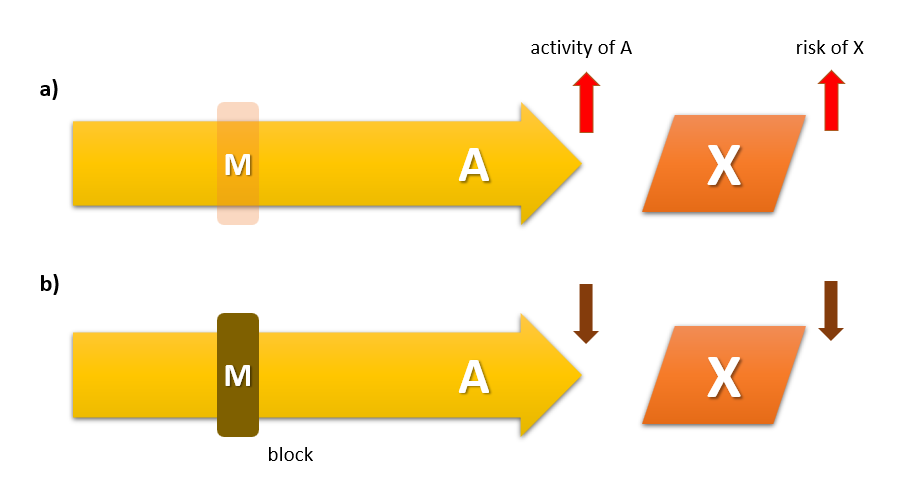

<a href="article-02-07.html"><i class="arrow far fa-arrow-alt-circle-left"></i></a>

<a href="article-02-09.html"><i class="arrow far fa-arrow-alt-circle-right"></i></a>

## 8-1. 도파민-세로토닌 가설의 등장

정신의학에서 <s>세로토닌</s>은 약방의 감초처럼 어느 질병에서나 조금씩은 관여하고 있는 모습을 보인다. 우울증과 불안 장애의 병인론에서는 중심적 역할을 맡고 있으며, 그 밖에 충동조절 장애, 자살 및 공격적 행동, 자폐증, 식이장애와 관련해서도 병태생리에 깊숙히 관여하고 있다.[@Lin2014-cd] <s>선택적 세로토닌 재흡수 억제제</s>의 예기치 못한 상업적 성공을 등에 업고 등장한 우울증의 "화학적 불균형 이론(chemical imbalance theory of depression"은 정신의학을 대중에게 친숙하게 다가갈 수 있도록 해주었지만, 그만큼 많은 오해와 부작용을 낳았다.[@Leo2008-zr] 세로토닌이 긍정적 기분과 현 상태에 대한 만족감을 가져온다는 몇몇 연구결과를 바탕으로, 대중 매체에서는 세로토닌이 마치 행복 호르몬인 것처럼 소개되었으며 이러한 인기는 현재까지도 이어지고 있다.[@Young2007-ua]

<aside>

**세로토닌(serotonin)**: 학술 문헌에서는 보통 5-hydroxytryptamine (5-HT)라고 불리운다. 대표적인 신경전달물질이지만, 체내에 존재하는 세로토닌의 90%는 소화기계에 존재하며 장의 연동운동을 조절한다. 또한 8%는 혈소판에서 혈액응고에 관여하며, 신경계에 존재하는 양은 전체의 1\~2%에 지나지 않는다.

**선택적 세로토닌 재흡수 억제제(Selective Serotonin Reuptake Inhibitor, SSRI)**: 시냅스 말단에서 일단 분비된 세로토닌은 세로토닌 운반체(SERT)나 단가아민 운반체에 의해 시냅스전 신경세포로 재흡수됨으로써 과도한 신호전달이 일어나지 않도록 조절된다. SSRI는 세로토닌 운반체에 결합하여 기능을 차단함으로써 시냅스 내 세로토닌의 유효농도를 올리며, 따라서 신호전달을 왕성하게 한다. 하지만 이는 단기적 효과일 뿐 장기적으로는 오히려 세로토닌 분비를 감소시키고, 시냅스 후 신경세포의 세로토닌 수용체 발현을 억제한다. SSRI는 자연에서 발견된 것이 아니라 연구자들이 의도적으로 설계한 항우울제이다. Arvid Carlsson이 최초의 SSRI인 zimelidine을 합성하는데 성공하였으며, 뒤이어 개발된 fluoxetine 부터 임상에 도입되었다. 도입 당시에는 기적의 약이라 불리울 정도로 환영받았으나, 역설적으로 우울증을 약만 먹으면 치료할 수 있다는 개념이 대중의 뇌리에 파고들면서 우울증의 유병률을 폭발적으로 증가시키는 역효과를 낳았다.

</aside>

조현병에서의 세로토닌의 역할 역시 이러한 추세를 좇아 한때 붐을 일으킨 적이 있다. 화학적 불균형 이론 만큼이나, 도파민-세로토닌의 균형 이론은 한 시대를 풍미하였고, 새로 개발되는 항정신병 약물이 추구해야할 궁극적 목표인 것처럼 여겨질 때가 있었다. 현재도 그 중요성이 완전히 부정된 것은 아니지만, 이제는 연구자들의 뇌리에서 많이 잊혀져서 과거와 같은 관심은 받지 못하고 있다. 이렇게 쉽사리 관심 밖으로 멀어지게 된 이유는, 도파민-세로토닌 가설이 항정신병 약물의 비정형성을 설명하는데는 분명히 성공적이었지만, 조현병의 병인론을 설명하거나 질병의 정체를 이해하는데 별다른 기여를 하지 못했기 때문일 것이다.

1960년대에 이미 <s>LSD</s>가 환각을 일으킨다는 것이 잘 알려져 있었다. 그러나 LSD에 의한 환각은 조현병과는 많이 달랐다. LSD 투여 환자는 생생한 환시를 경험했으나, 사고장애나 망상, 인지기능 저하는 드물었다. 대부분 환자는 환시를 현재와 혼동하는 대신, 신비 체험이나 자아의 확장으로 받아들였다. 또한 이미 조현병의 고위험군이 아닌 이상, 반복적으로 사용한다고 해도 조현병이 발생할 위험은 그리 높지 않았다.[@De_Gregorio2016-cd]

<aside>

**Lysergic acid diethylamide (LSD)**: 버섯에서 추출되는 lysergic acid를 출발점으로하여 1938년에 산도즈에 근무하던 Albert Hofman에 의해 합성되었다.생리적으로 중독되지는 않으나 생생한 환각을 만들어내기 때문에 1960년대 히피문화를 중심으로 의식을 확장시킨다는 명목하에 광범위하게 보급되었다. 역설적으로 1947년 산도즈 제약은 모든 정신질환의 탁월한 치료제로 LSD를 선전하였다.

</aside>

조현병에 있어서 세로토닌의 역할이 재조명된 것은 다름 아닌 클로자핀의 도입 이후였다. 당시 의사와 연구자들은 클로자핀이 추체외로 증후군을 일으키지 않고 항정신병 효과를 나타낸다는 것에 대해 어리둥절하였고, 이 현상의 원인을 찾는데 골몰하였다. 클로자핀의 효능을 재현하기 위해 연달아 개발된 리스페리돈, 올란자핀, 퀘티아핀, 지프라시돈 등 소위 비정형 약물은 모두 강력한 5-HT~2A~ 수용체 길항작용을 갖고 있었다. 마치 모든 항정신병 약물의 공통점이었던 D~2~ 수용체 길항작용이 도파민 가설의 출발점이 되었던 것처럼, 높은 5-HT~2A~/D~2~ 결합비는 소위 "비정형성"을 정의하는 출발점이 되었다.[@Meltzer1989-yh] 비정형성이란 상당히 모호한 개념이지만, 낮은 추체외로 증후군과 지연 운동 장애의 위험, 음성/인지 증상에 대한 의미있는 효과를 지칭한다. Meltzer는 강한 5-HT~2A~ 차단, 이보다 약한 D~2~ 차단, 부수적으로 5-HT~1A~에 대한 효현 효과라는 세가지 요소가 앞 문장에서 정의한 비정형성(atypicality)을 발휘하는 열쇠라고 믿었다.[@Meltzer2003-ia]

## 8-2. 세로토닌 시스템의 구조

세로토닌 분비 뉴런의 축삭돌기는 뇌 전역에 퍼져 있다. 크게 머리쪽(rostral)과 꼬리쪽(caudal) 경로로 나누며, 전자는 다시 배측솔기핵(dorsal raphe nucleus)과 정중솔기핵(median raphe nucleus)에서 시작되는 경로로 나뉜다. 배측솔기핵에 세포체를 둔 신경다발은 대뇌피질, 편도체, 흑질체, 교뇌, 해마 등 부위로 뻗어나가는 반면, 정중솔기핵에서 출발한 신경다발은 대뇌피질, 해마를 비롯하여 도파민 세포체가 모여있는 복측피개 영역(ventral tegmental area)에 연접을 이룬다. 따라서 조현병과의 관계에서는 정중솔기핵 경로가 좀더 비중이 높다. ([그림 1](#fig:serotonin-pathway))

{#fig:serotonin-pathway}

세로토닌 신호전달에서 가장 중요한 역할을 담당하는 5-HT~2A~는 시냅스 후 수용체로 주로 글루타메이트를 분비하는 피라미드 뉴런의 수상돌기에 위치한다. 5-HT~2A~가 자극되면 글루타메이트 신호전달이 시작되고, 이는 선조체의 GABA 분비 사이 뉴런을 활성화시킨다. 사이뉴런은 근방의 도파민 분비세포로 하여금 분비를 줄이도록 조절한다. NMDA 수용체를 통한 글루타메이트 신호전달이 도파민 활성을 조절하는 메카니즘은 전전두엽이 피질하 도파민 활성을 조절하는 주요 기전이다.([2장 7-6절 참조](article-02-07.html#subcortical-dopamine)) 이런 식으로 5-HT~2A~ 신호전달 은 도파민 활성을 조절할 수 있다. 따라서 5-HT~2A~ 길항효과를 지닌 비정형 항정신병 약물을 투여하면, 브레이크가 풀리면서 도파민 분비가 증가할 것이다. 이것이 추체외로 증후군 발생을 억제/예방하는 기전으로 여겨진다. 글루타메이트 신호전달을 거치지 않더라도, 세로토닌 분비 뉴런은 도파민 분비 신경세포의 세포체나 축삭돌기 말단에 직접 연접하거나 근방의 GABA 뉴런을 통해 도파민 분비를 억제할 수 있다. 항정신병 약물을 쓰면 이들 억제회로도 역시 차단되어 도파민 신호전달이 늘어난다.

5-HT~2A~에 비해 5-HT~1A~는 자가수용체 역할을 한다. 5-HT~1A~는 세로토닌 분비 뉴런에 위치하며, 자극되면 세로토닌 분비를 억제한다. 비정형 항정신병 약물은 대체로 5-HT~1A~ 효현효과를 갖기 때문에 결과적으로는 도파민 분비를 늘이는 쪽으로 기능한다.

## 8-3. 5-HT~2A~/D~2~ 차단비와 비정형성

만약 순수하게 5-HT~2A~ 수용체만을 차단한다면, 복측피개 영역에서 분비가 항진된 도파민은 중변연계든 중피질계든 관계없이 자극하여 오히려 정신병적 증상을 악화시킬 지 모른다. 바로 그렇기 때문에, 항정신병 약물의 비정형성은 5-HT~2A~ 차단이 아니라 5-HT~2A~/D~2~ 차단의 미묘한 균형에서 비롯된다고 할 수 있다. 5-HT~2A~와 D~2~가 동시에 차단된다는 것은, 시냅스 전 신경세포에서 분비되는 도파민의 양은 늘어나면서, 시냅스 후 신경세포에서의 도파민 효과는 막혀있는 상태를 불러온다.

![Figure 2. Therapeutic window\
from [@Arakawa2020-di]](images/02-08/img_0.png){#fig:therapeutic-window}

일반적으로 항정신병 효과를 나타내는데 필요한 D~2~ 차단 정도와 추체외로 증후군을 유발하는 D~2~ 차단 정도는 서로 차이가 나기 때문에, 일종의 치료적 창([2장 7-2절 참조](article-02-07.html#dopamine-discovery))을 만들어낼 수 있다. 항정신병 효과를 기대하기 위해선 적어도 D~2~ 수용체가 60%이상 차단되어야 하며, 차단율이 80%가 넘어가면 추체외로 증후군과 프로락틴 혈증의 위험이 급증한다. 따라서 이 두 차단율 사이에 해당되는 용량 범위가 치료적 창이 되는 셈이다.([그림 2](#fig:therapeutic-window)) 그런데 5-HT~2A~ 차단에 의해 선조체의 도파민 분비 양이 늘어나면 추체외로 증후군을 일으키는 D~2~ 수용체 차단 역치가 좀더 높아지며, 그에 따라 두 차단율 사이의 간격이 늘어난다. 이 말은 동시에 치료적 창의 범위도 넓어져, 상당히 고용량의 비정형 약물을 사용해도 추체외로 증후군의 위험이 적다는 뜻이 된다. 물론 비정형 약물이라 해도 지나치게 고용량을 쓰면 심한 추체외로 증상이 나타날 수 있으며, 이는 치료적 창을 넘어섰기 때문이라고 이해할 수 있다.

비정형 약물이라는 범주 안에는 상당히 이질적인 약물들이 포함되어 있으며, 5-HT~2A~/D~2~ 차단의 비율도 약물에 따라 상당히 다르다. 5-HT~2A~/D~2~ 차단의 황금비가 비정형성의 핵심이라고 주장한 Meltzer의 견해[@Meltzer1989-yh]를 따른다면, 이들 약물 중에서도 좀더 비정형적인 약물과 그렇지 않은 약물을 나눌 수 있을 것이다. 5-HT~2A~/D~2~ 차단비가 가장 높은 약물은 클로자핀이며, 그 뒤를 뒤따르는 올란자핀, 퀘티아핀, 아세나핀과 함께 하나의 그룹을 형성하고 있다. 반면 팔리페리돈, 지프라시돈, 일로페릴돈, 루라시돈 등은 5-HT~2A~와 D~2~의 차단 정도가 거의 비슷하여 또 다른 그룹을 이룬다. 리스페리돈은 두 그룹의 중간 쯤에 위치하고 있다. 반면 도파민 부분 효현제인 아리피프라졸, 브렉시피프라졸, 카리프라진은 오히려 5-HT~2A~/D~2~ 차단비가 1보다 작다. 이들 도파민 부분 효현제는 전혀 다른 방식에 의해 비정형성을 갖는다고 보아야 한다.

## 8-4. 조현병의 병태생리에서 세로토닌의 역할

이상에서 살펴본 도파민-세로토닌 가설은 정확히 말하면 "비정형성을 설명하기 위한 도파민-세로토닌 가설"에 지나지 않는다. 만약 병인론과 관련된 이론으로 승격하고자 한다면, 무엇보다 조현병 환자에게서 세로토닌 시스템의 이상이 발견되어야 하며, 세로토닌만을 조작함으로써 조현병과 유사한 상태를 유도할 수도, 차단할 수도 있어야 한다. 그러나 도파민 가설과는 달리 현재까지도 유력한 증거가 발견되지도, 설득력있는 통합 이론이 제시되지도 못하고 있다.

일단 LSD가 환각을 일으키는 기전부터 제대로 이해되지 않고 있다. LSD가 5-HT 수용체에 결합하는 것은 확실하지만 그것이 효현제인지 길항제인지도 불확실하다.[@Glennon1990-tc] 현재로서는 부분효현제로 보는 입장이 우세하며, 해부학적 위치와 기타 신경전달물질의 농도에 따라 효현 효과도 길항 효과도 발휘할 수 있다. LSD가 환각에 이르게 되는 과정에 대한 유력한 설명에 따르면, LSD는 청반(locus coeruleus)의 노르에피네프린 신경세포를 활성화하여 감각 신경을 예민하게 만들고, 대뇌 피질에서는 글루타메이트 신호전달을 필요 이상으로 강화시켜 신호대 잡음비를 높임으로써, 사고의 혼란과 비현실감을 유도한다.[@Aghajanian1999-mz]

과거에는 살아있는 조현병 환자의 뇌척수액에서 세로토닌 대사물질의 농도를 재거나, 사후 뇌조직에서 대사물질의 농도는 물론 수용체의 농도를 직접 측정하는 방식으로, 조현병과 관련된 세로토닌 시스템 이상을 발견하고자 노력하였다. 그러나 얻어진 결과들은 일관성이 없었고, 실험 조건이나 해부학적 부위에 따라 전혀 다른 결과가 얻어지곤 하였다. 몇 가지 흥미로운 결과를 언급한다면 다음과 같다. 뇌척수액의 5-HIAA (5-hydroxyindoleacetic acid, 5-HT의 대사물) 농도는 뇌피질의 위축과 상관관계가 있었으며, 동시에 낮은 5-HIAA 농도는 심한 음성증상 및 전전두엽 인지기능 손상과 연관이 있었다.[@Potkin1983-dx][@Abi-Dargham1997-lu] 사후 뇌조직 연구에서도 대체로 대뇌 피질이나 대상회에서는 세로토닌과 5-HIAA의 농도가 낮은 것으로, 측좌핵, 기저핵 등 피질하 조직에서는 높은 것으로 관찰되었다.[@Jospeh1979-uk][@Powchik1998-lo] 이 밖에도 대뇌 피질에서 5-HT 수송체는 대조군에 비해 낮은 것으로, 5-HT 수용체 역시 대조군에 비해 저하되어 있는 것으로 보여졌다.[@Laruelle1993-vx]

이러한 소견들은 조현병 환자에게서 5-HT와 관련된 신호전달이 원활하지 않다는 것을 시사한다. 그러나 이러한 연구들은 대부분 20-30년전에 이루어진 연구들로, 방법론이 현재처럼 정교화되지 않았을 뿐 아니라 만성화/황폐화된 환자들을 대상으로 하였기 때문에 의미있는 결론을 이끌어내기 어렵다. 다만 비교적 최근에 이루어진 메타 분석에 따르면, 사후 뇌의 전전두엽에서 5-HT~1A~ 수용체는 증가된 반면 5-HT~2A~ 수용체는 감소되어 있다고 한다.[@Selvaraj2014-qq] 그러나 PET를 이용하여 살아있는 환자에서 5-HT~2A~ 수용체를 측정한 연구에서는 대조군과의 차이를 발견할 수 없었다.[@Lewis1999-co][@Erritzoe2008-ox]

한편 유전 연구에서는 5-HT~2A~를 코딩하는 유전자인 HTR2A의 변이가 조현병의 위험을 높일 지 모른다 가능성이 제기되었으며 현재까지도 연구가 진행되고 있다. 주로 연구된 변이는 T102C(SNP rs6313)와 그 근방에 위치한 A-1438G (SNP rs6311)이다.[@Abdolmaleky2004-ww] 그러나 이들 변이는 조현병뿐 아니라 양극성 장애, 주요 우울증, 주의력 결핍장애 등 다양한 정신질환과 연관이 있다는 보고가 있어 조현병에 특히 하지도 않을 뿐더러, 최근 메타 연구에서는 어떤 질환과도 유의한 연관이 없다고 보고되었다.[@Serretti2007-hx][@Tan2014-rl]

## 8-5. 세로토닌과 항정신병 치료 효과

비정형 항정신병 약물의 약리학적 성질에서 5-HT~2A~가 차지하는 위치에 대해, 그저 부작용을 감소시켜주는 정도의 소극적인 역할만을 부여할 수도 있을 것이다. 그러나 이들 약물이 음성/인지 증상에도 어느 정도 효과적이라는 것 때문에, 많은 연구자들은 5-HT 시스템이 좀더 적극적인 역할을 하리라 기대하였다. 신약을 개발하는 연구자들은 다양한 5-HT 수용체의 길항 혹은 효현제를 이용하여, 기존 항정신병 약물의 한계를 극복하고자 하였다. 특히 이들이 기대한 것은 음성 증상에 대한 개선 효과였다.

리탄세린은 그 대표적인 약물로 5-HT~2A~와 5-HT~2C~에 대한 강력한 길항제이다. 일찌기 1990년대 초부터 시작되어 2000년대 후반에 이르기까지 기존 항정신병 약물에 리탄세린을 병용투여함으로써 음성 증상을 개선해보고 하는 많은 임상 시험이 있었지만, 결과는 가능성을 시사하는 정도에서 더 나아가지 못했다.[@Duinkerke1993-tv][@Akhondzadeh2008-hc] 이외에도 volinanserin(M100907), eplivanserin(SR46349B) 등이 2상 혹은 3상 임상시험까지 진행되었으나, 효과 부족으로 중도에 개발이 중단되었다.[@Meltzer2004-de][@Ebdrup2011-xm]

이후 한동안 항정신병 약물 개발에서 5-HT~2A~에 대한 관심이 줄어드는 듯 했으나, 5-HT~2A~에 대한 역효현제(inverse agonist) 개념이 등장하면서 새로운 전기를 맞이한다. 일반적인 약물은 수용체를 자극하거나 차단함으로써 그 효과를 발휘한다. 수용체 차단효과란 생리적으로 해당 수용체에 결합하는 내인성 리간드의 작용을 가로막는다는 뜻이다. 그러나 수용체의 작용기전에 대한 연구가 진일보하면서, 리간드가 결합되지 않아도 일정 수준의 활성을 보인다는 것을 알게 되었다. 따라서 고전적 차단약물로는 수용체를 완전히 차단한다고 해도, 리간드와 상관없이 발현되는 내인적 활성을 막을 수 없다. 역효현제란 약물이 수용체에 결합함으로써 내인적 효과마저 방해하는 약물을 말한다. 이런 개념을 적용해본 결과, 기존의 항정신병 약물도 5-HT~2A~에 대해 역효현 작용을 보이며, volinanserin, epivanserin 과 같은 실패한 약물도 역효현제라는 것을 알게 되었다.[@Sullivan2015-uc]

최근들어 5-HT~2A~ 역효현제들은 참신한 (novel) 항정신병 개발 노선에 있어 선두 위치를 차지하고 있다. 이중 pimavanserin은 도파민, 아세틸콜린, 아드레날린 수용체 차단효과가 전혀없는 거의 순수한 5-HT~2A~ 역효현제로 비정형 항정신병 약물의 하나로 분류된다. 이 약물은 파킨슨 병에 동반된 환각을 비롯한 정신병적 증상에 우수한 효과를 나타내며, 그 밖에 치매에 동반된 정신증상에도 효과적이라고 보고되었다.[@Friedman2013-pa] 이외에도 roluperidone와 lumateperone 등이 현재 임상 시험을 진행중이거나 이미 미국 식약청의 허가를 받았다.[@Jones2020-kk] Lumateperone은 5-HT~2A~에 대한 효과와 더불어 D~1~, D~2~ 수용체 차단효과를 지니고 있지만, pimavanserin과 roluperidone은 도파민 수용체에 작용하지 않는다. D~2~ 수용체를 차단하지 않고도 항정신병 효과를 낼 수 있다는 것은 세로토닌 가설을 진지하게 재고할 필요가 있음을 시사한다.[@Weiner2001-oz]

## 8-6. 조현병 치료에 있어서 세로토닌의 모순적 위치와 향후 연구 방향

정신약물학의 역사에 있어서 조현병의 도파민 가설 그리고 기분 장애의 "생체 아민 이론(biogenic amine theory)"만큼 큰 족적을 남긴 가설은 많지 않다. 1960년대를 거치면서 항정신병 약물은 도파민 수용체를 차단한다는 사실과 함께, 항우울제는 노르에피네프린과 세로토닌의 가용성에 영향을 미친다는 것을 알게 되었다. 생물학적 아민 이론의 기초를 쌓아올린 <s>Schildkraut</s>는 1965년과 67년에 연달아 생체 아민의 활성이 떨어지면 우울증이, 너무 높아지면 조증이 생긴다는 견해를 발표하였다.[**(Schildkraut 1965; Schildkraut and Kety 1967)**](https://paperpile.com/c/ndDlq0/twW7x+WEkdR)

<aside>

**Joseph J Schildkraut (1934\~2006)**: 미국의 정신과 의사. 기분 장애와 생체 아민의 관계를 연구했으며, 예술가들의 창조성과 기분 장애의 연관성에 대한 연구로 유명하다.

</aside>

약물의 작용기전과 기분 장애의 병인론을 연결시키기는 불가능하다는 Schildkraut의 조심스러운 견해와는 달리, 대부분의 정신질환은 신경전달물질의 불균형 때문에 일어난다는 단순명료한 이론은 의사와 연구자뿐만 아니라 제약 회사의 경영진 그리고 일반 대중의 마음을 사로잡았다. 현대의 정신과 의사들은 이제 더 이상 이러한 순진무구한 화학적 불균형 이론을 믿지 않는다고 하지만, 반세기를 이어져내려온 영향력은 쉽게 사그러지지 않았다. 여전히 정신의학 교과서에는 도파민 활성이 높으면 정신병적 증상이 생기며, 세로토닌이 부족하면 우울증에 쉽게 빠진다. 또한 노르에피네트린이 증가하면 조증이 유발되지만, 역설적으로 주의력 결핍 환자에게서는 집중력이 향상된다. 이런 식의 "A가 높으면 X가 생기고, B가 낮으면 Y가 생긴다"는 설명은, 여전히 수많은 정신의학 연구에서 숨겨진 전제로 자리잡고 있다. 치료제의 개발에 있어서도, "M을 차단하여 A를 낮추면 X가 치료된다"는 식의 논리가 널리 통용된다.

단순히 "A가 높으면 X가 생긴다"라는 식의 논리를 적용한다면, 조현병과 세로토닌의 관계에 있어서 금새 설명하기 어려운 벽에 부딪힌다. 세로토닌을 중심으로 한 과거의 연구는 조현병 환자 뇌에서 세로토닌 신호전달이 항진되어 있는 것처럼 묘사한다. 그렇기 때문에 세로토닌 효현제인 LSD를 투여하면 정신증상이 생기고, 5-HT~2A~를 차단하여 세로토닌 신호전달을 막으면 치료 효과를 볼 수 있다. 이에 반해 소박한 우울증의 세로토닌 가설에 의하면, 항우울제는 세로토닌 재흡수를 막아 시냅스내 세로토닌 농도를 올려주며 따라서 세로토닌 신호전달을 가속화시킨다. 세로토닌을 행복 호르몬에 비유하는 대중 매체의 선전에 따르면, 세로토닌은 많으면 많을수록 좋은 것이다. 그렇다면 우울증을 치료하기 위해선 세로토닌 활성을 높여야 하고, 조현병 치료를 위해서는 세로토닌 활성을 차단해야 한다는 모순적인 상황에 봉착한다. 이는 마치 양립할 수 없는 목표인 것처럼 보인다.

비정형 약물은 세로토닌 신호전달을 차단하며, 동시에 음성 증상에 효과를 나타내는 것처럼 보인다. 그러나 역으로 음성 증상을 개선하기 위해 항우울제를 사용하는 것은 예로부터 권장되어 왔으며, 효과 크기는 작지만 의미있는 성과를 거두고 있다.[@Singh2010-bt][@Helfer2016-mq] 그렇다면 음성 증상을 호전시키는데 필요한 것이 과연 세로토닌 차단인지, 아니면 자극인지 혼란스러워 진다. 더불어 조현병 환자가 심한 우울 증상을 동반하고 있을 때 대부분의 의사들은 주저없이 항우울제를 사용한다. 이 경우 세로토닌 활성을 높이는 약물과 낮추는 약물이 함께 투여되는 셈인데, 두 약물의 효과가 상쇄되거나 예기치 않은 부작용을 나타내지 않을지 우려하는 것은 매우 자연스럽다.[@Zullino1998-un]

이러한 모순을 이해하려면, " "A가 높으면 X가 생긴다" 혹은 "M을 차단하면 A가 낮추어진다"라는 식의 단순한 논리를 졸업해야만 한다. 예상과는 달리 SSRI를 장기간 투여하면 5-HT2A 수용체의 농도가 감소한다.[@Gray2001-eq] 더불어 5-HT~2A~ 수용체의 과발현(over-expression)이 우울증을 유발한다는 이론도 있다.[@Eison1996-ir] 항우울제를 투여하면 몇 시간 지나지 않아 세로토닌 농도가 급상승하는데, 실제 항우울 효과는 2주는 있어야 나타나는 현상에 대해 항우울제에 의해 5-HT~1A~, 5-HT~2A~ 수용체가 충분히 감소하는데 시간이 걸리기 때문이라는 주장도 제기되었다.[@Stahl1994-vg] 물론 5-HT~2A~ 수용체를 통한 신호전달이 직접 우울증을 일으키는지는 분명하지 않다. 항우울제에 의해 5-HT~2A~가 줄어드는 현상은 세로토닌 농도가 상승하는데 대한 단순한 피드백일 수 있다. 우울증 환자에서 5-HT~2A~가 늘어나 있는 것도 줄어든 세로토닌 신호전달에 의한 반작용일 수 있다.

대부분의 생체 과정은 어느 한 단백질의 기능을 차단하면, 보상성으로 해당 단백질이 과발현되어 양이 늘어나는 조절기전을 갖고 있다. 이는 내성(tolerance)이 발생하는 고전적 이유이다. 만약 5-HT~2A~를 차단하는 비정형 항정신병 약물을 오래 투여하면, 역시 내성이 생겨 수용체가 과발현되는 것도 예상할 수 있다. 5-HT~2A~가 직접 정신 증상과 연결되어있는 상태에서 5-HT~2A~의 농도가 증가한다면, 항정신병 약물의 효과 역시 내성이 생길 우려가 있다. 그러나 역설적으로 비정형 항정신병 약물을 오래 투여하면 오히려 5-HT~2A~가 점점 더 줄어드는 역내성(reverse-tolerance) 현상을 보인다.[@Van_Oekelen2003-nd] 따라서 비정형 항정신병 약물과 항우울제를 각각 세로토닌 차단제, 세로토닌 활성 강화제로 이해하는 것은 곤란하다. 5-HT~2A~ 신호전달의 차단효과에 있어서 두 계열의 약물이 동일한 효과를 나타내는 셈이다. 이러한 이론은 5-HT~2A~ 길항제가 SSRI의 항우울효과를 증강시킨다는 관찰에 의해 뒷빋침된다.[@Marek2003-mk] 5-HT~2A~의 역효현제인 volinanserin가 SSRI의 효과를 끌어올리는 것도 역시 같은 맥락에서 이해할 수 있다 [@Marek2005-jl]

그러나 세로토닌 시스템의 모순성이 위와 같은 설명으로 명쾌히 해결되지는 않는다. 만약 비정형 항정신병 약물의 비정형성이 세로토닌 활성 조절에 달려 있는 것이 아니라 5-HT~2A~ 차단에 달려 있다면, 5-HT~2A~를 통한 신호전달은 조현병 병태생리에 있어서 무조건 악영향만 끼치는 것으로 간주되기 쉽다. 그러나 5-HT~2A~는 신경섬유의 생성과 성장, 시냅스 형성에 중요한 역할을 맡고 있으며, 이 때문에 학습과 기억을 관장하는 신경가소성 메커니즘에 핵심 요소 중 하나이다.[@Lesch2012-fk] 21세기에 접어들면서 정신의학 연구자들은 신경전달물질 활성의 높고 낮음으로 인해 질병이 촉발된다는 단순한 도식에서 벗어나고자 애쓰고 있다. 그 대안으로 등장한 것은, 뉴런과 뉴런 사이의 원활하고 효율적인 연결의 생성 및 파괴, 그리고 이를 통해 상황에 역동적으로 적응하는 신경연결망(neural network)의 구조와 기능이라는 이해의 틀이다. 신경발달학적 가설이란 이런 신경연결망을 만들어가는 과정이요, 신경가소성이란 완성된 연결망을 유지, 보수하는 과정이다. 따라서 새롭게 인기를 끌고 있는 이론들은 학습/기억, 신경가소성, 신경영양인자 등에 강조점을 두고 있다. 따라서 세로토닌 가설, 특히 5-HT~2A~ 수용체의 작용은 이런 측면에서 재해석될 필요가 있다. 조현병의 발병을 막는 것과는 별개로, 이미 이환된 조현병 환자의 퇴행을 막고 회복을 앞당길 수 있는 방법을 찾는 것 역시 빠질 수 없는 연구 과제이다. 이런 차원에서 LSD와 <s>psilocybin</s> 등 5-HT~2A~ 효현제들이 새삼스럽게 각광받고 있다.[@Carhart-Harris2017-cu] 이들 약물을 소량 투여하면, 신경가소성이 활발해지며 뇌 각부위의 연결이 공고해진다.[@Ly2018-md] 용량에 따라 다르지만, 인지기능이 개선된다는 연구결과도 적지 않은 편이다. 이를 응용하여 이들을 항치매제로 개발하려는 동향도 엿보인다.[@Vann_Jones2020-fn]

<aside>

**Psilocybin**: 주로 버섯에서 추출되는 환각제. 체내에 들어가면 psilocin으로 바뀌며, LSD, 메스칼린 등과 유사한 효과를 낸다. 역사 이전부터 종교적 제례나 예술활동에 사용되어 왔던 것으로 여겨지며, 현재도 중남미에서 무속인을 중심으로 널리 사용된다. LSD를 합성한 Albert Hoffmann에 의해 활성 성분이 분리되었다. 산도즈 제약은 LSD와 함께 정신질환 치료제로 판매했으며, 이를 사이키델릭 정신치료라고 불렀다. 최근에 새롭게 우울증, 불안장애 등의 치료제로 각광받고 있다.

</aside>
