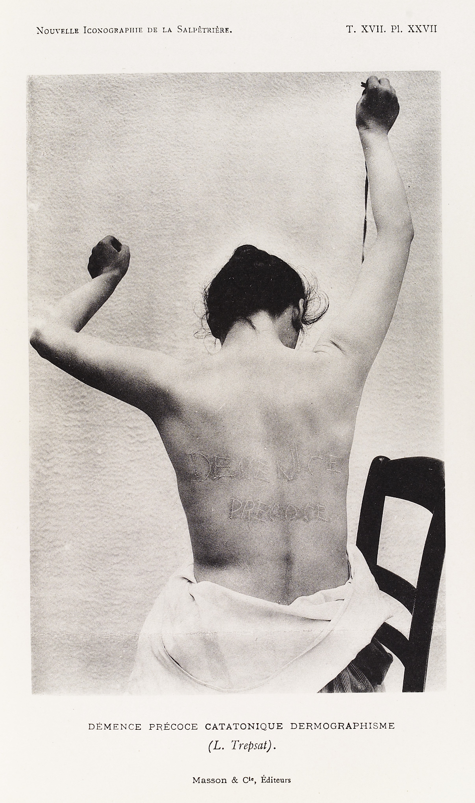

# 1장 조현병의 이해와 진단

## 1. 조현병 개념의 역사

### 1-1. 고대

조현병 개념의 생성과 변천을 살펴보기 전에 앞서, 광증(insanity, madness)이라는 개념을 먼저 살펴보아야 한다. 정신의학의 정통성에 의문을 제기하고, <s>반정신의학</s>의 기치를 내거는 소수 학자들은 조현병이 18,19세기 유럽 정신과 의사들이 만들어 낸 임의적 개념일 뿐이라고 주장한다.[@Desai2005-aq] 또 다른 일부 학자들은 조현병이 서구 문명이 고도로 산업화되면서 발생하게 된, 일종의 문명병이라는 주장을 펴기도 한다.[@Torrey1980-ca] 설령 조현병에 대한 이들의 주장에 어느 정도 일리가 있다 할지라도, 역사가 기록되기 시작한 이래, 어느 시대, 어느 문명에서도 광증에 대한 기록이 넘쳐난다는 것을 부인할 수 없다. 고대 이집트, 바빌로니아, 고대 중국 문명에서도 어렵지 않게 발견할 수 있으며, 구약성서에는 다윗을 의심하는 사울의 이야기가, 고대 그리이스 로마 신화에는 신들의 계략에 빠져 이성을 잃게 되는 인간들의 이야기가 적혀있다.[@Harris2013-lp][@Torous2014-zw] 중세에는 마귀에 씌웠다는 명목으로 죽어간 무고한 희생자들의 기록이 광증 때문에 저주받아야만 했던 비참한 운명을 증거하고 있으며, 근세의 문학작품에도 수많은 망상과 환각의 기록들이 인류를 끊임없이 쫒아다니는 악령처럼 묘사되어 있다.

<aside>

**반정신의학(anti-psychiatry)**: 광기를 질병으로 간주하는 기존 정신의학을 비판하는 이론. 반정신의학이라는 용어를 창시한 David Cooper에 따르면 정신병이란 구체적 실체가 있는 존재가 아니며, 사회의 가치 기준이나 행동 규범에 어긋나는 사람을 정상인들과 분리, 격리하기 위해 인위적으로 만들어진 개념이다. 대표적인 학자로는 David Cooper외에 Ronald Laing, Thomas Szasz가 있다.[@frances2019]

</aside>

조상들이 광증을 어떻게 이해하려 애를 썼는지 알려면 상상력을 동원하는 수밖에 없다. 아마 그들도, 정상과 상식이라 규정되는 범위를 넘어서는, 기이한 말과 행동을 하는 사람들을 눈여겨 보지 않을 수 없었을 것이다. 불과 얼마 전까지만 해도 영민하고 용맹했던 사람이 갑자기 혼이 나간 것처럼 이상한 행동을 하거나, 아무런 대상도 없이 겁에 질려 전율하는 모습을 보면 분명 당황스러웠을 것이다. 고대인에게 모든 질병은 원인을 헤아릴 수 없는 신비로움의 현현이자 신의 변덕이었다. 하물며 실체가 보이지 않는 광증은, 경외감과 더불어 깊은 혐오감과 공포를 불러일으켰을 것이다.

역사 이전의 고대인들은 별의 움직임이나 기후의 변화뿐 아니라, 사람의 마음 속에 피어나고 소멸되는 갖가지 생각과 감정 역시 초자연적인 힘의 영향을 받는다고 믿었다. 자연히 광증은 초자연적 기운에 접했거나, 금기를 깨서 생기는 저주, 신이 내리는 징벌이라 여겨졌다. 이러한 고태적 생각으로부터, 광증이 뇌에 병이 들었기 때문에 생기며, 광증에도 종류가 있어서 각기 치료법이 다를 것이라는 생각으로 발전한 것은, 아무리 생각해도 너무나도 혁신적이고 과감하여, 도무지 어떤 계기로 얻어진 통찰인지 신비롭기만 하다.

### 1-2. 그리스, 로마 시대 그리고 중세

광증을 초자연적 혹은 종교적 현상으로 해석하는 지배 이데올로기에 의문을 제기하고, 광증도 질병의 하나일 뿐이라는, 당시로서는 과감하다못해 위험해 보이는 주장을 내세운 것은 기원전 5-6세기 그리스에서 활동하였던 <s>자연철학자</s>이었다. 이들은 합리적 사고와 객관적 관찰을 통해 자연의 숨은 규칙성을 발견하고자 하였다. 동시에 인간의 지성이 뇌에서 비롯된다고 주장하였으며, 비정상적 정념이나 행동은 마치 조율되지 않은 악기에서 불협화음이 생성되듯이, 불균형 상태에 있는 체액 때문에 생기는 것이라 제안하였다.

<aside>

**자연철학자 (natural philosophers)**: 소크라테스 이전 고대 그리스에서 활약하던 철학자들을 가리킨다. 이들은 수학적, 과학적 그리고 철학적 연구의 기초가 되는 문제들과 역설들을 정의하는 데 집중했으며, 전통적으로 행해지던 신화적 해석들을 거부하는 대신 좀 더 이성적인 해석을 추구하였다. 대표적인 학파로는 밀레토스 학파, 피타고라스 학파, 엘레아 학파가 있다.)

</aside>

자연철학의 발전은 바야흐로 의학의 혁신이라는 열매를 거둔다. 기원전 4세기에 활약하였던 <s>히포크라테스</s>는 이론적 논쟁보다는 임상 관찰과 실제 치료 경험을 중요시하였다. 그는 <s>피타고라스</s>의 영향을 받아 지성과 감성이 뇌에서 비롯된다면, 광증이란 뇌기능의 이상에 다름아닐 것이라고 추론하였다. 당시의 치료는 체액의 균형을 바로잡는 데 초점이 맞추어져 있었기 때문에, 각각의 정신증상은 <s>체액</s>의 상대적 불균형에 따라 분류되었다. 동시에 광증의 치료를 위해서 운동요법, 식습관 교정, 휴식, 목욕, 사혈 등을 통해 체액의 균형을 회복하는 방법들이 동원되었다.

<aside>

**히포크라테스 (Hippocrates, 460\~370 BC)**: 고대 그리스의 의사로 의학의 아버지라 불리우기도 한다. 그와 그를 추종하는 히포크라테스 학파는 마술과 철학에서 의학을 분리해내는데 혁혁한 공을 세웠다.

**피타고라스 (Pythagoras of Samos, 570\~495 BC)**: 고대 그리스의 철학자로 피타고라스 학파라는 종교 단체의 교주이다. 숫자와 관련된 신비주의를 설파했으며, 피타고라스의 정리로 유명하다.

**4체액 설**: 히포크라테스는 인간이 정액이나 자궁의 체액에서 탄생하고 자라나는점을 근거로 이를 중요시했으며 따라서 액체가 생명의 근원일 것으로 여겼다. 그는 혈액(blood), 담즙(bile), 점액(phlegm) 그리고 흑담즙(black bile)의 4가지 체액으로 인간의 병리를 설명하려하였다.

</aside>

중세 이전 의학의 정점에 오른 인물은 로마에서 활약하였던 <s>갈레노스</s>였다. 그 역시 광증은 뇌와 신경 계통의 이상 때문이라 여겼다. 그는 뇌 기능이 <s>동물 영혼</s>을 낳고, 동물 영혼은 신경계를 타고 흘러다니며, 이것이 말단 근육 운동을 일으킨다고 보았다. 여기서 만약 동물 영혼이라는 개념을 "전기화학적 신호"로 바꾼다면 지극히 현대적인 생각이 아닐 수 없다. 그는 만약 뇌가 독물, 체액, 열, 감정적 요인 등에 의해 영향을 받으면, 동물 영혼의 잘못된 움직임을 낳고 광증은 그 외적 표현이라고 생각하였다. 그 또한 철저한 실용주의자로서, 결론이 안 나는 병인론에 대한 철학적 분석보다는 있는 그대로의 현상을 관찰하는 것이 중요하다고 생각하였다. 증후군(syndrome), 질병특이적 증상(pathognomic symptom) 등의 개념은 그에게서 비롯되었다.

<aside>

**갈레노스 (Claudius Galenus, 129\~199 AD)**: 로마 제국 당시의 고대 그리스의 의학자이자 철학자. 히포크라테스 이래 최고의 의사로 꼽힌다. 생체 해부를 실시하였고, 특히 신경계에 관해서 많은 연구를 하였다.

**동물 영혼(spiritus animalis)**: 갈레노스에 의해 창시된 이론. 동물영혼은 마치 4체액과 비슷하게 비어있는 신경을 흘러다니면 신체 기능을 조정한다고 믿어졌다. 이후 1500년 이상 신경기능을 설명하는 주요 이론으로 자리잡았다.

</aside>

이렇듯 그리스-로마 시대만 해도 벌써, 광증은 뇌의 이상때문이며, 질병 분류를 통해 각각의 질병에 효과적인 치료법을 찾을 수 있다는 현대적 개념이 정립되어 있었다. 그러나 기독교의 도입 이후 중세를 거치면서, 과거의 과학적 유산은 모두 파괴되었고, 광증은 악마의 소행이거나 신의 징벌이라는 개념으로 후퇴하였다. 동일한 광증이라도 기독교의 종교 논리에 어긋나면 이단으로 처단되었고, 교리에 부합하면 성인으로 추앙 받는 기묘한 시대가 바로 중세 유럽이었다.

그 중에서도 가장 참혹했던 사건은 14세기부터 18세기 까지 전 유럽을 혼란 속에 몰아넣었던 마녀 사냥이었다. 마녀 사냥은 백년 전쟁이 끝나고 정치적, 경제적 혼란과 개혁에 대한 염원이 높아지던 시기에 시작되었다. 오랜 전쟁 속에서 교회의 권위가 무너지기 시작했고, 화폐의 등장으로 말미암아 자본을 축적하게 되는 대상인들이 등장하면서 교회는 예수와 대립된 존재로서 악마와 마녀를 만들어냈다. 유럽 전역에서 50만명이 넘는 사람이 마녀 혹은 마법사라는 죄목으로 처형되었는데, 특이하게도 "마녀"라는 명칭에서 알 수 있듯이 그중 다수가 여성이었다.

1487년 하인리히 크레이머와 자콥 스프렝거라는 두 명의 도미니코 수도회 성직자는 "마녀의 망치(Malleus Maleficarum)"이라는 마녀사냥 지침서를 출간한다. 이 책은 마녀를 쉽게 구분하고 판결을 내릴 수 있는 기준을 나열한 책이다. 문제는 이 책의 저자들이, 악마의 술책은 인간 심리의 약점을 교묘하게 파고드는 것이라 믿었다는 점이다. 사회에서 소외되어 있는 사람들(특히 가난한 여성)의 말이나 행동, 혹은 신체적 증상이 당시의 의학적 지식으로 설명되지 않을 때, 종교재판관은 악마가 피해자의 영혼을 사로잡았기 때문이라고 설명하였다. 악마에게 영혼을 빼앗긴 것은 애초에 신앙심이 굳건하지 못했기 때문이요, 그 자체가 죄와 타락의 증거가 되었다. 이런 해석하에 광증을 비롯하여, 우울증, 히스테리아 등을 보이는 많은 환자들이, 편견에 치우친 증거와 고문으로 얻어진 자백하에 처형되었다.

)

[{width="50%"}](https://en.wikipedia.org/wiki/Malleus_Maleficarum#/media/File:J._Sprenger_and_H._Institutoris,_Malleus_maleficarum._Wellcome_L0000980.jpg)

<figcaption>

Malleus Malleficarum (retrieved from Wikipedia)

</figcaption>

<aside>

물론 수많은 정신질환자들이 마녀 사냥으로 인해 처형되었다는 분명한 증거는 존재하지 않는다. 당연하겠지만 정신질환자라고 진단을 한 적이 없기 때문이다. 이후 역사가들이 이렇게 생각하는 이유는, 다양한 마녀 판례집에 기술된 묘사가 다양한 정신병리와 놀랄만큼 유사하기 때문이다. 정신질환자들이 광신적 종교관과 교회의 권력욕에 의해 희생양이 되었다는 식의 관점은 정신분석가이자 의사학자인 Gregory Zilboorg로부터 비롯되었다. 그는 광증과 마법, 이단이 하나의 개념으로 융합되고, 그것이 정신질환이라는 의학적 상태때문일 지 모른다는 합리적 의심이 완전히 배제되는 바람에 이 모든 비극이 초래되었다고 주장한다.[@Zilboorg1941-nx]

</aside>

이러한 비극은 그저 역사의 한 페이지로 넘겨버릴 수도 있었을 것이다. 그런데, 반정신의학을 주장하는 학자들은 이러한 비극이 현재도 끊임없이 재생 반복되고 있다고 주장한다. 사회복지학자인 Kutchins와 Kirk는 "Making Us Crazy: DSM, the Psychiatric Bible and the Creation of Mental Disorders"라는 책[@Kutchins1997-ju]**​**에서 정상과 비정상의 경계를 규정하는 DSM이 어떻게 사람들간의 차이와 일상적 고통을 정치적, 경제적 목적을 위해 질병화하고 있는지를 비판한다. 혹자는 DSM이 현대의 "마녀의 망치"에 지나지 않는다는 가혹한 비판을 내리기도 한다.[@Melanson2014-pu]

### 1-3. 근대

18세기 <s>계몽주의</s>의 태동을 기점으로 해서, 종교에 의해 이성(reason)이 폄하되는 시대는 막을 내리기 시작하였다. 이성이 인간존재의 정수라고 여겨지는 것만큼, 광증은 "이성을 잃는 것"으로 이해되었다. 초기에는 광증을 굳이 분류할 필요성도 개념적 틀도 존재하지 않았다. 이러한 상황은 <s>린네</s>가 식물의 체계적 분류를 시도하면서 바뀌게 되었다. 자연을 이해하고 정복하는 길은 나누고 분류하는 것부터 시작되어야 한다는 암묵적 합의가 이루어졌고, 질병 역시 예외가 아니었다. 이에 린네의 계통학적 분류에 기반을 둔 <s>질병분류학</s>이 탄생되었다.

<aside>

**계몽주의 (Age of Enlightenment)**: 18세기 유럽은 과학문명이 급속도로 발전하던 때였다. 뉴턴 역학의 성공에 도취된 철학자들은 우주가 이성적이고 필연적인 법칙에 의해 지배되며, 인간의 능력으로 이를 파악할 수 있다는 믿음을 갖게 되었다. 그 전까지 종교적 세계관은 진리란 하나님으로부터 인간에게 은총을 통해 부여되는 것이었다. 그러나 계몽주의 철학자들은 모든 인간은 자연법칙을 이해할만한 이성을 갖고 태어나며, 외적 권위와 지식을 무비판적으로 수용하는 것이 아니라, 이성을 도구로 하여 우주와 인간 사회를 지배하는 이성적이고 필연적인 법칙을 스스로 파악해 나가야 한다고 주장하였다. 개인이 이러한 책임을 수행하면 인간 사회 역시 끊임없이 개혁되어 진보할 것이라는 낙관주의가 팽배하였다. 따라서 개인의 이성은 기본 권리인 동시에 의무이기도 하다.

**린네 (Carl Linnaeus, 1707\~1778)**: 스웨덴의 식물/동물학자. 현대적 생물분류학을 제창하였다.

**질병분류학(nosology)**: 질병을 구분하고, 그 계층적 관계를 규명하는 학문. 보다 광범위한 분류학(taxonomy)의 한 부분이다. 린네의 생물분류체계를 본따, 종의 개념에 상응하는 질병분류학적 단위를 가정하고, 그 상위 범주와 하위 범주를 모색함으로써 전체 계층 질서 내에서 개개 단위의 위치를 규정한다.

</aside>

린네 분류법의 기초는 분류의 근거가 될 특징들을 선정하는 것이다. 린네 이전까지는 외적 특성뿐 아니라, 용도, 타 개체와의 유사성 등 자의적 기준에 따라 그때그때 분류가 이루어졌다. 이에 반해 린네는 최대한 객관적이고 관찰 및 확인이 가능한 특징들을 분류의 기준으로 선정하였다. 마찬가지로 질병 분류학에서도 객관적 기준들이 필요했고, 증상 및 징후, 추정되는 원인, 손상부위 등이 후보로 모색되었다. 이러한 지표들에 대한 지속적 관찰로 데이터가 축적되면서, 점차 정신과 의사들은 특정한 증상, 징후가 서로 연관되어 나타나는 패턴을 인식하기 시작하였다.

린네가 도입한 또 다른 혁신적인 개념은 "종(species)" 개념이다. 린네에 따르면 "종"은 태초에 창조된 단위이고 불변하는 것으로서, 임의적인 분류 단위가 아니라 실제로 존재하는 것이다. 마찬가지로 개개질환은 더 이상 나눌 수 없는 실재하는 단위, 즉 <s>자연적 종</s>으로 여겨졌다.

<aside>

**자연적 종(natural kind)**: 과학은 이해의 대상을 명백히 하기 위해, 자연 현상을 끊임없이 분류해왔다. 이러한 분류는 인간의 필요에 의해서, 현행 이론에 부합시키기 위해서, 지각하거나 측정하는 도구의 한계때문에 임의적으로 행해지는 경우가 많다. 그러나 이와 달리, 자연현상을 지배하는 규칙에 부합하는 분류가 있을 수 있고, 이러한 분류를 통해 나뉘어진 단위를 자연적 종이라 한다. 예를 들어 화학적 원소는 서로 다른 원자량으로 분명히 구분된다. 생물의 종은 유전자의 유사성, 혹은 교배했을 때 생식가능한 자손을 얻을 수 있느냐로 분명히 정의된다. 이들은 자연적 종의 대표적인 예이다.

</aside>

질병의 분류에 린네적 접근을 최초로 적용한 사람은 <s>de Sauvages</s>이다. 그는 당시까지 알려진 모든 질환들을 10개의 과(classes), 295개의 속(genera), 그리고 24,000개가 넘는 질병단위로 구분하였다. 정신질환에 있어서 19세기 초까지 가장 영향력있고 인기있던 분류체계는 <s>Cullen</s>이 제시한 분류였다. 정신질환은 신경병리의 반영이라 생각했던 그는 "신경계의 질환"이라는 뜻으로 "신경증(neurosis)"이라는 단어를 만들어냈다. 그는 신경증을 네 개의 속(genera)으로 분류하였는데, 그 중 판단력의 장애를 의미하는 vesania가 광증에 해당되었다. 이후 <s>피넬</s>, <s>에스퀴롤</s> 등 초기 정신의학자들이 Cullen의 분류체계를 보완하거나 수정함으로써 질병분류체계를 정교화하였다. 그러나 분류의 잣대도 변변히 마련되지 못하였고, 이론적 편견과 근거없는 유추에 의해 얻어진 병인을 분류의 기준으로 삼는 바람에 19세기의 질병분류학은 혼란 그 자체였다.

<aside>

**Francois Boissier de Sauvages (1706-1767)**: 프랑스의 의사이자 식물학자. 린네의 친구로 질병분류를 최초로 시도하였다.

**William Cullen (1710-1790):** 스코틀랜드의 의사이자 화학자. 에딘버러 의과대학의 교수로 의학 교육의 초석을 세웠으며, David Hume과 Adam Smith의 친구로서 스코틀랜드 계몽주의의 중심인물이었다.

**피넬 (Philippe Pinel, 1745\~1826)**: 프랑스의 정신과 의사로 비세트르와 살페트리에 병원의 수석 의사로 일했다. 정신질환 환자들을 족쇄에서 풀어주는 등, 당시에 만연헀던 비인도적 치료, 관리 행태를 타파하고 도덕 치료(moral treatment)를 시도하였다. 이밖에도 사혈, 관장 등 비효과적인 치료를 줄이고, 환자를 자세히 관찰하고 긴밀한 대화를 나누는 방법을 사용하였다. 이는 심리치료라기보다는, 환자 개개인의 독특한 병리현상을 최대한 수집하여, 정신질환에 대한 이해를 강구하려는 노력이었다.

**에스퀴롤 (Jean-Étienne Dominique Esquirol, 1772\~1840)**: 프랑스의 정신과 의사. 피넬의 제자로 그를 이어 살페트리에 병원의 수석 의사를 역임하였다. 정신과 환자들의 처우개선과 인도적 치료를 위해 애썼으며, 정신병원이 단순한 수용소가 아니라 치료를 행하는 장소가 되어야 함을 역설하였다

</aside>

19세기 중반까지만 광증은 단일한 질환으로 여겨졌으며, 이러한 개념을 <s>단일정신병</s>이라고 하였다. 이 이론에 따르면 인간의 육체와 영혼은 단일한 복합체를 이루며, 어떤 정신질환이라도 육체-영혼 복합체의 이상이라는 점에서 서로 다르지 않다고 여겨졌다. 그러나 복합체의 이상은 그것이 거치는 단계에 따라 다양한 양상을 보이게 되는데, 이렇게 서로 다른 양상들이 각기 다른 명칭으로 불리면서 질병분류는 혼란에서 벗어나지 못하였다. 정신증(psychosis)이라는 명칭은 1840년대 초 각각 독일과 오스트리아에서 활동하던 Canstatt와 Feuchtersleben에 의해 명명되었다.[@Beer1996-qw] 이 명칭은 본래 뚜렷한 뇌병변으로부터 비롯된, 즉 기질적 원인에 의한 정신병리를 지칭하기 위해 만들어졌으나, 개념의 경계가 모호하여 히스테리, 멜랑콜리아, 조증, 편집증 등 광범위한 상태를 포괄적으로 의미하곤 하였다.[@Burgy2008-pb; @Torous2014-zw] 당시만 해도 신경증과 정신증의 구분도 명확하지 않았고, 뇌의 병과 마음의 병이라는 구분 역시 혼란스러웠다.

<aside>

**단일정신병** (unitary psychosis, 독어로는 *Einheitspsychose*): 크레펠린 이전까지 독일 정신의학에서 통용되던 이론으로, 모든 종류의 정신증은 단일 질환의 서로 다른 변형일 뿐으로, 개인의 특성이나 질병 단계에 따라 표면적으로만 달리 나타나는 것이라 생각한다. 또한 신체, 마음, 영혼을 구분하는 데카르트 주의에 반대하였기 때문에, 정신질환을 정신의 병과 육신의 병으로 나누는 것도 반대하였다. 단일정신병 개념은 크레펠린 이후 자취를 감추는 것처럼 보였으나, 1980년대 후반 이후 Crow, Craddock, Owen 등에 의해 다시 부활하고 있다. Tim Crow는 조현병과 양극성 장애의 증상이 분명히 구분되지 않으며, 취약 유전자가 상당 부분 서로 겹치고, 가계 내에서 함께 유전되며, 조현정동 장애 역시 두 질환과 증상, 유전자 측면에서 잘 구분되지 않는다는 것을 근거로 특히 조현병과 양극성 장애를 "연속성 정신병(psychosis continuum)"으로 이해할 것을 주장하였다.[@Crow1986-qt]

</aside>

[{width="50%"}](https://upload.wikimedia.org/wikipedia/commons/9/9c/Writing_on_the_back_of_a_female_patient_Wellcome_L0040284.jpg)

<figcaption>

A Dementia Praecox patient with Catatonia

</figcaption>

### 1-4. 크레펠린 이전의 조현병

현재의 조현병은 그 기원을 크레펠린의 질병 분류에 두고 있다. 그는 다양한 정신증의 형태 중에서 어떤 특정한 패턴에 주목하였고, 이를 <s>조발성 치매</s>라 칭하였다. 왜 갑자기 역사에서 조현병이 등장한 것일까? 광증은 예나 지금이나 있어왔지만, 조현병이라는 특별한 형태의 광증은 19세기에 새롭게 등장한 질병인 것일까? 아니면, 크레펠린이 이를 규범화하기 전까지는 누구의 눈에도 보이지 않았던 것일까?

<aside>

**조발성 치매** (dementia praecox): 이 용어를 처음 사용한 것은 1852년 프랑스의 의사인 Bénédict Augustin Morel에 의해서였다. 당시 치매(dementia)라는 용어는 이미 인지기능의 비가역적 감퇴라는 의미로 사용되고 있었는데, Morel이 어떤 기준으로 사용했는지는 분명하지 않다. 현대의 정신증 환자에게 이 용어를 사용한 것은 헝가리의 정신과 의사인 Arnold Pick이었다. 크레펠린은 당시까지 너무나 세분화되어있던 정신증의 분류체계를 조울정신병(manic-depressive insanity)과 조발성 치매(dementia praecox)로 단순화하기 위해 이 명칭을 빌려왔고, 그 덕에 마치 이 이름을 처음 사용한 사람처럼 알려져 있다.

</aside>

정통 정신의학은 후자의 견해를 받아들인다. 조현병은 예로부터 "실제로" 존재하고 있었지만, 객관적, 실용적 관찰이 정교해 지면서 그 실체가 드러나게 된 것으로 여겨진다. 그러나 한편으로는 크레펠린이 조현병을 구분한 것은 오로지 편의상 현상을 기술한 것에 지나지 않으며, 당시의 문화적, 사상적 배경에 의해 취사 선택된 것일 뿐이라는 주장도 만만치 않다. 그럼에도 분명한 것은 19세기 초에 이르러서야, 지금 우리가 조현병으로 진단할 수 있는 임상증례에 대한 기록이 처음 나타났고, 19세기를 통과하면서 그 양이 폭발적으로 증가하였다는 것이다. 혈기왕성한 젊은이가 아무런 이유도 없이 끝도 없는 악화를 거쳐 인간성을 상실하는 지경에 이르게 된다는 극적인 반전과 비극성은 많은 정신과 의사들의 마음을 사로잡았다. 현재의 진단기준으로 조현병으로 진단되는 최초의 임상기록은 19세기 초 프랑스와 영국에서 거의 동시에 보고되었다. 프랑스 살페트리에 병원의 피넬과 영국 베들렘 병원의 <s>하슬람</s>은 서로 안면도 없는 사이였지만, 1809년 두 사람은 각각 전형적인 조현병 환자 증례를 발표한다. 그들이 발표한 사례는 "피넬-하슬람 증후군"이라 불리기도 하는데, 점진적인 발병, 두드러진 음성증상, 무정동, 사람에 대한 관심의 소실 그리고 점차적인 인지기능 저하를 특징으로 하고 있으며, 모두 청소년기에서 청년기로 넘어가는 나이에 발병하기 시작한 경우였다.

<aside>

**John Haslam** (1764--1844): 영국의 약사이자 의사. 원래 베들렘 병원의 약사로 경력을 쌓았으며, 쉰살이 넘어서야의사 자격증을 취득하였다. 편집성 조현병 환자에 대한 최초의 임상 기록을 남겼다.)

</aside>

피넬-하슬람 증후군의 핵심은 젊은 나이에 발병해서 빠른 기간 내에 현저한 기능상실을 가져온다는 데 있었다. 물론 Cullen의 분류를 비롯한 당시의 진단분류적 접근은 철저히 횡단적인 증상과 징후의 특색에 기반을 두고 있었지만, 피넬과 하슬람의 천재성은 질병의 경과와 최종결과라는 종적인 변화양상을 특색으로 끄집어 낼 수 있었다는데 있다. 한번 학자들의 주목을 받기 시작하자, 유사한 증례에 대한 보고는 급증하게 되었다. 더군다나 광증에 대한 정신과 의사들의 견해를 결정지은 데는, 수용소(asylum)라는 독특한 제도의 영향 역시 간과할 수 없다. 신으로부터 버림받은 광증 환자들을 돌보아주던 수도원이, 공식적으로 런던 시에 의해 <s>왕립 베들렘 병원</s>으로 거듭난 것은 1547년의 일이었지만, 17세기 이후에는 유럽 각국의 지방 중소도시에 다양한 규모의 정신질환자 수용소(asylum)를 쉽게 찾아볼 수 있게 되었다. <s>미셀 푸코</s>가 지적했듯이, 이성의 힘이 강조되던 계몽주의 이데올로기 하에서, 이성이 소실된 결과를 극명하게 드러내 주는 광인들은 정상인으로부터 격리되어, 관찰의 대상이 되어야만 하였다. 한번 수용소에 입원된 환자들은 퇴원하는 일이 거의 없었다. 이 때문에 출범 초기에는 비교적 안락하고 쾌적한 요양시설로 시작했던 시설들마저, 점차 회복에 대한 희망도 없이 사회로부터 격리된 환자들을 과밀하게 수용하는 비참한 장소로 변모해갔다. 조현병이 19세기에 생겨난 문명병이라고 주장하는 학자들은 수용소가 이렇게 단시간에 과밀화된 현상을 그 증거로 지목한다. 18세기만 해도 수용시설을 채우는 환자들은 주로 알코올 중독과 매독 환자들이었기 때문이다. 그러나 19세기 후반 수용시설을 꽉 채운 환자들은 금단 섬망에 시달리는 알코올중독자와는 달리, 전혀 회복의 가능성을 보이지 않았다. 1878년 23살의 앳된 나이에 뮌헨 시립 수용소에 발령받은 크레펠린 역시 병동을 꽉 채운 광증 환자들에게 혐오감과 절망감을 느끼지 않을 수 없었다. 대형 수용소에서 일했던 정신과 의사들은 풍부한 임상 자료에 접할 수 있었고, 이론적 틀이 없었다 할 지라도 관찰과 분류만으로도 상당한 통찰에 도달할 수 있었다. 이 시기에 에스퀴롤은 환각에 대하여 "감각자극을 일으킬만한 외부 대상이 없는데도, 분명히 감각을 경험했다면 확신하는 현상"이라고 정의하였다. 그는 환각은 정신증의 증상임에도 불구하고, 많은 의사들이 말초 감각기관의 이상으로 착각한다고 짚어내었다.[@Telles-Correia2015-yh] 거의 비슷한 시기에 <s>Kahlbaum</s>은 편집증과 긴장증(catatonia)에 대해, <s>Hecker</s>는 파과증(hebephrenia)에 대해 각각 기술하여, 정신증의 개개 증상에 대한 이해의 발판을 마련하였다.

<aside>

**Bethlhem Royal Hospital**: 원래는 1247년 런던의 베들렘이라는 지역에 세워진 소규모 성모 수도원이었다. 일찍부터 빈민 구호와 병자 치료를 해왔기 때문에 점차 병원으로 발전하게 되었다. 정신질환자를 언제부터 받기 시작했는지는 분명하지 않으나, 아마도 1377년 무렵부터 시작되었던 것으로 전해지는데 1460년 경에는 이미 실질적으로 정신질환자 전용 병원으로 탈바꿈해있었다. 1666년 런던 대화재때 건물이 소실되었으나, 정신질환자 수용시설의 필요성이 다급하여 1676년에 규모를 확장하여 재건되었다. 적당한 치료법이 없었기 때문에 수용자들에게 수갑과 구속복을 입혀 관리하곤 하였고, 18세기 중반부터는 일반인에게 돈을 받고 환자들의 일상을 공개하기도 하였다. 이는 관광 목적이외에, 도적적 타락의 말로에 대한 경계심을 일깨우려는 교육적인 목적이 있었다. 워낙 악명이 높아 "bedlam"이란 단어가 혼동, 광기의 뜻으로 사용되기도 하였다.

**Michel Foucault** (1925\~1984): 프랑스의 철학자. 후기구조주의, 포스트모더니즘 철학의 대표적인 기수로 여겨진다. 근본적인 철학은 권력집단이 지식에 대한 독점권을 통해 피지배 계급을 억압한다는 것이다. 1960년 출간한 "광기와 문명(Madness and Civilization)"이라는 저서를 통해, 광기란 구체적 질병이 아니라, 자신들과 다른 이방인을 억압, 축출하기 위해 고안한 사회적 계약에 지나지 않는다고 주장한다.

**Karl Ludwig Kahlbaum** (1828\~1899): 독일의 정신과 의사. 괴를리츠 정신병원 소장을 역임하였다. 직장 동료이자 제자인 Ewald Hecker와 함께 젊은 정신증 환자들을 분류하고자 하였고, 그 과정에서 현재까지도 사용하고 있는 dysthymia, cyclothymia, catatonia, paraphrenia, hebephrenia 등의 개념을 정립하였다. 긴장증에 대한 연구를 통해, 긴장증은 운동기능의 이상으로, 조증, 우울증, 정신증에서 나타나는 진행성 질환으로 결국에는 치매에 이른다고 하였다.

**Ewald Hecker** (1843\~1909): 독일의 정신과 의사로 Kahlbaum의 제자. Kahlbaum과 함께 만들어낸 많은 개념중 파과증(hebephrenia)과 순환성 기질(cyclothymia)는 Hecker에 의해 정립되었다. 이러한 다양한 증상들을 통해 당시의 단일정신병 개념에 반대하여 정신증에도 다양한 질병이 있을 수 있음을 주장하였다.

</aside>

당시의 정신질환, 특히 조현병을 이해하는 가장 중요한 개념적 축은 <s>퇴행/변성</s>이라는 개념이었다. 일반적 광증에 비해 조현병이 갖는 두드러진 특색은 어린 나이에 시작되는 점진적이고 궁극적인 변성에 있었다. 원래 변성이란 생물학적 종의 다양성을 설명하기 위한 개념으로 동물학자였던 Buffon에 의해 도입되었다. 그는 창조된 원형 상태의 종이 시대가 바뀌고 환경이 다양해짐에 따라 점차 변성되면서 현재의 다양한 종으로 변모했다고 믿었다. 이는 현실은 이데아의 불완전한 모사에 지나지 않는다는 플라톤 철학의 반영이기도 하였다. <s>Buffon</s>의 이론을 추종했던 프랑스의 정신과 의사 <s>Morel</s>은 합리적이고 고귀한 인간이라는 종이 에덴동산 시절 이후 신체적, 지적, 도덕적으로 타락해왔다는 의미에서, 정신질환을 변성의 결과로 이해하였다. 그가 이성의 힘을 잃고 의식이 혼미해져 가는 일군의 젊은 환자들에게 "démence precocé"라는 이름을 사용한 것도 같은 맥락에서였다. 이 개념은 당시 사회적, 정치적, 의학적 상황에서도 시의 적절한 것이었다. 갑작스러운 산업화로 인한 도시의 슬럼화와 알코올중독 및 매독의 창궐, 범죄의 급증, 흑인과 인디언에 대한 차별과 압박을 정당화해야 할 필요가 있었고, 무엇보다 정신질환자의 급증은 인간이라는 종 자체가 변성되고 있는 증거라고 받아들여졌다. Morel 역시 인간이라는 종의 변성 현상을 역설하며, 타락에 빠져드는 세기말 유럽에 경종을 울린다. 선대의 도덕적 타락에 의해 변성의 씨앗이 뿌려지면, 유전 현상에 의해 대대로 가속화되며, 그 종착역은 결국 후손의 치매(demencé)라는 것이 그의 주장이었다.

<aside>

**퇴행/변성** (degeneration): Morel에 따르면 한 가계에서 질병이 시작되면 대를 거듭할 수록, 인간의 원형(primitive type)에서 신체적 , 정신적, 지적, 도덕적으로 타락하게 되고, 결국 후손을 남기지 못함으로써 종결된다. 변성은 6단계로 이어지는데, 5단계가 유전적 광증이요, 최종 단계가 치매라고 여겨졌다.[@2015-aw]

**Georges-Louis Leclerc, Comte de Buffon** (1707\~1788): 프랑스의 자연철학자, 수학자. 모든 종은 하나님이 창조하신 단일한 종에서 비롯되었다고 여겼기 때문에, 진화론자인 라마르크, 다윈 등에 큰 영향을 미쳤다.

**Bénédict Morel** (1809\~1873): 오스트리아 출신의 프랑스 정신과 의사. 변성 학설을 주장하였고, 혼미(stupor) 증상을 보이는 환자들을 기술하기 위해 조기치매(dementia praecox)라는 용어를 처음으로 사용하였다. 그는 단순히 환자들을 묘사한 것 뿐으로, 조현병이라는 질병을 구분해내고 개념을 정립한 것은 이후 Pick과 크레펠린의 공헌이다.

</aside>

따라서 조현병의 초기 명칭에 "demencé"가 붙게 된 것은 자연스런 현상이었다. 이러한 개념적 편견은 <s>다윈</s>의 진화론이 발표된 이후에도 전혀 나아지지 않았다. 다만 변성의 원인이 자연선택에서의 낙오로 바뀌었을 뿐이었다. 변성의 개념은 정신질환뿐 아니라 독일의 <s>Krafft-Ebing</s>에 의해 변태 성욕에, 이탈리아의 <s>Lombroso</s>에 의해 범죄자에게, 그리고 미국에서는 신경쇠약 환자에게 확대되어 적용되었다. 이들은 모두 변성과정에 있는 가계에 등장하며, 해당 가계가 오염되었다는 증거로 여겨졌다.

<aside>

**Charles Darwin** (1809-1882): 영국의 생물학자로 진화론을 주장

**Richard von Krafft-Ebing** (1840\~1902): 독일 정신과 의사. 일탈된 성적 행위와 그 법의학적 해석에 대한 연구를 남겼다. 그는 1886년에 이 분야의 기념비적 저작인 "성적 정신병리(*Psychopathia Sexualis) "*를 출간하였다. 새디스트, 마조키스트, 동성애, 페티시 등의 영어 단어들은 모두 이 책에서 비롯된 것이다.

**Cesare Lombroso** (1835\~1909): 이탈리아의 범죄학자이자 의사. 인간 본성에 범죄의 기질이 있기 때문에 모든 사람이 범죄자가 될 수 있다는 기존 믿음에 반대하여, 범죄 성향은 유전되며 생리적 특질을 통해 이러한 타고난 범죄자를 식별해낼 수 있다고 주장하였다.그는 범죄자에게서 발견되는 미세 기형(minor physical anomaly)은 인간이 진화의 궤적을 거꾸로 밟아 야만인으로 되돌아가는 증거라고 여겼고, 이러한 야만성이 범죄자를 만들어낸다고 하였다. 이는 조현병 환자에게 미세 기형이 자주 관찰된다는 현대적 이론과 맞닿아 있다.

</aside>

### 1-5. 크레펠린과 조발성 치매

<s>크레펠린</s>은 <s>Wundt</s> 밑에서 심리학자가 되고 싶어했던 영민한 청년이었다. 가난했던 그는 돈이 필요했기 때문에 청년시절부터 수용소에서 일했지만, 항상 그곳을 탈출하고 싶어했다고 전해진다. 그러나 역시 결혼자금을 마련하기 위해 써야만 했던 <s>정신의학 교과서</s>가 크게 성공하면서 일찌감치 학계에 두각을 나타낸다. 그럼에도 불구하고 1891년 하이델베르그 대학 정신과의 교수이자, 부속병원의 원장으로 임명되고 나서야, 자신의 소명에 대해 수긍하게 되었다고 전해진다.

<aside>

**Emil Wilhelm Georg Magnus Kraepelin** (1856\~1926): 독일의 정신과 의사. 그의 상세한 환자 기록과 이를 분석하여 패턴을 도출해낸 방식 들은 근대 임상 연구 및 역학 연구의 토대가 되었다.

**Wilhelm Maximilian Wundt** (1832\~1920): 독일의 심리학자 겸 철학자, 생리학자이며 "근대 실험 심리학의 아버지"라고 일컬어지고 있다. 이전의 심리학이 철학적 사변에서 벗어나지 못하고 있을 때, 분트의 실험실에서는 객관화된 수치, 다시 말해 측정이 가능한 형태로 조작된 정의와 정확한 통계를 통한 과학적 연구가 진행되었다

***Ein Lehrbuch der Psychiatrie*** (*A Textbook: Foundations of Psychiatry and Neuroscience*)은 크레펠린이 32세인 1883년에 처음 출간되었으며, 크레펠린은 죽기 직전까지 이 책을 수정 보완하여 사망 다음 해인 1927년 9판이 마지막으로 발간되었다. 그는 이 책에서 정신의학은 일반 의학의 한 분야로, 다른 자연과학과 같이 관찰과 실험을 통해 발전할 수 있음을 강조하였다.

</aside>

당시 독일과 프랑스의 정신과 의사들은 자신들이 보고한 증례의 고유성을 강조하기 위해 하루가 멀다하고 새로운 용어들을 만들어내고 있었다. 크레펠린이 이 많은 용어들을 하나로 통합하는 체계를 구축하고자 했을 때, 그가 발견한 것은 다름 아닌 점진적이고 비가역적인 변성(degeneration)이었다. <s>그리징거</s>의 영향을 받은 그와 그의 동료들은 외적으로 드러나는 변성의 기저에는 역시 신경병리학적 병변이 깔려있다고 생각하였다. 1822년 <s>Bayle</s>은 신경매독 환자의 뇌에서 거미막 염증(arachnitis)을 발견하였는데, 이는 최초로 광증의 원인이 뇌병변이라는 확고한 증거였다. 크레펠린의 동료인 <s>알츠하이머</s> 역시 사후 뇌조직을 관찰함으로써 치매의 병변을 찾아내고자 하였고, 혁혁한 성과를 거두었다. 하지만 크레펠린은 뇌병변을 통해 질병을 분류하는 것은 무의미하다고 생각하였다. 그는 동일한 뇌병변도 서로 다른 증상을 일으킬 수 있으며, 서로 다른 뇌병변이 유사한 증상을 일으킬 수도 있다고 생각하였다. 크레펠린은 대신에 하슬람의 아이디어를 물려받아 발전시킨 Kahlbaum과 Hecker의 시도를 염두에 두고 있었다.

<aside>

**Wilhelm Griesinger** (1817\~1868): 독일의 신경학자이자 정신과 의사. 정신질환은 분명한 신경과 뇌질환이라는 점을 역설하여, 생물정신의학의 아버지라 일컬어진다. 그 자신이 연구자였다기 보다는 대학 연구실에 묻힐 수도 있던 이론들을 실제 임상에 적응하는데 앞장섰고, 수용소가 아니라 대학부속병원에서 정신과 환자를 보는 모델을 만들었다.

**Antoine Laurent Jesse Bayle** (1799\~1858): 프랑스의 의사로 신경매독에 의한 진행 마비와 동반된 광증을 연구하였으며, 당시에는 이 질환을 *"maladie de Bayle "*이라고 부르기도 하였다.

**Alois Alzheimer** (1864\~1915): 독일의 정신과 의사이자 신경병리학자. 조발성 치매와는 다른 질환인 "조기 치매(presenile dementia)"를 기술하였다. 이 병을 알츠하이머 치매로 이름 붙인 사람은 다름 아닌 크레펠린이다.

</aside>

당시 유행하던 질병관은 <s>Neumann</s>이 주장한 단일정신병 개념이었다. 광증은 다양한 외적 양상을 보이며, 동일한 환자라도 시간에 따라 나타나는 증상과 징후가 변하기도 한다. 또한 정상과 광증의 차이라는 것도 정도 차이에 불과하며, 정상인도 경우에 따라 광증의 증상을 나타낼 수 있다. Neumann의 이론은 한마디로, 모든 정신증상은 정상의 극단적인 양태라는 것으로, 현재의 차원적 접근과 맥이 닿고 있다. 그러나 Kahlbaum은 이에 질문을 던진다. 만약 횡단면적인 증상 및 징후가 변화무쌍하더라도, 병의 경과나 예후를 고려하면 불변하는 특색이 발견되지는 않을까? Kahlbaum은 학위논문에서 이러한 생각을 전개했고, 1871년 후배였던 Hecker와 함께 "파과증(hebephrenia)"이라는 병명을 붙인 일련의 증례를 발표한다. 그가 사례들을 통해 증명하고자 한 것은, 질병 분류의 기준에 종단적인 병의 경과를 추가한다면 좀더 합리적으로 질병 실체를 찾아낼 수 있으리라는 것이었다. Kahlbaum과 Hecker는 이외에도 긴장증(catatonia), 편집증(paranoia) 개념을 정리하였다. 이제 크레펠린이 이들을 어떻게 질병명으로 묶어내는지 기다리는 일만 남았다.

<aside>

**Heinrich Neumann** (1814\~1888): 독일의 정신과 의사. 그는 정신질환을 분류하는 것은 의미없는 자의적 해석일 뿐이라고 하였다. 모든 정신질환은 광증단계로 시작하여, 혼동단계를 거쳐 궁극적으로는 치매단계에 이른다. 그는 이러한 진행과정을 "변용(metamorphosis)"라고 불렀다. 대학과 달리 정신병원이나 수용소에 근무하는 의사들은 단일정신병 개념을 옹호했는데, 그들은 정확한 진단을 내릴 필요가 없었을 뿐더러, 한 환자를 수십년간 관찰해보니 결국 Neumann의 관점이 옳았다고 보았기 때문이다.

</aside>

크레펠린 이전까지만 해도 대부분의 학술논문은 증례보고의 형식을 띠고 있었다. 저자는 철학적 논지를 통해 이론적 근거를 제시하고, 이를 뒷받침하는 증례를 분석과 함께 나열하는 형식이었다. 따라서 객관적 증거로 뒷받침되는 반박할 수 없는 논지란 있을 수 없었다. 크레펠린은 이러한 식의 연구는 객관적이지 못하다고 생각하였다. 연구자 자신의 이론적 편향에 휘둘리지 않는 좀더 객관적이고 중립적인 연구방법이 있으리라 고민하였다.

크레펠린이 근무하였던 하이델베르크 정신질환 수용소는 몰려드는 환자에도 불구하고 한번 입원한 환자는 퇴원시키기 어렵다는 현실때문에 골치를 썩혔다. 자연히 회복가능한 자와 회복불가능한 자를 조속히 구분하여 타병원으로 전원시키는 것이 큰 행정업무가 되었다. 효율적 행정처리를 위해 크레펠린은 "진단카드(*Zähnkarten*)"를 만들도록 하였다. 하이델베르크 수용소와 인근 수용소를 전전하게 되는 환자들은 누구나, 처음 입원시의 진단과 이후 변화된 진단, 그리고 그렇게 진단한 근거등을 기록한 진단카드를 소지하고 있었다. 따라서 진단카드만 보면, 그 환자의 수십년간에 걸친 진단과 증상의 변화를 일목요연하게 볼 수 있었다. 크레펠린은 수천장에 이르는 이 카드를 침대에 늘어놓고 이렇게도 묶어보고 저렇게도 묶어보곤 했다고 전해진다. 그러던 중 Kahlbaum이 기술했던 증상을 보이는 환자들이 종적으로 유사한 경과를 보인다는 것을 확신하게 된다. 그는 정신질환 역학연구(epidemiological research)의 선구자였던 셈이다.

크레펠린은 Kahlbaum이 기술한 파과증, 강직증, 편집증 개념을 모두 흡수한 조발성 치매라는 병명을 확고히한다. 그는 횡단면적 관찰만으로는 질병특이적(pathognomic) 증상이나 징후를 발견할 수 없으며, 오로지 종단적 경과 상의 특징을 함께 고려해야만 질병단위를 확인할 수 있다고 하였다. 그가 정신질환을 뇌병변에 따라 분류하고자 한 그리싱거의 염원에 거스른 것은, 원인이 되는 뇌병변을 찾기에는 당시의 학문수준이 따라오지 못한다는 반성이 있었기 때문이다. 이러한 철학은 1980년대 소위 신크레펠린 주의를 주창하는 미국 정신과 의사들이 DSM (Diagnostic and Statistical Manual of Mental Disorders)을 만들게 된 이론적 근거가 되었다.

크레펠린은 5판 교과서부터 정신질환을 모두 <s>13개의 큰 범주</s>로 나누었으나, 학계의 주목을 받은 것은 조발성 치매와 조울정신병 둘 뿐이었다. 조울정신병 개념은 살페트리에 병원의 정신과 의사였던 <s>Falret</s> 와 <s>Baillarger</s>에게로 거슬러 올라간다. 크레펠린은 단극성 장애와 양극성 장애의 구분없이 모든 정서적 요소를 갖는 광증은 단일한 질환이라 보았고, 이는 조발성 치매에 비해 훨씬 양호한 경과를 보인다고 주장하였다. 크레펠린의 주장은 학자들 사이에 상당한 반향을 불러일으켰다. 단순하면서도 우아하고, 더군다나 탄탄한 임상자료를 통해 얻어진 그의 분류는 빠른 시간안에 전유럽으로 확산되었다. 그러나 한편으로 조발성 치매 진단을 내린다는 것은 너무나 가혹한 것이 되어버렸다. 유서 깊은 가문들은 자기 혈통 중에 환자가 발생하면 이를 비밀에 붙이느라 바빴고, 신경쇠약 혹은 신경증(neurosis)이라는 진단이 대신 붙여졌다. 뇌의 병변이라는 의미에서의 neurosis가, 광증은 아니라는 의미의 neurosis로 의미가 전환된 것도 이러한 사회적 요구때문이었다.

<aside>

**Kraepelin's 1899 Classification**

1.  Infectious insanity

2.  Exhaustion insanity

3.  Intoxications

4.  Thyrogenous insanity

5.  **Dementia praecox**

6.  Dementia paralytica

7.  Insanity with cerebral disease

8.  Involutional insanity

9.  **Manic-depressive insanity**

10. Paranoia

11. General neuroses

12. Psychopathic states (degenerative insanity)

13. Defective mental development)

**Jean-Pierre Falret** (1794\~1870): 프랑스의 정신과 의사. 순환정신병(folie circulaire)의 개념을 창안했다.

**Jules Baillarger** (1809\~1890): 프랑스의 정신과 의사. Falret와는 독립적으로 조울병 환자 증례를 보고하였으나, Farlet의 발표가 좀더 앞선다. Baillarger는 오히려 대뇌피질이 6개의 세포층으로 구설되어 있음을 발견한 것으로 유명하며, 6개 세포층 중 신경섬유로만 구성된 층을 bands of Baillarger라고 부른다.

</aside>

그러나 모든 조발성 치매 환자가 회복을 하지 못했던 것은 아니었다. 크레펠린이 수집한 사례에서도 1/4에 해당되는 환자는 어느 정도 회복을 하였으며, 그가 완성하지 못했던 9판 교과서 원고에는 궁극적으로 회복하여 정상 생활을 하는 증례도 소개되어 있다. 크레펠린은 자신의 교과서를 여러 차례 개정하면서, 동료 의사들의 비판을 수용하여 질병의 개념과 이름을 변화시켰다. 말년에 나온 8판 교과서는 블로일러의 조현병 개념을 받아들였으며, 역시 블로일러가 제안한 단순 정신병(simple type) 개념도 추가하였다. 조발성 치매의 개념은 20년 이상에 걸쳐 수정, 보완되면서, 처음의 엄격하고 제한적인 개념에서 경계가 불분명하고 포괄적인 개념으로 변모하게 된다. 그러다보니 크레펠린의 교과서 8판에는 무려 10개의 아형이 기술되었고, 또 다시 이질적인 진단의 집합체가 되어버렸다.

# References
