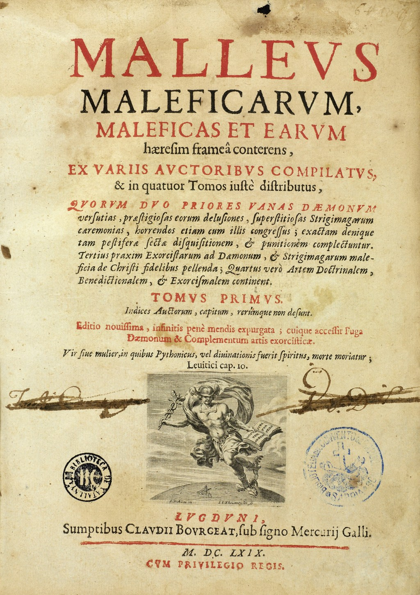

<a href="article-01-02.html"><i class="arrow far fa-arrow-alt-circle-right"></i></a>

## 1-1. 고대

조현병 개념의 생성과 변천을 살펴보기 전에 앞서, 광증(insanity, madness)이라는 개념을 먼저 살펴보아야 한다. 정신의학의 정통성에 의문을 제기하고, <s>반정신의학</s>의 기치를 내거는 소수 학자들은 조현병이 18,19세기 유럽 정신과 의사들이 만들어 낸 임의적 개념일 뿐이라고 주장한다.[@Desai2005-aq] 또 다른 일부 학자들은 조현병이 서구 문명이 고도로 산업화되면서 발생하게 된, 일종의 문명병이라는 주장을 펴기도 한다.[@Torrey1980-ca] 설령 조현병에 대한 이들의 주장에 어느 정도 일리가 있다 할지라도, 역사가 기록되기 시작한 이래, 어느 시대, 어느 문명에서도 광증에 대한 기록이 넘쳐난다는 것을 부인할 수 없다. 고대 이집트, 바빌로니아, 고대 중국 문명에서도 어렵지 않게 발견할 수 있으며, 구약성서에는 다윗을 의심하는 사울의 이야기가, 고대 그리이스 로마 신화에는 신들의 계략에 빠져 이성을 잃게 되는 인간들의 이야기가 적혀있다.[@Harris2013-lp][@Torous2014-zw] 중세에는 마귀에 씌웠다는 명목으로 죽어간 무고한 희생자들의 기록이 광증 때문에 저주받아야만 했던 비참한 운명을 증거하고 있으며, 근세의 문학작품에도 수많은 망상과 환각의 기록들이 인류를 끊임없이 쫒아다니는 악령처럼 묘사되어 있다.

<aside>

**반정신의학(anti-psychiatry)**: 광기를 질병으로 간주하는 기존 정신의학을 비판하는 이론. 반정신의학이라는 용어를 창시한 David Cooper에 따르면 정신병이란 구체적 실체가 있는 존재가 아니며, 사회의 가치 기준이나 행동 규범에 어긋나는 사람을 정상인들과 분리, 격리하기 위해 인위적으로 만들어진 개념이다. 대표적인 학자로는 David Cooper외에 Ronald Laing, Thomas Szasz가 있다.[@frances2019]

</aside>

조상들이 광증을 어떻게 이해하려 애를 썼는지 알려면 상상력을 동원하는 수밖에 없다. 아마 그들도, 정상과 상식이라 규정되는 범위를 넘어서는, 기이한 말과 행동을 하는 사람들을 눈여겨 보지 않을 수 없었을 것이다. 불과 얼마 전까지만 해도 영민하고 용맹했던 사람이 갑자기 혼이 나간 것처럼 이상한 행동을 하거나, 아무런 대상도 없이 겁에 질려 전율하는 모습을 보면 분명 당황스러웠을 것이다. 고대인에게 모든 질병은 원인을 헤아릴 수 없는 신비로움의 현현이자 신의 변덕이었다. 하물며 실체가 보이지 않는 광증은, 경외감과 더불어 깊은 혐오감과 공포를 불러일으켰을 것이다.

역사 이전의 고대인들은 별의 움직임이나 기후의 변화뿐 아니라, 사람의 마음 속에 피어나고 소멸되는 갖가지 생각과 감정 역시 초자연적인 힘의 영향을 받는다고 믿었다. 자연히 광증은 초자연적 기운에 접했거나, 금기를 깨서 생기는 저주, 신이 내리는 징벌이라 여겨졌다. 이러한 고태적 생각으로부터, 광증이 뇌에 병이 들었기 때문에 생기며, 광증에도 종류가 있어서 각기 치료법이 다를 것이라는 생각으로 발전한 것은, 아무리 생각해도 너무나도 혁신적이고 과감하여, 도무지 어떤 계기로 얻어진 통찰인지 신비롭기만 하다.

## 1-2. 그리스, 로마 시대 그리고 중세

광증을 초자연적 혹은 종교적 현상으로 해석하는 지배 이데올로기에 의문을 제기하고, 광증도 질병의 하나일 뿐이라는, 당시로서는 과감하다못해 위험해 보이는 주장을 내세운 것은 기원전 5-6세기 그리스에서 활동하였던 <s>자연철학자</s>이었다. 이들은 합리적 사고와 객관적 관찰을 통해 자연의 숨은 규칙성을 발견하고자 하였다. 동시에 인간의 지성이 뇌에서 비롯된다고 주장하였으며, 비정상적 정념이나 행동은 마치 조율되지 않은 악기에서 불협화음이 생성되듯이, 불균형 상태에 있는 체액 때문에 생기는 것이라 제안하였다.

<aside>

**자연철학자 (natural philosophers)**: 소크라테스 이전 고대 그리스에서 활약하던 철학자들을 가리킨다. 이들은 수학적, 과학적 그리고 철학적 연구의 기초가 되는 문제들과 역설들을 정의하는 데 집중했으며, 전통적으로 행해지던 신화적 해석들을 거부하는 대신 좀 더 이성적인 해석을 추구하였다. 대표적인 학파로는 밀레토스 학파, 피타고라스 학파, 엘레아 학파가 있다.)

</aside>

자연철학의 발전은 바야흐로 의학의 혁신이라는 열매를 거둔다. 기원전 4세기에 활약하였던 <s>히포크라테스</s>는 이론적 논쟁보다는 임상 관찰과 실제 치료 경험을 중요시하였다. 그는 <s>피타고라스</s>의 영향을 받아 지성과 감성이 뇌에서 비롯된다면, 광증이란 뇌기능의 이상에 다름아닐 것이라고 추론하였다. 당시의 치료는 체액의 균형을 바로잡는 데 초점이 맞추어져 있었기 때문에, 각각의 정신증상은 <s>체액</s>의 상대적 불균형에 따라 분류되었다. 동시에 광증의 치료를 위해서 운동요법, 식습관 교정, 휴식, 목욕, 사혈 등을 통해 체액의 균형을 회복하는 방법들이 동원되었다.

<aside>

**히포크라테스 (Hippocrates, 460\~370 BC)**: 고대 그리스의 의사로 의학의 아버지라 불리우기도 한다. 그와 그를 추종하는 히포크라테스 학파는 마술과 철학에서 의학을 분리해내는데 혁혁한 공을 세웠다.

**피타고라스 (Pythagoras of Samos, 570\~495 BC)**: 고대 그리스의 철학자로 피타고라스 학파라는 종교 단체의 교주이다. 숫자와 관련된 신비주의를 설파했으며, 피타고라스의 정리로 유명하다.

**4체액 설**: 히포크라테스는 인간이 정액이나 자궁의 체액에서 탄생하고 자라나는점을 근거로 이를 중요시했으며 따라서 액체가 생명의 근원일 것으로 여겼다. 그는 혈액(blood), 담즙(bile), 점액(phlegm) 그리고 흑담즙(black bile)의 4가지 체액으로 인간의 병리를 설명하려하였다.

</aside>

중세 이전 의학의 정점에 오른 인물은 로마에서 활약하였던 <s>갈레노스</s>였다. 그 역시 광증은 뇌와 신경 계통의 이상 때문이라 여겼다. 그는 뇌 기능이 <s>동물 영혼</s>을 낳고, 동물 영혼은 신경계를 타고 흘러다니며, 이것이 말단 근육 운동을 일으킨다고 보았다. 여기서 만약 동물 영혼이라는 개념을 "전기화학적 신호"로 바꾼다면 지극히 현대적인 생각이 아닐 수 없다. 그는 만약 뇌가 독물, 체액, 열, 감정적 요인 등에 의해 영향을 받으면, 동물 영혼의 잘못된 움직임을 낳고 광증은 그 외적 표현이라고 생각하였다. 그 또한 철저한 실용주의자로서, 결론이 안 나는 병인론에 대한 철학적 분석보다는 있는 그대로의 현상을 관찰하는 것이 중요하다고 생각하였다. 증후군(syndrome), 질병특이적 증상(pathognomic symptom) 등의 개념은 그에게서 비롯되었다.

<aside>

**갈레노스 (Claudius Galenus, 129\~199 AD)**: 로마 제국 당시의 고대 그리스의 의학자이자 철학자. 히포크라테스 이래 최고의 의사로 꼽힌다. 생체 해부를 실시하였고, 특히 신경계에 관해서 많은 연구를 하였다.

**동물 영혼 (spiritus animalis)**: 갈레노스에 의해 창시된 이론. 동물영혼은 마치 4체액과 비슷하게 비어있는 신경을 흘러다니면 신체 기능을 조정한다고 믿어졌다. 이후 1500년 이상 신경기능을 설명하는 주요 이론으로 자리잡았다.

</aside>

이렇듯 그리스-로마 시대만 해도 벌써, 광증은 뇌의 이상때문이며, 질병 분류를 통해 각각의 질병에 효과적인 치료법을 찾을 수 있다는 현대적 개념이 정립되어 있었다. 그러나 기독교의 도입 이후 중세를 거치면서, 과거의 과학적 유산은 모두 파괴되었고, 광증은 악마의 소행이거나 신의 징벌이라는 개념으로 후퇴하였다. 동일한 광증이라도 기독교의 종교 논리에 어긋나면 이단으로 처단되었고, 교리에 부합하면 성인으로 추앙 받는 기묘한 시대가 바로 중세 유럽이었다.

그 중에서도 가장 참혹했던 사건은 14세기부터 18세기 까지 전 유럽을 혼란 속에 몰아넣었던 마녀 사냥이었다. 마녀 사냥은 백년 전쟁이 끝나고 정치적, 경제적 혼란과 개혁에 대한 염원이 높아지던 시기에 시작되었다. 오랜 전쟁 속에서 교회의 권위가 무너지기 시작했고, 화폐의 등장으로 말미암아 자본을 축적하게 되는 대상인들이 등장하면서 교회는 예수와 대립된 존재로서 악마와 마녀를 만들어냈다. 유럽 전역에서 50만명이 넘는 사람이 마녀 혹은 마법사라는 죄목으로 처형되었는데, 특이하게도 "마녀"라는 명칭에서 알 수 있듯이 그중 다수가 여성이었다.

1487년 하인리히 크레이머와 자콥 스프렝거라는 두 명의 도미니코 수도회 성직자는 "[마녀의 망치(Malleus Maleficarum)](https://en.wikipedia.org/wiki/Malleus_Maleficarum)"이라는 마녀사냥 지침서를 출간한다.[그림 1](#fig:malleus)) 이 책은 마녀를 쉽게 구분하고 판결을 내릴 수 있는 기준을 나열한 책이다. 문제는 이 책의 저자들이, 악마의 술책은 인간 심리의 약점을 교묘하게 파고드는 것이라 믿었다는 점이다. 사회에서 소외되어 있는 사람들(특히 가난한 여성)의 말이나 행동, 혹은 신체적 증상이 당시의 의학적 지식으로 설명되지 않을 때, 종교재판관은 악마가 피해자의 영혼을 사로잡았기 때문이라고 설명하였다. 악마에게 영혼을 빼앗긴 것은 애초에 신앙심이 굳건하지 못했기 때문이요, 그 자체가 죄와 타락의 증거가 되었다. 이런 해석하에 광증을 비롯하여, 우울증, 히스테리아 등을 보이는 많은 환자들이, 편견에 치우친 증거와 고문으로 얻어진 자백하에 처형되었다.

<aside>

물론 수많은 정신질환자들이 마녀 사냥으로 인해 처형되었다는 분명한 증거는 존재하지 않는다. 당연하겠지만 정신질환자라고 진단을 한 적이 없기 때문이다. 이후 역사가들이 이렇게 생각하는 이유는, 다양한 마녀 판례집에 기술된 묘사가 다양한 정신병리와 놀랄만큼 유사하기 때문이다. 정신질환자들이 광신적 종교관과 교회의 권력욕에 의해 희생양이 되었다는 식의 관점은 정신분석가이자 의사학자인 Gregory Zilboorg로부터 비롯되었다. 그는 광증과 마법, 이단이 하나의 개념으로 융합되고, 그것이 정신질환이라는 의학적 상태때문일 지 모른다는 합리적 의심이 완전히 배제되는 바람에 이 모든 비극이 초래되었다고 주장한다.[@Zilboorg1941-nx]

</aside>

{#fig:malleus width="60%"}

이러한 비극은 그저 역사의 한 페이지로 넘겨버릴 수도 있었을 것이다. 그런데, 반정신의학을 주장하는 학자들은 이러한 비극이 현재도 끊임없이 재생 반복되고 있다고 주장한다. 사회복지학자인 Kutchins와 Kirk는 "Making Us Crazy: DSM, the Psychiatric Bible and the Creation of Mental Disorders"라는 책[@Kutchins1997-ju]"에서 정상과 비정상의 경계를 규정하는 DSM이 어떻게 사람들간의 차이와 일상적 고통을 정치적, 경제적 목적을 위해 질병화하고 있는지를 비판한다. 혹자는 DSM이 현대의 "마녀의 망치"에 지나지 않는다는 가혹한 비판을 내리기도 한다.[@Melanson2014-pu]

## 1-3. 근대 {#modern-period}

18세기 <s>계몽주의</s>의 태동을 기점으로 해서, 종교에 의해 이성(reason)이 폄하되는 시대는 막을 내리기 시작하였다. 이성이 인간존재의 정수라고 여겨지는 것만큼, 광증은 "이성을 잃는 것"으로 이해되었다. 초기에는 광증을 굳이 분류할 필요성도 개념적 틀도 존재하지 않았다. 이러한 상황은 <s>린네</s>가 식물의 체계적 분류를 시도하면서 바뀌게 되었다. 자연을 이해하고 정복하는 길은 나누고 분류하는 것부터 시작되어야 한다는 암묵적 합의가 이루어졌고, 질병 역시 예외가 아니었다. 이에 린네의 계통학적 분류에 기반을 둔 <s>질병분류학</s>이 탄생되었다.

<aside>

**계몽주의 (Age of Enlightenment)**: 18세기 유럽은 과학문명이 급속도로 발전하던 때였다. 뉴턴 역학의 성공에 도취된 철학자들은 우주가 이성적이고 필연적인 법칙에 의해 지배되며, 인간의 능력으로 이를 파악할 수 있다는 믿음을 갖게 되었다. 그 전까지 종교적 세계관은 진리란 하나님으로부터 인간에게 은총을 통해 부여되는 것이었다. 그러나 계몽주의 철학자들은 모든 인간은 자연법칙을 이해할만한 이성을 갖고 태어나며, 외적 권위와 지식을 무비판적으로 수용하는 것이 아니라, 이성을 도구로 하여 우주와 인간 사회를 지배하는 이성적이고 필연적인 법칙을 스스로 파악해 나가야 한다고 주장하였다. 개인이 이러한 책임을 수행하면 인간 사회 역시 끊임없이 개혁되어 진보할 것이라는 낙관주의가 팽배하였다. 따라서 개인의 이성은 기본 권리인 동시에 의무이기도 하다.

**린네 (Carl Linnaeus, 1707\~1778)**: 스웨덴의 식물/동물학자. 현대적 생물분류학을 제창하였다.

**질병분류학 (nosology)**: 질병을 구분하고, 그 계층적 관계를 규명하는 학문. 보다 광범위한 분류학(taxonomy)의 한 부분이다. 린네의 생물분류체계를 본따, 종의 개념에 상응하는 질병분류학적 단위를 가정하고, 그 상위 범주와 하위 범주를 모색함으로써 전체 계층 질서 내에서 개개 단위의 위치를 규정한다.

</aside>

린네 분류법의 기초는 분류의 근거가 될 특징들을 선정하는 것이다. 린네 이전까지는 외적 특성뿐 아니라, 용도, 타 개체와의 유사성 등 자의적 기준에 따라 그때그때 분류가 이루어졌다. 이에 반해 린네는 최대한 객관적이고 관찰 및 확인이 가능한 특징들을 분류의 기준으로 선정하였다. 마찬가지로 질병 분류학에서도 객관적 기준들이 필요했고, 증상 및 징후, 추정되는 원인, 손상부위 등이 후보로 모색되었다. 이러한 지표들에 대한 지속적 관찰로 데이터가 축적되면서, 점차 정신과 의사들은 특정한 증상, 징후가 서로 연관되어 나타나는 패턴을 인식하기 시작하였다.

린네가 도입한 또 다른 혁신적인 개념은 "종(species)" 개념이다. 린네에 따르면 "종"은 태초에 창조된 단위이고 불변하는 것으로서, 임의적인 분류 단위가 아니라 실제로 존재하는 것이다. 마찬가지로 개개질환은 더 이상 나눌 수 없는 실재하는 단위, 즉 <s>자연적 종</s>으로 여겨졌다.

<aside>

**자연적 종 (natural kind)**: 과학은 이해의 대상을 명백히 하기 위해, 자연 현상을 끊임없이 분류해왔다. 이러한 분류는 인간의 필요에 의해서, 현행 이론에 부합시키기 위해서, 지각하거나 측정하는 도구의 한계때문에 임의적으로 행해지는 경우가 많다. 그러나 이와 달리, 자연현상을 지배하는 규칙에 부합하는 분류가 있을 수 있고, 이러한 분류를 통해 나뉘어진 단위를 자연적 종이라 한다. 예를 들어 화학적 원소는 서로 다른 원자량으로 분명히 구분된다. 자연적 종의 또 다른 대표적인 예인 생물의 종은 유전자의 유사성, 혹은 교배했을 때 생식가능한 자손을 얻을 수 있느냐로 분명히 정의된다. 예를 들어 소, 개, 말 등은 자연적 종이지만, 황소, 젖소, 육우 등은 인위적 종(artificial kinds)이다.

</aside>

질병의 분류에 린네적 접근을 최초로 적용한 사람은 <s>de Sauvages</s>이다. 그는 당시까지 알려진 모든 질환들을 10개의 과(classes), 295개의 속(genera), 그리고 24,000개가 넘는 질병단위로 구분하였다. 정신질환에 있어서 19세기 초까지 가장 영향력있고 인기있던 분류체계는 <s>Cullen</s>이 제시한 분류였다. 정신질환은 신경병리의 반영이라 생각했던 그는 "신경계의 질환"이라는 뜻으로 "신경증(neurosis)"이라는 단어를 만들어냈다. 그는 신경증을 네 개의 속(genera)으로 분류하였는데, 그 중 판단력의 장애를 의미하는 vesania가 광증에 해당되었다. 이후 <s>피넬</s>, <s>에스퀴롤</s> 등 초기 정신의학자들이 Cullen의 분류체계를 보완하거나 수정함으로써 질병분류체계를 정교화하였다. 그러나 분류의 잣대도 변변히 마련되지 못하였고, 이론적 편견과 근거없는 유추에 의해 얻어진 병인을 분류의 기준으로 삼는 바람에 19세기의 질병분류학은 혼란 그 자체였다.

<aside>

